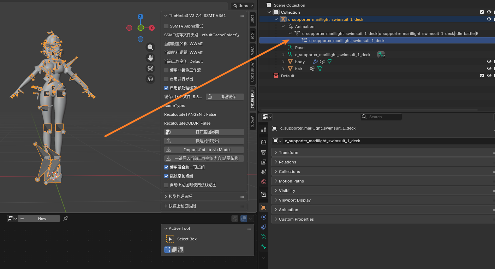
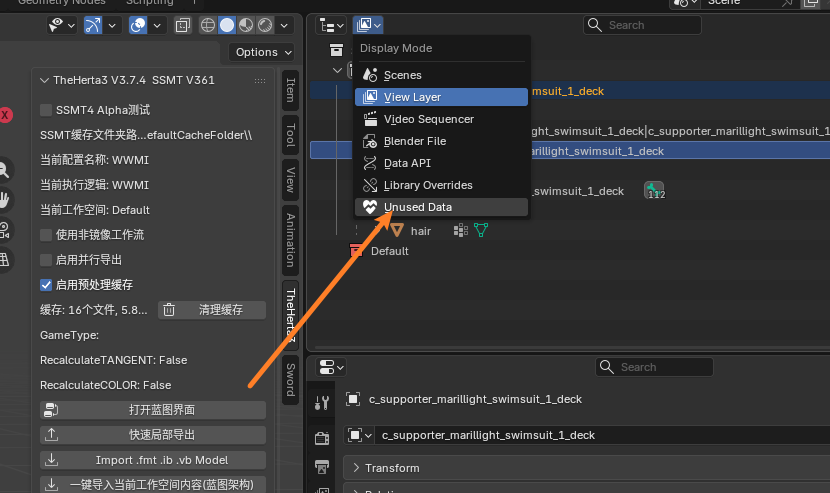
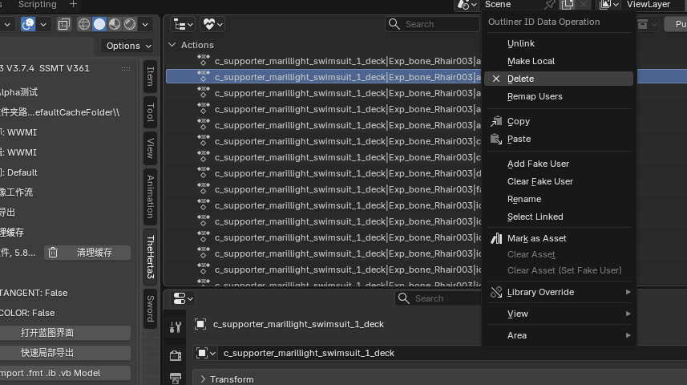

# 导入FBX后如何删除Animation

有些 FBX 文件导入后会自带很多动画，右键直接删除会导致整个骨骼也被删除掉。

此时需要点击大纲视图左上角的显示模式菜单，切换到 **Unused Data**，如下图所示：

然后就可以在 **Actions** 列表中右键点击要删除的动画，选择 **Delete** 了：

原文：[《导入FBX后如何删除Animation》](https://www.yuque.com/airde/qerzgn/sfg8u6u00pvivl3e?singleDoc)
