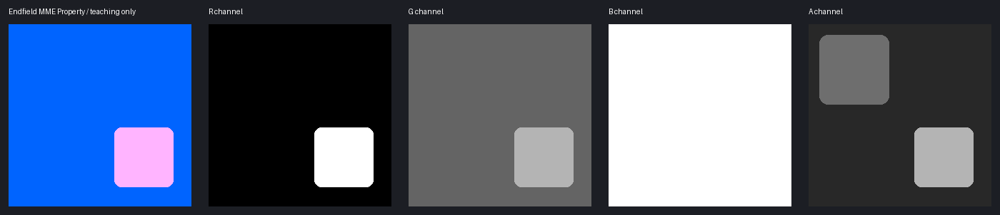

# 明日方舟：终末地：属性图、皮肤、脸与头发通道详解

终末地的属性图有几套公开说法，BA顺序甚至相反。你要做的不是选一张看起来权威的表，而是先确认自己的材质用哪套。衣服、脸和头发也要分开改。

**怎么用下面的提示词：**先读通道说明，再让模型出草稿。未修改通道请在编辑器里从原图复制，不靠模型保证像素一致；ID和阈值用取色器确认。练习数字不代表该角色的标准参数。

[通用基础与验收](../../../newbie/tools/TextureChannelGuide/TextureChannelGuide.md)。终末地的公开资料仍有不同复刻管线和社区定义，**不能把一个“R/G/B/A表”当全部材质规范**。

## 下载练习图

[合成Diffuse](./assets/synthetic-diffuse.png) · [同UV语义分区](./assets/synthetic-regions.png) · [原始RGBA教学数据](./assets/property-data.png) · [资源来源与边界](./assets/README.md) · [SHA256清单](./assets/manifest.json)

可以下载旁边的合成图练习拆通道。图中的分区和数值是练习设定，不是从游戏角色测得的参数。

## 1. 先解决旧简表与公开源码的冲突

本站已有[社区简表](../TextureChannels/TextureChannels.md)：R金属、G镜面高光类型、B平滑度、A AO，并提到皮肤Diffuse A的AO。该页署名为“失乡のKnight”，没有附对应Shader版本和读取代码，因此应作为**待核查的社区资产约定**，不能直接删除，也不能擅自把它推广。

本次取得的 [Endfield MME Shader](https://github.com/chris0214/Arknights-Endfield-MME-Shader) 固定提交 `f9e90932a25678101e3e28a8d91663fa0706a4ed`，其 [材质指南](https://github.com/chris0214/Arknights-Endfield-MME-Shader/blob/f9e90932a25678101e3e28a8d91663fa0706a4ed/USER_GUIDE_CN.md#L67-L75)与 [衣服实际计算](https://github.com/chris0214/Arknights-Endfield-MME-Shader/blob/f9e90932a25678101e3e28a8d91663fa0706a4ed/EndfieldMME/internal/endfield_cloth.hlsl#L1842-L1852)明确：**R金属、G反射率、B AO、A光滑度**。这与简表BA相反、G也不能直接解释成离散高光类型。

| 约定 | R | G | B | A | 证据与使用范围 |
| --- | --- | --- | --- | --- | --- |
| 社区简表 | 金属 | 镜面高光类型 | 光滑度 | AO | 没有固定Shader证据；仅在确认自己的资产确实如此时使用 |
| 本次MME衣服Property | 金属 | Reflectivity反射率 | AO | 光滑度 | 有固定版本计算源码；适用于这套复刻布局 |
| DanbaidongRP PBRMask | 金属 | 光滑度 | AO | 反向发光1−A | 独立参考管线，不是终末地原资产规范 |

[DanbaidongRP实际读取](https://github.com/danbaidong1111/DanbaidongRP/blob/072b375399e4c38d0cad235a7ec513f981fd5676/Shaders/Material/PBRToon/PBRToonBase.shader#L466-L475)展示第三种布局。它是MME作者列出的参考之一，但**引用该管线不意味着所有贴图按它打包**。

::: danger 防止灾难性通道交换
未经确认就把B/A交换，可能让无遮蔽区域变成极光滑或让光滑区域变成强遮蔽。先检查目标材质采样代码或做单通道小区测试；不知道属于哪套时保留原图。
:::



## 2. 按MME实际实现划分材质

| 图与材质 | R | G | B | A |
| --- | --- | --- | --- | --- |
| 衣服Diffuse | RGB颜色 | 同左 | 同左 | 依具体载入/透明路径，保留，别套皮肤AO |
| 衣服Property | 金属度控制 | 反射率控制 | AO式遮蔽控制 | 光滑度，代码取1−A获得粗糙度 |
| 衣服Normal | 法线X | 法线Y | 核心RG解包未使用，保留 | 同左 |
| 脸Diffuse（已核查Face路径） | RGB颜色 | 同左 | 同左 | AO控制，并受参数指数影响 |
| 独立Skin路径Diffuse | RGB颜色 | 同左 | 同左 | 本次核心Skin函数只读RGB，不能据此断言A用于AO；原资产约定待确认 |
| 脸SDF | 方向阴影阈值R | 另一方向阈值G/混合使用 | 本页没有确认用途，先保留 | 同左 |
| 脸cm_M | SSS作用权重 | 脸SDF/几何区混合与保护 | 摄像机阴影区域控制 | 脸边缘/轮廓光遮罩 |
| 头发HN | 常规法线X | 常规法线Y | 平滑法线X | 平滑法线Y；BA也是法线而非AO/光滑度 |
| 头发Property / P | 层/法线混合等头发专属控制 | 反射率或高光遮罩，按路径 | AO式控制，按路径 | 光滑度或发丝线控制，按路径 |
| RD | RGB色带/光照外观 | 同左 | 同左 | 明暗混合权重 |
| RS | RGB高光查表 | 同左 | 同左 | 依表，保留 |
| Skin LUT / FGD / MatCap | 查表外观/数值，非衣服UV | 依表 | 依表 | 依表 |

这个表限定为上述MME复刻的确认路径；头发与脸图不能套衣服Property。下面每个贴图给出一次可复制的提示词，未知编码只给保守修补而不硬编。

## 3. 衣服Property：适用于这套MME布局

G是反射率，和高光形状、强度、各向异性类别不同。它还会乘材质强度参数；A光滑度进入 `roughness=1−A`，最终有最低粗糙度限制。AO图不等于“深色布料”。

| 衣服Property | 数值减小 | 数值增大 | 端点与例子 |
| --- | --- | --- | --- |
| R金属 | 更偏非金属 | 更偏金属 | 0非金属端，255在强度=1时金属端；不是高光总亮度刻度 |
| G反射率 | 反射率权重降低 | 权重增大 | 0压掉按G相乘的分量，但其它层仍可能反光；255还受强度、分层和光向控制。不是离散类型ID |
| B AO | 遮蔽更强 | 遮蔽更轻 | 255不加这一项遮蔽，0最重，但高光AO还有 `0.5+0.5B` 等处理，不保证全图变黑；200约0.784，是轻遮蔽练习值，不是缝隙编码 |
| A光滑度 | 粗糙度升高，高光更散 | 粗糙度降低，高光更集中 | 强度=1时A=0→roughness1，128→约0.498，255→最低0.04。A≥245已触及0.04下限；不是255变成完美镜面 |

这些方向对应干燥基础材质、正常非负参数。雨水、分层、控制器还会继续改变结果。先保留原图参数，再看你想改的是高光亮度还是高光宽度。

```text
以<image2>原衣服Property的A层为参考，对照<image1>服装UV，生成单通道光滑度草稿。只把我标出的普通布料A适当调暗，让高光更分散，金属、光滑饰件和未知区域保持原灰度。保持尺寸、UV岛、缝线与扣件边界，不画自然颜色、阴影或文字，只输出A层。
```

上面的提示词只生成光滑度层。合并到A时，R/G/B从原Property复制，别因为预览颜色变了就把AO一起重画。

若已经确认用社区BA布局，B光滑度低值更粗、高值更光滑；A AO低值更遮蔽、高值更保留受光。G声称是“高光类型”却没有固定源码，所以不能给你编0～255类型表或强弱方向；它应该保留原编码，直到有对应Shader或实测。

**社区BA相反约定的提示词（仅确认后使用）：**

```text
对照<image1>服装UV和<image2>已确认社区BA布局的原属性图，只修补指定B光滑度层，让标出的布料比原值稍暗，其它区域不动。保持画布、UV岛和边界，不画自然颜色、阴影或文字，只输出B灰度草稿。
```

该段不证明社区表就是你的资产规范。

## 4. 衣服Normal：RG法线

[RG解包](https://github.com/chris0214/Arknights-Endfield-MME-Shader/blob/f9e90932a25678101e3e28a8d91663fa0706a4ed/EndfieldMME/internal/endfield_cloth.hlsl#L811-L885)支持法线强度与Y方向调整。不能把头发HN的BA双法线方式推广到衣服。

R/G的线性解码方向仍是0负、128附近零、255正；Y翻转后G方向相反。越白不是越凸。B/A在这条衣服RG法线解包中不用，但可能存在其它资产用途，保留。

```text
对照<image1>服装UV生成浅法线XY草稿，平坦RG约(128,128)，只在指定缝线、扣件和压边处做连续弱变化。不把颜色明暗当高低，不添噪点、光照或文字，保持尺寸和UV位置，只用于提取RG。
```

## 5. 脸Diffuse：Alpha参与AO，独立Skin路径不能外推

Face路径已确认A参与AO；独立Skin函数主要读取Diffuse RGB，本次没有找到同样的Diffuse A→AO链路。因此以下“皮肤AO”操作仅在自己的皮肤材质也确认该用途时使用，不把社区经验外推到所有复刻路径。

[Face读取AO](https://github.com/chris0214/Arknights-Endfield-MME-Shader/blob/f9e90932a25678101e3e28a8d91663fa0706a4ed/EndfieldMME/internal/endfield_face.hlsl#L969-L975)把A作为遮蔽并受指数参数调节。不能把所有颜色图Alpha定义成“透明度”。

```text
按指定色板修改<image1>脸部Diffuse的RGB，保留尺寸、脸UV、眼鼻嘴和肤色细节，不加新的光源、投影或文字。只输出颜色草稿，Alpha稍后从原图复制。
```

Face路径按 `AO=(A/255)^强度` 处理：正指数下A越小遮蔽越重，255始终保留1，0趋向0。指数=1时200约保留78.4%；指数=2时约61.5%，所以同样200可能明显更暗。指数为0又是特殊情况，别把这套公式外推给只读RGB的独立Skin路径。

**单独皮肤AO候选：**

```text
对照<image1>脸部UV和<image2>原Diffuse的Alpha，只在我标出的遮蔽区稍微压暗，其它位置沿用原灰度。不要把腮红当AO，不画方向鼻影，不改画布和UV位置，不加文字，输出A灰度草稿。
```

## 6. 脸SDF与cm_M

MME [SDF读取](https://github.com/chris0214/Arknights-Endfield-MME-Shader/blob/f9e90932a25678101e3e28a8d91663fa0706a4ed/EndfieldMME/internal/endfield_face.hlsl#L705-L758)包含RG选择与不同诊断/渲染路径，依头部与光向计算；不能用灰度鼻影替代。

固定MME常规分支把R/G平均后与角度阈值比较：其它参数不变时，提高选中值会提高亮面权重。另一些诊断分支按前光G、背光R选通道，它们不能当成同时生效的最终规范。0/255是场两端，不是“R越白越金属”；B/A核心未确认。

**SDF：**

```text
对照<image1>脸UV，只修补<image2>原SDF中标出的破损，沿用原RG方向阈值梯度和镜像关系，不画肤色、普通AO或透明度。保持画布与UV位置，不加文字，输出修补草稿。
```

cm_M用途分别见 [摄像机阴影](https://github.com/chris0214/Arknights-Endfield-MME-Shader/blob/f9e90932a25678101e3e28a8d91663fa0706a4ed/EndfieldMME/internal/endfield_face.hlsl#L552-L560)、[SSS](https://github.com/chris0214/Arknights-Endfield-MME-Shader/blob/f9e90932a25678101e3e28a8d91663fa0706a4ed/EndfieldMME/internal/endfield_face.hlsl#L602-L621)、[边缘遮罩](https://github.com/chris0214/Arknights-Endfield-MME-Shader/blob/f9e90932a25678101e3e28a8d91663fa0706a4ed/EndfieldMME/internal/endfield_face.hlsl#L861-L876)。R/G/B/A不是衣服MRO。

| cm_M通道 | 值小 / 值大的含义 |
| --- | --- |
| R | SSS权重乘子，0关闭这项，增大允许更多SSS颜色响应，255最大纹理权重 |
| G | SSS链中增大会减弱视角限制；选中SDF混合诊断时0用SDF、255用几何N·L；摄像机阴影链中还提高阴影接收权重。三条路径不同，不能一句“越白越亮”概括 |
| B | 摄像机阴影区域乘子，0不贡献这项区域，增大允许更多场景阴影进入；最终取max(G,摄像机区域×B)，G大时改B可能看不出区别 |
| A | 脸边缘光权重，0压掉这项，增大允许更多边缘光；还受光侧、视角、宽度指数限制，不是透明度 |

改SSS先动R，改边缘光先动A；不要为了让脸更亮同时把整张cm_M涂白。

```text
对照<image1>脸UV和<image2>原cm_M的指定通道，只修补我标出的控制区域，沿用原灰度和边界。保持画布与眼鼻嘴位置，不套衣服金属粗糙度规则，不画照明或文字，输出单通道草稿。
```

## 7. 头发HN与Property：双法线不能丢Alpha

[头发读入](https://github.com/chris0214/Arknights-Endfield-MME-Shader/blob/f9e90932a25678101e3e28a8d91663fa0706a4ed/EndfieldMME/internal/endfield_shader.hlsl#L1231-L1252)把HN RG作为regular normal、BA作为soft normal，再以P.r作层混合。**HN A不是未用透明通道，直接置255会破坏平滑法线Y。**

```text
对照<image1>头发UV，只修补<image2>原HN的RG常规法线层，沿用原细小连续梯度。保持画布、发丝边界和UV位置，不把BA当Z或透明度，不画头发颜色、光照或文字，只输出用于提取RG的草稿。
```

HN的RG和BA都是XY方向数据：每对128附近零偏转，低值负、高值正。A=255不是“不透明”，而是平滑法线Y极端偏向一侧。两套法线不能用衣服Property的解释。

头发P.r是混合权重：0更偏外层法线（球面/soft组合），255更偏regular法线；中间值插值后归一化，不是线性提高高光强度。若启用sRGB转换，R=128读入约0.216，并非一半混合。G在原生高光链通常越大权重越多，在另一ORM链是反射率；B的AO通常低值更遮蔽；A在ORM链越大越光滑，在发丝线链则改变线控制。没有一套涵盖所有wrapper的A端点解释，确认路径后再改，不编固定阈值。

**头发Property：**

```text
对照<image1>头发UV和<image2>原头发Property的指定通道，只修补我标出的区域，沿用原灰度和发丝边界。不要把R当衣服金属度，不改画布或UV位置，不加光照和文字，输出单通道草稿。
```

头发G/B/A最终作用还需要查看选定wrapper、宏与对应分支：资产原生高光路径会读G作highlightMask、A作发丝线控制；另一ORM路径读G作反射率、A作光滑度。部分路径还显式将Property RGB做sRGB→线性转换，不能无条件套用“所有控制图一律Non-Color数值直接读”的泛化规则。本页不把所有诊断路径当最终渲染，增加新角色应再审计。

## 8. RD、RS、查表与微细节

RD在 [衣服路径](https://github.com/chris0214/Arknights-Endfield-MME-Shader/blob/f9e90932a25678101e3e28a8d91663fa0706a4ed/EndfieldMME/internal/endfield_cloth.hlsl#L1838-L1844)读A为diffuseWeight；[脸路径](https://github.com/chris0214/Arknights-Endfield-MME-Shader/blob/f9e90932a25678101e3e28a8d91663fa0706a4ed/EndfieldMME/internal/endfield_face.hlsl#L765-L788)也以RD A混合明暗。RS、FGD、Skin LUT都不是服装UV。

RD A在所引用的混合路径中，0偏向LUT/暗色端，255偏向绘制的亮面Diffuse端，中间值控制两端混合；RGB是查表颜色，某一色通道增大只是增加该查表颜色分量。RS RGB也是查表数据，Alpha与Skin LUT/FGD的具体参数没有统一强弱方向，没表定义就不动。

**RD：**

```text
以<image1>原RD为查表模板，只按指定色板修改对应RGB色带，A完整继承原明暗混合权重，保留尺寸、取样行和边界，不放服装UV、不重新绘制人物、不加文字，只输出查表候选供逐坐标取样检查。
```

**RS：**

```text
以<image1>原RS为高光查表模板按指定外观修订RGB，严格保留尺寸、行列、取样方向和Alpha，不把它当UV服装贴图、不增加文字或场景，只输出候选并用原高光坐标映射验证。
```

**Skin LUT / FGD：**

这类图需要精确参数和网格对应，直接填写数值更可靠。模型的修补草稿不能证明数据已恢复。

```text
以<image1>原Skin LUT或FGD为参考，只修补我标记的视觉破损，保持切片网格、尺寸和其它区域，不新添渐变、物体或文字，输出修补草稿。精确参数稍后在编辑器里填写。
```

**MatCap：**

```text
以<image1>原MatCap为球面采样布局模板，按指定材质外观修改RGB高光、Alpha继承原图，保留中心与边缘结构，不放服装UV或真实背景、不加文字，只输出球面外观候选供转视角和mip采样验证。
```

独立头发噪声、发丝线、唇高光及雨水图由特定宏/采样坐标决定：

```text
以<image1>原微细节贴图的指定通道为参考，只修补我标记的破损区域，沿用原灰度和平铺边界。保持尺寸，不重新设计材质参数，不加文字，输出该层草稿。
```

## 9. 可靠性与实机验收

公开MME作者也明确自动匹配和检查不能替代实机视觉验收。该复刻是MMD/MME运行时，**不是直接可安装进终末地游戏的Shader**；此文用于解释与生成候选，部署仍要核对原游戏绑定。

检查Property BA顺序、皮肤Diffuse A、脸SDF RG、cm_M、头发HN双法线与P.r；逐通道、逐材质、不同光向和视角测试。保留源图与宏配置，不把衣服/皮肤/脸/头发各自规则混用。提示词生成不保证数字精度，用外部工具定值与继承通道。
