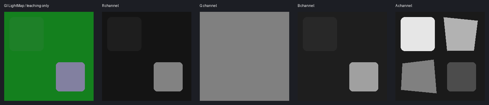

# 原神：角色贴图通道详解与生成提示词

[先读通道基础、色彩空间与验收方法](../../../newbie/tools/TextureChannelGuide/TextureChannelGuide.md)。本页讨论角色 Toon 材质，不覆盖地图、粒子和所有特殊角色效果。

::: warning 范围与证据
主要依据公开复刻 [HoyoToon](https://github.com/Hoyotoon/HoyoToon) 固定提交 `d9e5ca2f312bf16fba89dee67d32c08b482dcda4` 的实际读取代码。它证明**该复刻实现**怎样解释纹理，不能保证原游戏每个版本、每个角色一致。与其它复刻方案、原材质冲突时，核对自己的 Shader 绑定，不按文件名猜。
:::



配图为原创合成示意，不是游戏原贴图。提示词中的数字是教学候选值；皮肤/布/金属与材质 ID 没有跨角色固定对应。

## 快速总表

| 贴图/路径 | R | G | B | A |
| --- | --- | --- | --- | --- |
| MainTex / Diffuse | RGB共同组成颜色 | 同左 | 同左 | 可由参数选择忽略、裁剪、发光、脸红或透明等，不能一律设255 |
| 身体/头发 LightMapTex | 普通高光强度，同时可触发金属/特殊分支 | AO式光照/阴影阈值控制 | 高光区域/阈值控制，不是通用 roughness | 材质区域选择 |
| FaceMapTex（本实现新脸图） | 本页核心路径未确认用途，保留 | 同左 | 可选轮廓线宽度控制 | 脸部阴影阈值场，读镜像 UV |
| 脸部 LightMapTex | 不应照搬身体含义 | 依脸材质条件 | `_UseFaceBlueAsAO` 开启时乘入脸阴影 | 依具体脸路径，保留 |
| BumpMap | XY法线的X | XY法线的Y | 可选纹理线条控制，核心法线函数不直接使用原Z | 核心路径未确认，保留 |
| CustomAO | 本实现采样R作为AO候选 | 未确认 | 未确认 | 未确认 |
| Ramp / 特殊 LUT | RGB查表颜色 | 同左 | 同左 | 依实际表，保留，不按衣服UV生成 |

### 相邻教学资源

[合成Diffuse](./assets/synthetic-diffuse.png) · [同UV语义分区](./assets/synthetic-regions.png) · [原始RGBA教学数据](./assets/lightmap-data.png) · [资源来源与边界](./assets/README.md) · [SHA256清单](./assets/manifest.json)

这些资源只用于学习如何拆通道、量化与合并；分区颜色和材质ID的对应是教学预设，不是游戏官方规则。

## 1. Diffuse：改颜色不要损坏 Alpha

[主程序](https://github.com/Hoyotoon/HoyoToon/blob/d9e5ca2f312bf16fba89dee67d32c08b482dcda4/Shaders/Genshin%20Impact/Includes/HoyoToonGenshin-program.hlsl#L523-L544)同时采样 Diffuse 和 LightMap；[Alpha 分支](https://github.com/Hoyotoon/HoyoToon/blob/d9e5ca2f312bf16fba89dee67d32c08b482dcda4/Shaders/Genshin%20Impact/Includes/HoyoToonGenshin-program.hlsl#L728-L741)明确由 `_MainTexAlphaUse` 决定用途。

**一段式提示词：**

```text
编辑<image1>这张原神风格角色服装UV颜色图，在完全保持原尺寸、UV岛边界、缝线、装饰与材质位置的前提下按我的配色说明修改RGB颜色，保留原有绘制细节且不加入新的场景光源、投影或3D效果，不把控制遮罩画进RGB；<image2>提供同UV的原始Alpha，必须逐像素继承它而不是猜测透明或发光区域，不加文字、不拼贴、不镜像、不重排UV，仅输出颜色图候选；若无法输出真实Alpha，只输出RGB并让我在外部工具合并<image2>的Alpha。
```

不能由“亮色衣服”推断发光 Alpha。常量255仅适用于已确认不使用Alpha的数据/材质。

### 2. 身体/头发 LightMap：最值得学的 packed 图

[高光与阴影调用](https://github.com/Hoyotoon/HoyoToon/blob/d9e5ca2f312bf16fba89dee67d32c08b482dcda4/Shaders/Genshin%20Impact/Includes/HoyoToonGenshin-program.hlsl#L757-L768)使用 G 参与阴影、R/B 参与高光。R 在高于0.90时关闭普通高光，并可用于金属分支；不能简单说“R=金属度”。

G 的“AO”叫法是近似：源码将其与顶点数据、N·L、Shadow 参数结合，形成阈值/色带，不是纯粹乘颜色的物理 AO。B 在普通高光中进入 `term > 1.015−B` 一类阈值；范围增大与强度增加不是同一件事。

A 的 [materialID](https://github.com/Hoyotoon/HoyoToon/blob/d9e5ca2f312bf16fba89dee67d32c08b482dcda4/Shaders/Genshin%20Impact/Includes/HoyoToonGenshin-common.hlsl#L1-L13)在材质开关启用时区分若干区域：常见安全代表值0.1、0.3、0.5、0.7、0.9，分别对应字节26、76、128、178、230。**参数组顺序不是固定“皮肤/金属/布料顺序”**；先看原Alpha与材质配置。阈值边界可能重叠且受判断顺序影响，不在0.2/0.4/0.6/0.8上取值。

**一段式候选提示词（只针对普通高光分支，金属ID另行确认）：**

```text
将<image1>这张二次元服装UV颜色图转换为原神身体LightMap技术控制图，原尺寸和UV布局完全不变，R是普通高光强度而不是自然红色，已确认皮肤用30、哑光布料用20、较光滑非金属饰件用130且所有R低于230以避免未知金属分支，G是阴影阈值控制并以128为教学中性基值、明确遮蔽缝隙用90、其余不用Diffuse明暗直接复制，B是高光区域控制且皮肤用40、布料用30、光滑饰件用160，所以RGB分别为皮肤(30,128,40)、布料(20,128,30)、光滑饰件(130,128,160)；A必须继承<image2>同UV原LightMap的材质ID而不是全部255，不保留自然颜色、不加照明、不把白布变白或黑布变黑，保留边界与小装饰位置，不加文字、不重排UV，仅输出控制图草稿，无法准确输出A时只生成RGB供外部合并。
```

**只改 ID 的提示词：**

```text
依据<image1>的UV布局和<image2>同UV原LightMap Alpha分区，制作单通道灰度材质ID草稿，只沿已有分区保持或修补已明确的边界，使用原图对应的26、76、128、178、230五个字节值，不重新定义哪个值代表皮肤或金属，不按Diffuse颜色区分材质、不做渐变或照明、不改变岛位置，无法辨认的区域保留<image2>，只输出灰度图，供外部工具定值量化后替换LightMap的A。
```

**验收：**R超过0.9的区域是否有意；G旋转光源下是否过黑；B是否导致过宽高光；A是否选中正确参数组；头发不可直接套用衣服数值。

### 3. 脸部 FaceMap 与 LightMap

本实现 [脸阴影函数](https://github.com/Hoyotoon/HoyoToon/blob/d9e5ca2f312bf16fba89dee67d32c08b482dcda4/Shaders/Genshin%20Impact/Includes/HoyoToonGenshin-common.hlsl#L414-L463)读取 FaceMap A，并依光向选择镜像坐标；LightMap B仅在指定选项开启时乘入结果。FaceMap B也可在 [轮廓线路径](https://github.com/Hoyotoon/HoyoToon/blob/d9e5ca2f312bf16fba89dee67d32c08b482dcda4/Shaders/Genshin%20Impact/Includes/HoyoToonGenshin-program.hlsl#L350-L358)控制线宽。

**保守提示词：**

```text
以<image1>作为脸部UV位置参考，修补<image2>同角色同UV的原FaceMap，保持原尺寸、左右镜像关系和全部四通道不变，仅修复我明确标记的破损区域，A保留原有随光向变化的脸部阴影阈值梯度而不是绘制普通AO或鼻子投影，B保留原轮廓控制，R/G未知功能保持原值，不根据颜色猜阴影、不增加红橙材质遮罩、不加文字或3D渲染，输出与原FaceMap配准的修补候选；未提供<image2>时不要声称能够恢复原SDF。
```

**脸部AO通道候选提示词：**

```text
在<image2>同UV原脸部LightMap上仅编辑B通道，按<image1>对应位置对已确认的局部遮蔽区域制作柔和灰度候选，无遮蔽B=255、明确缝隙B=180且不改变R/G/A，保留原岛位置和脸部对称，不把这张图当FaceMap的方向SDF，不按自然肤色上色，不加文字，仅输出修补候选；本操作仅用于已确认开启UseFaceBlueAsAO的材质，无法保持其它通道时只输出B灰度层外部合并。
```

### 4. BumpMap：不一定是标准蓝紫 XYZ

[normal_mapping](https://github.com/Hoyotoon/HoyoToon/blob/d9e5ca2f312bf16fba89dee67d32c08b482dcda4/Shaders/Genshin%20Impact/Includes/HoyoToonGenshin-common.hlsl#L367-L402)将RG解成XY，Z由函数指定并归一化，而原图B可用于 [detail_line](https://github.com/Hoyotoon/HoyoToon/blob/d9e5ca2f312bf16fba89dee67d32c08b482dcda4/Shaders/Genshin%20Impact/Includes/HoyoToonGenshin-program.hlsl#L659-L664)。因此不要把标准法线Z直接盖掉B的线条数据。

```text
将<image1>服装UV图转换为浅浮雕切线法线XY候选，保持原尺寸与全部UV岛、缝线和扣件位置，平坦区域R/G约128，凸起缝线和明确金属边缘产生细小连贯XY变化而不是把颜色明暗变成凹凸，不增加织物噪点，B与A逐像素继承<image2>同UV原BumpMap以保留可能的纹理线条与未知数据，不计算标准法线Z覆盖B，不加照明、文字或3D渲染，只输出技术图候选，不能继承B/A时仅输出RG供外部合并并校验方向。
```

### 5. CustomAO

本实现 [自定义AO读取](https://github.com/Hoyotoon/HoyoToon/blob/d9e5ca2f312bf16fba89dee67d32c08b482dcda4/Shaders/Genshin%20Impact/Includes/HoyoToonGenshin-program.hlsl#L530-L536)还可选UV0、另一个UV或屏幕坐标，不能保证和Diffuse同UV。

```text
在已确认CustomAO使用<image1>同一UV的前提下生成灰度AO候选，无遮挡区域255、明显结构重叠和缝隙约180至220且柔和过渡，不把深色布料当阴影、不烘焙单方向光照，严格保留UV岛位置与尺寸，输出无文字的单通道灰度图供外部放入R；若实际采样另一个UV或屏幕坐标，不从当前Diffuse猜测映射。
```

### 6. Ramp、MatCap与角色特殊图

本实现还有金属/皮革色带、丝袜Detail、武器、星空、VAT和特效Mask等。它们是**条件路径**，不共享一套R/G/B/A解释；不把本页当成“所有原神贴图完整清单”。

Ramp教学提示词：

```text
以<image1>原Ramp查表图为唯一布局参考，只按我指定的色板修改其RGB色带，严格保留原尺寸、每行材质顺序、采样边界与Alpha，不把衣服UV放进色带，不添加纹理、物体或文字，不重新排列冷暖色行，不改变数值查表结构，只输出配准候选供外部采样检查；没有原Ramp与行定义时保留原图。
```

对于任何未确认特殊贴图：`以原图为模板，只编辑指定通道/区域，其余逐像素继承；不能继承则输出独立候选层外部合并。` 这是可靠的保守操作，不是从Diffuse猜回未知数据。

## 实操验收与复刻限制

先导出PNG/TGA中间图，再按实际游戏加载要求部署；不做Gamma增强。用同材质原图作A/B对照，测试正侧背光、近远距离/mip、身体头发脸轮廓。提示词中的“继承”仍必须在外部工具真正拷贝通道，不能以模型口头执行当作像素一致证据。

补充参考：[PrimoToon](https://github.com/festivities/PrimoToon)、[Blender-miHoYo-Shaders](https://github.com/festivities/Blender-miHoYo-Shaders)。它们是不同重建方案，不应把各自变量名和功能合并成无条件游戏规范。更细的后续材质研究应按相同的“声明→采样→计算→条件→渲染”流程加入。
