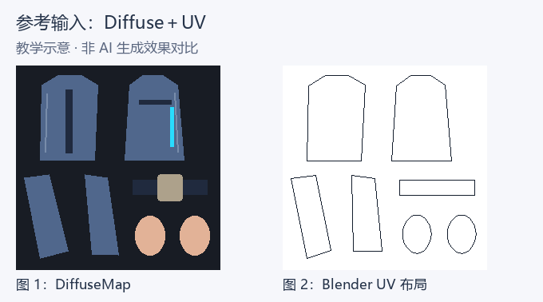
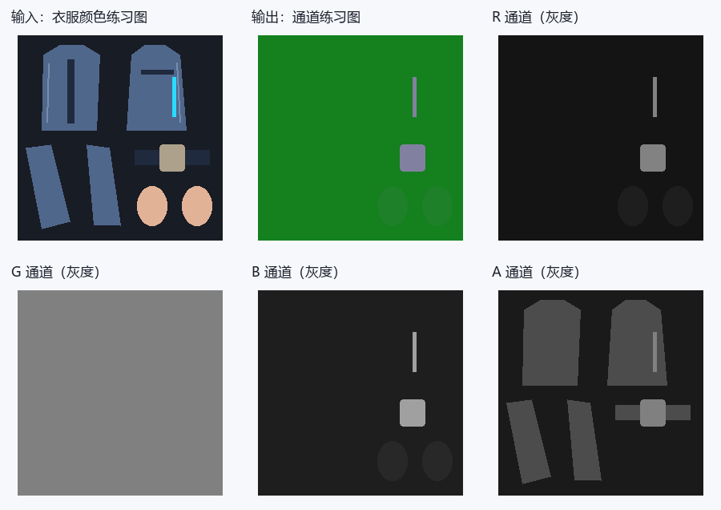
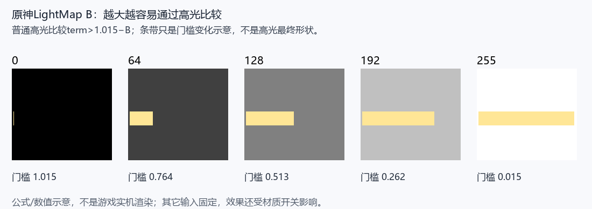
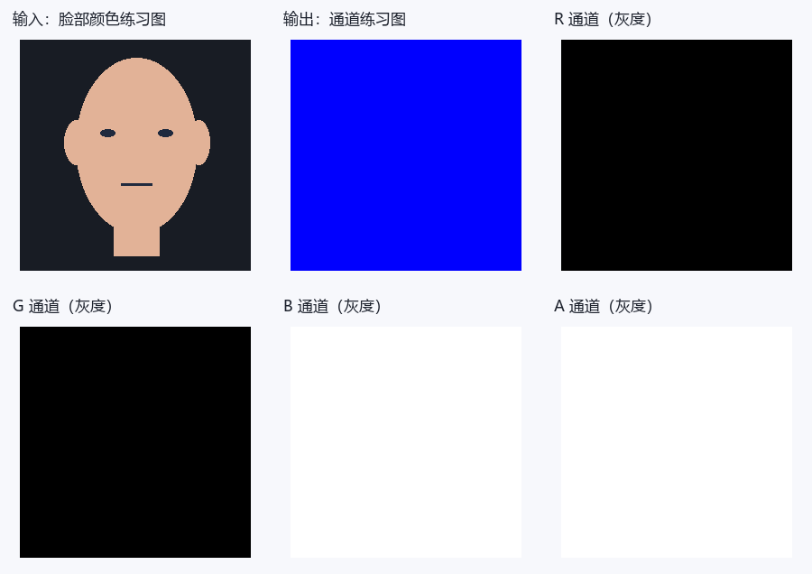
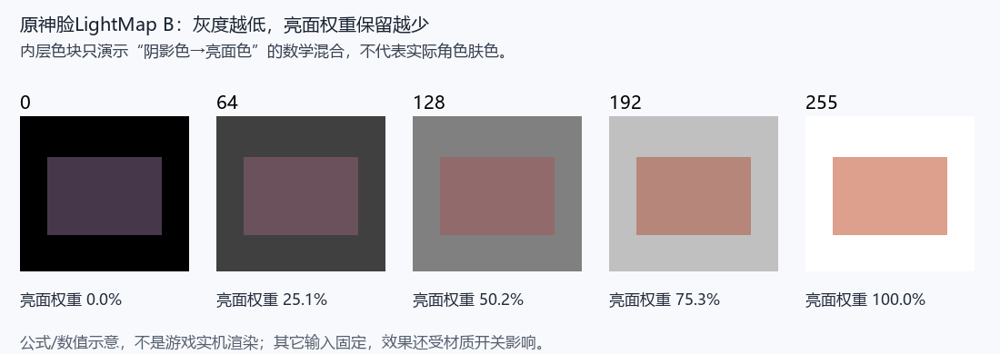
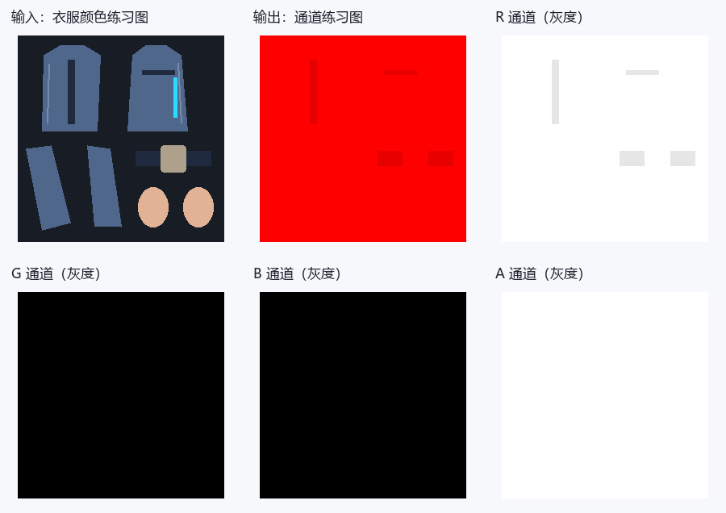
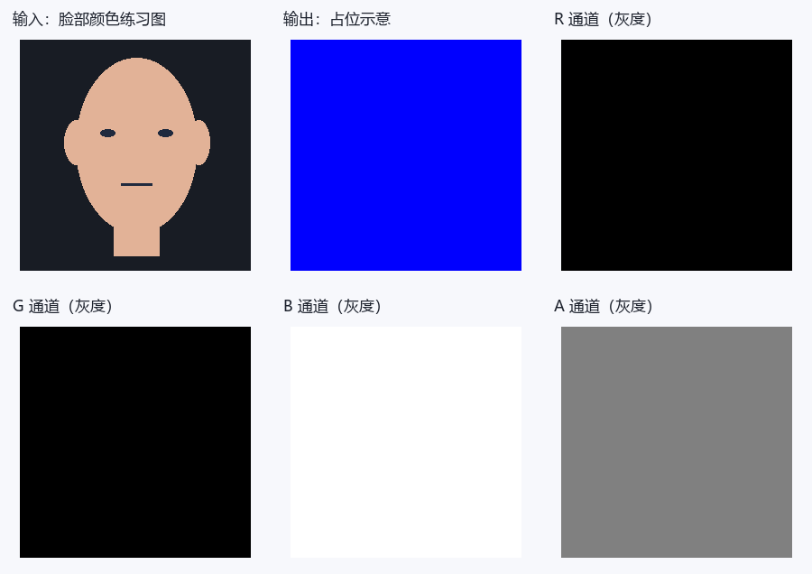
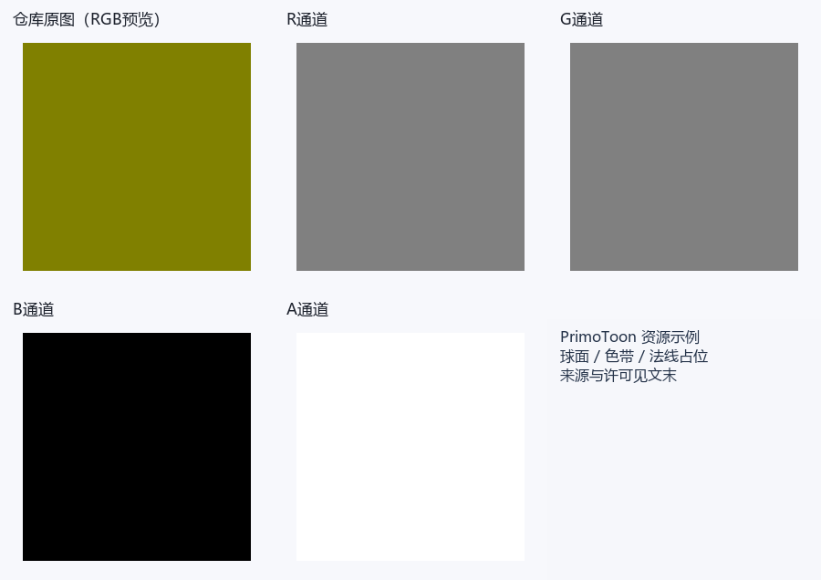
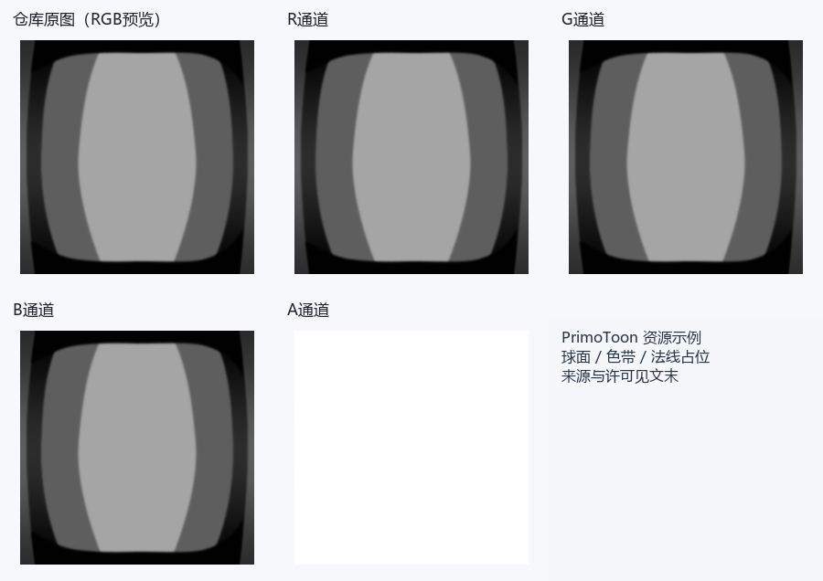
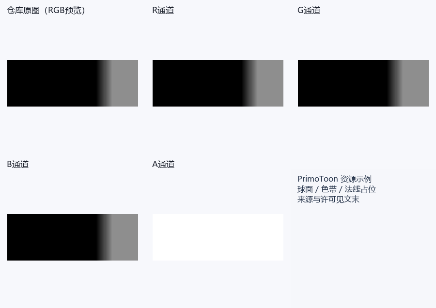

# 原神：逐贴图通道图解与建议提示词

选好下面的贴图类型，就可以查看 RGBA 通道的作用、数值示例和建议提示词。每个分区都提供两种模板：**只有 DiffuseMap**，或 **DiffuseMap＋Blender 导出的 UV 分布图**，可用于 ChatGPT 等支持参考图的图像模型。

如果手边有模型，建议一起提供 UV 图：模型会更容易辨认 UV 岛、边界和细条，通常有助于对齐。只有 Diffuse 也可以尝试；请补充皮肤、布料、裸金属或发光区域的文字说明。

这里的提示词是可调整的参考模板，数字是练习预设，不是角色原始参数。图解是教学示意，不是 AI 实测结果。生成后仍需检查尺寸、UV 和通道数值；UV 图也不能代替材质参数、几何法线或 SDF 方向信息。

## 找到你要生成的贴图

- [DiffuseMap / 颜色图](#map-diffuse)
- [身体 / 头发 LightMap](#map-lightmap)
- [脸部 LightMap（Blue AO选项）](#map-facelight)
- [BumpMap / 身体法线](#map-bump)
- [CustomAO / 自定义遮蔽](#map-customao)
- [FaceMap / 脸部方向阴影图](#map-sdf)
- [Ramp / 漫反射色带](#map-ramp)
- [MatCap / 球面外观图](#map-matcap)
- [LUT / 精确布局与适用范围](#map-lut)
- [独立粒子 BaseTex、液体、噪声、火焰、溶解与深度](#map-particle-base)
- [后处理输入、Bloom、层选择与未使用槽](#map-post-color)

- [10. CustomEmissionTex / 自定义发光遮罩](#map-custom-emission)
- [11. MTSpecularRamp / 金属高光色带](#map-metal-specular-ramp)
- [12. LeatherReflect / 皮革球面反射](#map-leather-reflect)
- [13. LeatherLaserRamp / 皮革镭射色带](#map-leather-laser-ramp)
- [14. GlassSpecularTex / 玻璃双层高光](#map-glass-specular)
- [15. StockingsDetailTex / 丝袜细节打包](#map-stockings-detail)

- [16. MaterialMasksTex / 材质配色权重](#map-material-masks)
- [17. HueMaskTexture / 色相变化选择遮罩](#map-hue-mask)
- [18. OutlineTex / 描边宽度图](#map-outline-width)
- [19. EyeMask / EyeMaskCustom 可编程Stencil遮罩](#map-eye-stencil)
- [20. TempNyxStatePaintMaskTex / 夜魂身体混色遮罩](#map-nyx-body-mask)
- [21. NyxStateOutlineNoise / 夜魂颜色与几何噪声](#map-nyx-noise)
- [22. NyxStateOutlineColorRamp / 夜魂双色带](#map-nyx-color-ramp)
- [23. FakePointNoiseTex / 假点光时间噪声](#map-fake-point-noise)
- [24. WeaponDissolveTex / 武器溶解及亮边](#map-weapon-dissolve)
- [25. WeaponPatternTex / 武器滚动花纹](#map-weapon-pattern)
- [26. ScanPatternTex / 武器扫描条带](#map-weapon-scan)
- [27. DissolveNoise / 角色死亡噪声](#map-death-noise)
- [28. NbrRefTex / NBR球面反射](#map-nbr-reflect)
- [29. ClipAlphaTex / FakePointNoiseTex2/3 未使用槽](#map-unused-slots)

- [30. StarTex / 多版本星斗篷图](#map-star-texture)
- [31. Star02Tex / 第二层星形](#map-star-secondary)
- [32. NoiseTex01 / NoiseTex02 双层星云噪声](#map-star-noise)
- [33. ColorPaletteTex / 星斗篷滚动配色](#map-star-palette)
- [34. ConstellationTex / 星座颜色](#map-star-constellation)
- [35. CloudTex / 星云灰度](#map-star-cloud)
- [36. StarMask / 星色抑制与分块视角权重](#map-star-mask)
- [37. BlockHighlightMask / 四相位分块高光](#map-star-blocks)
- [38. BrightLineMask / 明线灰度选择](#map-star-bright-line)
- [39. FlowMap / FlowMap02 流动灰度层](#map-flow-textures)
- [40. NoiseMap / 流动坐标噪声](#map-flow-noise)
- [41. FlowMask / 流光局部权重](#map-flow-mask)

- [42. Mask / 手臂特效打包](#map-arm-mask)
- [43. VertexTex / 顶点法线方向噪声](#map-vertex-noise)
- [44. VertTex / 片元颜色坐标噪声](#map-fragment-noise)
- [45. LerpTexture / 动态发色三权重](#map-vat-color-lerp)
- [46. PosTex_A / 帧序列位置数据](#map-position-vat)
- [47. VerticalRampTex / VerticalRampTex2 纵向颜色](#map-vat-vertical-ramp)
- [48. HighlightMaskTex / HighlightMaskTex2 高光混色](#map-vat-highlight-masks)

## 准备参考图

- **单图方式：** 上传对应材质的 DiffuseMap 颜色贴图，再复制该分区的单图模板。
- **双图方式：** 第一张上传 DiffuseMap，第二张上传同一材质、同一 UV 层的 UV 分布图，再复制双图模板。两张图保持相同宽高、方向和 0～1 范围，不裁切、不镜像，也不要把 UV 线直接画进 Diffuse。
- **Blender 导出：** 选中目标网格，进入编辑模式并选中该材质对应的面；在 UV 编辑器中选择正确的 UV 层，使用 **UV → 导出 UV 布局（Export UV Layout）**。尺寸设为 Diffuse 的宽高，填充不透明度设为 0，导出 PNG。若没有该选项，可在 Blender 的扩展/插件设置中启用 UV Layout。多材质请分别导出；UDIM 请注明 tile 编号，不要拼成截图。
- 可以下载本页的[教学 Diffuse](./assets/reference-inputs/diffuse.png)与[教学 UV 图](./assets/reference-inputs/uv.png)了解输入形式。它们是通用衣片示意；脸部或头发贴图请换成自己的对应材质参考图，不要用衣服 UV 代替。
- 模板按文中预设开始练习。想调整材质时，可以改预设数值，并补充“哪些区域是什么材质”；UV 只提供边界，不提供材质标签。

## 通道阅读小提示

- 数据值用0～255；线性UNORM中除以255得到0～1。字节128约0.502，若RGB被sRGB解码则约0.216，不能对控制图做自动Gamma或美化。Alpha通常不经过sRGB转换，仍要核对加载路径。
- 灰度白只意味着数值大：乘子、反向遮罩、材质ID、方向数据的“白”含义不同。下面逐图解释，不用一条规则概括。
- 只上传Diffuse时，材质分类是猜测。裸金属、丝袜、发光区域最好在文字里指出；不明区域有保守默认值，但它不恢复原角色ID。
- 合成预览可能受Alpha显示影响；灰度A图是真正的第四通道。下载各层后用取色器看字节，不靠预览颜色判断。

## 1. DiffuseMap / 颜色图 {#map-diffuse}

先看输入的蓝色衣片：颜色图里它就该是蓝色，R/G/B是颜色分量。到了控制图，同一片蓝布可能变成红橙色，那不是改了衣服颜色，而是几个控制值叠在一起。


**教学示意：** 数字对应本节练习预设，图例不属于贴图数据。

[原始RGBA图](./assets/maps/diffuse/diffuse.png) · [R灰度层](./assets/maps/diffuse/diffuse-r.png) · [G灰度层](./assets/maps/diffuse/diffuse-g.png) · [B灰度层](./assets/maps/diffuse/diffuse-b.png) · [A灰度层](./assets/maps/diffuse/diffuse-a.png)

**R怎么用：** R是基础颜色红分量，0最低、255最高。

**G怎么用：** G是基础颜色绿分量，0最低、255最高。

**B怎么用：** B是基础颜色蓝分量，0最低、255最高。

**A怎么用：** A由MainTexAlphaUse=0/1/2/3/4分别选择忽略、裁剪、发光、脸红、输出Alpha；裁剪小于Cutoff丢弃，脸红按A×FaceBlushStrength混色；发光先减0.02，线性字节0～5无该项贡献，6起才有。

颜色分量不是金属、高光或AO；不要增加新的方向光、投影和高光。

**实际分支：** [主图Alpha模式](https://github.com/Hoyotoon/HoyoToon/blob/d9e5ca2f312bf16fba89dee67d32c08b482dcda4/Shaders/Genshin%20Impact/Includes/HoyoToonGenshin-program.hlsl#L728-L749)和[输出Alpha](https://github.com/Hoyotoon/HoyoToon/blob/d9e5ca2f312bf16fba89dee67d32c08b482dcda4/Shaders/Genshin%20Impact/Includes/HoyoToonGenshin-program.hlsl#L887-L901)；主图也用于描边、玻璃与特殊手臂/星斗篷。普通RGB颜色规则不适用于手臂数据分支，见手臂Mask定义。MainTexColoring还会将原A乘MainTexTintColor.A，配色属性也可能改变中间Alpha；调用前处理应一起核对，不把原字节等同最终mask。

### 建议提示词

有 UV 分布图时可选双图模板，更方便核对边界；单图模板同样可以作为起点。

::: tabs

== 只有 DiffuseMap


```text
请根据我上传的这一张原神角色DiffuseMap颜色贴图，生成DiffuseMap / 颜色图的颜色贴图草稿。

生成图片必须与上传Diffuse的像素尺寸、UV岛位置、空白区域、缝线、扣件和所有细条完全对齐，不缩放、镜像、移动或重新排UV。

通道数值采用8位0～255，不做Gamma、自动对比度、美化或预乘Alpha。

完整通道规则：R是基础颜色红分量，0最低、255最高；
G是基础颜色绿分量，0最低、255最高；
B是基础颜色蓝分量，0最低、255最高；
A可由MainTexAlphaUse选择忽略、裁剪、发光或脸红；
裁剪小于Cutoff丢弃，脸红越大越强；
发光先减0.02，线性字节0～5无该项贡献，6起才有。

本次明确采用的生成预设：本次生成同UV、不透明Diffuse颜色草稿：R/G/B按我给出的新配色修改，未指定改色时保留上传图的RGB颜色；
A固定255，不猜透明、发光或材质ID。

不要把自然衣服颜色、RGB明暗或金色油漆直接当成金属、AO或高光值；
只修改我指定的配色，未指定处保留上传Diffuse的颜色和绘制细节。

输出只有目标贴图，不加文字、通道标签、图例、拼图、背景场景、3D渲染或光晕。

这是按给定预设生成的候选，不视为角色原始通道的还原；
不能输出真实Alpha时明确说明，不要以白底预览代替 RGBA 文件。
```

== DiffuseMap＋UV 分布图



```text
我上传了两张参考图：第一张是原神角色 DiffuseMap 颜色贴图，第二张是 Blender 导出的同一材质 UV 分布图。请结合这两张参考图，生成DiffuseMap / 颜色图的颜色贴图草稿。

生成图片必须与上传Diffuse的像素尺寸、UV岛位置、空白区域、缝线、扣件和所有细条完全对齐，不缩放、镜像、移动或重新排UV。

通道数值采用8位0～255，不做Gamma、自动对比度、美化或预乘Alpha。

完整通道规则：R是基础颜色红分量，0最低、255最高；
G是基础颜色绿分量，0最低、255最高；
B是基础颜色蓝分量，0最低、255最高；
A可由MainTexAlphaUse选择忽略、裁剪、发光或脸红；
裁剪小于Cutoff丢弃，脸红越大越强；
发光先减0.02，线性字节0～5无该项贡献，6起才有。

本次明确采用的生成预设：本次生成同UV、不透明Diffuse颜色草稿：R/G/B按我给出的新配色修改，未指定改色时保留上传图的RGB颜色；
A固定255，不猜透明、发光或材质ID。

不要把自然衣服颜色、RGB明暗或金色油漆直接当成金属、AO或高光值；
只修改我指定的配色，未指定处保留上传Diffuse的颜色和绘制细节。

输出只有目标贴图，不加文字、通道标签、图例、拼图、背景场景、3D渲染或光晕。

这是按给定预设生成的候选，不视为角色原始通道的还原；
不能输出真实Alpha时明确说明，不要以白底预览代替 RGBA 文件。

以 Diffuse 的像素画布为基准，用 UV 分布图核对岛轮廓、细条、边界与空白区域。UV 线是参考标记，不得画入结果，也不作为 AO、缝线、法线或高光。

若两图尺寸、朝向或岛位置不一致，请先让我确认，不自行缩放或对齐。

UV 图没有材质标签或几何方向；
未确认区域仍按上述预设，不据 UV 线推断真实法线、SDF 或材质 ID。
```

:::


**拿到结果先看：** 尺寸、UV边界和每通道数值，并检查 Alpha、常量与阈值。模型输出有偏色或渐变时，用通道编辑器精确赋值，确认无误后再导出目标格式并测试。

## 2. 身体 / 头发 LightMap {#map-lightmap}

先找图中的衣片和扣件，再分别看R/G/B/A。同一位置在不同通道里的灰度可以完全不同：一层选材质，一层管高光，一层管阴影。不要为了让合成预览“像原衣服”而把四层一起涂。



**教学示意：** 数字对应本节练习预设，图例不属于贴图数据。

[原始RGBA图](./assets/maps/lightmap/lightmap.png) · [R灰度层](./assets/maps/lightmap/lightmap-r.png) · [G灰度层](./assets/maps/lightmap/lightmap-g.png) · [B灰度层](./assets/maps/lightmap/lightmap-b.png) · [A灰度层](./assets/maps/lightmap/lightmap-a.png)

**R怎么用：** R为普通高光乘子，0无该项、增大增强；>0.89即字节227起可能进入金属，230起关闭普通高光。

**G怎么用：** G控制受光阈值，增大通常更偏亮面；启用AO且顶点AO=1时t=0.5+2(G−0.5)abs(G−0.5)，字节≤6强暗、≥249强亮。

**B怎么用：** B降低普通高光门槛：term>1.015−B，增大扩大范围；正常指数下0～3不通过。

**A怎么用：** A选参数组，0～50组1、51～102组4、103～152组3、153～204组5、205～255组2；开关关闭会回退，无物理材质固定对应。

想让高光更亮改R，想让出现范围更宽改B；G不是照搬衣服明暗。

**源码与额外消费：** [参数组选择](https://github.com/Hoyotoon/HoyoToon/blob/d9e5ca2f312bf16fba89dee67d32c08b482dcda4/Shaders/Genshin%20Impact/Includes/HoyoToonGenshin-common.hlsl#L1-L12)、[阴影阈值](https://github.com/Hoyotoon/HoyoToon/blob/d9e5ca2f312bf16fba89dee67d32c08b482dcda4/Shaders/Genshin%20Impact/Includes/HoyoToonGenshin-common.hlsl#L467-L550)、[高光](https://github.com/Hoyotoon/HoyoToon/blob/d9e5ca2f312bf16fba89dee67d32c08b482dcda4/Shaders/Genshin%20Impact/Includes/HoyoToonGenshin-common.hlsl#L712-L737)和[主程序](https://github.com/Hoyotoon/HoyoToon/blob/d9e5ca2f312bf16fba89dee67d32c08b482dcda4/Shaders/Genshin%20Impact/Includes/HoyoToonGenshin-program.hlsl#L648-L870)。Repeat取uv_a；所有控制通道保持线性。A区间边界的后续判断可覆盖前一个组，开关未启用回退组1。R在0.5…0.85还可进入NBR，B在皮革模式为leather_color乘子，在丝袜模式以1−B抑制受光项；G>0.95可为眼发光区域，G>0.8还可强制casted=1。阈值／模式不是标准金属或粗糙度打包。

### 建议提示词

有 UV 分布图时可选双图模板，更方便核对边界；单图模板同样可以作为起点。

::: tabs

== 只有 DiffuseMap


```text
请根据我上传的这一张原神角色DiffuseMap颜色贴图，生成身体 / 头发 LightMap的技术数据草稿。

生成图片必须与上传Diffuse的像素尺寸、UV岛位置、空白区域、缝线、扣件和所有细条完全对齐，不缩放、镜像、移动或重新排UV。

通道数值采用8位0～255，不做Gamma、自动对比度、美化或预乘Alpha。

完整通道规则：R为普通高光乘子，0无该项、增大增强；
>0.89即字节227起可能进入金属，230起关闭普通高光；
G控制受光阈值，增大通常更偏亮面；
启用AO且顶点AO=1时t=0.5+2(G−0.5)abs(G−0.5)，字节≤6强暗、≥249强亮；
B降低普通高光门槛：term>1.015−B，增大扩大范围；
正常指数下0～3不通过；
A选参数组，0～50组1、51～102组4、103～152组3、153～204组5、205～255组2；
开关关闭会回退，无物理材质固定对应。

本次明确采用的生成预设：仅普通非金属练习，金属开关关闭：皮肤RGBA(30,128,40,26)、布料(20,128,30,76)、普通光滑饰件(130,128,160,128)、未识别(20,128,30,26)。这些ID只定义练习组，不声称皮肤固定组1。

不要把自然衣服颜色、RGB明暗或金色油漆直接当成金属、AO或高光值；
只按我文字确认的材质区域分类，无法判断的区域使用上述未知默认值，没有默认时使用本次占位规则而不推断原游戏数据。

输出只有目标贴图，不加文字、通道标签、图例、拼图、背景场景、3D渲染或光晕。

这是按给定预设生成的候选，不视为角色原始通道的还原；
不能输出真实Alpha时明确说明，不要以白底预览代替 RGBA 文件。

除上面明确要求的连续阴影或灰度过渡外，每个确认材质区按预设定值填充；
材质ID禁止渐变，不要因为白布/黑布就另设控制值。背景和未识别区按本次默认编码，不自行补未给出的游戏规则。
```

== DiffuseMap＋UV 分布图


```text
我上传了两张参考图：第一张是原神角色 DiffuseMap 颜色贴图，第二张是 Blender 导出的同一材质 UV 分布图。请结合这两张参考图，生成身体 / 头发 LightMap的技术数据草稿。

生成图片必须与上传Diffuse的像素尺寸、UV岛位置、空白区域、缝线、扣件和所有细条完全对齐，不缩放、镜像、移动或重新排UV。

通道数值采用8位0～255，不做Gamma、自动对比度、美化或预乘Alpha。

完整通道规则：R为普通高光乘子，0无该项、增大增强；
>0.89即字节227起可能进入金属，230起关闭普通高光；
G控制受光阈值，增大通常更偏亮面；
启用AO且顶点AO=1时t=0.5+2(G−0.5)abs(G−0.5)，字节≤6强暗、≥249强亮；
B降低普通高光门槛：term>1.015−B，增大扩大范围；
正常指数下0～3不通过；
A选参数组，0～50组1、51～102组4、103～152组3、153～204组5、205～255组2；
开关关闭会回退，无物理材质固定对应。

本次明确采用的生成预设：仅普通非金属练习，金属开关关闭：皮肤RGBA(30,128,40,26)、布料(20,128,30,76)、普通光滑饰件(130,128,160,128)、未识别(20,128,30,26)。这些ID只定义练习组，不声称皮肤固定组1。

不要把自然衣服颜色、RGB明暗或金色油漆直接当成金属、AO或高光值；
只按我文字确认的材质区域分类，无法判断的区域使用上述未知默认值，没有默认时使用本次占位规则而不推断原游戏数据。

输出只有目标贴图，不加文字、通道标签、图例、拼图、背景场景、3D渲染或光晕。

这是按给定预设生成的候选，不视为角色原始通道的还原；
不能输出真实Alpha时明确说明，不要以白底预览代替 RGBA 文件。

除上面明确要求的连续阴影或灰度过渡外，每个确认材质区按预设定值填充；
材质ID禁止渐变，不要因为白布/黑布就另设控制值。背景和未识别区按本次默认编码，不自行补未给出的游戏规则。

以 Diffuse 的像素画布为基准，用 UV 分布图核对岛轮廓、细条、边界与空白区域。UV 线是参考标记，不得画入结果，也不作为 AO、缝线、法线或高光。

若两图尺寸、朝向或岛位置不一致，请先让我确认，不自行缩放或对齐。

UV 图没有材质标签或几何方向；
未确认区域仍按上述预设，不据 UV 线推断真实法线、SDF 或材质 ID。
```

:::


**拿到结果先看：** 尺寸、UV边界和每通道数值，并检查 Alpha、常量与阈值。模型输出有偏色或渐变时，用通道编辑器精确赋值，确认无误后再导出目标格式并测试。



## 3. 脸部 LightMap（Blue AO选项） {#map-facelight}

脸图和身体图不能共用解释。图中常量只是把每个通道的位置拆给你看，不代表脸的方向阴影已经恢复；眼鼻嘴的对应关系、视角和材质分支都很重要。



**教学示意：** 数字对应本节练习预设，图例不属于贴图数据。

[原始RGBA图](./assets/maps/facelight/facelight.png) · [R灰度层](./assets/maps/facelight/facelight-r.png) · [G灰度层](./assets/maps/facelight/facelight-g.png) · [B灰度层](./assets/maps/facelight/facelight-b.png) · [A灰度层](./assets/maps/facelight/facelight-a.png)

**R怎么用：** R不参与shadow_area_face的Blue AO乘法；主程序仍把LightMap.R用于高光／材质判断，另见身体LightMap。

**G怎么用：** G不参与Blue AO乘法；主程序仍可用G控制眼部发光区域及常规阴影输入，不等于整张脸图无用途。

**B怎么用：** B在UseFaceBlueAsAO开启时乘SDF亮面权重，0阴影端、128约50.2%、180约70.6%、255保留100%。

**A怎么用：** A不参与Blue AO乘法；主程序仍用LightMap.A选择材质参数组，另见身体LightMap。

180没有特殊开关意义；最终亮度不等于乘子百分比。 R/G/A占位取值没有已证实的兼容性，建议提示词只供练习打包，不是建议覆盖原脸图。



**源码：** [新脸Blue AO](https://github.com/Hoyotoon/HoyoToon/blob/d9e5ca2f312bf16fba89dee67d32c08b482dcda4/Shaders/Genshin%20Impact/Includes/HoyoToonGenshin-common.hlsl#L430-L464)明确只在UseFaceBlueAsAO开启时把LightMap.B乘到FaceMap.A形成的亮面权重，采样原UV（不是镜像faceuv）。这只说明该AO链，R/G/A的其他消费不能抹掉，详见LightMap与眼Stencil定义。

### 建议提示词（占位练习）

有 UV 分布图时可选双图模板，更方便核对边界；单图模板同样可以作为起点。

::: tabs

== 只有 DiffuseMap


```text
请根据我上传的这一张原神角色DiffuseMap颜色贴图，生成脸部 LightMap（Blue AO选项）的技术数据草稿。

生成图片必须与上传Diffuse的像素尺寸、UV岛位置、空白区域、缝线、扣件和所有细条完全对齐，不缩放、镜像、移动或重新排UV。

通道数值采用8位0～255，不做Gamma、自动对比度、美化或预乘Alpha。

完整通道规则：R不参与shadow_area_face的Blue AO乘法；主程序仍把LightMap.R用于高光／材质判断，另见身体LightMap；
G不参与Blue AO乘法；主程序仍可用G控制眼部发光区域及常规阴影输入，不等于整张脸图无用途；
B在UseFaceBlueAsAO开启时乘SDF亮面权重，0阴影端、128约50.2%、180约70.6%、255保留100%；
A不参与Blue AO乘法；主程序仍用LightMap.A选择材质参数组，另见身体LightMap。

本次明确采用的生成预设：只做Blue AO教学占位：R=0、G=0、A=255；
B普通脸区255、可辨认重叠缝隙230。未知通道是占位，不是从Diffuse恢复。

不要把自然衣服颜色、RGB明暗或金色油漆直接当成金属、AO或高光值；
只按我文字确认的材质区域分类，无法判断的区域使用上述未知默认值，没有默认时使用本次占位规则而不推断原游戏数据。

输出只有目标贴图，不加文字、通道标签、图例、拼图、背景场景、3D渲染或光晕。

这是按给定预设生成的候选，不视为角色原始通道的还原；
不能输出真实Alpha时明确说明，不要以白底预览代替 RGBA 文件。
```

== DiffuseMap＋UV 分布图


```text
我上传了两张参考图：第一张是原神角色 DiffuseMap 颜色贴图，第二张是 Blender 导出的同一材质 UV 分布图。请结合这两张参考图，生成脸部 LightMap（Blue AO选项）的技术数据草稿。

生成图片必须与上传Diffuse的像素尺寸、UV岛位置、空白区域、缝线、扣件和所有细条完全对齐，不缩放、镜像、移动或重新排UV。

通道数值采用8位0～255，不做Gamma、自动对比度、美化或预乘Alpha。

完整通道规则：R不参与shadow_area_face的Blue AO乘法；主程序仍把LightMap.R用于高光／材质判断，另见身体LightMap；
G不参与Blue AO乘法；主程序仍可用G控制眼部发光区域及常规阴影输入，不等于整张脸图无用途；
B在UseFaceBlueAsAO开启时乘SDF亮面权重，0阴影端、128约50.2%、180约70.6%、255保留100%；
A不参与Blue AO乘法；主程序仍用LightMap.A选择材质参数组，另见身体LightMap。

本次明确采用的生成预设：只做Blue AO教学占位：R=0、G=0、A=255；
B普通脸区255、可辨认重叠缝隙230。未知通道是占位，不是从Diffuse恢复。

不要把自然衣服颜色、RGB明暗或金色油漆直接当成金属、AO或高光值；
只按我文字确认的材质区域分类，无法判断的区域使用上述未知默认值，没有默认时使用本次占位规则而不推断原游戏数据。

输出只有目标贴图，不加文字、通道标签、图例、拼图、背景场景、3D渲染或光晕。

这是按给定预设生成的候选，不视为角色原始通道的还原；
不能输出真实Alpha时明确说明，不要以白底预览代替 RGBA 文件。

以 Diffuse 的像素画布为基准，用 UV 分布图核对岛轮廓、细条、边界与空白区域。UV 线是参考标记，不得画入结果，也不作为 AO、缝线、法线或高光。

若两图尺寸、朝向或岛位置不一致，请先让我确认，不自行缩放或对齐。

UV 图没有材质标签或几何方向；
未确认区域仍按上述预设，不据 UV 线推断真实法线、SDF 或材质 ID。
```

:::


**拿到结果先看：** 尺寸、UV边界和每通道数值，并检查 Alpha、常量与阈值。模型输出有偏色或渐变时，用通道编辑器精确赋值，确认无误后再导出目标格式并测试。

## 4. BumpMap / 身体法线 {#map-bump}

看R和G里的细小变化，方向信息藏在这些梯度里，而不是藏在“蓝紫色外观”里。平坦区域约128；从128向两侧偏移表示向不同切线方向倾斜，不是越白越凸。


**教学示意：** 数字对应本节练习预设，图例不属于贴图数据。

[原始RGBA图](./assets/maps/bump/bump.png) · [R灰度层](./assets/maps/bump/bump-r.png) · [G灰度层](./assets/maps/bump/bump-g.png) · [B灰度层](./assets/maps/bump/bump-b.png) · [A灰度层](./assets/maps/bump/bump-a.png)

**R怎么用：** R编码切线法线X：0负方向、128附近零偏转、255正方向。

**G怎么用：** G编码切线法线Y：0负方向、128附近零偏转、255正方向，最终翻转依Shader。

**B怎么用：** B在纹理线条功能中跨阈值混入线条色，越大更多混入，线条色可亮可暗；不作为原Z。

**A怎么用：** A在此BumpMap绑定未消费，法线和线条只用RG和B。

该函数指定Z后归一化，不是把标准蓝紫图直接写回。

**源码与编码：** [采样及功能开关](https://github.com/Hoyotoon/HoyoToon/blob/d9e5ca2f312bf16fba89dee67d32c08b482dcda4/Shaders/Genshin%20Impact/Includes/HoyoToonGenshin-program.hlsl#L648-L663)、[normal_mapping](https://github.com/Hoyotoon/HoyoToon/blob/d9e5ca2f312bf16fba89dee67d32c08b482dcda4/Shaders/Genshin%20Impact/Includes/HoyoToonGenshin-common.hlsl#L370-L403)与[detail_line](https://github.com/Hoyotoon/HoyoToon/blob/d9e5ca2f312bf16fba89dee67d32c08b482dcda4/Shaders/Genshin%20Impact/Includes/HoyoToonGenshin-common.hlsl#L407-L427)。Repeat取uv_a，RG先2×值−1，Z被重建为max(1−min(BumpScale,0.5),0.001)，而非从B读取或sqrt(1−x²−y²)重建；随后normalize。BumpScale不是直接乘RG。TBN由坐标导数计算，DummyFixedForNormal决定输入ws_pos还是view，不能照搬标准引擎切线约定。线条B经过距离相关smoothstep后混色，正向增大不保证颜色更亮；A未消费。

### 建议提示词

有 UV 分布图时可选双图模板，更方便核对边界；单图模板同样可以作为起点。

::: tabs

== 只有 DiffuseMap


```text
请根据我上传的这一张原神角色DiffuseMap颜色贴图，生成BumpMap / 身体法线的技术数据草稿。

生成图片必须与上传Diffuse的像素尺寸、UV岛位置、空白区域、缝线、扣件和所有细条完全对齐，不缩放、镜像、移动或重新排UV。

通道数值采用8位0～255，不做Gamma、自动对比度、美化或预乘Alpha。

完整通道规则：R编码切线法线X：0负方向、128附近零偏转、255正方向；
G编码切线法线Y：0负方向、128附近零偏转、255正方向，最终翻转依Shader；
B在纹理线条功能中跨阈值混入线条色，越大更多混入，线条色可亮可暗；
不作为原Z；
A在此BumpMap绑定未消费，法线和线条只用RG和B。

本次明确采用的生成预设：平坦RG=(128,128)，指定浅缝线才有小XY变化；
无原控制图时B=0关闭练习线条候选、A=255占位，不覆盖原角色未知BA。

不要把自然衣服颜色、RGB明暗或金色油漆直接当成金属、AO或高光值；
只按我文字确认的材质区域分类，无法判断的区域使用上述未知默认值，没有默认时使用本次占位规则而不推断原游戏数据。

输出只有目标贴图，不加文字、通道标签、图例、拼图、背景场景、3D渲染或光晕。

这是按给定预设生成的候选，不视为角色原始通道的还原；
不能输出真实Alpha时明确说明，不要以白底预览代替 RGBA 文件。

法线细节仅来自我明确指出的浅缝线、压边、扣件和发丝结构，不把Diffuse明暗转成高度，不新增织物噪点；
XY解码为2×值/255−1，保持X²+Y²≤1并按目标定义重建或填写Z，不能把方向极值当凹凸强度。
```

== DiffuseMap＋UV 分布图


```text
我上传了两张参考图：第一张是原神角色 DiffuseMap 颜色贴图，第二张是 Blender 导出的同一材质 UV 分布图。请结合这两张参考图，生成BumpMap / 身体法线的技术数据草稿。

生成图片必须与上传Diffuse的像素尺寸、UV岛位置、空白区域、缝线、扣件和所有细条完全对齐，不缩放、镜像、移动或重新排UV。

通道数值采用8位0～255，不做Gamma、自动对比度、美化或预乘Alpha。

完整通道规则：R编码切线法线X：0负方向、128附近零偏转、255正方向；
G编码切线法线Y：0负方向、128附近零偏转、255正方向，最终翻转依Shader；
B在纹理线条功能中跨阈值混入线条色，越大更多混入，线条色可亮可暗；
不作为原Z；
A在此BumpMap绑定未消费，法线和线条只用RG和B。

本次明确采用的生成预设：平坦RG=(128,128)，指定浅缝线才有小XY变化；
无原控制图时B=0关闭练习线条候选、A=255占位，不覆盖原角色未知BA。

不要把自然衣服颜色、RGB明暗或金色油漆直接当成金属、AO或高光值；
只按我文字确认的材质区域分类，无法判断的区域使用上述未知默认值，没有默认时使用本次占位规则而不推断原游戏数据。

输出只有目标贴图，不加文字、通道标签、图例、拼图、背景场景、3D渲染或光晕。

这是按给定预设生成的候选，不视为角色原始通道的还原；
不能输出真实Alpha时明确说明，不要以白底预览代替 RGBA 文件。

法线细节仅来自我明确指出的浅缝线、压边、扣件和发丝结构，不把Diffuse明暗转成高度，不新增织物噪点；
XY解码为2×值/255−1，保持X²+Y²≤1并按目标定义重建或填写Z，不能把方向极值当凹凸强度。

以 Diffuse 的像素画布为基准，用 UV 分布图核对岛轮廓、细条、边界与空白区域。UV 线是参考标记，不得画入结果，也不作为 AO、缝线、法线或高光。

若两图尺寸、朝向或岛位置不一致，请先让我确认，不自行缩放或对齐。

UV 图没有材质标签或几何方向；
未确认区域仍按上述预设，不据 UV 线推断真实法线、SDF 或材质 ID。
```

:::


**拿到结果先看：** 尺寸、UV边界和每通道数值，并检查 Alpha、常量与阈值。模型输出有偏色或渐变时，用通道编辑器精确赋值，确认无误后再导出目标格式并测试。

## 5. CustomAO / 自定义遮蔽 {#map-customao}

颜色图里的黑色腰带不该自动变成重遮蔽。AO应该对应结构重叠、接缝，而不是布料本身的颜色；灰度较白通常保留更多受光。



**教学示意：** 数字对应本节练习预设，图例不属于贴图数据。

[原始RGBA图](./assets/maps/customao/customao.png) · [R灰度层](./assets/maps/customao/customao-r.png) · [G灰度层](./assets/maps/customao/customao-g.png) · [B灰度层](./assets/maps/customao/customao-b.png) · [A灰度层](./assets/maps/customao/customao-a.png)

**R怎么用：** R为AO权重，低值更遮蔽、255不额外削弱，参与Ramp/混合不保证0纯黑。

**G怎么用：** G在此CustomAO绑定未消费，采样只取R。

**B怎么用：** B在此CustomAO绑定未消费，采样只取R。

**A怎么用：** A在此CustomAO绑定未消费，采样只取R。

必须确认CustomAO采样衣服同一UV，屏幕坐标或第二UV时不能从当前Diffuse配准。

**源码：** [AO取样](https://github.com/Hoyotoon/HoyoToon/blob/d9e5ca2f312bf16fba89dee67d32c08b482dcda4/Shaders/Genshin%20Impact/Includes/HoyoToonGenshin-program.hlsl#L530-L536)可在uv_a、第二UV或屏幕UV中选择CustomAOUV%3，乘CustomAO_ST；AOSamplerType=0为Repeat，其他值Clamp。采样只取R。[shadow_color](https://github.com/Hoyotoon/HoyoToon/blob/d9e5ca2f312bf16fba89dee67d32c08b482dcda4/Shaders/Genshin%20Impact/Includes/HoyoToonGenshin-common.hlsl#L574-L641)仅CustomAOEnable时使用：新脸模式直接乘亮面权重；Ramp模式参与横坐标shadow.x×ao和混合权重saturate(shadow.y+1−ao)，并可能与casted相乘。AO=0不保证输出纯黑；不要为GBA编造作用。

### 建议提示词

有 UV 分布图时可选双图模板，更方便核对边界；单图模板同样可以作为起点。

::: tabs

== 只有 DiffuseMap


```text
请根据我上传的这一张原神角色DiffuseMap颜色贴图，生成CustomAO / 自定义遮蔽的技术数据草稿。

生成图片必须与上传Diffuse的像素尺寸、UV岛位置、空白区域、缝线、扣件和所有细条完全对齐，不缩放、镜像、移动或重新排UV。

通道数值采用8位0～255，不做Gamma、自动对比度、美化或预乘Alpha。

完整通道规则：R为AO权重，低值更遮蔽、255不额外削弱，参与Ramp/混合不保证0纯黑；
G在此CustomAO绑定未消费，采样只取R；
B在此CustomAO绑定未消费，采样只取R；
A在此CustomAO绑定未消费，采样只取R。

本次明确采用的生成预设：仅同UV教学：R无遮挡255、明确结构缝隙230，柔和过渡；
G=0、B=0、A=255占位。

不要把自然衣服颜色、RGB明暗或金色油漆直接当成金属、AO或高光值；
只按我文字确认的材质区域分类，无法判断的区域使用上述未知默认值，没有默认时使用本次占位规则而不推断原游戏数据。

输出只有目标贴图，不加文字、通道标签、图例、拼图、背景场景、3D渲染或光晕。

这是按给定预设生成的候选，不视为角色原始通道的还原；
不能输出真实Alpha时明确说明，不要以白底预览代替 RGBA 文件。

除上面明确要求的连续阴影或灰度过渡外，每个确认材质区按预设定值填充；
材质ID禁止渐变，不要因为白布/黑布就另设控制值。背景和未识别区按本次默认编码，不自行补未给出的游戏规则。
```

== DiffuseMap＋UV 分布图


```text
我上传了两张参考图：第一张是原神角色 DiffuseMap 颜色贴图，第二张是 Blender 导出的同一材质 UV 分布图。请结合这两张参考图，生成CustomAO / 自定义遮蔽的技术数据草稿。

生成图片必须与上传Diffuse的像素尺寸、UV岛位置、空白区域、缝线、扣件和所有细条完全对齐，不缩放、镜像、移动或重新排UV。

通道数值采用8位0～255，不做Gamma、自动对比度、美化或预乘Alpha。

完整通道规则：R为AO权重，低值更遮蔽、255不额外削弱，参与Ramp/混合不保证0纯黑；
G在此CustomAO绑定未消费，采样只取R；
B在此CustomAO绑定未消费，采样只取R；
A在此CustomAO绑定未消费，采样只取R。

本次明确采用的生成预设：仅同UV教学：R无遮挡255、明确结构缝隙230，柔和过渡；
G=0、B=0、A=255占位。

不要把自然衣服颜色、RGB明暗或金色油漆直接当成金属、AO或高光值；
只按我文字确认的材质区域分类，无法判断的区域使用上述未知默认值，没有默认时使用本次占位规则而不推断原游戏数据。

输出只有目标贴图，不加文字、通道标签、图例、拼图、背景场景、3D渲染或光晕。

这是按给定预设生成的候选，不视为角色原始通道的还原；
不能输出真实Alpha时明确说明，不要以白底预览代替 RGBA 文件。

除上面明确要求的连续阴影或灰度过渡外，每个确认材质区按预设定值填充；
材质ID禁止渐变，不要因为白布/黑布就另设控制值。背景和未识别区按本次默认编码，不自行补未给出的游戏规则。

以 Diffuse 的像素画布为基准，用 UV 分布图核对岛轮廓、细条、边界与空白区域。UV 线是参考标记，不得画入结果，也不作为 AO、缝线、法线或高光。

若两图尺寸、朝向或岛位置不一致，请先让我确认，不自行缩放或对齐。

UV 图没有材质标签或几何方向；
未确认区域仍按上述预设，不据 UV 线推断真实法线、SDF 或材质 ID。
```

:::


**拿到结果先看：** 尺寸、UV边界和每通道数值，并检查 Alpha、常量与阈值。模型输出有偏色或渐变时，用通道编辑器精确赋值，确认无误后再导出目标格式并测试。

## 6. FaceMap / 脸部方向阴影图 {#map-sdf}

这张示意图展示常量占位，用来认识通道，并不具备正确的脸部方向阴影。颜色图没有告诉我们每个脸部像素在哪个光向开始转暗；正确方向场需要额外设计或几何信息。



**常量占位示意：** 用于认识通道，不具备正确的脸部方向阴影。

[原始RGBA图](./assets/maps/sdf/sdf.png) · [R灰度层](./assets/maps/sdf/sdf-r.png) · [G灰度层](./assets/maps/sdf/sdf-g.png) · [B灰度层](./assets/maps/sdf/sdf-b.png) · [A灰度层](./assets/maps/sdf/sdf-a.png)

**R怎么用：** R在FaceMap方向阴影和轮廓宽度中未消费，仅调试显示。

**G怎么用：** G在FaceMap方向阴影和轮廓宽度中未消费，仅调试显示。

**B怎么用：** B为新脸轮廓宽度乘子，0抑制该项、255最大纹理乘子。

**A怎么用：** A是方向阴影阈值场，固定光向下增大更偏亮面，镜像/头部方向决定采样。

只上传Diffuse无法唯一确定方向场。下面建议模板仅生成标明用途的占位草稿，不是正确SDF生成配方；要重建必须增加几何/光向设计信息。

**源码：** [方向阴影](https://github.com/Hoyotoon/HoyoToon/blob/d9e5ca2f312bf16fba89dee67d32c08b482dcda4/Shaders/Genshin%20Impact/Includes/HoyoToonGenshin-common.hlsl#L430-L464)：光与headRight的XZ点积>0取原UV，否则取(1−u,v)；t=1−(headForward·light×0.5+0.5)，先由FaceMapRotateOffset整形，再smoothstep(t−FaceMapSoftness,t+FaceMapSoftness,A)。UseFaceBlueAsAO额外乘LightMap.B；这里没有鸣潮式headForward≥−0.5门控，不应混用。FaceMap.B另在[顶点描边](https://github.com/Hoyotoon/HoyoToon/blob/d9e5ca2f312bf16fba89dee67d32c08b482dcda4/Shaders/Genshin%20Impact/Includes/HoyoToonGenshin-program.hlsl#L354-L360)于UseFaceMapNew开启时以mip0乘轮廓宽度；R/G只是调试。

### 建议提示词（占位练习）

有 UV 分布图时可选双图模板，更方便核对边界；单图模板同样可以作为起点。

::: tabs

== 只有 DiffuseMap


```text
请根据我上传的这一张原神角色DiffuseMap颜色贴图，生成FaceMap / 脸部方向阴影图的占位草稿。

生成图片必须与上传Diffuse的像素尺寸、UV岛位置、空白区域、缝线、扣件和所有细条完全对齐，不缩放、镜像、移动或重新排UV。

通道数值采用8位0～255，不做Gamma、自动对比度、美化或预乘Alpha。

完整通道规则：R在FaceMap方向阴影和轮廓宽度中未消费，仅调试显示；
G在FaceMap方向阴影和轮廓宽度中未消费，仅调试显示；
B为新脸轮廓宽度乘子，0抑制该项、255最大纹理乘子；
A是方向阴影阈值场，固定光向下增大更偏亮面，镜像/头部方向决定采样。

本次明确采用的生成预设：非还原占位RGBA(0,0,255,128)，保留练习轮廓乘子但A平场没有正确脸阴影。

不要把自然衣服颜色、RGB明暗或金色油漆直接当成金属、AO或高光值；
只按我文字确认的材质区域分类，无法判断的区域使用上述未知默认值，没有默认时使用本次占位规则而不推断原游戏数据。

输出只有目标贴图，不加文字、通道标签、图例、拼图、背景场景、3D渲染或光晕。

这是按给定预设生成的候选，不视为角色原始通道的还原；
不能输出真实Alpha时明确说明，不要以白底预览代替 RGBA 文件。
```

== DiffuseMap＋UV 分布图


```text
我上传了两张参考图：第一张是原神角色 DiffuseMap 颜色贴图，第二张是 Blender 导出的同一材质 UV 分布图。请结合这两张参考图，生成FaceMap / 脸部方向阴影图的占位草稿。

生成图片必须与上传Diffuse的像素尺寸、UV岛位置、空白区域、缝线、扣件和所有细条完全对齐，不缩放、镜像、移动或重新排UV。

通道数值采用8位0～255，不做Gamma、自动对比度、美化或预乘Alpha。

完整通道规则：R在FaceMap方向阴影和轮廓宽度中未消费，仅调试显示；
G在FaceMap方向阴影和轮廓宽度中未消费，仅调试显示；
B为新脸轮廓宽度乘子，0抑制该项、255最大纹理乘子；
A是方向阴影阈值场，固定光向下增大更偏亮面，镜像/头部方向决定采样。

本次明确采用的生成预设：非还原占位RGBA(0,0,255,128)，保留练习轮廓乘子但A平场没有正确脸阴影。

不要把自然衣服颜色、RGB明暗或金色油漆直接当成金属、AO或高光值；
只按我文字确认的材质区域分类，无法判断的区域使用上述未知默认值，没有默认时使用本次占位规则而不推断原游戏数据。

输出只有目标贴图，不加文字、通道标签、图例、拼图、背景场景、3D渲染或光晕。

这是按给定预设生成的候选，不视为角色原始通道的还原；
不能输出真实Alpha时明确说明，不要以白底预览代替 RGBA 文件。

以 Diffuse 的像素画布为基准，用 UV 分布图核对岛轮廓、细条、边界与空白区域。UV 线是参考标记，不得画入结果，也不作为 AO、缝线、法线或高光。

若两图尺寸、朝向或岛位置不一致，请先让我确认，不自行缩放或对齐。

UV 图没有材质标签或几何方向；
未确认区域仍按上述预设，不据 UV 线推断真实法线、SDF 或材质 ID。
```

:::


**拿到结果先看：** 尺寸、UV边界和每通道数值，并检查 Alpha、常量与阈值。模型输出有偏色或渐变时，用通道编辑器精确赋值，确认无误后再导出目标格式并测试。

## 7. Ramp / 漫反射色带 {#map-ramp}

看横向色带：它按受光坐标查颜色，不是按衣服UV读。四通道图里白色Alpha可能只是占位，也可能控制混合，要看这一种表的定义。


**教学示意：** 数字对应本节练习预设，图例不属于贴图数据。

[原始RGBA图](./assets/maps/ramp/ramp.png) · [R灰度层](./assets/maps/ramp/ramp-r.png) · [G灰度层](./assets/maps/ramp/ramp-g.png) · [B灰度层](./assets/maps/ramp/ramp-b.png) · [A灰度层](./assets/maps/ramp/ramp-a.png)

**R怎么用：** R是查表颜色红分量，值增大增加所采样红贡献。

**G怎么用：** G是查表颜色绿分量，值增大增加所采样绿贡献。

**B怎么用：** B是查表颜色蓝分量，值增大增加所采样蓝贡献。

**A怎么用：** A在所引漫反射Ramp采样中未消费，仅取RGB；保留原Alpha兼容其他实现，不能把它当统一阴影遮罩。

这是查表坐标图，不使用衣服UV；Diffuse只提供配色/风格线索，不能推回原查表参数。

**坐标与消费证据：** PackedShadowRampTex按材质行和日夜坐标分别取样RGB，然后按日夜参数混合；服装UV只决定材质ID，不能把服装轮廓直接画到表里。 [固定版本Ramp读取](https://github.com/Hoyotoon/HoyoToon/blob/d9e5ca2f312bf16fba89dee67d32c08b482dcda4/Shaders/Genshin%20Impact/Includes/HoyoToonGenshin-common.hlsl#L609-L634)。

### 建议提示词

这类图不沿服装 UV 排列，双图模板也保持指定的查表/平铺结构。

::: tabs

== 只有 DiffuseMap


```text
请根据我上传的这一张原神角色DiffuseMap颜色贴图，生成Ramp / 漫反射色带的技术数据草稿。

这是查表或平铺纹理，不是衣服UV图，按下面指定尺寸和坐标结构输出，不把衣服轮廓放进图里。

通道数值采用8位0～255，不做Gamma、自动对比度、美化或预乘Alpha。

完整通道规则：R是查表颜色红分量，值增大增加所采样红贡献；
G是查表颜色绿分量，值增大增加所采样绿贡献；
B是查表颜色蓝分量，值增大增加所采样蓝贡献；
A在所引漫反射Ramp采样中未消费，仅取RGB；保留原Alpha兼容其他实现，不能把它当统一阴影遮罩。

本次明确采用的生成预设：256×16练习色带：每一行相同，左RGB(45,50,65)、中(150,160,180)、右(255,255,255)，A255，沿X平滑变化、不重排成衣服UV。

不要把自然衣服颜色、RGB明暗或金色油漆直接当成金属、AO或高光值；
只按我文字确认的材质区域分类，无法判断的区域使用上述未知默认值，没有默认时使用本次占位规则而不推断原游戏数据。

输出只有目标贴图，不加文字、通道标签、图例、拼图、背景场景、3D渲染或光晕。

这是按给定预设生成的候选，不视为角色原始通道的还原；
不能输出真实Alpha时明确说明，不要以白底预览代替 RGBA 文件。
```

== DiffuseMap＋UV 分布图


```text
我上传了两张参考图：第一张是原神角色 DiffuseMap 颜色贴图，第二张是 Blender 导出的同一材质 UV 分布图。请结合这两张参考图，生成Ramp / 漫反射色带的技术数据草稿。

这是查表或平铺纹理，不是衣服UV图，按下面指定尺寸和坐标结构输出，不把衣服轮廓放进图里。

通道数值采用8位0～255，不做Gamma、自动对比度、美化或预乘Alpha。

完整通道规则：R是查表颜色红分量，值增大增加所采样红贡献；
G是查表颜色绿分量，值增大增加所采样绿贡献；
B是查表颜色蓝分量，值增大增加所采样蓝贡献；
A在所引漫反射Ramp采样中未消费，仅取RGB；保留原Alpha兼容其他实现，不能把它当统一阴影遮罩。

本次明确采用的生成预设：256×16练习色带：每一行相同，左RGB(45,50,65)、中(150,160,180)、右(255,255,255)，A255，沿X平滑变化、不重排成衣服UV。

不要把自然衣服颜色、RGB明暗或金色油漆直接当成金属、AO或高光值；
只按我文字确认的材质区域分类，无法判断的区域使用上述未知默认值，没有默认时使用本次占位规则而不推断原游戏数据。

输出只有目标贴图，不加文字、通道标签、图例、拼图、背景场景、3D渲染或光晕。

这是按给定预设生成的候选，不视为角色原始通道的还原；
不能输出真实Alpha时明确说明，不要以白底预览代替 RGBA 文件。

UV 图仅作为材质关联参考，不作为输出布局；
查表、球面或平铺图仍严格按上面的尺寸与坐标结构生成。
```

:::


**拿到结果先看：** 尺寸、查表/平铺布局和边缘连续性；再按上面的规则检查Alpha、常量与阈值。模型输出有偏色或渐变时，用通道编辑器精确赋值，确认无误后再导出目标格式并测试。

## 8. MatCap / 球面外观图 {#map-matcap}

这里看的是球面查表外观，不是扣件在UV中的位置。转视角时材质去球面图取样；直接把服装图变成橙色不可能得到正确MatCap。


**教学示意：** 数字对应本节练习预设，图例不属于贴图数据。

[原始RGBA图](./assets/maps/matcap/matcap.png) · [R灰度层](./assets/maps/matcap/matcap-r.png) · [G灰度层](./assets/maps/matcap/matcap-g.png) · [B灰度层](./assets/maps/matcap/matcap-b.png) · [A灰度层](./assets/maps/matcap/matcap-a.png)

**R怎么用：** R为所核对MetalMap／MTMap的球面灰度响应，采样只取首分量；与DarkColor／LightColor插值，不是输出颜色的独立红分量。

**G怎么用：** G在这条MTMap球面读取中未消费，不是独立绿色输出；不能把彩色MatCap通用规则套到此MetalMap。

**B怎么用：** B在这条MTMap球面读取中未消费，不是独立蓝色输出或AO。

**A怎么用：** A在这条MTMap球面读取中未消费；材质颜色来自属性，保留原Alpha兼容其他实现。

这是查表坐标图，不使用衣服UV；Diffuse只提供配色/风格线索，不能推回原查表参数。

**实际类型与来源：** 本节改为已核对的灰度MetalMap契约。[球面读取及颜色插值](https://github.com/Hoyotoon/HoyoToon/blob/d9e5ca2f312bf16fba89dee67d32c08b482dcda4/Shaders/Genshin%20Impact/Includes/HoyoToonGenshin-common.hlsl#L652-L664)。原神显式`.x`，崩坏3 Part2将float4样本赋给float而取首分量；其他彩色球面贴图如LeatherReflect应另立类型。旧教学预览展示的是彩色外观，不代表当前代码读取G/B；成品请用灰度R响应核对。

### 建议提示词

这类图不沿服装 UV 排列，双图模板也保持指定的查表/平铺结构。

::: tabs

== 只有 DiffuseMap


```text
请根据我上传的这一张原神角色DiffuseMap颜色贴图，生成MatCap / 球面外观图的技术数据草稿。

这是查表或平铺纹理，不是衣服UV图，按下面指定尺寸和坐标结构输出，不把衣服轮廓放进图里。

通道数值采用8位0～255，不做Gamma、自动对比度、美化或预乘Alpha。

完整通道规则：R为所核对MetalMap／MTMap的球面灰度响应，采样只取首分量；与DarkColor／LightColor插值，不是输出颜色的独立红分量；
G在这条MTMap球面读取中未消费，不是独立绿色输出；不能把彩色MatCap通用规则套到此MetalMap；
B在这条MTMap球面读取中未消费，不是独立蓝色输出或AO；
A在这条MTMap球面读取中未消费；材质颜色来自属性，保留原Alpha兼容其他实现。

本次明确采用的生成预设：256×256球面灰度练习，中心R200、边缘R40平滑过渡；G/B复制R仅便于查看，A255。实际路径仅取R，不把RGB当三个输出颜色分量。

不要把自然衣服颜色、RGB明暗或金色油漆直接当成金属、AO或高光值；
只按我文字确认的材质区域分类，无法判断的区域使用上述未知默认值，没有默认时使用本次占位规则而不推断原游戏数据。

输出只有目标贴图，不加文字、通道标签、图例、拼图、背景场景、3D渲染或光晕。

这是按给定预设生成的候选，不视为角色原始通道的还原；
不能输出真实Alpha时明确说明，不要以白底预览代替 RGBA 文件。
```

== DiffuseMap＋UV 分布图


```text
我上传了两张参考图：第一张是原神角色 DiffuseMap 颜色贴图，第二张是 Blender 导出的同一材质 UV 分布图。请结合这两张参考图，生成MatCap / 球面外观图的技术数据草稿。

这是查表或平铺纹理，不是衣服UV图，按下面指定尺寸和坐标结构输出，不把衣服轮廓放进图里。

通道数值采用8位0～255，不做Gamma、自动对比度、美化或预乘Alpha。

完整通道规则：R为所核对MetalMap／MTMap的球面灰度响应，采样只取首分量；与DarkColor／LightColor插值，不是输出颜色的独立红分量；
G在这条MTMap球面读取中未消费，不是独立绿色输出；不能把彩色MatCap通用规则套到此MetalMap；
B在这条MTMap球面读取中未消费，不是独立蓝色输出或AO；
A在这条MTMap球面读取中未消费；材质颜色来自属性，保留原Alpha兼容其他实现。

本次明确采用的生成预设：256×256球面灰度练习，中心R200、边缘R40平滑过渡；G/B复制R仅便于查看，A255。实际路径仅取R，不把RGB当三个输出颜色分量。

不要把自然衣服颜色、RGB明暗或金色油漆直接当成金属、AO或高光值；
只按我文字确认的材质区域分类，无法判断的区域使用上述未知默认值，没有默认时使用本次占位规则而不推断原游戏数据。

输出只有目标贴图，不加文字、通道标签、图例、拼图、背景场景、3D渲染或光晕。

这是按给定预设生成的候选，不视为角色原始通道的还原；
不能输出真实Alpha时明确说明，不要以白底预览代替 RGBA 文件。

UV 图仅作为材质关联参考，不作为输出布局；
查表、球面或平铺图仍严格按上面的尺寸与坐标结构生成。
```

:::


**拿到结果先看：** 尺寸、查表/平铺布局和边缘连续性；再按上面的规则检查Alpha、常量与阈值。模型输出有偏色或渐变时，用通道编辑器精确赋值，确认无误后再导出目标格式并测试。

## 9. LUT / 不属于本页已核对角色材质的通用参数图 {#map-lut}

已检查的 HoyoToon 原神角色 shader 没有统一的 `_Lut2DTex` 或材质参数 LUT 读取契约。此前将通用“参数查表图”列为这个游戏的确定贴图类型不准确：**不能给一个并未绑定的图发明 RGBA 功能。**

| 通道 | 已核对角色 shader 中的状态 | 编辑结果 |
| --- | --- | --- |
| R | 没有通用 LUT 绑定／消费 | 无法通过新增 LUT R 改变该角色的材质参数 |
| G | 没有通用 LUT 绑定／消费 | 不是粗糙度 |
| B | 没有通用 LUT 绑定／消费 | 不是 AO |
| A | 没有通用 LUT 绑定／消费 | 没有“统一填255”的参数表规则 |

颜色 Ramp、MetalMap／MatCap 与角色控制图仍按各自小节定义；它们并不自动等于参数 LUT。若导出数据确实有名为 LUT 的资产，需记录目标材质绑定、引擎 pass、版本和完整采样函数后另立类型。这是明确的覆盖边界，不是证明整个游戏永远没有 LUT。

**检查范围：** [角色 shader](https://github.com/Hoyotoon/HoyoToon/blob/d9e5ca2f312bf16fba89dee67d32c08b482dcda4/Shaders/Genshin%20Impact/HoyoToonGenshin.shader) 及其 Includes；[HoyoToon 独立后处理 LUT](https://github.com/Hoyotoon/HoyoToon/blob/d9e5ca2f312bf16fba89dee67d32c08b482dcda4/Shaders/Post%20Processing/Includes/BloomCommon.hlsl#L352-L394) 是另一个 pass，不能作为该角色 shader 消费 LUT 的证据。

## 10. CustomEmissionTex / 自定义发光遮罩 {#map-custom-emission}

**R怎么用：** EmissionType=1时替代Diffuse.A作为发光遮罩；实际mask=saturate(R−0.02)，并受发光模式和脉冲控制。

**G怎么用：** 未消费，采样只取.x。

**B怎么用：** 未消费。

**A怎么用：** 未消费，不控制透明度。

Repeat、uv_a。正参数下R增大提高遮罩，但0…0.02被压到0；UseFaceMapNew开启会把发光mask及eye_mask清零。StarCloakEnable与StarCockEmis组合可能把mask覆盖为1或Diffuse.A，不能忽略特殊分支。

**源码：** [10. CustomEmissionTex / 自定义发光遮罩采样与消费](https://github.com/Hoyotoon/HoyoToon/blob/d9e5ca2f312bf16fba89dee67d32c08b482dcda4/Shaders/Genshin%20Impact/Includes/HoyoToonGenshin-program.hlsl#L728-L749)。范围限固定HoyoToon版本，不代表所有原游戏材质；控制通道保留线性数据，RGB颜色图另核对加载器的sRGB设置。

## 11. MTSpecularRamp / 金属高光色带 {#map-metal-specular-ramp}

**R怎么用：** 金属高光红分量，乘MTSpecularColor.R及LightMap提供的speculartex。

**G怎么用：** 同上绿色分量。

**B怎么用：** 同上蓝色分量。

**A怎么用：** 采样赋给float3，A截去，不控制高光或透明度。

仅use_metal编译分支且MTUseSpecularRamp开启、没有进入sharp层时有效。Clamp取(u,0.5)，u=saturate(pow(max(N·H,0.001),MTShininess)×MTSpecularScale)，不是服装UV布局。之后受阴影衰减；真正金属区域为speculartex>0.89且未使用角色皮革。

**源码：** [11. MTSpecularRamp / 金属高光色带采样与消费](https://github.com/Hoyotoon/HoyoToon/blob/d9e5ca2f312bf16fba89dee67d32c08b482dcda4/Shaders/Genshin%20Impact/Includes/HoyoToonGenshin-common.hlsl#L646-L708)。范围限固定HoyoToon版本，不代表所有原游戏材质；控制通道保留线性数据，RGB颜色图另核对加载器的sRGB设置。

## 12. LeatherReflect / 皮革球面反射 {#map-leather-reflect}

**R怎么用：** 球面响应颜色红分量。

**G怎么用：** 球面响应颜色绿分量。

**B怎么用：** 球面响应颜色蓝分量。

**A怎么用：** 采样赋给float3，A截去，未消费。

use_leather分支；基于视图矩阵与normal的球面XY取样，X乘MTMapTileScale，Y按4x(1−x)权重加LeatherReflectOffset，再映射0…1。Repeat，显式mip=LeatherReflectBlur（是mip选择，不是模糊半径），RGB乘LeatherReflectScale，与皮革主／细高光逐分量max后输出。最终lightmapspec×leather加到原色。

**源码：** [12. LeatherReflect / 皮革球面反射采样与消费](https://github.com/Hoyotoon/HoyoToon/blob/d9e5ca2f312bf16fba89dee67d32c08b482dcda4/Shaders/Genshin%20Impact/Includes/HoyoToonGenshin-common.hlsl#L741-L774)。范围限固定HoyoToon版本，不代表所有原游戏材质；控制通道保留线性数据，RGB颜色图另核对加载器的sRGB设置。

## 13. LeatherLaserRamp / 皮革镭射色带 {#map-leather-laser-ramp}

**R怎么用：** 镭射颜色红分量；最终先乘LeatherLaserScale，再平方加到皮革。

**G怎么用：** 同上绿色分量。

**B怎么用：** 同上蓝色分量。

**A怎么用：** 只采样.xyz，A未消费。

use_leather分支。h=saturate(N·L×0.5+0.5)×LeatherLaserTiling+LeatherLaserOffset，取样坐标(h,h)，不是常见固定中间行的1D Ramp。使用sampler_MainTex，Wrap设置应核对主纹理加载路径。最终saturate(holoRGB²+leather)，所以不是简单线性加色。

**源码：** [13. LeatherLaserRamp / 皮革镭射色带采样与消费](https://github.com/Hoyotoon/HoyoToon/blob/d9e5ca2f312bf16fba89dee67d32c08b482dcda4/Shaders/Genshin%20Impact/Includes/HoyoToonGenshin-common.hlsl#L741-L774)。范围限固定HoyoToon版本，不代表所有原游戏材质；控制通道保留线性数据，RGB颜色图另核对加载器的sRGB设置。

## 14. GlassSpecularTex / 玻璃双层高光 {#map-glass-specular}

**R怎么用：** 在specular_uv读取主高光灰度，乘纵向长度门控及GlassSpecularColor。

**G怎么用：** 在另一detail_uv读取细节高光灰度，乘独立长度门控及GlassSpecularDetailColor。

**B怎么用：** 未采样，不是玻璃法线Z。

**A怎么用：** 未采样；玻璃输出A来自MainTex.A。

parallax_glass分支。specular_uv=uv.zw×GlassSpecularTex_ST.xy×GlassTiling+ST.zw+(GlassSpecularOffset−1)×view.xy；detail_uv=specular_uv+GlassSpecularDetailOffset。两通道采样坐标不同；同用sampler_MainTex。uv.w分别按主／细长度和max(range,0.0001)门控；另加视角厚度颜色。不要把G当粗糙度。

**源码：** [14. GlassSpecularTex / 玻璃双层高光采样与消费](https://github.com/Hoyotoon/HoyoToon/blob/d9e5ca2f312bf16fba89dee67d32c08b482dcda4/Shaders/Genshin%20Impact/Includes/HoyoToonGenshin-common.hlsl#L778-L804)。范围限固定HoyoToon版本，不代表所有原游戏材质；控制通道保留线性数据，RGB颜色图另核对加载器的sRGB设置。

## 15. StockingsDetailTex / 丝袜细节打包 {#map-stockings-detail}

**R怎么用：** uv_b×StockingsDetailTilingNear下取切线扰动X，先2R−1，再乘DetailScale。

**G怎么用：** 同一坐标取切线扰动Y，先2G−1，再乘DetailScale。

**B怎么用：** uv×StockingsDetailPattenTiling下取花纹输入；按PattenScale与1混合。

**A怎么用：** 在未平铺原uv下取花纹混合量；参与pattern=saturate(lerp(1,B,PattenScale)−A+1)，不是表面透明度。

[RG采样块](https://github.com/Hoyotoon/HoyoToon/blob/d9e5ca2f312bf16fba89dee67d32c08b482dcda4/Shaders/Genshin%20Impact/Includes/HoyoToonGenshin-program.hlsl#L669-L687)仅UseCharacterStockings且material_id=4；重要限制：normal_stock在内层重声明，更新normal的赋值被注释，不能把这一块说成已验证会改变主normal。BA在丝袜颜色函数中真正消费，正PattenScale下B增大令pattern更趋向1、A增大使pattern趋向PattenColor；饱和区可能不变。B与A采样UV不同，不可用统一平铺丢掉A的局部布局。

**源码：** [15. StockingsDetailTex / 丝袜细节打包采样与消费](https://github.com/Hoyotoon/HoyoToon/blob/d9e5ca2f312bf16fba89dee67d32c08b482dcda4/Shaders/Genshin%20Impact/Includes/HoyoToonGenshin-common.hlsl#L1776-L1802)。范围限固定HoyoToon版本，不代表所有原游戏材质；控制通道保留线性数据，RGB颜色图另核对加载器的sRGB设置。

## 16. MaterialMasksTex / 材质配色权重 {#map-material-masks}

**R怎么用：** 乘UseMaterial3，作为当前混合颜色到Color3的权重。

**G怎么用：** 乘UseMaterial4，随后混向Color4。

**B怎么用：** 乘UseMaterial5，最后混向Color5。

**A怎么用：** 同样乘UseMaterial5（并非独立UseMaterial2），先在Color与Color2之间混合。不是透明度。

has_mask且UseMaterialMasksTex开启，Repeat取uv_a；顺序为A→R→G→B的四次lerp，不是四个权重归一化求和。之后把所得RGB乘Diffuse.rgb；后面的权重1会覆盖前面的颜色。关闭此功能时走material_id配色。源码的A和B都乘UseMaterial5，文档保留真实实现，不替作者猜测修正。

**源码：** [16. MaterialMasksTex / 材质配色权重采样与消费](https://github.com/Hoyotoon/HoyoToon/blob/d9e5ca2f312bf16fba89dee67d32c08b482dcda4/Shaders/Genshin%20Impact/Includes/HoyoToonGenshin-program.hlsl#L710-L785)。范围限固定HoyoToon版本，不代表所有原游戏材质；控制通道保持线性数据，颜色纹理另核对sRGB加载设置。

## 17. HueMaskTexture / 色相变化选择遮罩 {#map-hue-mask}

**R怎么用：** 选择器值0读取R作为指定效果色相变化权重。

**G怎么用：** 选择器值1读取G。

**B怎么用：** 选择器值2读取B。

**A怎么用：** 选择器值3读取A，A不是透明度。

can_shift编译分支，Repeat、显式mip0、uv_a。DiffuseMaskSource/RimMaskSource/EmissionMaskSource分别选择0…3；UseHueMask关闭时改为1。Diffuse、Rim及Emission实际把各自mask送入hue_shift；不要把通道固定命名为“R只能漫反射”。[调用证据](https://github.com/Hoyotoon/HoyoToon/blob/d9e5ca2f312bf16fba89dee67d32c08b482dcda4/Shaders/Genshin%20Impact/Includes/HoyoToonGenshin-program.hlsl#L714-L917)。描边OutlineMaskSource同样读取并选择mask，但[描边调用](https://github.com/Hoyotoon/HoyoToon/blob/d9e5ca2f312bf16fba89dee67d32c08b482dcda4/Shaders/Genshin%20Impact/Includes/HoyoToonGenshin-program.hlsl#L1046-L1084)最后把hue_shift权重写死1，outline_mask不影响该变色输出。选择器超出0…3时helper无赋值分支，不能推荐任意值。

**源码：** [17. HueMaskTexture / 色相变化选择遮罩采样与消费](https://github.com/Hoyotoon/HoyoToon/blob/d9e5ca2f312bf16fba89dee67d32c08b482dcda4/Shaders/Genshin%20Impact/Includes/HoyoToonGenshin-common.hlsl#L180-L201)。范围限固定HoyoToon版本，不代表所有原游戏材质；控制通道保持线性数据，颜色纹理另核对sRGB加载设置。

## 18. OutlineTex / 描边宽度图 {#map-outline-width}

**R怎么用：** OutlineWidthChannel=0时取R。

**G怎么用：** OutlineWidthChannel=1时取G。

**B怎么用：** OutlineWidthChannel=2时取B。

**A怎么用：** OutlineWidthChannel=3时取A；所选通道调节几何描边宽度，不是表面透明度。

use_outline分支，在顶点阶段Repeat采样uv_0.xy、mip0，outline_tex=所选值×UseOutlineTex。OutlineWidthSource×UseOutlineTex的case0使用顶点A、case1只用outline_tex、case2用outline_tex×顶点A。开关为0时回到顶点A；正宽度参数下所选值0把该宽度乘子置零，1保留。不是描边RGB颜色图。

**源码：** [18. OutlineTex / 描边宽度图采样与消费](https://github.com/Hoyotoon/HoyoToon/blob/d9e5ca2f312bf16fba89dee67d32c08b482dcda4/Shaders/Genshin%20Impact/Includes/HoyoToonGenshin-program.hlsl#L292-L310)。范围限固定HoyoToon版本，不代表所有原游戏材质；控制通道保持线性数据，颜色纹理另核对sRGB加载设置。

## 19. EyeMask / EyeMaskCustom 可编程Stencil遮罩 {#map-eye-stencil}

**R怎么用：** StencilLayer0…3中选择0时取R，参与后续运算和条件判断。

**G怎么用：** 选择1时取G。

**B怎么用：** 选择2时取B。

**A怎么用：** 选择3时取A，同样是计算输入，不自动成为最终透明度。

StencilMaskSource=0取EyeMask并saturate，=2取EyeMaskCustom不预先saturate；=1改用LightMap、其他值用全1。Repeat、传入uv。InvertMask实际对RGBA执行x−1，**不是1−x**。StencilChannelCount启用额外层；LayerOp0/1/2/3分别saturate(A+B)、saturate(A×B)、saturate(A−B)、saturate(A/B)（除法没有零保护）。[选择与运算](https://github.com/Hoyotoon/HoyoToon/blob/d9e5ca2f312bf16fba89dee67d32c08b482dcda4/Shaders/Genshin%20Impact/Includes/HoyoToonGenshin-common.hlsl#L180-L219)。StencilType0/1以conditional_picker结果×filterMask输出A并clip(A−0.01)；filter由pos.x正／负侧、HairTransparentValue控制。Type2头发忽略final_mask，改按头部视角和HairBlendUse计算A，不能声称EyeMask控制了该头发结果。StencilConditional=0/1/2/3/4分别判断final_mask<threshold、>、==、<=、>=，其他值返回false；0…1范围下InvertMask得到负值，这与1−x的方向完全不同。[比较模式](https://github.com/Hoyotoon/HoyoToon/blob/d9e5ca2f312bf16fba89dee67d32c08b482dcda4/Shaders/Genshin%20Impact/Includes/HoyoToonGenshin-common.hlsl#L161-L177)。

**源码：** [19. EyeMask / EyeMaskCustom 可编程Stencil遮罩采样与消费](https://github.com/Hoyotoon/HoyoToon/blob/d9e5ca2f312bf16fba89dee67d32c08b482dcda4/Shaders/Genshin%20Impact/Includes/HoyoToonGenshin-common.hlsl#L1582-L1660)。范围限固定HoyoToon版本，不代表所有原游戏材质；控制通道保持线性数据，颜色纹理另核对sRGB加载设置。

## 20. TempNyxStatePaintMaskTex / 夜魂身体混色遮罩 {#map-nyx-body-mask}

**R怎么用：** TempNyxStatePaintMaskChannel=0时读取R作为身体夜魂混色权重。

**G怎么用：** 选择1时读取G。

**B怎么用：** 选择2时读取B。

**A怎么用：** 选择3时读取A，不控制整体透明度。

nyx_body分支，在NyxBodyUVCoord指定的UV0…UV3中选层，Repeat、mip0。最终lerp(原RGB,夜魂Ramp×时间Ramp×OnBodyMultiplier,所选mask×OnBodyOpacity)。在0…1权重且非负Opacity下，值增大更趋向夜魂颜色；不能称为一律更亮，权重大于1时会外插。

**源码：** [20. TempNyxStatePaintMaskTex / 夜魂身体混色遮罩采样与消费](https://github.com/Hoyotoon/HoyoToon/blob/d9e5ca2f312bf16fba89dee67d32c08b482dcda4/Shaders/Genshin%20Impact/Includes/HoyoToonGenshin-common.hlsl#L875-L917)。范围限固定HoyoToon版本，不代表所有原游戏材质；控制通道保持线性数据，颜色纹理另核对sRGB加载设置。

## 21. NyxStateOutlineNoise / 夜魂颜色与几何噪声 {#map-nyx-noise}

**R怎么用：** 像素阶段读取R：第一次扰动屏幕UV，第二次取R作为夜魂色带横坐标；值改变颜色索引而非直接提高亮度。

**G怎么用：** 夜魂描边顶点阶段取G作为几何宽度噪声，outline_height=G×height_width+nyx_outline_width；正height_width时增大宽度。

**B怎么用：** 未消费。

**A怎么用：** 未消费。

R使用带屏幕宽高比缩放、NoiseScale和frac(Time×NoiseAnim)的Repeat坐标；描边像素还翻转屏幕V，身体函数不做这一步。[身体](https://github.com/Hoyotoon/HoyoToon/blob/d9e5ca2f312bf16fba89dee67d32c08b482dcda4/Shaders/Genshin%20Impact/Includes/HoyoToonGenshin-common.hlsl#L891-L917)、[描边像素](https://github.com/Hoyotoon/HoyoToon/blob/d9e5ca2f312bf16fba89dee67d32c08b482dcda4/Shaders/Genshin%20Impact/Includes/HoyoToonGenshin-program.hlsl#L1116-L1143)。G在顶点阶段用视图位置(y+z,x)、独立VertAnimNoiseScale/Anim采样，显式mip0，不与R共用UV。

**源码：** [21. NyxStateOutlineNoise / 夜魂颜色与几何噪声采样与消费](https://github.com/Hoyotoon/HoyoToon/blob/d9e5ca2f312bf16fba89dee67d32c08b482dcda4/Shaders/Genshin%20Impact/Includes/HoyoToonGenshin-program.hlsl#L415-L436)。范围限固定HoyoToon版本，不代表所有原游戏材质；控制通道保持线性数据，颜色纹理另核对sRGB加载设置。

## 22. NyxStateOutlineColorRamp / 夜魂双色带 {#map-nyx-color-ramp}

**R怎么用：** 夜魂输出红分量，和另一行时间颜色逐分量相乘。

**G怎么用：** 同上绿色分量。

**B怎么用：** 同上蓝色分量。

**A怎么用：** 所有此表采样只取RGB，A未消费。

Repeat：主效果行y=0.75，x=二次NyxStateOutlineNoise.R；时间色行y=0.25，DayOrNight开启x=0、关闭x=1。注意Repeat在x=1的边界会绕回，需核对原表布局和过滤，不能假定Clamp端点。NyxStateRampType=1将主nyx_ramp替换为程序custom_ramp_color；身体仍乘time_ramp，描边该分支在乘色后替换并不保留先前乘积。RGB最大分量>1时按最大值归一化，后续颜色Scale/Opacity与光照仍影响结果。

**源码：** [22. NyxStateOutlineColorRamp / 夜魂双色带采样与消费](https://github.com/Hoyotoon/HoyoToon/blob/d9e5ca2f312bf16fba89dee67d32c08b482dcda4/Shaders/Genshin%20Impact/Includes/HoyoToonGenshin-program.hlsl#L1124-L1147)。范围限固定HoyoToon版本，不代表所有原游戏材质；控制通道保持线性数据，颜色纹理另核对sRGB加载设置。

## 23. FakePointNoiseTex / 假点光时间噪声 {#map-fake-point-noise}

**R怎么用：** R取样后max(R,freq_min)，乘假点光颜色；非负参数下增大R不减弱光，但下限区不变。

**G怎么用：** 未消费。

**B怎么用：** 未消费。

**A怎么用：** 未消费。

fakePointLight使用Repeat、UV=(frac(Time.y×fake_freq),0)，不沿角色UV。距离与fake_range先产生衰减；matIDTex≥0.8切换皮肤强度和饱和度。三个假点光调用均使用这张_FakePointNoiseTex；_FakePointNoiseTex2/3没有对应采样，见未使用槽清单。

**源码：** [23. FakePointNoiseTex / 假点光时间噪声采样与消费](https://github.com/Hoyotoon/HoyoToon/blob/d9e5ca2f312bf16fba89dee67d32c08b482dcda4/Shaders/Genshin%20Impact/Includes/HoyoToonGenshin-common.hlsl#L1103-L1131)。范围限固定HoyoToon版本，不代表所有原游戏材质；控制通道保持线性数据，颜色纹理另核对sRGB加载设置。

## 24. WeaponDissolveTex / 武器溶解及亮边 {#map-weapon-dissolve}

**R怎么用：** R用于clip(R−0.001)，小于0.001丢弃；线性8位R=0丢弃、R≥1保留（过滤中间值另算）。

**G怎么用：** G×3加到武器效果强度ndotv；和菲涅耳、花纹、Diffuse.A及扫描共同混合效果，不是溶解透明度。

**B怎么用：** 未采样。

**A怎么用：** 未采样。

weapon_mode且UseWeapon。Clamp，UV的y可先减1，再加WeaponDissolveValue×2.09−1；这是纵向取样平移，不是R直接与DissolveValue比较。WeaponDissolveTex_ST虽然声明，这条采样不使用它。G通常正向增强效果，但最终有saturate和颜色混合；不能把该值简单叫发光颜色。

**源码：** [24. WeaponDissolveTex / 武器溶解及亮边采样与消费](https://github.com/Hoyotoon/HoyoToon/blob/d9e5ca2f312bf16fba89dee67d32c08b482dcda4/Shaders/Genshin%20Impact/Includes/HoyoToonGenshin-common.hlsl#L1134-L1201)。范围限固定HoyoToon版本，不代表所有原游戏材质；控制通道保持线性数据，颜色纹理另核对sRGB加载设置。

## 25. WeaponPatternTex / 武器滚动花纹 {#map-weapon-pattern}

**R怎么用：** R加到视角强度，再乘sin((DissolveValue−0.25)×6.28)+1，与WeaponPatternColor组合。

**G怎么用：** 未采样。

**B怎么用：** 未采样。

**A怎么用：** 未采样。

weapon_mode且UseWeapon。Repeat，UV=uv×WeaponPatternTex_ST.xy+ST.zw+Time.yy×Pattern_Speed；R控制花纹灰度响应，不存RGB花纹颜色。增大R的效果受溶解相位、强度饱和和最终颜色混合限制。

**源码：** [25. WeaponPatternTex / 武器滚动花纹采样与消费](https://github.com/Hoyotoon/HoyoToon/blob/d9e5ca2f312bf16fba89dee67d32c08b482dcda4/Shaders/Genshin%20Impact/Includes/HoyoToonGenshin-common.hlsl#L1134-L1201)。范围限固定HoyoToon版本，不代表所有原游戏材质；控制通道保持线性数据，颜色纹理另核对sRGB加载设置。

## 26. ScanPatternTex / 武器扫描条带 {#map-weapon-scan}

**R怎么用：** R乘ScanColorScaler及ScanColor加到武器RGB，并参与最终效果权重。

**G怎么用：** 未采样。

**B怎么用：** 未采样。

**A怎么用：** 未采样。

weapon_mode且UseWeapon。Repeat，先UV×ScanPatternTex_ST.xy+ST.zw；ScanDirection_Switch可把v变成1−v；再v=0.5v+Time.y×ScanSpeed。正参数下R增大增强扫描项，但不改变裁剪判据，最终clip仅用WeaponDissolveTex.R。

**源码：** [26. ScanPatternTex / 武器扫描条带采样与消费](https://github.com/Hoyotoon/HoyoToon/blob/d9e5ca2f312bf16fba89dee67d32c08b482dcda4/Shaders/Genshin%20Impact/Includes/HoyoToonGenshin-common.hlsl#L1168-L1201)。范围限固定HoyoToon版本，不代表所有原游戏材质；控制通道保持线性数据，颜色纹理另核对sRGB加载设置。

## 27. DissolveNoise / 角色死亡噪声 {#map-death-noise}

**R怎么用：** R与t=DissolveValue×1.2−0.1比较；最终保留R≤t，R>t丢弃。与WeaponDissolveTex的R>0保留不同。

**G怎么用：** 未采样。

**B怎么用：** 未采样。

**A怎么用：** 未采样。

EnableAvatarDie调用avatar_death。Repeat、UV=uv×DissolveNoiseST.xy+ST.zw。边缘判断是R≥t×DissolveEdgeWidth，death_edge为0/1，alpha=max(death_edge,R)并用于死亡颜色判断；不直接输出贴图A。函数还clip(isFront−0.1)，主／描边调用对vface的处理需分别核对；不要推断双面一致。diffuse_alpha只生成未消费的check_alpha，不是最终裁剪门控。

**源码：** [27. DissolveNoise / 角色死亡噪声采样与消费](https://github.com/Hoyotoon/HoyoToon/blob/d9e5ca2f312bf16fba89dee67d32c08b482dcda4/Shaders/Genshin%20Impact/Includes/HoyoToonGenshin-common.hlsl#L1806-L1828)。范围限固定HoyoToon版本，不代表所有原游戏材质；控制通道保持线性数据，颜色纹理另核对sRGB加载设置。

## 28. NbrRefTex / NBR球面反射 {#map-nbr-reflect}

**R怎么用：** 视图球面反射红分量，乘5×NbrRefScale。

**G怎么用：** 同上绿色分量。

**B怎么用：** 同上蓝色分量。

**A怎么用：** 只取.xyz，A未消费。

use_nbrbase且UseCharacterNbrBase开启、0.5<LightMap.R<0.85时调用。Repeat球面XY采样，X乘NbrRefTiling，映射0…1；显式mip=(NbrRefBlur−0.15)×10。reflection=(sphere+specular)×(color.rgb×5)，再加到原色；此表不编码标准金属度／粗糙度。改变正RGB通常提高反射项，但色彩加载及额外BRDF参数仍决定外观。

**源码：** [28. NbrRefTex / NBR球面反射采样与消费](https://github.com/Hoyotoon/HoyoToon/blob/d9e5ca2f312bf16fba89dee67d32c08b482dcda4/Shaders/Genshin%20Impact/Includes/HoyoToonGenshin-common.hlsl#L1663-L1692)。范围限固定HoyoToon版本，不代表所有原游戏材质；控制通道保持线性数据，颜色纹理另核对sRGB加载设置。

## 29. ClipAlphaTex / FakePointNoiseTex2/3 未使用槽 {#map-unused-slots}

**R怎么用：** 这些绑定只有声明，所核对主／公共程序未采样或消费R。

**G怎么用：** 同上，G未消费。

**B怎么用：** 同上，B未消费。

**A怎么用：** 同上，A未消费；ClipAlphaTex名字不能证明它控制裁剪。

实际主图裁剪取MainTex.A，死亡取DissolveNoise.R，武器裁剪取WeaponDissolveTex.R；假点光函数始终读FakePointNoiseTex。这里只证明固定实现未使用，不替原游戏所有版本下结论。

**源码：** [29. ClipAlphaTex / FakePointNoiseTex2/3 未使用槽采样与消费](https://github.com/Hoyotoon/HoyoToon/blob/d9e5ca2f312bf16fba89dee67d32c08b482dcda4/Shaders/Genshin%20Impact/Includes/HoyoToonGenshin-declarations.hlsl#L68-L108)。范围限固定HoyoToon版本，不代表所有原游戏材质；控制通道保持线性数据，颜色纹理另核对sRGB加载设置。

## 星斗篷调用链的重要限制

以下30～41节逐项说明 `star_cocks` **函数内部**的RGBA消费，不等于已验证可见效果。[主程序调用](https://github.com/Hoyotoon/HoyoToon/blob/d9e5ca2f312bf16fba89dee67d32c08b482dcda4/Shaders/Genshin%20Impact/Includes/HoyoToonGenshin-program.hlsl#L831-L833)传入的是临时构造 `float4(out_color.xyz, diffuse.w)`，而非可直接写回的 `out_color`；此后没有把该函数输出赋回。不同编译器可能拒绝非左值inout，或只修改临时值，本次未编译验证Unity对应变体，因此不能称为已证实写回最终颜色。保留函数内采样定义和版本限制，不据此伪造原游戏通道。这批绑定清单的verified_scoped表示函数内定义已核对，不是实机效果验证。

## 30. StarTex / 多版本星斗篷图 {#map-star-texture}

**R怎么用：** StarCockType0以R作为第一层星形灰度；Type1常规分支以R作星色红分量。

**G怎么用：** Type0未消费G；Type1常规分支以G作星色绿分量。

**B怎么用：** Type0未消费B；Type1以B作星色蓝分量，Skirktype开启则以B复制为整个RGB。

**A怎么用：** 采样赋给标量或float3，所有这里的A未消费；星斗篷遮罩另取Diffuse.A。

StarCloakEnable调用且is_cock编译分支；StarUVSource=0/1/2选择UV0/UV1/UV2。Type0（paimon_cock）Repeat：UV=所选UV×StarTex_ST.xy+ST.zw，v加Time×Star01Speed，另加归一化parallax×(StarHeight−1)×−0.1；最终R与Star02.G相加，乘Diffuse.A、ColorPalette RGB、StarBrightness、两噪声乘积。Type1（skirk_cock）RGB取样可按UseScreenUV混入屏幕UV，受FOV/ScreenIsWorld/StarTiling与frac(Time×StarTexSpeed)影响；Skirktype还反向速度。星色乘StarColor，再用灰度dot(RGB,(0.03968,0.4580,0.006))≥StarFlickRange控制闪色。不能以一般亮度系数代替这些权重。

**源码：** [30. StarTex / 多版本星斗篷图采样与消费](https://github.com/Hoyotoon/HoyoToon/blob/d9e5ca2f312bf16fba89dee67d32c08b482dcda4/Shaders/Genshin%20Impact/Includes/HoyoToonGenshin-common.hlsl#L1205-L1330)。此处限固定HoyoToon星斗篷分支；控制图保持Non-Color，RGB颜色图另核对sRGB加载，不是全游戏统一通道。

## 31. Star02Tex / 第二层星形 {#map-star-secondary}

**R怎么用：** 未消费，采样只取.y。

**G怎么用：** G为第二星形灰度，与StarTex.R相加后乘星色、Diffuse.A、亮度和噪声。

**B怎么用：** 未消费。

**A怎么用：** 未消费。

StarCloakEnable调用且is_cock编译分支；StarUVSource=0/1/2选择UV0/UV1/UV2。仅StarCockType0/paimon_cock。Repeat，UV×Star02Tex_ST+ST偏移，v加0.5×Time×Star01Speed，再加parallax×(Star02Height−1)×−0.1。不是RGBA星色图；正参数下G提高星形贡献。

**源码：** [31. Star02Tex / 第二层星形采样与消费](https://github.com/Hoyotoon/HoyoToon/blob/d9e5ca2f312bf16fba89dee67d32c08b482dcda4/Shaders/Genshin%20Impact/Includes/HoyoToonGenshin-common.hlsl#L1233-L1289)。此处限固定HoyoToon星斗篷分支；控制图保持Non-Color，RGB颜色图另核对sRGB加载，不是全游戏统一通道。

## 32. NoiseTex01 / NoiseTex02 双层星云噪声 {#map-star-noise}

**R怎么用：** 两图各取R，noise=R01×R02；乘最终星形贡献，并按Noise03Brightness扰动CloudTex的UV。

**G怎么用：** 未消费。

**B怎么用：** 未消费。

**A怎么用：** 未消费。

StarCloakEnable调用且is_cock编译分支；StarUVSource=0/1/2选择UV0/UV1/UV2。仅StarCockType0/paimon_cock。两图Repeat，各自UV×NoiseTex01/02_ST+ST偏移+Time.yy×Noise01/02Speed。增大R在非负值下提高noise，但云层因坐标改变可能变亮或变暗，不能说所有输出都单调增强。

**源码：** [32. NoiseTex01 / NoiseTex02 双层星云噪声采样与消费](https://github.com/Hoyotoon/HoyoToon/blob/d9e5ca2f312bf16fba89dee67d32c08b482dcda4/Shaders/Genshin%20Impact/Includes/HoyoToonGenshin-common.hlsl#L1248-L1289)。此处限固定HoyoToon星斗篷分支；控制图保持Non-Color，RGB颜色图另核对sRGB加载，不是全游戏统一通道。

## 33. ColorPaletteTex / 星斗篷滚动配色 {#map-star-palette}

**R怎么用：** 星形与云层的颜色红分量，乘对应灰度贡献。

**G怎么用：** 同上绿色分量。

**B怎么用：** 同上蓝色分量。

**A怎么用：** 采样赋给float3，A未消费。

StarCloakEnable调用且is_cock编译分支；StarUVSource=0/1/2选择UV0/UV1/UV2。仅StarCockType0/paimon_cock。Clamp，UV=所选UV×ColorPaletteTex_ST.xy+ST.zw，u另加Time×ColorPalletteSpeed。不是整数材质LUT；布局仍按这条UV变换，不自行规定行列。星形和云层都乘这份RGB，星座另有RGB图。

**源码：** [33. ColorPaletteTex / 星斗篷滚动配色采样与消费](https://github.com/Hoyotoon/HoyoToon/blob/d9e5ca2f312bf16fba89dee67d32c08b482dcda4/Shaders/Genshin%20Impact/Includes/HoyoToonGenshin-common.hlsl#L1244-L1289)。此处限固定HoyoToon星斗篷分支；控制图保持Non-Color，RGB颜色图另核对sRGB加载，不是全游戏统一通道。

## 34. ConstellationTex / 星座颜色 {#map-star-constellation}

**R怎么用：** 星座红色输出贡献。

**G怎么用：** 星座绿色输出贡献。

**B怎么用：** 星座蓝色输出贡献。

**A怎么用：** 只采样.xyz，A未消费。

StarCloakEnable调用且is_cock编译分支；StarUVSource=0/1/2选择UV0/UV1/UV2。仅StarCockType0/paimon_cock。Repeat，UV×ConstellationTex_ST+ST偏移，再加parallax×(ConstellationHeight−1)×−0.1；RGB乘ConstellationBrightness直接加到原RGB，与星形不同，这一项不乘Diffuse.A或noise。

**源码：** [34. ConstellationTex / 星座颜色采样与消费](https://github.com/Hoyotoon/HoyoToon/blob/d9e5ca2f312bf16fba89dee67d32c08b482dcda4/Shaders/Genshin%20Impact/Includes/HoyoToonGenshin-common.hlsl#L1266-L1289)。此处限固定HoyoToon星斗篷分支；控制图保持Non-Color，RGB颜色图另核对sRGB加载，不是全游戏统一通道。

## 35. CloudTex / 星云灰度 {#map-star-cloud}

**R怎么用：** R为星云灰度，乘Diffuse.A×CloudBrightness×ColorPalette RGB后加到原RGB。

**G怎么用：** 未消费。

**B怎么用：** 未消费。

**A怎么用：** 未消费。

StarCloakEnable调用且is_cock编译分支；StarUVSource=0/1/2选择UV0/UV1/UV2。仅StarCockType0/paimon_cock。Repeat，UV×CloudTex_ST+ST偏移，再加noise×Noise03Brightness（两轴同一标量）与parallax×(CloudHeight−1)×−0.1。正参数下R增大提高星云项，不是RGB云色，云色来自ColorPalette。

**源码：** [35. CloudTex / 星云灰度采样与消费](https://github.com/Hoyotoon/HoyoToon/blob/d9e5ca2f312bf16fba89dee67d32c08b482dcda4/Shaders/Genshin%20Impact/Includes/HoyoToonGenshin-common.hlsl#L1272-L1289)。此处限固定HoyoToon星斗篷分支；控制图保持Non-Color，RGB颜色图另核对sRGB加载，不是全游戏统一通道。

## 36. StarMask / 星色抑制与分块视角权重 {#map-star-mask}

**R怎么用：** 以1−R乘star_color；R=0保留星色，R=1抑制星色，不是越白星星越亮。

**G怎么用：** G在线性插值BlockHighlightViewWeight→CloakViewWeight之间选择分块随光变化权重。

**B怎么用：** 采样赋给float2，B截去，未消费。

**A怎么用：** 同上，A截去，未消费。

StarCloakEnable调用且is_cock编译分支；StarUVSource=0/1/2选择UV0/UV1/UV2。仅StarCockType1/skirk_cock，Repeat、原所选UV。G改变light.z进入四相位块亮度的倍率，经过frac、abs和saturate，不是直接的高光强度。R只抑制星色与闪色，不抑制后续block_thing、BrightLine或基础Diffuse。

**源码：** [36. StarMask / 星色抑制与分块视角权重采样与消费](https://github.com/Hoyotoon/HoyoToon/blob/d9e5ca2f312bf16fba89dee67d32c08b482dcda4/Shaders/Genshin%20Impact/Includes/HoyoToonGenshin-common.hlsl#L1320-L1364)。此处限固定HoyoToon星斗篷分支；控制图保持Non-Color，RGB颜色图另核对sRGB加载，不是全游戏统一通道。

## 37. BlockHighlightMask / 四相位分块高光 {#map-star-blocks}

**R怎么用：** 第0组块遮罩，乘相位偏移0的block_light.x。

**G怎么用：** 第1组块遮罩，乘相位偏移0.2的block_light.y。

**B怎么用：** 第2组块遮罩，乘相位偏移0.5的block_light.z。

**A怎么用：** 第3组块遮罩，乘相位偏移0.8的block_light.w，不是透明度。

StarCloakEnable调用且is_cock编译分支；StarUVSource=0/1/2选择UV0/UV1/UV2。仅StarCockType1/skirk_cock，Repeat、原所选UV。四相位来自light.z×G控制的block_masked+offset，frac后生成1−abs(2x−1)三角波，再按Range/Softness整形；四组遮罩×各波形相加、saturate、乘BlockHighlightColor。非负遮罩下增大相应通道增加该组贡献，但饱和后不再增加。

**源码：** [37. BlockHighlightMask / 四相位分块高光采样与消费](https://github.com/Hoyotoon/HoyoToon/blob/d9e5ca2f312bf16fba89dee67d32c08b482dcda4/Shaders/Genshin%20Impact/Includes/HoyoToonGenshin-common.hlsl#L1332-L1364)。此处限固定HoyoToon星斗篷分支；控制图保持Non-Color，RGB颜色图另核对sRGB加载，不是全游戏统一通道。

## 38. BrightLineMask / 明线灰度选择 {#map-star-bright-line}

**R怎么用：** Skirktype关闭时取R复制到RGBA进行pow(值,BrightLineMaskContrast)×BrightLineColor。

**G怎么用：** 被float4读取但随后复制R或A覆盖，G不消费。

**B怎么用：** 同上，B不消费。

**A怎么用：** Skirktype开启时取A复制到RGBA，A是明线灰度而非透明度。

StarCloakEnable调用且is_cock编译分支；StarUVSource=0/1/2选择UV0/UV1/UV2。仅StarCockType1/skirk_cock。Repeat，UV=原所选UV+frac(Time.yy×BrightLineMaskSpeed.xy)。重要：虽算出彩色brightmask，最终加到RGB的是Diffuse.A×brightmask.x，即只用BrightLineColor.R的灰度复制贡献；不能声称完整RGB明线颜色进入输出。正Contrast和Color.R下所选值越大贡献越大；其他参数方向需另算。

**源码：** [38. BrightLineMask / 明线灰度选择采样与消费](https://github.com/Hoyotoon/HoyoToon/blob/d9e5ca2f312bf16fba89dee67d32c08b482dcda4/Shaders/Genshin%20Impact/Includes/HoyoToonGenshin-common.hlsl#L1350-L1364)。此处限固定HoyoToon星斗篷分支；控制图保持Non-Color，RGB颜色图另核对sRGB加载，不是全游戏统一通道。

## 39. FlowMap / FlowMap02 流动灰度层 {#map-flow-textures}

**R怎么用：** 两张图均只取R；R01+R02乘FlowColor×FlowScale，随后受纵向渐变与FlowMask.R控制。不是RG向量流图。

**G怎么用：** 未消费。

**B怎么用：** 未消费。

**A怎么用：** 未消费。

StarCloakEnable调用且is_cock编译分支；StarUVSource=0/1/2选择UV0/UV1/UV2。仅StarCockType2/asmoday_cock。Repeat。FlowMap坐标=UV×FlowMap_ST+ST偏移+NoiseMap.R×NoiseScale+Time×FlowMaskSpeed；FlowMap02坐标=UV×FlowMap02_ST+ST偏移+Time×FlowMask02Speed，不受NoiseMap扰动。最终按Diffuse.A把原RGB混向底部渐变与流光颜色；非负参数下R增大提高流动项。

**源码：** [39. FlowMap / FlowMap02 流动灰度层采样与消费](https://github.com/Hoyotoon/HoyoToon/blob/d9e5ca2f312bf16fba89dee67d32c08b482dcda4/Shaders/Genshin%20Impact/Includes/HoyoToonGenshin-common.hlsl#L1367-L1404)。此处限固定HoyoToon星斗篷分支；控制图保持Non-Color，RGB颜色图另核对sRGB加载，不是全游戏统一通道。

## 40. NoiseMap / 流动坐标噪声 {#map-flow-noise}

**R怎么用：** R以同一标量偏移FlowMap的两轴UV，分别乘NoiseScale；不是直接亮度。

**G怎么用：** 未消费。

**B怎么用：** 未消费。

**A怎么用：** 未消费。

StarCloakEnable调用且is_cock编译分支；StarUVSource=0/1/2选择UV0/UV1/UV2。仅StarCockType2/asmoday_cock。Repeat，UV=所选UV×NoiseMap_ST+ST偏移+Time×NoiseSpeed.xy。不扰动第二层FlowMap02，也不扰动FlowMask；改变R后明暗取决于被移到的FlowMap内容。

**源码：** [40. NoiseMap / 流动坐标噪声采样与消费](https://github.com/Hoyotoon/HoyoToon/blob/d9e5ca2f312bf16fba89dee67d32c08b482dcda4/Shaders/Genshin%20Impact/Includes/HoyoToonGenshin-common.hlsl#L1367-L1404)。此处限固定HoyoToon星斗篷分支；控制图保持Non-Color，RGB颜色图另核对sRGB加载，不是全游戏统一通道。

## 41. FlowMask / 流光局部权重 {#map-flow-mask}

**R怎么用：** R乘流动灰度颜色项；0关闭此流光项、1保留，但底部渐变仍存在。

**G怎么用：** 未消费。

**B怎么用：** 未消费。

**A怎么用：** 未消费。

StarCloakEnable调用且is_cock编译分支；StarUVSource=0/1/2选择UV0/UV1/UV2。仅StarCockType2/asmoday_cock。Repeat、所选UV×FlowMask_ST+ST偏移，无独立时间滚动。还乘saturate(pow(max(uv.y,0.0001),FlowMaskPower)×FlowMaskScale)纵向权重。最终颜色=lerp(原RGB,bottomGradient+flow×R,Diffuse.A)，此图并非整个表面的透明度。

**源码：** [41. FlowMask / 流光局部权重采样与消费](https://github.com/Hoyotoon/HoyoToon/blob/d9e5ca2f312bf16fba89dee67d32c08b482dcda4/Shaders/Genshin%20Impact/Includes/HoyoToonGenshin-common.hlsl#L1381-L1404)。此处限固定HoyoToon星斗篷分支；控制图保持Non-Color，RGB颜色图另核对sRGB加载，不是全游戏统一通道。

## 42. Mask / 手臂特效打包 {#map-arm-mask}

**R怎么用：** R乘第三次MainTex采样的A，作为最终不透明权重链的基础乘子。

**G怎么用：** G与三个MainTex.G取最大值，参与线条／亮面阈值场。

**B怎么用：** B乘第三次MainTex.R，从G的最大阈值场中减去；增大B通常降低该阈值场，不是AO。

**A怎么用：** 只采样.xyz，A未消费，最终Alpha另有公式。

asmogay_arm且HandEffectEnable。Repeat、UV2×Mask_ST+ST偏移+Time×(Mask_Speed_U,0)。三个MainTex采样分别使用Tex01/02/03_UV和速度：q=max(Mask.G,main1.G,main2.G,main3.G)−(Mask.B×main3.R+main1.R×main2.R)；opacityBase=Mask.R×main3.A+main1.A×main2.A，之后由UV2.x≥DownMaskRange和main4.B×main5.B≥TopMaskRange门控。最终Alpha=saturate(pow(max(UV2.y,0.0001),GradientPower)×GradientScale×opacityBase)；UV2.y>0.995裁剪。这是特殊MainTex数据分支，不是普通RGB颜色纹理。MainTex.R/G/A都被当数据，B在另两个UV下生成顶部阈值，所有UV层和速度必须保留。

**源码：** [42. Mask / 手臂特效打包采样与消费](https://github.com/Hoyotoon/HoyoToon/blob/d9e5ca2f312bf16fba89dee67d32c08b482dcda4/Shaders/Genshin%20Impact/Includes/HoyoToonGenshin-common.hlsl#L1410-L1493)。范围限固定HoyoToon实现；所有这里的控制／位置数据保持Non-Color，不按Diffuse颜色猜测或自动Gamma。

## 43. VertexTex / 顶点法线方向噪声 {#map-vertex-noise}

**R怎么用：** VertexTexSwitch=0选R。

**G怎么用：** Switch=1选G。

**B怎么用：** Switch=2选B。

**A怎么用：** Switch=3选A，同样是位移噪声，不是透明度。

use_vat且EnableHairVat，顶点阶段Repeat、mip0。UV=UV1×VertexTexST.xy+ST.zw+Time×(VertexTexUS,VertexTexVS)。offset=(selected+VertexAdd)×VertexPower×normal×顶点R×saturate(顶点B+VertexMask)，加到position.xyz。值方向由VertexPower、法线及顶点R决定；不是RGB分别存XYZ位移。Switch非法值时shift保持0（仍可能受VertexAdd位移）。

**源码：** [43. VertexTex / 顶点法线方向噪声采样与消费](https://github.com/Hoyotoon/HoyoToon/blob/d9e5ca2f312bf16fba89dee67d32c08b482dcda4/Shaders/Genshin%20Impact/Includes/HoyoToonGenshin-common.hlsl#L1497-L1518)。范围限固定HoyoToon实现；所有这里的控制／位置数据保持Non-Color，不按Diffuse颜色猜测或自动Gamma。

## 44. VertTex / 片元颜色坐标噪声 {#map-fragment-noise}

**R怎么用：** VertTexSwitch=0选R。

**G怎么用：** Switch=1选G。

**B怎么用：** Switch=2选B。

**A怎么用：** Switch=3选A，不控制透明度。

use_vat、VertexAnimType=1且EnableHairVertexVat。Repeat，noiseUV=传入uv.zw×VertTexST+ST偏移+Time×(VertTexUS,VertTexVS)。shift=(selected+VertAdd)×VertPower×顶点R×saturate(顶点B+VertMask)，对LerpTexture采样UV两轴加同一NoisePowerForLerpTex×shift。该函数是片元阶段坐标扰动，不实际移动顶点；非法Switch保持0。

**源码：** [44. VertTex / 片元颜色坐标噪声采样与消费](https://github.com/Hoyotoon/HoyoToon/blob/d9e5ca2f312bf16fba89dee67d32c08b482dcda4/Shaders/Genshin%20Impact/Includes/HoyoToonGenshin-common.hlsl#L1521-L1578)。范围限固定HoyoToon实现；所有这里的控制／位置数据保持Non-Color，不按Diffuse颜色猜测或自动Gamma。

## 45. LerpTexture / 动态发色三权重 {#map-vat-color-lerp}

**R怎么用：** R将已有highlightedColor混向AhomoColor×时间高光。

**G怎么用：** G在DarkColor与LightColor之间混合。

**B怎么用：** B乘视角高光权重，控制已有颜色混向HighlightsColor×时间高光。

**A怎么用：** 只采样.xyz，A未消费；该函数最终把输出A设为1。

use_vat、VertexAnimType=1且EnableHairVertexVat。Repeat，UV=传入uv.xy×LerpTextureST+ST偏移，再加VertTex计算的标量扰动。顺序G基础配色→B视角混色→R最终混色；不是RGB颜色。时间高光=sin(Time×HighlightsSpeed)×HighlightsBrightness+1；视角因子=max(1−N·V,0.000001)^2.3199×1.399+0.3。最后乘AllColorBrightness×DayColor，最大RGB>1时归一化。参数可能造成外插，不保证更白更亮。

**源码：** [45. LerpTexture / 动态发色三权重采样与消费](https://github.com/Hoyotoon/HoyoToon/blob/d9e5ca2f312bf16fba89dee67d32c08b482dcda4/Shaders/Genshin%20Impact/Includes/HoyoToonGenshin-common.hlsl#L1521-L1578)。范围限固定HoyoToon实现；所有这里的控制／位置数据保持Non-Color，不按Diffuse颜色猜测或自动Gamma。

## 46. PosTex_A / 帧序列位置数据 {#map-position-vat}

**R怎么用：** R解码为局部切线方向的位移坐标。

**G怎么用：** G解码为cross(normal,tangent)方向的位移坐标。

**B怎么用：** B解码为局部法线方向的位移坐标。

**A怎么用：** 只采样.xyz，A不参与位置解码；不是低字节或透明度。

use_vat、VertexAnimType=2顶点路径。Repeat、显式mip0，u=UV1.x，v由1−UV1.y与FrameCount、自动Time×Speed×HoudiniFPS或CurrentFrame计算，代码另反向映射帧坐标。[帧UV](https://github.com/Hoyotoon/HoyoToon/blob/d9e5ca2f312bf16fba89dee67d32c08b482dcda4/Shaders/Genshin%20Impact/Includes/HoyoToonGenshin-program.hlsl#L64-L129)。每通道f解码：d=(uint(f×255)<<8)×1.52590219e−05（约除65535），位移=BoundMin+d×(BoundMax−BoundMin)；只用高字节，非标准RG拼16位解码。InterframeInterp可对两帧解码位置插值；最终位移沿归一化T、cross(N,T)、N加到原顶点，不是直接替换世界坐标。UV索引、FrameCount>0及边界必须来自配套几何／导出参数；普通Diffuse不能重建该数据。

**源码：** [46. PosTex_A / 帧序列位置数据采样与消费](https://github.com/Hoyotoon/HoyoToon/blob/d9e5ca2f312bf16fba89dee67d32c08b482dcda4/Shaders/Genshin%20Impact/Includes/HoyoToonGenshin-program.hlsl#L144-L184)。范围限固定HoyoToon实现；所有这里的控制／位置数据保持Non-Color，不按Diffuse颜色猜测或自动Gamma。

## 47. VerticalRampTex / VerticalRampTex2 纵向颜色 {#map-vat-vertical-ramp}

**R怎么用：** 每张Ramp的R为纵向颜色红分量。

**G怎么用：** G为绿色分量。

**B怎么用：** B为蓝色分量。

**A怎么用：** 两表均只采样.xyz，A未消费；输出A来自VerticalFade公式。

use_vat、VertexAnimType=2基本pass，Clamp取(u=uv_a.y,v=0.5)。两表RGB按VerticalRampLerp混合，再乘VerticalRampTint；依次被HighlightMaskTex与HighlightMaskTex2选中通道混向HighlightColor/2，乘Color×DayColor，最大分量>1时归一化。VerticalFade=1−saturate((uv_a.y−VerticalFadeOffset)/VerticalFadeRange)，可独立抖动裁剪和输出A；Ramp.ST声明没有在此固定行采样中使用。

**源码：** [47. VerticalRampTex / VerticalRampTex2 纵向颜色采样与消费](https://github.com/Hoyotoon/HoyoToon/blob/d9e5ca2f312bf16fba89dee67d32c08b482dcda4/Shaders/Genshin%20Impact/Includes/HoyoToonGenshin-program.hlsl#L580-L644)。范围限固定HoyoToon实现；所有这里的控制／位置数据保持Non-Color，不按Diffuse颜色猜测或自动Gamma。

## 48. HighlightMaskTex / HighlightMaskTex2 高光混色 {#map-vat-highlight-masks}

**R怎么用：** 各自ChannelSwitch=0选R。

**G怎么用：** Switch=1选G。

**B怎么用：** Switch=2选B。

**A怎么用：** Switch=3选A，A是配色权重，不是表面透明度。

use_vat、VertexAnimType=2基本pass。Repeat，两图分别先后混向HighlightColor与HighlightColor2，第二层权重1会覆盖第一层结果。第一图UV=(uv_a.y×ST.y+ST.w,uv_a.x×ST.x+ST.z)，交换XY及ST；第二图先p=uv_a.xy×ST.xy+ST.zw，再取(p.y,p.x+顶点A偏移)，偏移仅HighlightMaskTex2VOffsetByVerColA开启时启用。不是两图统一UV采样；非法Switch默认权重0。

**源码：** [48. HighlightMaskTex / HighlightMaskTex2 高光混色采样与消费](https://github.com/Hoyotoon/HoyoToon/blob/d9e5ca2f312bf16fba89dee67d32c08b482dcda4/Shaders/Genshin%20Impact/Includes/HoyoToonGenshin-program.hlsl#L610-L629)。范围限固定HoyoToon实现；所有这里的控制／位置数据保持Non-Color，不按Diffuse颜色猜测或自动Gamma。

## 补充：球面与色带贴图示例

下面三张资源可以帮助区分法线占位、球面外观与高光色带。它们不代表某个角色的完整贴图，来源与许可列在文末。

### Avatar_Tex_Body_Normalmap

它是常量占位资源。拆开后能看到通道固定，不能把“法线”文件名当成一张有衣服细节的正常XYZ图。



[转换后的原图](./assets/github-examples/Avatar_Tex_Body_Normalmap/Avatar_Tex_Body_Normalmap.png) · [R层](./assets/github-examples/Avatar_Tex_Body_Normalmap/Avatar_Tex_Body_Normalmap-r.png) · [G层](./assets/github-examples/Avatar_Tex_Body_Normalmap/Avatar_Tex_Body_Normalmap-g.png) · [B层](./assets/github-examples/Avatar_Tex_Body_Normalmap/Avatar_Tex_Body_Normalmap-b.png) · [A层](./assets/github-examples/Avatar_Tex_Body_Normalmap/Avatar_Tex_Body_Normalmap-a.png)

### Avatar_Tex_MetalMap

这是金属球面/查表外观，不是衣服UV上的金属ID。不同灰度带被反射采样用来形成分层外观。



[转换后的原图](./assets/github-examples/Avatar_Tex_MetalMap/Avatar_Tex_MetalMap.png) · [R层](./assets/github-examples/Avatar_Tex_MetalMap/Avatar_Tex_MetalMap-r.png) · [G层](./assets/github-examples/Avatar_Tex_MetalMap/Avatar_Tex_MetalMap-g.png) · [B层](./assets/github-examples/Avatar_Tex_MetalMap/Avatar_Tex_MetalMap-b.png) · [A层](./assets/github-examples/Avatar_Tex_MetalMap/Avatar_Tex_MetalMap-a.png)

### Avatar_Tex_Specular_Ramp

这是小尺寸高光Ramp；按查表坐标取样，不根据衣服形状排布局。



[转换后的原图](./assets/github-examples/Avatar_Tex_Specular_Ramp/Avatar_Tex_Specular_Ramp.png) · [R层](./assets/github-examples/Avatar_Tex_Specular_Ramp/Avatar_Tex_Specular_Ramp-r.png) · [G层](./assets/github-examples/Avatar_Tex_Specular_Ramp/Avatar_Tex_Specular_Ramp-g.png) · [B层](./assets/github-examples/Avatar_Tex_Specular_Ramp/Avatar_Tex_Specular_Ramp-b.png) · [A层](./assets/github-examples/Avatar_Tex_Specular_Ramp/Avatar_Tex_Specular_Ramp-a.png)


## 看数值方向，不要只看合成颜色


## 导出前的小检查

1. 同UV目标用原Diffuse半透明叠加，检查岛边界、细条、镜像和空白；查表图则检查行列与采样坐标。
2. 拆RGBA取样，确认常量、离散ID和阈值没有被模型偏色、抗锯齿、Gamma改变；ID不做普通模糊渐变。
3. PNG/TGA用于编辑，中间图不是DDS；BC5仅两路、BC6H没有Alpha且HDR转8位会损失范围，最终格式按游戏加载器要求。
4. 材质参数、版本、关键词、采样UV一起记录。转光、转视角、远近mip都比较；开关关闭时改通道可能看不出作用。

建议提示词解决表达歧义，不解决Diffuse缺少的数据，也不代替实机验证。SDF、LUT、双法线几何方向仍有明确限制。

## 自己查看 RGBA 通道

将 DDS 转为 PNG，再拆出灰度层，就能分别检查每个通道。输出请放在新目录，保留原文件。以下命令只处理第一层 mip，不做 sRGB 转换或预乘 Alpha：

```powershell
texconv.exe -m 1 -f R8G8B8A8_UNORM -ft png -o output input.dds
texconv.exe -m 1 -f R8G8B8A8_UNORM -ft png -swizzle rrr1 -sx -r -o output input.dds
texconv.exe -m 1 -f R8G8B8A8_UNORM -ft png -swizzle ggg1 -sx -g -o output input.dds
texconv.exe -m 1 -f R8G8B8A8_UNORM -ft png -swizzle bbb1 -sx -b -o output input.dds
texconv.exe -m 1 -f R8G8B8A8_UNORM -ft png -swizzle aaa1 -sx -a -o output input.dds
```

`rrr1` 将原 R 复制到显示用 RGB；`aaa1` 显示原 Alpha 的灰度，不会把原数据变成白色。PNG 输入也可用。BC5 只有两路，BC6H 是无 Alpha 的 HDR 格式，转成 8 位会量化；立方体、数组和多 mip 贴图需要选择对应子资源。

## 参考仓库与资料

- [主程序](https://github.com/Hoyotoon/HoyoToon/blob/d9e5ca2f312bf16fba89dee67d32c08b482dcda4/Shaders/Genshin%20Impact/Includes/HoyoToonGenshin-program.hlsl#L523-L544)
- [Alpha 分支](https://github.com/Hoyotoon/HoyoToon/blob/d9e5ca2f312bf16fba89dee67d32c08b482dcda4/Shaders/Genshin%20Impact/Includes/HoyoToonGenshin-program.hlsl#L728-L741)
- [高光与阴影调用](https://github.com/Hoyotoon/HoyoToon/blob/d9e5ca2f312bf16fba89dee67d32c08b482dcda4/Shaders/Genshin%20Impact/Includes/HoyoToonGenshin-program.hlsl#L757-L768)
- [materialID](https://github.com/Hoyotoon/HoyoToon/blob/d9e5ca2f312bf16fba89dee67d32c08b482dcda4/Shaders/Genshin%20Impact/Includes/HoyoToonGenshin-common.hlsl#L1-L13)
- [普通高光公式](https://github.com/Hoyotoon/HoyoToon/blob/d9e5ca2f312bf16fba89dee67d32c08b482dcda4/Shaders/Genshin%20Impact/Includes/HoyoToonGenshin-common.hlsl#L712-L738)
- [阴影公式](https://github.com/Hoyotoon/HoyoToon/blob/d9e5ca2f312bf16fba89dee67d32c08b482dcda4/Shaders/Genshin%20Impact/Includes/HoyoToonGenshin-common.hlsl#L467-L520)
- [脸阴影函数](https://github.com/Hoyotoon/HoyoToon/blob/d9e5ca2f312bf16fba89dee67d32c08b482dcda4/Shaders/Genshin%20Impact/Includes/HoyoToonGenshin-common.hlsl#L414-L463)
- [轮廓线路径](https://github.com/Hoyotoon/HoyoToon/blob/d9e5ca2f312bf16fba89dee67d32c08b482dcda4/Shaders/Genshin%20Impact/Includes/HoyoToonGenshin-program.hlsl#L350-L358)
- [normal_mapping](https://github.com/Hoyotoon/HoyoToon/blob/d9e5ca2f312bf16fba89dee67d32c08b482dcda4/Shaders/Genshin%20Impact/Includes/HoyoToonGenshin-common.hlsl#L367-L402)
- [detail_line](https://github.com/Hoyotoon/HoyoToon/blob/d9e5ca2f312bf16fba89dee67d32c08b482dcda4/Shaders/Genshin%20Impact/Includes/HoyoToonGenshin-program.hlsl#L659-L664)
- [自定义AO读取](https://github.com/Hoyotoon/HoyoToon/blob/d9e5ca2f312bf16fba89dee67d32c08b482dcda4/Shaders/Genshin%20Impact/Includes/HoyoToonGenshin-program.hlsl#L530-L536)


- [微软 DirectXTex / texconv 下载](https://github.com/microsoft/DirectXTex/releases)
- [Blender UV 布局导出说明](https://docs.blender.org/manual/en/latest/addons/import_export/mesh_uv_layout.html)
- [PrimoToon 资源与作者说明](https://github.com/festivities/PrimoToon/tree/12d42095035edf879a45b3e7a679a6ab86fc081d/Resources) · [再分发说明](https://github.com/festivities/PrimoToon/blob/12d42095035edf879a45b3e7a679a6ab86fc081d/README.md#L44-L48) · [GPL-3.0 许可](https://github.com/festivities/PrimoToon/blob/12d42095035edf879a45b3e7a679a6ab86fc081d/LICENSE)。补充示例归属 festivities/PrimoToon；游戏资产权利归原权利人。

## 独立粒子模块：先确认通道开关

以下限定 HoyoToon GI Particles，不能套用角色 LightMap。`get_channel(v,s,0)` 为0→R、1→G、2→B、3→A、4→常数1；`get_channel(v,s,1)` 则0→A、1→R、2→G、3→B，其他→1。所有灰度控制图按线性 Non-Color 读取；颜色RGB另按导入颜色设置。源码未提供六游戏所有原生特效的统一命名契约。粒子类型3的bolt函数为空；flipbook变量仅声明，不能据此宣称已实现帧序列采样。

## Particles BaseTex / 颜色与透明度标量 {#map-particle-base}

类型0颜色使用所选标量在Custom2两颜色间插值（关闭Custom2时不影响RGB），Alpha使用另一个所选标量相乘；颜色并不是直接读取BaseTex.RGB。类型1颜色仍是所选灰度×主色，Alpha使用override=1的另一套索引。值越高相应颜色权重/透明度乘数越大（正亮度条件）；0剪裁阈值为0.5。UV用BaseTex ST与时间滚动。

**R怎么用：** 可由开关选作单通道标量；未选通道不参与该次读取。

**G怎么用：** 可由开关选作单通道标量；未选通道不参与该次读取。

**B怎么用：** 可由开关选作单通道标量；未选通道不参与该次读取。

**A怎么用：** 可由开关选作单通道标量；未选通道不参与该次读取。

源码：[选择器与输出](https://github.com/Hoyotoon/HoyoToon/blob/d9e5ca2f312bf16fba89dee67d32c08b482dcda4/Shaders/Particles/Include/HoyoToonGI-ParticlesCommon.hlsl#L3-L82)。

## Particles LiquidTex / 液体边界与覆盖 {#map-particle-liquid}

类型2，UV=LiquidTex ST加Uspeed滚动。R不是颜色，G不是粗糙度；最终Alpha还乘MatCap.A（开启时）、AlphaBrightness、Alpha与DayColor.A并saturate。

**R怎么用：** 边界阈值：1−顶点Alpha≤R时保留液体；R提高扩大通过范围。

**G怎么用：** 液体覆盖乘数，与边界布尔值相乘；正参数下越高越不透明。

**B怎么用：** 该函数未使用。

**A怎么用：** 该函数未使用。

源码：[liquid](https://github.com/Hoyotoon/HoyoToon/blob/d9e5ca2f312bf16fba89dee67d32c08b482dcda4/Shaders/Particles/Include/HoyoToonGI-ParticlesCommon.hlsl#L84-L120)。

## Particles Normalmap / 液体切线法线 {#map-particle-normal}

类型2，使用Normalmap ST；顶点Alpha与NormalIntensity改变采样UV，RGB经TBN变换并归一化。平面近似(0.5,0.5,1)，非颜色数据。

**R怎么用：** 切线法线X，2R−1。

**G怎么用：** 切线法线Y，2G−1；源码没有额外绿通道翻转。

**B怎么用：** 切线法线Z，2B−1；不是从RG重建Z。

**A怎么用：** 不参与法线解码。

源码：[normal mapping](https://github.com/Hoyotoon/HoyoToon/blob/d9e5ca2f312bf16fba89dee67d32c08b482dcda4/Shaders/Particles/Include/HoyoToonGI-ParticlesCommon.hlsl#L89-L100)。

## Particles Matcap / 液体外观和透明度 {#map-particle-matcap}

类型2，以视图矩阵变换法线XY×MatcapSize×0.5+0.5采样，linear_repeat；不是角色MTMap的灰度金属定义。

**R怎么用：** 球面外观红分量，乘主色R。

**G怎么用：** 球面外观绿分量，乘主色G。

**B怎么用：** 球面外观蓝分量，乘主色B。

**A怎么用：** MatcapAlphaToggle开启才作为液体透明度乘数；关闭不用。

源码：[Matcap](https://github.com/Hoyotoon/HoyoToon/blob/d9e5ca2f312bf16fba89dee67d32c08b482dcda4/Shaders/Particles/Include/HoyoToonGI-ParticlesCommon.hlsl#L98-L116)。

## Particles NoiseTex / 噪声与无效UV路径 {#map-particle-noise}

类型1由NoiseTexChannelSwitch选灰度，计算base_uv += NoiseBrightness×(noise+NoiseOffset)，但随后BaseTex仍采样i.uv.zw，base_uv未使用，不能声称该分支产生扭曲。类型4则由NoiseTexSwitch选标量：n=noise×NoiseInt+NoiseOffset，同时偏移色带UV和Mask2 UV，确实用于最终输出；为滚动UV的标量噪声，不是RG流向。

**R怎么用：** 可由开关选作单通道标量；未选通道不参与该次读取。

**G怎么用：** 可由开关选作单通道标量；未选通道不参与该次读取。

**B怎么用：** 可由开关选作单通道标量；未选通道不参与该次读取。

**A怎么用：** 可由开关选作单通道标量；未选通道不参与该次读取。

源码：[uv_move](https://github.com/Hoyotoon/HoyoToon/blob/d9e5ca2f312bf16fba89dee67d32c08b482dcda4/Shaders/Particles/Include/HoyoToonGI-ParticlesCommon.hlsl#L59-L82)、[line renderer](https://github.com/Hoyotoon/HoyoToon/blob/d9e5ca2f312bf16fba89dee67d32c08b482dcda4/Shaders/Particles/Include/HoyoToonGI-ParticlesCommon.hlsl#L145-L163)。

## Particles _FireNoiseTex / 可选通道控制 {#map-particle-firenoisetex}

类型4 line_renderer，用`FireNoiseTex_Switch`按0R/1G/2B/3A/4常数1选择；fire_noise×FireNoiseInt同时偏移FireTex的U和V；越高增加同向偏移，不代表世界方向。 使用对应ST与时间滚动UV（FireTex另外有sin时间偏移），不从Diffuse猜测这些时序数据。

**R怎么用：** 可由开关选作单通道标量；未选通道不参与该次读取。

**G怎么用：** 可由开关选作单通道标量；未选通道不参与该次读取。

**B怎么用：** 可由开关选作单通道标量；未选通道不参与该次读取。

**A怎么用：** 可由开关选作单通道标量；未选通道不参与该次读取。

源码：[实际采样](https://github.com/Hoyotoon/HoyoToon/blob/d9e5ca2f312bf16fba89dee67d32c08b482dcda4/Shaders/Particles/Include/HoyoToonGI-ParticlesCommon.hlsl#L170-L178)。

## Particles _FireTex / 可选通道控制 {#map-particle-firetex}

类型4 line_renderer，用`FireTex_Switch`按0R/1G/2B/3A/4常数1选择；作为lerp(ramp×RampTexBrightness,FireColor,fire)的权重；之后min(fire,1)参与高亮；不是固定亮度遮罩。 使用对应ST与时间滚动UV（FireTex另外有sin时间偏移），不从Diffuse猜测这些时序数据。

**R怎么用：** 可由开关选作单通道标量；未选通道不参与该次读取。

**G怎么用：** 可由开关选作单通道标量；未选通道不参与该次读取。

**B怎么用：** 可由开关选作单通道标量；未选通道不参与该次读取。

**A怎么用：** 可由开关选作单通道标量；未选通道不参与该次读取。

源码：[实际采样](https://github.com/Hoyotoon/HoyoToon/blob/d9e5ca2f312bf16fba89dee67d32c08b482dcda4/Shaders/Particles/Include/HoyoToonGI-ParticlesCommon.hlsl#L174-L198)。

## Particles _Fire02_Tex / 可选通道控制 {#map-particle-fire02-tex}

类型4 line_renderer，用`Fire02Tex_Switch`按0R/1G/2B/3A/4常数1选择；乘两个UV smoothstep窗口后，加上Fire02_Color到RGB；正颜色下越高追加火光越强。 使用对应ST与时间滚动UV（FireTex另外有sin时间偏移），不从Diffuse猜测这些时序数据。

**R怎么用：** 可由开关选作单通道标量；未选通道不参与该次读取。

**G怎么用：** 可由开关选作单通道标量；未选通道不参与该次读取。

**B怎么用：** 可由开关选作单通道标量；未选通道不参与该次读取。

**A怎么用：** 可由开关选作单通道标量；未选通道不参与该次读取。

源码：[实际采样](https://github.com/Hoyotoon/HoyoToon/blob/d9e5ca2f312bf16fba89dee67d32c08b482dcda4/Shaders/Particles/Include/HoyoToonGI-ParticlesCommon.hlsl#L129-L139)。

## Particles _HighlightTex / 可选通道控制 {#map-particle-highlighttex}

类型4 line_renderer，用`HighlightTex_Switch`按0R/1G/2B/3A/4常数1选择；highrange=saturate(high×HighlightSoft+HighlightRange−1)，与fire相乘控制明暗混合。 使用对应ST与时间滚动UV（FireTex另外有sin时间偏移），不从Diffuse猜测这些时序数据。

**R怎么用：** 可由开关选作单通道标量；未选通道不参与该次读取。

**G怎么用：** 可由开关选作单通道标量；未选通道不参与该次读取。

**B怎么用：** 可由开关选作单通道标量；未选通道不参与该次读取。

**A怎么用：** 可由开关选作单通道标量；未选通道不参与该次读取。

源码：[实际采样](https://github.com/Hoyotoon/HoyoToon/blob/d9e5ca2f312bf16fba89dee67d32c08b482dcda4/Shaders/Particles/Include/HoyoToonGI-ParticlesCommon.hlsl#L183-L198)。

## Particles _DissolveTex / 可选通道控制 {#map-particle-dissolvetex}

类型4 line_renderer，用`DissolveTex_Switch`按0R/1G/2B/3A/4常数1选择；与DissolveSoft1一起计算top及outline的clamp，top乘最终Alpha；正Soft1时增大该值提高top，不应通称白色必定溶掉。 使用对应ST与时间滚动UV（FireTex另外有sin时间偏移），不从Diffuse猜测这些时序数据。

**R怎么用：** 可由开关选作单通道标量；未选通道不参与该次读取。

**G怎么用：** 可由开关选作单通道标量；未选通道不参与该次读取。

**B怎么用：** 可由开关选作单通道标量；未选通道不参与该次读取。

**A怎么用：** 可由开关选作单通道标量；未选通道不参与该次读取。

源码：[实际采样](https://github.com/Hoyotoon/HoyoToon/blob/d9e5ca2f312bf16fba89dee67d32c08b482dcda4/Shaders/Particles/Include/HoyoToonGI-ParticlesCommon.hlsl#L200-L252)。

## Particles _MaskTex / 可选通道控制 {#map-particle-masktex}

类型4 line_renderer，用`MaskTexSwitch`按0R/1G/2B/3A/4常数1选择；与state_switch、DissolveRange1合成溶解边界；正Soft1时提高mask使top非减；不是uv_move中生效的遮罩（该函数未采样MaskTex）。 使用对应ST与时间滚动UV（FireTex另外有sin时间偏移），不从Diffuse猜测这些时序数据。

**R怎么用：** 可由开关选作单通道标量；未选通道不参与该次读取。

**G怎么用：** 可由开关选作单通道标量；未选通道不参与该次读取。

**B怎么用：** 可由开关选作单通道标量；未选通道不参与该次读取。

**A怎么用：** 可由开关选作单通道标量；未选通道不参与该次读取。

源码：[实际采样](https://github.com/Hoyotoon/HoyoToon/blob/d9e5ca2f312bf16fba89dee67d32c08b482dcda4/Shaders/Particles/Include/HoyoToonGI-ParticlesCommon.hlsl#L207-L244)。

## Particles _Mask2 / 可选通道控制 {#map-particle-mask2}

类型4 line_renderer，用`Mask2Switch`按0R/1G/2B/3A/4常数1选择；最终Alpha=saturate(rim×mask2×top)，正参数下越高越不透明。 使用对应ST与时间滚动UV（FireTex另外有sin时间偏移），不从Diffuse猜测这些时序数据。

**R怎么用：** 可由开关选作单通道标量；未选通道不参与该次读取。

**G怎么用：** 可由开关选作单通道标量；未选通道不参与该次读取。

**B怎么用：** 可由开关选作单通道标量；未选通道不参与该次读取。

**A怎么用：** 可由开关选作单通道标量；未选通道不参与该次读取。

源码：[实际采样](https://github.com/Hoyotoon/HoyoToon/blob/d9e5ca2f312bf16fba89dee67d32c08b482dcda4/Shaders/Particles/Include/HoyoToonGI-ParticlesCommon.hlsl#L258-L278)。

## Particles RampTexWeak / RampTexStrong / 火焰双色表 {#map-particle-ramps}

类型4，两个RGB表按RampTexWeakStrongLerp混合；两者共用Weak ST，v→(1−v)v，UV先max(0.0001)、pow(RampTexScale)，再加噪声偏移。不存在“左暗右亮”的强制契约；保持实际二维色表坐标，不画UV岛色块。

**R怎么用：** 查表输出红分量。

**G怎么用：** 查表输出绿分量。

**B怎么用：** 查表输出蓝分量。

**A怎么用：** 采样转换float3，Alpha未使用。

源码：[ramp sampling](https://github.com/Hoyotoon/HoyoToon/blob/d9e5ca2f312bf16fba89dee67d32c08b482dcda4/Shaders/Particles/Include/HoyoToonGI-ParticlesCommon.hlsl#L141-L180)。

## Particles CameraDepthTexture / 软粒子深度 {#map-particle-depth}

SOFTPARTICLES开启时用ComputeScreenPos的xy/w采样，delta=眼空间深度−粒子w；最终Alpha乘lerp(saturate(delta×DepthFade),1,saturate(delta/DepthThresh))。DepthThresh、DepthFade正值时距离表面越近越透明；不能作为手绘R图替代实际相机深度。

**R怎么用：** 屏幕深度标量经LinearEyeDepth解码；不是颜色，需使用引擎深度纹理约定。

**G怎么用：** 普通RGBA意义不适用，未作为独立控制通道读取。

**B怎么用：** 普通RGBA意义不适用，未作为独立控制通道读取。

**A怎么用：** 普通RGBA意义不适用，未作为透明度图读取。

源码：[soft_particles](https://github.com/Hoyotoon/HoyoToon/blob/d9e5ca2f312bf16fba89dee67d32c08b482dcda4/Shaders/Particles/Include/HoyoToonGI-ParticlesCommon.hlsl#L24-L37)。

## Particles TextureMask / Noise_Tex / 声明但未使用 {#map-particle-unused}

_TextureMask仅在vertex生成UV，没有对应采样；_Noise_Tex只声明，与实际_NoiseTex不同。不要生成伪通道用途。

**R怎么用：** 未使用。

**G怎么用：** 未使用。

**B怎么用：** 未使用。

**A怎么用：** 未使用。

源码：[vertex](https://github.com/Hoyotoon/HoyoToon/blob/d9e5ca2f312bf16fba89dee67d32c08b482dcda4/Shaders/Particles/Include/HoyoToonGI-ParticlesProgram.hlsl#L36-L49)、[完整采样模块](https://github.com/Hoyotoon/HoyoToon/blob/d9e5ca2f312bf16fba89dee67d32c08b482dcda4/Shaders/Particles/Include/HoyoToonGI-ParticlesCommon.hlsl#L40-L279)。

## 共享后处理模块的适用范围

以下仅为HoyoToon共享Bloom实现，原神GameType=1、星铁=2、鸣潮=3。不是角色资产贴图，也不推定其它游戏原生后处理一致。输入是运行时RenderTexture，色彩编码由实际渲染目标/导入设置决定，不能给全部RT强制套sRGB。

## Post MainTex / OriginalTexture / HDRTexture / 场景输入 {#map-post-color}

屏幕UV，linear_clamp；Original→prefilter，HDR→sharpen/vignette→tone mapping。该版本sharpening输出saturate，不能写成无限HDR值完整保留。白平衡pass当前两条layer分支均返回MainTex，不实现注释掉的矩阵。

**R怎么用：** 场景颜色红分量；参与预滤波、锐化或显示颜色。

**G怎么用：** 场景颜色绿分量；非独立材质通道。

**B怎么用：** 场景颜色蓝分量；非法线或粗糙度。

**A怎么用：** 输入Alpha不是统一透明度契约：OriginalTexture在GI/WW预滤波中与RGB一并max(A−threshold,0)×scaler，SR预滤波保留A；HDR锐化先恢复中心Alpha再saturate，GI又随col×0.95缩放；MainTex白平衡pass返回原RGBA。

源码：[passes](https://github.com/Hoyotoon/HoyoToon/blob/d9e5ca2f312bf16fba89dee67d32c08b482dcda4/Shaders/Post%20Processing/Includes/BloomProgram.hlsl#L13-L35)、[tone/white balance](https://github.com/Hoyotoon/HoyoToon/blob/d9e5ca2f312bf16fba89dee67d32c08b482dcda4/Shaders/Post%20Processing/Includes/BloomProgram.hlsl#L138-L193)、[prefilter/sharpen](https://github.com/Hoyotoon/HoyoToon/blob/d9e5ca2f312bf16fba89dee67d32c08b482dcda4/Shaders/Post%20Processing/Includes/BloomCommon.hlsl#L12-L29)、[sharpen](https://github.com/Hoyotoon/HoyoToon/blob/d9e5ca2f312bf16fba89dee67d32c08b482dcda4/Shaders/Post%20Processing/Includes/BloomCommon.hlsl#L286-L301)。

## Post PreFilter / BloomH,V / BloomAH,AV,BH,BV,CH,CV / MHYBloomTex {#map-post-bloom}

实际链为Original→PreFilter→BloomH→BloomV→AH→AV→BH→BV→CH→CV；combined使用PreFilter×weight.x与同一个CV×(weight.y+z+w)，不是分别采三块atlas（旧atlas组合代码已注释）。MHYBloomTex是最终bloom采样输入，UV为屏幕UV。

**R怎么用：** Bloom红色能量，逐通道卷积和加权。

**G怎么用：** Bloom绿色能量，非阈值图。

**B怎么用：** Bloom蓝色能量，非材质ID。

**A怎么用：** 模糊和合成使用float4，同RGB被卷积及加权，并不强制A=1；tone mapping仅加Bloom.RGB，Bloom.A不进入最终颜色/Alpha。

源码：[完整pass链](https://github.com/Hoyotoon/HoyoToon/blob/d9e5ca2f312bf16fba89dee67d32c08b482dcda4/Shaders/Post%20Processing/Includes/BloomProgram.hlsl#L13-L171)、[float4卷积](https://github.com/Hoyotoon/HoyoToon/blob/d9e5ca2f312bf16fba89dee67d32c08b482dcda4/Shaders/Post%20Processing/Includes/BloomCommon.hlsl#L31-L283)。

## Post LayerTex / 图层选择 {#map-post-layer}

屏幕UV，sampler_LayerTex，线性数据。white balance同样读取R但两分支相同，当前对该pass的返回颜色没有作用。

**R怎么用：** R>0时选tone-mapped final，否则选原col；不是二进制材质ID查表，也不使用IncludedLayers做位运算。

**G怎么用：** 未使用。

**B怎么用：** 未使用。

**A怎么用：** 未使用。

源码：[layer selection](https://github.com/Hoyotoon/HoyoToon/blob/d9e5ca2f312bf16fba89dee67d32c08b482dcda4/Shaders/Post%20Processing/Includes/BloomProgram.hlsl#L168-L193)。

## Post Lut2DTex / 颜色分级二维LUT {#map-post-lut}

先对输入color.zxy执行log2(color.zxy×5.55555582+0.0479959995)×0.0734997839+0.386036009并clamp；乘param.z。B变换值沿水平方向选相邻两片，R/G分别决定片内U/V，param.xy给出texel/slice尺度，0.5像素偏移后线性插值；WW反转V并平方输出。GI GameType1不调用LUT，不应生成角色UV色块或从Diffuse推导精确颜色分级表。

**R怎么用：** 查表输出红分量，SR直接saturate，WW额外pow(RGB,2)。

**G怎么用：** 查表输出绿分量，同样颜色编码规则。

**B怎么用：** 查表输出蓝分量，不是控制参数。

**A怎么用：** 采样仅.rgb，Alpha未使用。

源码：[实际LUT坐标及编码](https://github.com/Hoyotoon/HoyoToon/blob/d9e5ca2f312bf16fba89dee67d32c08b482dcda4/Shaders/Post%20Processing/Includes/BloomCommon.hlsl#L352-L403)。

## Post CharacterMask / BloomAtlas / FinalImage / LayerRT / 声明未使用 {#map-post-unused}

这些名字出现在声明中；BloomAtlas的旧组合代码是注释，不能按名字猜为有效atlas输入。LayerRT不等于实际采样的LayerTex。

**R怎么用：** 该固定版本有效pass未采样。

**G怎么用：** 未采样。

**B怎么用：** 未采样。

**A怎么用：** 未采样。

源码：[声明](https://github.com/Hoyotoon/HoyoToon/blob/d9e5ca2f312bf16fba89dee67d32c08b482dcda4/Shaders/Post%20Processing/Includes/BloomDeclarations.hlsl#L19-L95)、[有效pass与已注释atlas](https://github.com/Hoyotoon/HoyoToon/blob/d9e5ca2f312bf16fba89dee67d32c08b482dcda4/Shaders/Post%20Processing/Includes/BloomProgram.hlsl#L90-L193)。

## Blender导入别名：玻璃、VFX与脸部夜魂 {#importer-aliases}

Gacha Setup固定版本将同一玻璃Diffuse依次分配给存在的Glass_Diffuse、VFX_Diffuse、Main_Diffuse等节点，并设置sRGB/CHANNEL_PACKED；这不是“所有VFX都采用粒子BaseTex通道”的证明。Face_NYXmask按材质名字选脸节点，回退可用Main_NYXmask；赋值本身不证明其RGBA与HoyoToon身体夜魂mask一致。

| 导入节点 | 相关消费说明 | 固定源码 |
| --- | --- | --- |
| `Glass_Diffuse / VFX_Diffuse` | [已核对消费端边界](#map-diffuse) | [赋值代码](https://github.com/PaoloESAN/gacha-setup/blob/3e40423dbec489368696c4f89a2bfb285662cdc1/setup_wizard/texture_import_setup/texture_importer_types.py#L926-L950) |
| `Glass specular` | [已核对消费端边界](#map-glass-specular) | [赋值代码](https://github.com/PaoloESAN/gacha-setup/blob/3e40423dbec489368696c4f89a2bfb285662cdc1/setup_wizard/texture_import_setup/texture_importer_types.py#L952-L965) |
| `NYX_Color_Ramp` | [已核对消费端边界](#map-nyx-color-ramp) | [赋值代码](https://github.com/PaoloESAN/gacha-setup/blob/3e40423dbec489368696c4f89a2bfb285662cdc1/setup_wizard/texture_import_setup/texture_importer_types.py#L967-L985) |
| `Main_NYXmask / Face_NYXmask` | [已核对消费端边界](#map-nyx-body-mask) | [赋值代码](https://github.com/PaoloESAN/gacha-setup/blob/3e40423dbec489368696c4f89a2bfb285662cdc1/setup_wizard/texture_import_setup/texture_importer_types.py#L987-L1008) |
| `Night Soul Blessing noise` | [已核对消费端边界](#map-nyx-noise) | [赋值代码](https://github.com/PaoloESAN/gacha-setup/blob/3e40423dbec489368696c4f89a2bfb285662cdc1/setup_wizard/texture_import_setup/texture_importer_types.py#L1010-L1022) |

**颜色空间：**玻璃Diffuse、NYX色带设sRGB；玻璃高光、夜魂mask/noise设Non-Color。Night Soul Blessing噪声赋给组内全部TEX_IMAGE，代码不按纹理用途再区分；不能凭这种批量赋值补造每个节点的RGBA意义。具体Blender版本的脸夜魂、VFX输出需要其消费节点或匹配材质，不用Diffuse猜测。
