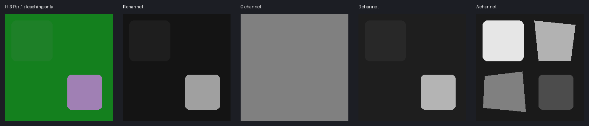

# 崩坏三：Part 1 / Part 2 贴图通道与生成提示词

改崩坏三贴图，第一件事是分清Part1和Part2。尤其是高光：同一个B通道，在软、硬分支里调大的效果可能相反。下面把这些容易改错的地方放在一起讲。

**怎么用下面的提示词：**先读通道说明，再让模型出草稿。未修改通道请在编辑器里从原图复制，不靠模型保证像素一致；ID和阈值用取色器确认。练习数字不代表该角色的标准参数。

[通道基础与验收](../../../newbie/tools/TextureChannelGuide/TextureChannelGuide.md)。**崩坏三不是一套永远不变的Shader。** 本页分别记录 [HoyoToon Part 1](https://github.com/Hoyotoon/HoyoToon/blob/d9e5ca2f312bf16fba89dee67d32c08b482dcda4/Shaders/Honkai%20Impact/Includes/HoyoToonHonkaiImpact-Program.hlsl)与 [Part 2](https://github.com/Hoyotoon/HoyoToon/blob/d9e5ca2f312bf16fba89dee67d32c08b482dcda4/Shaders/Honkai%20Impact/Includes/Part2-program.hlsl)，固定版本 `d9e5ca2f312bf16fba89dee67d32c08b482dcda4`。公开复刻可含近似与新增功能，不等于原游戏全部角色规范。



## 下载练习图

[合成Diffuse](./assets/synthetic-diffuse.png) · [同UV语义分区](./assets/synthetic-regions.png) · [原始RGBA教学数据](./assets/lightmap-data.png) · [资源来源与边界](./assets/README.md) · [SHA256清单](./assets/manifest.json)

可以下载旁边的合成图练习拆通道。图中的分区和数值是练习设定，不是从游戏角色测得的参数。

## 1. 常见角色图总表

| 贴图 | R | G | B | A |
| --- | --- | --- | --- | --- |
| Diffuse（Part 1） | RGB颜色 | 同左 | 同左 | 可选透明/裁剪；另一模式可用作发光阈值 |
| LightMap（Part 1） | 普通高光强度 | 与顶点数据结合的阴影控制 | 硬高光区域阈值 | 阴影/边缘/发光等参数组选择 |
| FaceMap（Part 1） | 核心SDF路径未确认，保留 | 同左 | 同左 | 脸部阴影阈值场，镜像读取 |
| FacExpTex（Part 1） | 脸红层 | 表情阴影层1 | 表情阴影层2 | 反向表情阴影层3：使用1−A |
| LightMap（Part 2） | 普通高光强度；低R还可触发丝袜分支/部分pass裁剪 | 身体/头发阴影控制 | 高光软硬/区域控制，受UseSoftSpecular影响 | 材质区域与金属阈值路径 |
| BumpMap（Part 2） | XYZ法线X，函数内翻转X | XYZ法线Y | XYZ法线Z | 核心法线路径未见使用，保留 |
| FaceMapTex（Part 2） | 核心Face函数未确认，保留 | 同左 | 同左 | 镜像脸部SDF |
| FaceExpTex（Part 2） | 脸红层 | 表情阴影G | 表情阴影B | 反向表情阴影A；另被部分顶点pass采样 |
| SpecularMaskMap / JitterMap / HairStripPatterns（Part 2） | 各向异性发丝路径的独立控制 | 按原图/函数 | 按原图/函数 | 按原图/函数 |

**Part 1 法线范围：**此固定核心路径未见Part 2式BumpMap读入，不能由此推断所有老角色没有其它法线纹理。

## 2. LightMap Part 1：R强度、B阈值不是一回事

[普通高光函数](https://github.com/Hoyotoon/HoyoToon/blob/d9e5ca2f312bf16fba89dee67d32c08b482dcda4/Shaders/Honkai%20Impact/Includes/HoyoToonHonkaiImpact-Common.hlsl#L46-L55)由R乘高光颜色，而B与 `1−pow(N·H,Shininess)` 比较。G进 [hi3_shadow](https://github.com/Hoyotoon/HoyoToon/blob/d9e5ca2f312bf16fba89dee67d32c08b482dcda4/Shaders/Honkai%20Impact/Includes/HoyoToonHonkaiImpact-Common.hlsl#L29-L43)，不是单纯物理AO。

独立旧MME实现 [HI3-Toon-old](https://github.com/Elysia-simp/HI3-Toon-old/blob/8a53d3235f906517e202439aa9ec89dceb1701e0/Sub/materials.fxh#L99-L104)也用R强度与B阈值，但其后续合成还乘B；因此只能说结构相近，不能交换精确数值。该仓库明确标为过时。

| Part1通道 | 小值与大值 | 特殊情况 |
| --- | --- | --- |
| R | 0不贡献普通高光，255给最大纹理乘子；增大主要提高已出现高光的亮度 | 仍需通过B门槛，强度参数为0时无效 |
| B | 增大会降低 `pow(N·H,Shininess)>1−B` 门槛，扩大高光范围 | B=0在正常N·H范围内不通过；255门槛为0，但N·H=0仍不通过。它不是roughness |
| G | 输入为 `p=G×顶点R`，分段重映射后与光向比较；段内通常越大越容易受光 | p≤0.5用 `1.25p−0.125`，p>0.5用 `1.2p−0.1`，在0.5附近有小跳变；最终floor使变化呈台阶，不是直接AO乘法 |
| A | 选择或影响阴影、边缘光、发光参数路径 | 没有通用“越大越金属”；颜色选择范围见下文 |

Part1的[颜色选择函数](https://github.com/Hoyotoon/HoyoToon/blob/d9e5ca2f312bf16fba89dee67d32c08b482dcda4/Shaders/Honkai%20Impact/Includes/HoyoToonHonkaiImpact-Colors.hlsl#L1-L27)也先给A加0.1：线性字节0～25选颜色1，26～76选颜色2，77～127选颜色3，128～178选颜色4，179～255选颜色5。头发variant_selector=2会固定回颜色1；边缘、阴影、发光各自调用的颜色参数不同。这个颜色分区顺序与Part2相近，**但不表示高光、金属和丝袜规则也相同**，更不是某个编号固定代表皮肤。

```text
以<image2>原Part1 LightMap的R层为参考，对照<image1>服装UV，生成单通道灰度草稿。只把我指定的普通饰件R适当调亮，提高已出现的高光亮度，其它区域保持原灰度。保留画布、UV岛、缝线和扣件位置，不画自然颜色、光照或文字，只输出R层。
```

R/G/B必须外部取样，不同高光公式不能仅凭标签混用。A最好保留原值与原区域，没材质参数时不重编号。

## 3. LightMap Part 2：附加的金属与丝袜路径

[核心采样与分支](https://github.com/Hoyotoon/HoyoToon/blob/d9e5ca2f312bf16fba89dee67d32c08b482dcda4/Shaders/Honkai%20Impact/Includes/Part2-program.hlsl#L52-L158)会使用A+0.1与金属阈值比较，R≤0.1还能结合EnableStocking触发丝袜路径。不能把“R=0的哑光布”不加条件地用于所有材质。

[material_region](https://github.com/Hoyotoon/HoyoToon/blob/d9e5ca2f312bf16fba89dee67d32c08b482dcda4/Shaders/Honkai%20Impact/Includes/Part2-common.hlsl#L69-L86)先对A加0.1再分区；教学安全内部点可选0.05/0.2/0.4/0.6/0.8（字节13/51/102/153/204）。这不是固定物理材质分类，仍应保留原A与材质阈值。两者分区顺序相近，但参数配置不能直接互换。

[specular_regular](https://github.com/Hoyotoon/HoyoToon/blob/d9e5ca2f312bf16fba89dee67d32c08b482dcda4/Shaders/Honkai%20Impact/Includes/Part2-common.hlsl#L291-L332)中B既可参与指数调节也可参与硬阈值，R参与强度与门限；不能把B简单改名“光滑度”。

| Part2通道 | 调小与调大 | 需要记住的边界 |
| --- | --- | --- |
| R | 普通高光里，增大会提高进入smoothstep的量；硬分支也更容易通过门槛 | R≤0.1（字节0～25）且开启丝袜时，可切入丝袜；R=0不是随处可用的哑光值。另一个pass还用R<0.45裁剪，不能跨pass共用解释 |
| G身体 | 受光输入约为 `saturate((N·L+1+Offset)×G)`，增大通常更偏亮面 | G=0输入为0，255仍受光向和参数限制 |
| G头发 | 用 `G+0.5` 缩放光向项，另有第二阴影颜色选择 | G<0.2（字节0～50）走第二阴影色；从51起通过这项比较，和身体不同 |
| B硬高光 | 增大降低 `1−B` 门槛，范围扩大 | 比较量还乘R，不只靠B |
| B软高光 | 增大提高高光指数，在0<N·H<1时使高光更集中、同一点贡献降低 | **方向与硬分支不同**。B=0使指数接近0，不是关闭高光；先确认UseSoftSpecular |
| A | 先加0.1再分区；也用 `A+0.1≥MetalThreshold` 判金属 | 线性字节0～25→组0，26～76→组1，77～127→组2，128～178→组3，179～255→组4。金属阈值是材质参数，不能固定说某组永远金属 |

软高光要更宽，可能要减B；硬高光要更宽，可能要加B。同叫“高光图”，方向却相反，这就是必须先看开关的原因。

```text
对照<image1>服装UV，以<image2>原Part2 LightMap为参考，生成我标出的普通非金属区域R灰度草稿，仅让已有高光稍增强。丝袜、金属和未知区域保持原灰度，保留尺寸、UV岛和小饰件，不画自然颜色、环境光或文字，只输出R层。
```

## 4. Diffuse与发光

Part1 [AlphaType分支](https://github.com/Hoyotoon/HoyoToon/blob/d9e5ca2f312bf16fba89dee67d32c08b482dcda4/Shaders/Honkai%20Impact/Includes/HoyoToonHonkaiImpact-Program.hlsl#L216-L240)分透明和发光阈值；Part2 [发光来源](https://github.com/Hoyotoon/HoyoToon/blob/d9e5ca2f312bf16fba89dee67d32c08b482dcda4/Shaders/Honkai%20Impact/Includes/Part2-program.hlsl#L153-L158)可选择Diffuse A或常量1。不能统一宣称A为发光。

```text
按指定配色修改<image1>服装Diffuse的RGB，保留原尺寸、UV岛、缝线和装饰，不增加高光、方向投影或文字。输出颜色草稿，Alpha稍后从原图复制。
```

Part1发光模式用 `Diffuse A>0.45` 的开关式判断：线性字节0～114不通过，115～255通过，**180不比115更强**，亮度由其它参数控制。启用AlphaClip时又按A<0.5裁剪，0～127被丢掉。Part2直接从Diffuse A或常量1取发光来源时则不是同一套0.45开关规则，不能混着改。

**只改已确认的Diffuse A发光层：**

```text
依据<image1>UV位置和我明确标出的发光图案生成单通道灰度发光候选，发光区域255、非发光0并保留细条边界，不把反光金属或白布算作发光、不做光晕或自然颜色，保持原尺寸、不加文字，用于外部替换已确认发光模式的Diffuse A；若该材质用A做透明或裁剪，不应用这张图。
```

## 5. FaceMap与表情图

脸部 [Part1镜像采样](https://github.com/Hoyotoon/HoyoToon/blob/d9e5ca2f312bf16fba89dee67d32c08b482dcda4/Shaders/Honkai%20Impact/Includes/HoyoToonHonkaiImpact-Program.hlsl#L145-L171)配合头部方向与G控制；表情 [RGBA读取](https://github.com/Hoyotoon/HoyoToon/blob/d9e5ca2f312bf16fba89dee67d32c08b482dcda4/Shaders/Honkai%20Impact/Includes/HoyoToonHonkaiImpact-Program.hlsl#L242-L256)含反向Alpha层。Part2表情 [face_exp](https://github.com/Hoyotoon/HoyoToon/blob/d9e5ca2f312bf16fba89dee67d32c08b482dcda4/Shaders/Honkai%20Impact/Includes/Part2-common.hlsl#L88-L111)也使用1−A。

FaceMap A在同一光向下，增大更容易进入亮面，减小更容易进入阴影；0/255是场的两端，不是透明度。Part1还乘脸LightMap G作为AO，G越低遮蔽越重、255不额外削弱；Part2脸函数没有这条同样的G乘法。FaceMap RGB在这条方向场路径未确认用途，保留。

**FaceMap：**

```text
对照<image1>脸UV，只修补<image2>原FaceMap中标出的破损，保留方向阈值场和镜像关系，不重新设计鼻影或肤色。保持画布和UV位置，不加文字，输出修补草稿。
```

表情R/G/B一般越大越靠近对应设置色，0不贡献；Part1 R带平方、Part2 G/B带平方，所以128不一定是一半效果。A使用 `1−A`：255关闭这一层，0最强，128约半输入后还可能平方到约四分之一。所谓“阴影色”由材质设定，不能保证只会变黑。

**表情图：**

```text
对照<image1>脸UV和<image2>原表情层，按我的表情说明修改指定的单通道灰度层。R/G/B按原遮罩方向，A按反向遮罩方向，未标区不动。保持尺寸、眼鼻嘴和UV位置，不画肤色、SDF或文字。
```

## 6. Part2 BumpMap：注意函数翻转X

[法线函数](https://github.com/Hoyotoon/HoyoToon/blob/d9e5ca2f312bf16fba89dee67d32c08b482dcda4/Shaders/Honkai%20Impact/Includes/Part2-common.hlsl#L21-L29)解码XYZ、缩放XY并翻转X。它不是ZZZ的“RG法线+B阴影偏置”。

标准XYZ先把0～255解成−1～+1；平坦区约(128,128,255)。这里online函数还翻转X，所以R调大在最终切线X上反而更偏负，G调大更偏正Y，B越接近255越朝正Z。offline函数不翻X；实际选择哪条路径要看调用，不要凭“Part2”就预先多翻一次。A没有在这条法线函数里用到，保留。

```text
对照<image1>服装UV生成浅XYZ法线草稿，平坦区约(128,128,255)，只在指定缝线和扣件处作连续弱变化。不把颜色明暗当高低，不添噪点、照明或文字，保持画布与UV位置。
```

## 7. 头发专用高光、溶解与查表图

Part2 [hair_specular](https://github.com/Hoyotoon/HoyoToon/blob/d9e5ca2f312bf16fba89dee67d32c08b482dcda4/Shaders/Honkai%20Impact/Includes/Part2-common.hlsl#L335-L354)分别采样JitterMap R、HairStripPatterns的标量与SpecularMaskMap。平铺与沿UV特定坐标采样使它们不等于服装粗糙度；暂时不清楚参数时先留原图。

[完整发丝计算](https://github.com/Hoyotoon/HoyoToon/blob/d9e5ca2f312bf16fba89dee67d32c08b482dcda4/Shaders/Honkai%20Impact/Includes/Part2-common.hlsl#L335-L406)还可以说明这些通道：

- **JitterMap R**：在两端扰动方向之间插值，0取一端、255取另一端，128附近处于中间；它移动高光方向，不是越白越亮。G/B/A在这条函数中不用，保留。
- **HairStripPatterns R**：先变成−1～1，再影响扰动幅度范围；低值取一端、高值取另一端，方向还看Min/Max设置。不是衣服UV遮罩，G/B/A未确认。
- **SpecularMaskMap R**：MaskLerp=1时0压掉所用高光权重、255完整保留；也参与高频扰动位置，不只强度。MaskLerp=0时不由R遮住高光。
- **SpecularMaskMap G**：在高频高光指数Max与Min之间插值。通常Max>Min时，增大G降低指数、让高光更宽；参数顺序反过来，效果也反过来。
- **SpecularMaskMap B**：`B≥0.5` 允许高频高光，线性字节128起通过，0～127不通过这项门控。A在该函数没用到，保留。

这些都是发丝方向/高光控制，不是普通R金属、G粗糙、B AO。

**JitterMap候选：**

```text
以<image1>原JitterMap的R层为参考，只修补标出的扰动纹样，沿用原灰度范围、方向和平铺边界，不画自然头发颜色或直接高光。保持尺寸，不加文字，输出R灰度草稿。
```

**HairStripPatterns：**

```text
以<image1>原HairStripPatterns为采样布局模板，沿原条带方向修补明确损坏的灰度高光扰动纹样，保持尺寸、ST映射、边缘连续与全部未修改通道，不把它画成角色UV颜色图，不添加高光渲染或文字，只输出配准候选供指定坐标采样测试。
```

**SpecularMaskMap：**

```text
对照<image1>头发UV和<image2>原SpecularMaskMap的指定通道，只修补我标出的高光控制区域，沿用原灰度和边界。不要重画其它层，不画自然头发颜色、光照或文字，输出该通道灰度草稿。
```

**MaskDisTex等溶解图：**

```text
以<image1>原溶解控制贴图为模板只修补指定区域和指定通道，严格保留原尺寸、噪声平铺与RGBA编码，不把服装颜色转为未知溶解值，不改变其它通道、不新增文字，输出局部候选；只有取得目标溶解函数和材质参数后才生成新控制场。
```

**Ramp类：**

```text
以<image1>原SpecularRamp或其它色带图为模板，仅修改我指定行的RGB色板，保留原行列、采样边界与Alpha，不放衣服UV、不重排行、不生成物体或文字，输出查表候选并按材质区域索引逐行验证。
```

这些保留/修补提示词刻意不编造未知通道。更多特效、眼部纹样及不同年代Shader必须作为独立材质的读取规则研究。

## 改完怎么检查

记录Part1/Part2、Shader关键词和原材质参数。每次单通道A/B测试；对金属、丝袜和眼部单独检查；表情Alpha方向不得反转。数值、UV、切线与真实渲染四项都过关才部署。配图与数字仅作教学，不是已验证游戏成品。
