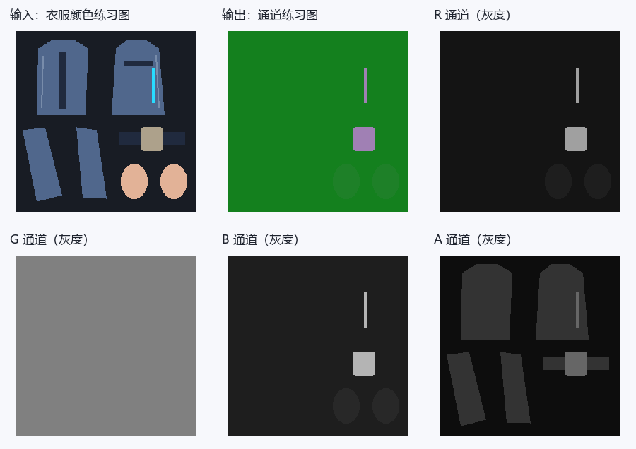
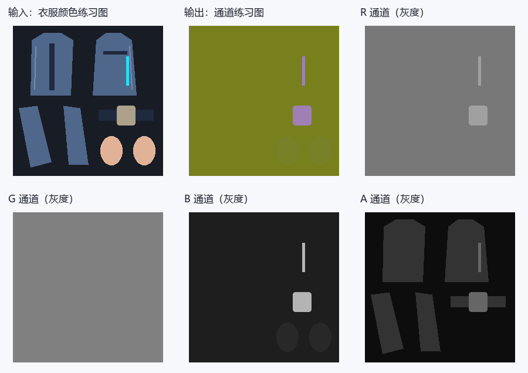
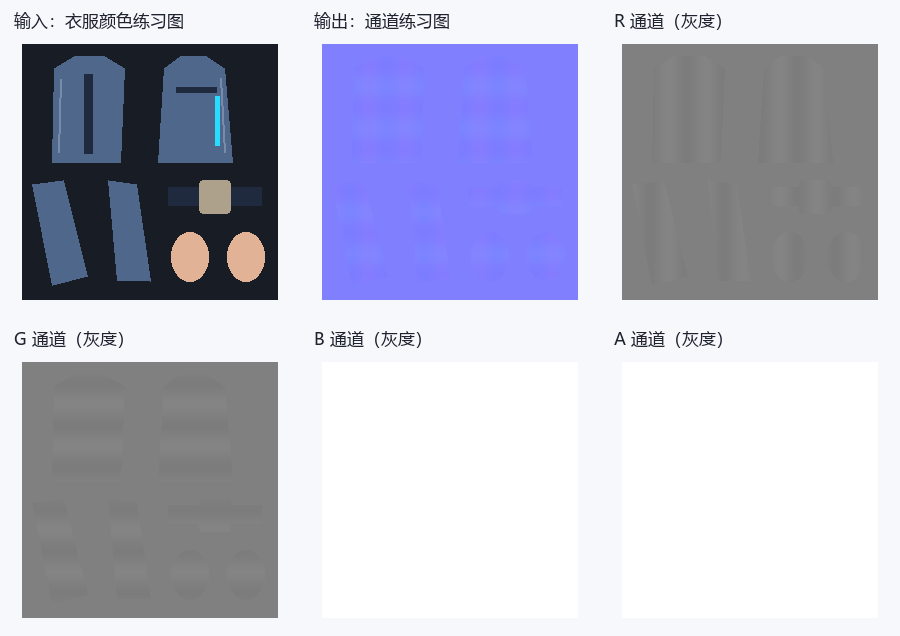
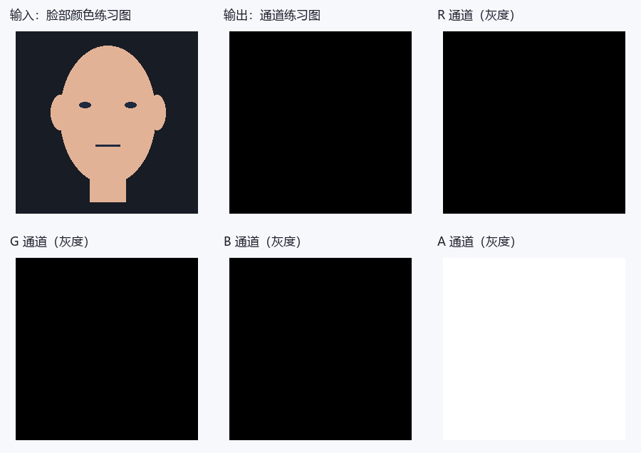
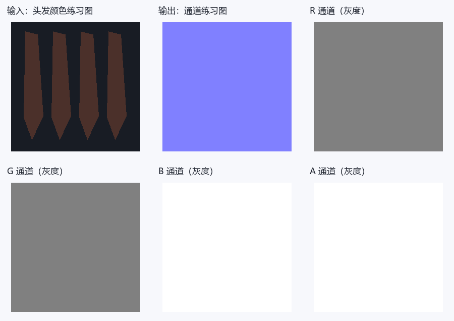
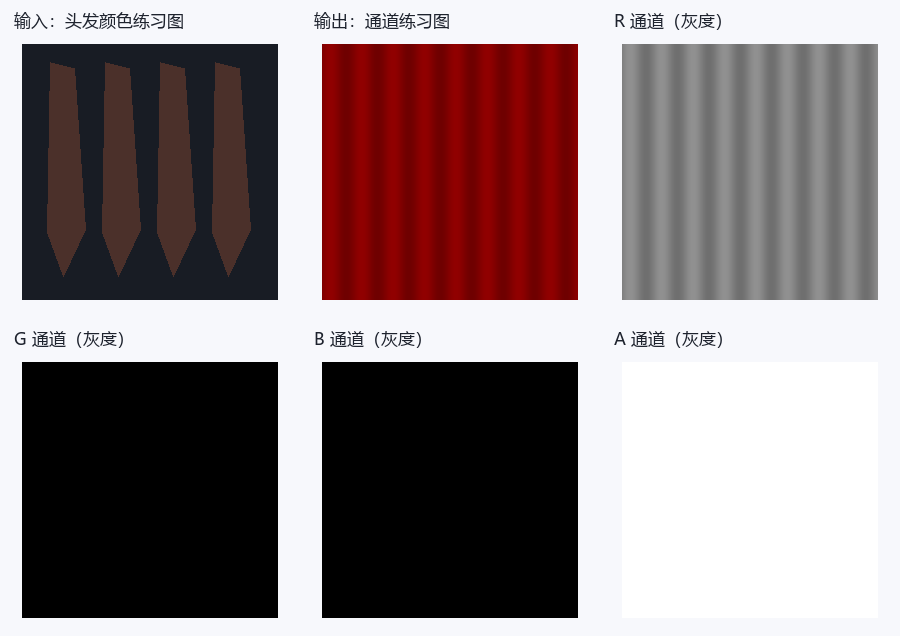
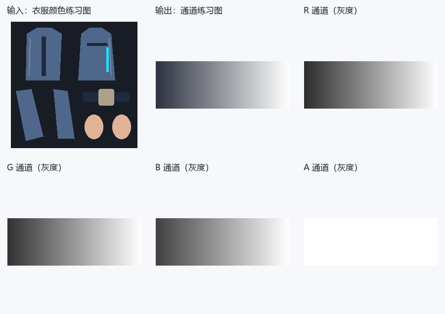

# 崩坏三：逐贴图通道图解与建议提示词

选好下面的贴图类型，就可以查看 RGBA 通道的作用、数值示例和建议提示词。每个分区都提供两种模板：**只有 DiffuseMap**，或 **DiffuseMap＋Blender 导出的 UV 分布图**，可用于 ChatGPT 等支持参考图的图像模型。

如果手边有模型，建议一起提供 UV 图：模型会更容易辨认 UV 岛、边界和细条，通常有助于对齐。只有 Diffuse 也可以尝试；请补充皮肤、布料、裸金属或发光区域的文字说明。

这里的提示词是可调整的参考模板，数字是练习预设，不是角色原始参数。图解是教学示意，不是 AI 实测结果。生成后仍需检查尺寸、UV 和通道数值；UV 图也不能代替材质参数、几何法线或 SDF 方向信息。

## 找到你要生成的贴图

- [DiffuseMap / 颜色图](#map-diffuse)
- [Part 1 LightMap](#map-lightmap-p1)
- [Part 2 LightMap](#map-lightmap-p2)
- [Part 2 BumpMap / 法线](#map-normal)
- [FacExpTex / FaceExpTex 表情图](#map-expression)
- [Part 2 SpecularMaskMap / 发丝高光](#map-specmask)
- [Part 2 JitterMap / 发丝扰动](#map-jitter)
- [Part 2 HairStripPatterns](#map-hairpattern)
- [FaceMap / 脸部方向阴影图（Part1 / Part2）](#map-sdf)
- [MaskDisTex / 溶解控制图](#map-dissolve)
- [Ramp / 漫反射色带](#map-ramp)
- [MatCap / 球面外观图](#map-matcap)
- [LUT / 精确布局与适用范围](#map-lut)
- [EyeEffectTex / 瞳孔叠加](#map-eye-effect)
- [MainTex2 / 溶解附加颜色](#map-secondary-diffuse)
- [NoiseTex / 溶解噪声](#map-dissolve-noise)
- [RampMap / 头发高光表](#map-specular-ramp)
- [StockingRampTex / 丝袜色带](#map-stocking-ramp)
- [备用纹理槽的未消费状态](#map-unused-slots)

## 准备参考图

- **单图方式：** 上传对应材质的 DiffuseMap 颜色贴图，再复制该分区的单图模板。
- **双图方式：** 第一张上传 DiffuseMap，第二张上传同一材质、同一 UV 层的 UV 分布图，再复制双图模板。两张图保持相同宽高、方向和 0～1 范围，不裁切、不镜像，也不要把 UV 线直接画进 Diffuse。
- **Blender 导出：** 选中目标网格，进入编辑模式并选中该材质对应的面；在 UV 编辑器中选择正确的 UV 层，使用 **UV → 导出 UV 布局（Export UV Layout）**。尺寸设为 Diffuse 的宽高，填充不透明度设为 0，导出 PNG。若没有该选项，可在 Blender 的扩展/插件设置中启用 UV Layout。多材质请分别导出；UDIM 请注明 tile 编号，不要拼成截图。
- 可以下载本页的[教学 Diffuse](./assets/reference-inputs/diffuse.png)与[教学 UV 图](./assets/reference-inputs/uv.png)了解输入形式。它们是通用衣片示意；脸部或头发贴图请换成自己的对应材质参考图，不要用衣服 UV 代替。
- 模板按文中预设开始练习。想调整材质时，可以改预设数值，并补充“哪些区域是什么材质”；UV 只提供边界，不提供材质标签。

## 通道阅读小提示

- 数据值用0～255；线性UNORM中除以255得到0～1。字节128约0.502，若RGB被sRGB解码则约0.216，不能对控制图做自动Gamma或美化。Alpha通常不经过sRGB转换，仍要核对加载路径。
- 灰度白只意味着数值大：乘子、反向遮罩、材质ID、方向数据的“白”含义不同。下面逐图解释，不用一条规则概括。
- 只上传Diffuse时，材质分类是猜测。裸金属、丝袜、发光区域最好在文字里指出；不明区域有保守默认值，但它不恢复原角色ID。
- 合成预览可能受Alpha显示影响；灰度A图是真正的第四通道。下载各层后用取色器看字节，不靠预览颜色判断。

## 1. DiffuseMap / 颜色图 {#map-diffuse}

先看输入的蓝色衣片：颜色图里它就该是蓝色，R/G/B是颜色分量。到了控制图，同一片蓝布可能变成红橙色，那不是改了衣服颜色，而是几个控制值叠在一起。


**教学示意：** 数字对应本节练习预设，图例不属于贴图数据。

[原始RGBA图](./assets/maps/diffuse/diffuse.png) · [R灰度层](./assets/maps/diffuse/diffuse-r.png) · [G灰度层](./assets/maps/diffuse/diffuse-g.png) · [B灰度层](./assets/maps/diffuse/diffuse-b.png) · [A灰度层](./assets/maps/diffuse/diffuse-a.png)

**R怎么用：** R是基础颜色红分量，0最低、255最高。

**G怎么用：** G是基础颜色绿分量，0最低、255最高。

**B怎么用：** B是基础颜色蓝分量，0最低、255最高。

**A怎么用：** A用途由材质决定，单张Diffuse不能推断透明、发光或ID。

颜色分量不是金属、高光或AO；不要增加新的方向光、投影和高光。

**固定源码证据：** Part1/2主图采样、ST与分支请分别核对，不能把两个Alpha合同混用；[采样及消费1](https://github.com/Hoyotoon/HoyoToon/blob/d9e5ca2f312bf16fba89dee67d32c08b482dcda4/Shaders/Honkai%20Impact/Includes/HoyoToonHonkaiImpact-Program.hlsl#L145-L155)、[采样及消费2](https://github.com/Hoyotoon/HoyoToon/blob/d9e5ca2f312bf16fba89dee67d32c08b482dcda4/Shaders/Honkai%20Impact/Includes/Part2-program.hlsl#L50-L62)。这是固定社区实现的依据，不宣称原游戏全版本通用。

### 建议提示词

有 UV 分布图时可选双图模板，更方便核对边界；单图模板同样可以作为起点。

::: tabs

== 只有 DiffuseMap


```text
请根据我上传的这一张崩坏三角色DiffuseMap颜色贴图，生成DiffuseMap / 颜色图的颜色贴图草稿。

生成图片必须与上传Diffuse的像素尺寸、UV岛位置、空白区域、缝线、扣件和所有细条完全对齐，不缩放、镜像、移动或重新排UV。

通道数值采用8位0～255，不做Gamma、自动对比度、美化或预乘Alpha。

完整通道规则：R是基础颜色红分量，0最低、255最高；
G是基础颜色绿分量，0最低、255最高；
B是基础颜色蓝分量，0最低、255最高；
A用途由材质决定，单张Diffuse不能推断透明、发光或ID。

本次明确采用的生成预设：本次生成同UV、不透明Diffuse颜色草稿：R/G/B按我给出的新配色修改，未指定改色时保留上传图的RGB颜色；
A固定255，不猜透明、发光或材质ID。

不要把自然衣服颜色、RGB明暗或金色油漆直接当成金属、AO或高光值；
只修改我指定的配色，未指定处保留上传Diffuse的颜色和绘制细节。

输出只有目标贴图，不加文字、通道标签、图例、拼图、背景场景、3D渲染或光晕。

这是按给定预设生成的候选，不视为角色原始通道的还原；
不能输出真实Alpha时明确说明，不要以白底预览代替 RGBA 文件。
```

== DiffuseMap＋UV 分布图


```text
我上传了两张参考图：第一张是崩坏三角色 DiffuseMap 颜色贴图，第二张是 Blender 导出的同一材质 UV 分布图。请结合这两张参考图，生成DiffuseMap / 颜色图的颜色贴图草稿。

生成图片必须与上传Diffuse的像素尺寸、UV岛位置、空白区域、缝线、扣件和所有细条完全对齐，不缩放、镜像、移动或重新排UV。

通道数值采用8位0～255，不做Gamma、自动对比度、美化或预乘Alpha。

完整通道规则：R是基础颜色红分量，0最低、255最高；
G是基础颜色绿分量，0最低、255最高；
B是基础颜色蓝分量，0最低、255最高；
A用途由材质决定，单张Diffuse不能推断透明、发光或ID。

本次明确采用的生成预设：本次生成同UV、不透明Diffuse颜色草稿：R/G/B按我给出的新配色修改，未指定改色时保留上传图的RGB颜色；
A固定255，不猜透明、发光或材质ID。

不要把自然衣服颜色、RGB明暗或金色油漆直接当成金属、AO或高光值；
只修改我指定的配色，未指定处保留上传Diffuse的颜色和绘制细节。

输出只有目标贴图，不加文字、通道标签、图例、拼图、背景场景、3D渲染或光晕。

这是按给定预设生成的候选，不视为角色原始通道的还原；
不能输出真实Alpha时明确说明，不要以白底预览代替 RGBA 文件。

以 Diffuse 的像素画布为基准，用 UV 分布图核对岛轮廓、细条、边界与空白区域。UV 线是参考标记，不得画入结果，也不作为 AO、缝线、法线或高光。

若两图尺寸、朝向或岛位置不一致，请先让我确认，不自行缩放或对齐。

UV 图没有材质标签或几何方向；
未确认区域仍按上述预设，不据 UV 线推断真实法线、SDF 或材质 ID。
```

:::


**拿到结果先看：** 尺寸、UV边界和每通道数值，并检查 Alpha、常量与阈值。模型输出有偏色或渐变时，用通道编辑器精确赋值，确认无误后再导出目标格式并测试。

## 2. Part 1 LightMap {#map-lightmap-p1}

先找图中的衣片和扣件，再分别看R/G/B/A。同一位置在不同通道里的灰度可以完全不同：一层选材质，一层管高光，一层管阴影。不要为了让合成预览“像原衣服”而把四层一起涂。



**教学示意：** 数字对应本节练习预设，图例不属于贴图数据。

[原始RGBA图](./assets/maps/lightmap-p1/lightmap-p1.png) · [R灰度层](./assets/maps/lightmap-p1/lightmap-p1-r.png) · [G灰度层](./assets/maps/lightmap-p1/lightmap-p1-g.png) · [B灰度层](./assets/maps/lightmap-p1/lightmap-p1-b.png) · [A灰度层](./assets/maps/lightmap-p1/lightmap-p1-a.png)

**R怎么用：** R普通高光强度，0无该项、增大增强已出现高光。

**G怎么用：** G与顶点R相乘p，p≤0.5用1.25p−0.125、p>0.5用1.2p−0.1，再与光向floor；段内增大通常更受光，有台阶。

**B怎么用：** B控制硬高光门槛，pow(N·H,Shininess)>1−B，增大扩范围，0通常不通过。

**A怎么用：** A+0.1选颜色：0～25色1、26～76色2、77～127色3、128～178色4、179～255色5，头发variant2固定色1。

**固定源码证据：** Part1 LightMap采样与阴影调用；[采样及消费1](https://github.com/Hoyotoon/HoyoToon/blob/d9e5ca2f312bf16fba89dee67d32c08b482dcda4/Shaders/Honkai%20Impact/Includes/HoyoToonHonkaiImpact-Program.hlsl#L145-L200)。这是固定社区实现的依据，不宣称原游戏全版本通用。

### 建议提示词

有 UV 分布图时可选双图模板，更方便核对边界；单图模板同样可以作为起点。

::: tabs

== 只有 DiffuseMap


```text
请根据我上传的这一张崩坏三角色DiffuseMap颜色贴图，生成Part 1 LightMap的技术数据草稿。

生成图片必须与上传Diffuse的像素尺寸、UV岛位置、空白区域、缝线、扣件和所有细条完全对齐，不缩放、镜像、移动或重新排UV。

通道数值采用8位0～255，不做Gamma、自动对比度、美化或预乘Alpha。

完整通道规则：R普通高光强度，0无该项、增大增强已出现高光；
G与顶点R相乘p，p≤0.5用1.25p−0.125、p>0.5用1.2p−0.1，再与光向floor；
段内增大通常更受光，有台阶；
B控制硬高光门槛，pow(N·H,Shininess)>1−B，增大扩范围，0通常不通过；
A+0.1选颜色：0～25色1、26～76色2、77～127色3、128～178色4、179～255色5，头发variant2固定色1。

本次明确采用的生成预设：普通高光练习：皮肤RGBA(30,128,40,13)、布料(20,128,30,51)、普通饰件(160,128,180,102)、未识别(20,128,30,13)；
组别是本次练习参数组，不恢复原角色编号。

不要把自然衣服颜色、RGB明暗或金色油漆直接当成金属、AO或高光值；
只按我文字确认的材质区域分类，无法判断的区域使用上述未知默认值，没有默认时使用本次占位规则而不推断原游戏数据。

输出只有目标贴图，不加文字、通道标签、图例、拼图、背景场景、3D渲染或光晕。

这是按给定预设生成的候选，不视为角色原始通道的还原；
不能输出真实Alpha时明确说明，不要以白底预览代替 RGBA 文件。

除上面明确要求的连续阴影或灰度过渡外，每个确认材质区按预设定值填充；
材质ID禁止渐变，不要因为白布/黑布就另设控制值。背景和未识别区按本次默认编码，不自行补未给出的游戏规则。
```

== DiffuseMap＋UV 分布图


```text
我上传了两张参考图：第一张是崩坏三角色 DiffuseMap 颜色贴图，第二张是 Blender 导出的同一材质 UV 分布图。请结合这两张参考图，生成Part 1 LightMap的技术数据草稿。

生成图片必须与上传Diffuse的像素尺寸、UV岛位置、空白区域、缝线、扣件和所有细条完全对齐，不缩放、镜像、移动或重新排UV。

通道数值采用8位0～255，不做Gamma、自动对比度、美化或预乘Alpha。

完整通道规则：R普通高光强度，0无该项、增大增强已出现高光；
G与顶点R相乘p，p≤0.5用1.25p−0.125、p>0.5用1.2p−0.1，再与光向floor；
段内增大通常更受光，有台阶；
B控制硬高光门槛，pow(N·H,Shininess)>1−B，增大扩范围，0通常不通过；
A+0.1选颜色：0～25色1、26～76色2、77～127色3、128～178色4、179～255色5，头发variant2固定色1。

本次明确采用的生成预设：普通高光练习：皮肤RGBA(30,128,40,13)、布料(20,128,30,51)、普通饰件(160,128,180,102)、未识别(20,128,30,13)；
组别是本次练习参数组，不恢复原角色编号。

不要把自然衣服颜色、RGB明暗或金色油漆直接当成金属、AO或高光值；
只按我文字确认的材质区域分类，无法判断的区域使用上述未知默认值，没有默认时使用本次占位规则而不推断原游戏数据。

输出只有目标贴图，不加文字、通道标签、图例、拼图、背景场景、3D渲染或光晕。

这是按给定预设生成的候选，不视为角色原始通道的还原；
不能输出真实Alpha时明确说明，不要以白底预览代替 RGBA 文件。

除上面明确要求的连续阴影或灰度过渡外，每个确认材质区按预设定值填充；
材质ID禁止渐变，不要因为白布/黑布就另设控制值。背景和未识别区按本次默认编码，不自行补未给出的游戏规则。

以 Diffuse 的像素画布为基准，用 UV 分布图核对岛轮廓、细条、边界与空白区域。UV 线是参考标记，不得画入结果，也不作为 AO、缝线、法线或高光。

若两图尺寸、朝向或岛位置不一致，请先让我确认，不自行缩放或对齐。

UV 图没有材质标签或几何方向；
未确认区域仍按上述预设，不据 UV 线推断真实法线、SDF 或材质 ID。
```

:::


**拿到结果先看：** 尺寸、UV边界和每通道数值，并检查 Alpha、常量与阈值。模型输出有偏色或渐变时，用通道编辑器精确赋值，确认无误后再导出目标格式并测试。

## 3. Part 2 LightMap {#map-lightmap-p2}

先找图中的衣片和扣件，再分别看R/G/B/A。同一位置在不同通道里的灰度可以完全不同：一层选材质，一层管高光，一层管阴影。不要为了让合成预览“像原衣服”而把四层一起涂。



**教学示意：** 数字对应本节练习预设，图例不属于贴图数据。

[原始RGBA图](./assets/maps/lightmap-p2/lightmap-p2.png) · [R灰度层](./assets/maps/lightmap-p2/lightmap-p2-r.png) · [G灰度层](./assets/maps/lightmap-p2/lightmap-p2-g.png) · [B灰度层](./assets/maps/lightmap-p2/lightmap-p2-b.png) · [A灰度层](./assets/maps/lightmap-p2/lightmap-p2-a.png)

**R怎么用：** R参与普通高光强度/门槛，≤0.1即0～25且EnableStocking开启可走丝袜；某pass R<0.45裁剪。

**G怎么用：** G身体增大通常更受光，头发G+0.5控制且G<0.2即0～50走第二阴影色。

**B怎么用：** B硬分支增大降低1−B门槛扩大高光；软分支增大提高指数，让高光更集中，方向相反。

**A怎么用：** A+0.1分组：0～25组0、26～76组1、77～127组2、128～178组3、179～255组4；金属由A+0.1≥材质MetalThreshold另判。

### 建议提示词

有 UV 分布图时可选双图模板，更方便核对边界；单图模板同样可以作为起点。

::: tabs

== 只有 DiffuseMap


```text
请根据我上传的这一张崩坏三角色DiffuseMap颜色贴图，生成Part 2 LightMap的技术数据草稿。

生成图片必须与上传Diffuse的像素尺寸、UV岛位置、空白区域、缝线、扣件和所有细条完全对齐，不缩放、镜像、移动或重新排UV。

通道数值采用8位0～255，不做Gamma、自动对比度、美化或预乘Alpha。

完整通道规则：R参与普通高光强度/门槛，≤0.1即0～25且EnableStocking开启可走丝袜；
某pass R<0.45裁剪；
G身体增大通常更受光，头发G+0.5控制且G<0.2即0～50走第二阴影色；
B硬分支增大降低1−B门槛扩大高光；
软分支增大提高指数，让高光更集中，方向相反；
A+0.1分组：0～25组0、26～76组1、77～127组2、128～178组3、179～255组4；
金属由A+0.1≥材质MetalThreshold另判。

本次明确采用的生成预设：只做普通非金属、关闭丝袜与金属路径、UseSoftSpecular=0的练习：皮肤(120,128,40,13)、布(120,128,30,51)、饰件(160,128,180,102)、未知(120,128,30,13)。R≥115只是避开已知0.45裁剪候选，不保证其它pass安全。

不要把自然衣服颜色、RGB明暗或金色油漆直接当成金属、AO或高光值；
只按我文字确认的材质区域分类，无法判断的区域使用上述未知默认值，没有默认时使用本次占位规则而不推断原游戏数据。

输出只有目标贴图，不加文字、通道标签、图例、拼图、背景场景、3D渲染或光晕。

这是按给定预设生成的候选，不视为角色原始通道的还原；
不能输出真实Alpha时明确说明，不要以白底预览代替 RGBA 文件。

除上面明确要求的连续阴影或灰度过渡外，每个确认材质区按预设定值填充；
材质ID禁止渐变，不要因为白布/黑布就另设控制值。背景和未识别区按本次默认编码，不自行补未给出的游戏规则。
```

== DiffuseMap＋UV 分布图


```text
我上传了两张参考图：第一张是崩坏三角色 DiffuseMap 颜色贴图，第二张是 Blender 导出的同一材质 UV 分布图。请结合这两张参考图，生成Part 2 LightMap的技术数据草稿。

生成图片必须与上传Diffuse的像素尺寸、UV岛位置、空白区域、缝线、扣件和所有细条完全对齐，不缩放、镜像、移动或重新排UV。

通道数值采用8位0～255，不做Gamma、自动对比度、美化或预乘Alpha。

完整通道规则：R参与普通高光强度/门槛，≤0.1即0～25且EnableStocking开启可走丝袜；
某pass R<0.45裁剪；
G身体增大通常更受光，头发G+0.5控制且G<0.2即0～50走第二阴影色；
B硬分支增大降低1−B门槛扩大高光；
软分支增大提高指数，让高光更集中，方向相反；
A+0.1分组：0～25组0、26～76组1、77～127组2、128～178组3、179～255组4；
金属由A+0.1≥材质MetalThreshold另判。

本次明确采用的生成预设：只做普通非金属、关闭丝袜与金属路径、UseSoftSpecular=0的练习：皮肤(120,128,40,13)、布(120,128,30,51)、饰件(160,128,180,102)、未知(120,128,30,13)。R≥115只是避开已知0.45裁剪候选，不保证其它pass安全。

不要把自然衣服颜色、RGB明暗或金色油漆直接当成金属、AO或高光值；
只按我文字确认的材质区域分类，无法判断的区域使用上述未知默认值，没有默认时使用本次占位规则而不推断原游戏数据。

输出只有目标贴图，不加文字、通道标签、图例、拼图、背景场景、3D渲染或光晕。

这是按给定预设生成的候选，不视为角色原始通道的还原；
不能输出真实Alpha时明确说明，不要以白底预览代替 RGBA 文件。

除上面明确要求的连续阴影或灰度过渡外，每个确认材质区按预设定值填充；
材质ID禁止渐变，不要因为白布/黑布就另设控制值。背景和未识别区按本次默认编码，不自行补未给出的游戏规则。

以 Diffuse 的像素画布为基准，用 UV 分布图核对岛轮廓、细条、边界与空白区域。UV 线是参考标记，不得画入结果，也不作为 AO、缝线、法线或高光。

若两图尺寸、朝向或岛位置不一致，请先让我确认，不自行缩放或对齐。

UV 图没有材质标签或几何方向；
未确认区域仍按上述预设，不据 UV 线推断真实法线、SDF 或材质 ID。
```

:::


**拿到结果先看：** 尺寸、UV边界和每通道数值，并检查 Alpha、常量与阈值。模型输出有偏色或渐变时，用通道编辑器精确赋值，确认无误后再导出目标格式并测试。

## 4. Part 2 BumpMap / 法线 {#map-normal}

看R和G里的细小变化，方向信息藏在这些梯度里，而不是藏在“蓝紫色外观”里。平坦区域约128；从128向两侧偏移表示向不同切线方向倾斜，不是越白越凸。



**教学示意：** 数字对应本节练习预设，图例不属于贴图数据。

[原始RGBA图](./assets/maps/normal/normal.png) · [R灰度层](./assets/maps/normal/normal-r.png) · [G灰度层](./assets/maps/normal/normal-g.png) · [B灰度层](./assets/maps/normal/normal-b.png) · [A灰度层](./assets/maps/normal/normal-a.png)

**R怎么用：** R编码切线法线X：0负方向、128附近零偏转、255正方向。

**G怎么用：** G编码切线法线Y：0负方向、128附近零偏转、255正方向，最终翻转依Shader。

**B怎么用：** B标准切线Z：0负Z、128附近零、255正Z，平坦B255。

**A怎么用：** A在此BumpMap法线链未消费，normal_online接收float3并截去Alpha。

**固定源码证据：** Part2 BumpMap采样后送normal_online；不会根据Alpha显示自行删除BA数据；[采样及消费1](https://github.com/Hoyotoon/HoyoToon/blob/d9e5ca2f312bf16fba89dee67d32c08b482dcda4/Shaders/Honkai%20Impact/Includes/Part2-program.hlsl#L50-L63)。这是固定社区实现的依据，不宣称原游戏全版本通用。

### 建议提示词

有 UV 分布图时可选双图模板，更方便核对边界；单图模板同样可以作为起点。

::: tabs

== 只有 DiffuseMap


```text
请根据我上传的这一张崩坏三角色DiffuseMap颜色贴图，生成Part 2 BumpMap / 法线的技术数据草稿。

生成图片必须与上传Diffuse的像素尺寸、UV岛位置、空白区域、缝线、扣件和所有细条完全对齐，不缩放、镜像、移动或重新排UV。

通道数值采用8位0～255，不做Gamma、自动对比度、美化或预乘Alpha。

完整通道规则：R编码切线法线X：0负方向、128附近零偏转、255正方向；
G编码切线法线Y：0负方向、128附近零偏转、255正方向，最终翻转依Shader；
B标准切线Z：0负Z、128附近零、255正Z，平坦B255；
A在此BumpMap法线链未消费，normal_online接收float3并截去Alpha。

本次明确采用的生成预设：平坦RGBA(128,128,255,255)，浅缝线微弱XY变化并保证XYZ单位方向；
输出标准XYZ、不预先翻X，由目标online解包翻X，offline不翻。

不要把自然衣服颜色、RGB明暗或金色油漆直接当成金属、AO或高光值；
只按我文字确认的材质区域分类，无法判断的区域使用上述未知默认值，没有默认时使用本次占位规则而不推断原游戏数据。

输出只有目标贴图，不加文字、通道标签、图例、拼图、背景场景、3D渲染或光晕。

这是按给定预设生成的候选，不视为角色原始通道的还原；
不能输出真实Alpha时明确说明，不要以白底预览代替 RGBA 文件。

法线细节仅来自我明确指出的浅缝线、压边、扣件和发丝结构，不把Diffuse明暗转成高度，不新增织物噪点；
XY解码为2×值/255−1，保持X²+Y²≤1并按目标定义重建或填写Z，不能把方向极值当凹凸强度。
```

== DiffuseMap＋UV 分布图


```text
我上传了两张参考图：第一张是崩坏三角色 DiffuseMap 颜色贴图，第二张是 Blender 导出的同一材质 UV 分布图。请结合这两张参考图，生成Part 2 BumpMap / 法线的技术数据草稿。

生成图片必须与上传Diffuse的像素尺寸、UV岛位置、空白区域、缝线、扣件和所有细条完全对齐，不缩放、镜像、移动或重新排UV。

通道数值采用8位0～255，不做Gamma、自动对比度、美化或预乘Alpha。

完整通道规则：R编码切线法线X：0负方向、128附近零偏转、255正方向；
G编码切线法线Y：0负方向、128附近零偏转、255正方向，最终翻转依Shader；
B标准切线Z：0负Z、128附近零、255正Z，平坦B255；
A在此BumpMap法线链未消费，normal_online接收float3并截去Alpha。

本次明确采用的生成预设：平坦RGBA(128,128,255,255)，浅缝线微弱XY变化并保证XYZ单位方向；
输出标准XYZ、不预先翻X，由目标online解包翻X，offline不翻。

不要把自然衣服颜色、RGB明暗或金色油漆直接当成金属、AO或高光值；
只按我文字确认的材质区域分类，无法判断的区域使用上述未知默认值，没有默认时使用本次占位规则而不推断原游戏数据。

输出只有目标贴图，不加文字、通道标签、图例、拼图、背景场景、3D渲染或光晕。

这是按给定预设生成的候选，不视为角色原始通道的还原；
不能输出真实Alpha时明确说明，不要以白底预览代替 RGBA 文件。

法线细节仅来自我明确指出的浅缝线、压边、扣件和发丝结构，不把Diffuse明暗转成高度，不新增织物噪点；
XY解码为2×值/255−1，保持X²+Y²≤1并按目标定义重建或填写Z，不能把方向极值当凹凸强度。

以 Diffuse 的像素画布为基准，用 UV 分布图核对岛轮廓、细条、边界与空白区域。UV 线是参考标记，不得画入结果，也不作为 AO、缝线、法线或高光。

若两图尺寸、朝向或岛位置不一致，请先让我确认，不自行缩放或对齐。

UV 图没有材质标签或几何方向；
未确认区域仍按上述预设，不据 UV 线推断真实法线、SDF 或材质 ID。
```

:::


**拿到结果先看：** 尺寸、UV边界和每通道数值，并检查 Alpha、常量与阈值。模型输出有偏色或渐变时，用通道编辑器精确赋值，确认无误后再导出目标格式并测试。

## 5. FacExpTex / FaceExpTex 表情图 {#map-expression}

表情图不是在Diffuse上画腮红，而是存几层表情权重。特别留意Alpha的正反方向：有的实现255关闭这一层，0才最强。



**教学示意：** 数字对应本节练习预设，图例不属于贴图数据。

[原始RGBA图](./assets/maps/expression/expression.png) · [R灰度层](./assets/maps/expression/expression-r.png) · [G灰度层](./assets/maps/expression/expression-g.png) · [B灰度层](./assets/maps/expression/expression-b.png) · [A灰度层](./assets/maps/expression/expression-a.png)

**R怎么用：** R脸红权重，0无贡献；Part1含平方所以中灰不是一半效果。

**G怎么用：** G表情阴影，0无贡献、增大靠近材质色，Part2含平方。

**B怎么用：** B另一表情阴影，0无贡献、增大靠近材质色。

**A怎么用：** A反向表情遮罩，255关闭、0最强；1−A后还可能平方。

**固定源码证据：** Part1 FacExpTex与Part2 FaceExpTex各自采样和表情消费；[采样及消费1](https://github.com/Hoyotoon/HoyoToon/blob/d9e5ca2f312bf16fba89dee67d32c08b482dcda4/Shaders/Honkai%20Impact/Includes/HoyoToonHonkaiImpact-Program.hlsl#L245-L258)、[采样及消费2](https://github.com/Hoyotoon/HoyoToon/blob/d9e5ca2f312bf16fba89dee67d32c08b482dcda4/Shaders/Honkai%20Impact/Includes/Part2-common.hlsl#L85-L116)。这是固定社区实现的依据，不宣称原游戏全版本通用。

### 建议提示词

有 UV 分布图时可选双图模板，更方便核对边界；单图模板同样可以作为起点。

::: tabs

== 只有 DiffuseMap


```text
请根据我上传的这一张崩坏三角色DiffuseMap颜色贴图，生成FacExpTex / FaceExpTex 表情图的技术数据草稿。

生成图片必须与上传Diffuse的像素尺寸、UV岛位置、空白区域、缝线、扣件和所有细条完全对齐，不缩放、镜像、移动或重新排UV。

通道数值采用8位0～255，不做Gamma、自动对比度、美化或预乘Alpha。

完整通道规则：R脸红权重，0无贡献；
Part1含平方所以中灰不是一半效果；
G表情阴影，0无贡献、增大靠近材质色，Part2含平方；
B另一表情阴影，0无贡献、增大靠近材质色；
A反向表情遮罩，255关闭、0最强；
1−A后还可能平方。

本次明确采用的生成预设：无表情RGBA(0,0,0,255)；
只在用户明确要求的脸红区域R=180，G/B保持0，A255。

不要把自然衣服颜色、RGB明暗或金色油漆直接当成金属、AO或高光值；
只按我文字确认的材质区域分类，无法判断的区域使用上述未知默认值，没有默认时使用本次占位规则而不推断原游戏数据。

输出只有目标贴图，不加文字、通道标签、图例、拼图、背景场景、3D渲染或光晕。

这是按给定预设生成的候选，不视为角色原始通道的还原；
不能输出真实Alpha时明确说明，不要以白底预览代替 RGBA 文件。
```

== DiffuseMap＋UV 分布图


```text
我上传了两张参考图：第一张是崩坏三角色 DiffuseMap 颜色贴图，第二张是 Blender 导出的同一材质 UV 分布图。请结合这两张参考图，生成FacExpTex / FaceExpTex 表情图的技术数据草稿。

生成图片必须与上传Diffuse的像素尺寸、UV岛位置、空白区域、缝线、扣件和所有细条完全对齐，不缩放、镜像、移动或重新排UV。

通道数值采用8位0～255，不做Gamma、自动对比度、美化或预乘Alpha。

完整通道规则：R脸红权重，0无贡献；
Part1含平方所以中灰不是一半效果；
G表情阴影，0无贡献、增大靠近材质色，Part2含平方；
B另一表情阴影，0无贡献、增大靠近材质色；
A反向表情遮罩，255关闭、0最强；
1−A后还可能平方。

本次明确采用的生成预设：无表情RGBA(0,0,0,255)；
只在用户明确要求的脸红区域R=180，G/B保持0，A255。

不要把自然衣服颜色、RGB明暗或金色油漆直接当成金属、AO或高光值；
只按我文字确认的材质区域分类，无法判断的区域使用上述未知默认值，没有默认时使用本次占位规则而不推断原游戏数据。

输出只有目标贴图，不加文字、通道标签、图例、拼图、背景场景、3D渲染或光晕。

这是按给定预设生成的候选，不视为角色原始通道的还原；
不能输出真实Alpha时明确说明，不要以白底预览代替 RGBA 文件。

以 Diffuse 的像素画布为基准，用 UV 分布图核对岛轮廓、细条、边界与空白区域。UV 线是参考标记，不得画入结果，也不作为 AO、缝线、法线或高光。

若两图尺寸、朝向或岛位置不一致，请先让我确认，不自行缩放或对齐。

UV 图没有材质标签或几何方向；
未确认区域仍按上述预设，不据 UV 线推断真实法线、SDF 或材质 ID。
```

:::


**拿到结果先看：** 尺寸、UV边界和每通道数值，并检查 Alpha、常量与阈值。模型输出有偏色或渐变时，用通道编辑器精确赋值，确认无误后再导出目标格式并测试。

## 6. Part 2 SpecularMaskMap / 发丝高光 {#map-specmask}

先找图中的衣片和扣件，再分别看R/G/B/A。同一位置在不同通道里的灰度可以完全不同：一层选材质，一层管高光，一层管阴影。不要为了让合成预览“像原衣服”而把四层一起涂。



**教学示意：** 数字对应本节练习预设，图例不属于贴图数据。

[原始RGBA图](./assets/maps/specmask/specmask.png) · [R灰度层](./assets/maps/specmask/specmask-r.png) · [G灰度层](./assets/maps/specmask/specmask-g.png) · [B灰度层](./assets/maps/specmask/specmask-b.png) · [A灰度层](./assets/maps/specmask/specmask-a.png)

**R怎么用：** R按SpecularMaskLerp混合高光权重并参与扰动，开关1时0抑制、255保留。

**G怎么用：** G在高频指数Max/Min间插值，通常Max>Min时增大更宽，反向设置方向相反。

**B怎么用：** B≥0.5即128起允许高频高光、0～127不通过。

**A怎么用：** A虽随SpecularMaskMap读取，但该发丝函数只消费RGB，A不进入高光输出。

**固定源码证据：** 头发SpecularMaskMap采样与高光链；[采样及消费1](https://github.com/Hoyotoon/HoyoToon/blob/d9e5ca2f312bf16fba89dee67d32c08b482dcda4/Shaders/Honkai%20Impact/Includes/Part2-common.hlsl#L335-L432)。这是固定社区实现的依据，不宣称原游戏全版本通用。

### 建议提示词

有 UV 分布图时可选双图模板，更方便核对边界；单图模板同样可以作为起点。

::: tabs

== 只有 DiffuseMap


```text
请根据我上传的这一张崩坏三角色DiffuseMap颜色贴图，生成Part 2 SpecularMaskMap / 发丝高光的技术数据草稿。

生成图片必须与上传Diffuse的像素尺寸、UV岛位置、空白区域、缝线、扣件和所有细条完全对齐，不缩放、镜像、移动或重新排UV。

通道数值采用8位0～255，不做Gamma、自动对比度、美化或预乘Alpha。

完整通道规则：R按SpecularMaskLerp混合高光权重并参与扰动，开关1时0抑制、255保留；
G在高频指数Max/Min间插值，通常Max>Min时增大更宽，反向设置方向相反；
B≥0.5即128起允许高频高光、0～127不通过；
A虽随SpecularMaskMap读取，但该发丝函数只消费RGB，A不进入高光输出。

本次明确采用的生成预设：只做无方向细节练习：头发岛R=128、G=128、B=255，背景R/G/B=0，A=255；
不能从Diffuse恢复真实切线高光。

不要把自然衣服颜色、RGB明暗或金色油漆直接当成金属、AO或高光值；
只按我文字确认的材质区域分类，无法判断的区域使用上述未知默认值，没有默认时使用本次占位规则而不推断原游戏数据。

输出只有目标贴图，不加文字、通道标签、图例、拼图、背景场景、3D渲染或光晕。

这是按给定预设生成的候选，不视为角色原始通道的还原；
不能输出真实Alpha时明确说明，不要以白底预览代替 RGBA 文件。

除上面明确要求的连续阴影或灰度过渡外，每个确认材质区按预设定值填充；
材质ID禁止渐变，不要因为白布/黑布就另设控制值。背景和未识别区按本次默认编码，不自行补未给出的游戏规则。
```

== DiffuseMap＋UV 分布图


```text
我上传了两张参考图：第一张是崩坏三角色 DiffuseMap 颜色贴图，第二张是 Blender 导出的同一材质 UV 分布图。请结合这两张参考图，生成Part 2 SpecularMaskMap / 发丝高光的技术数据草稿。

生成图片必须与上传Diffuse的像素尺寸、UV岛位置、空白区域、缝线、扣件和所有细条完全对齐，不缩放、镜像、移动或重新排UV。

通道数值采用8位0～255，不做Gamma、自动对比度、美化或预乘Alpha。

完整通道规则：R按SpecularMaskLerp混合高光权重并参与扰动，开关1时0抑制、255保留；
G在高频指数Max/Min间插值，通常Max>Min时增大更宽，反向设置方向相反；
B≥0.5即128起允许高频高光、0～127不通过；
A虽随SpecularMaskMap读取，但该发丝函数只消费RGB，A不进入高光输出。

本次明确采用的生成预设：只做无方向细节练习：头发岛R=128、G=128、B=255，背景R/G/B=0，A=255；
不能从Diffuse恢复真实切线高光。

不要把自然衣服颜色、RGB明暗或金色油漆直接当成金属、AO或高光值；
只按我文字确认的材质区域分类，无法判断的区域使用上述未知默认值，没有默认时使用本次占位规则而不推断原游戏数据。

输出只有目标贴图，不加文字、通道标签、图例、拼图、背景场景、3D渲染或光晕。

这是按给定预设生成的候选，不视为角色原始通道的还原；
不能输出真实Alpha时明确说明，不要以白底预览代替 RGBA 文件。

除上面明确要求的连续阴影或灰度过渡外，每个确认材质区按预设定值填充；
材质ID禁止渐变，不要因为白布/黑布就另设控制值。背景和未识别区按本次默认编码，不自行补未给出的游戏规则。

以 Diffuse 的像素画布为基准，用 UV 分布图核对岛轮廓、细条、边界与空白区域。UV 线是参考标记，不得画入结果，也不作为 AO、缝线、法线或高光。

若两图尺寸、朝向或岛位置不一致，请先让我确认，不自行缩放或对齐。

UV 图没有材质标签或几何方向；
未确认区域仍按上述预设，不据 UV 线推断真实法线、SDF 或材质 ID。
```

:::


**拿到结果先看：** 尺寸、UV边界和每通道数值，并检查 Alpha、常量与阈值。模型输出有偏色或渐变时，用通道编辑器精确赋值，确认无误后再导出目标格式并测试。

## 7. Part 2 JitterMap / 发丝扰动 {#map-jitter}

这类图通常平铺或沿特定坐标取样。输入Diffuse可以给风格线索，却不能让模型知道原来使用的ST缩放和发丝切线；练习图只演示灰度数据。



**教学示意：** 数字对应本节练习预设，图例不属于贴图数据。

[原始RGBA图](./assets/maps/jitter/jitter.png) · [R灰度层](./assets/maps/jitter/jitter-r.png) · [G灰度层](./assets/maps/jitter/jitter-g.png) · [B灰度层](./assets/maps/jitter/jitter-b.png) · [A灰度层](./assets/maps/jitter/jitter-a.png)

**R怎么用：** R在两端扰动方向间插值，0一端、255另一端，128附近中间，不是强度。

**G怎么用：** G在这条函数未用。

**B怎么用：** B在这条函数未用。

**A怎么用：** A在这条函数未用。

**固定源码证据：** JitterMap.R经ST取样，在pJitter两端之间插值，不是单调亮度控制；[采样及消费1](https://github.com/Hoyotoon/HoyoToon/blob/d9e5ca2f312bf16fba89dee67d32c08b482dcda4/Shaders/Honkai%20Impact/Includes/Part2-common.hlsl#L335-L351)。这是固定社区实现的依据，不宣称原游戏全版本通用。

### 建议提示词

这类图不沿服装 UV 排列，双图模板也保持指定的查表/平铺结构。

::: tabs

== 只有 DiffuseMap


```text
请根据我上传的这一张崩坏三角色DiffuseMap颜色贴图，生成Part 2 JitterMap / 发丝扰动的技术数据草稿。

这是查表或平铺纹理，不是衣服UV图，按下面指定尺寸和坐标结构输出，不把衣服轮廓放进图里。

通道数值采用8位0～255，不做Gamma、自动对比度、美化或预乘Alpha。

完整通道规则：R在两端扰动方向间插值，0一端、255另一端，128附近中间，不是强度；
G在这条函数未用；
B在这条函数未用；
A在这条函数未用。

本次明确采用的生成预设：R基值128并按用户指定发丝走向作110～145弱扰动；
G=0、B=0、A=255。采用256×256平铺图，不按衣服UV输出。

不要把自然衣服颜色、RGB明暗或金色油漆直接当成金属、AO或高光值；
只按我文字确认的材质区域分类，无法判断的区域使用上述未知默认值，没有默认时使用本次占位规则而不推断原游戏数据。

输出只有目标贴图，不加文字、通道标签、图例、拼图、背景场景、3D渲染或光晕。

这是按给定预设生成的候选，不视为角色原始通道的还原；
不能输出真实Alpha时明确说明，不要以白底预览代替 RGBA 文件。
```

== DiffuseMap＋UV 分布图


```text
我上传了两张参考图：第一张是崩坏三角色 DiffuseMap 颜色贴图，第二张是 Blender 导出的同一材质 UV 分布图。请结合这两张参考图，生成Part 2 JitterMap / 发丝扰动的技术数据草稿。

这是查表或平铺纹理，不是衣服UV图，按下面指定尺寸和坐标结构输出，不把衣服轮廓放进图里。

通道数值采用8位0～255，不做Gamma、自动对比度、美化或预乘Alpha。

完整通道规则：R在两端扰动方向间插值，0一端、255另一端，128附近中间，不是强度；
G在这条函数未用；
B在这条函数未用；
A在这条函数未用。

本次明确采用的生成预设：R基值128并按用户指定发丝走向作110～145弱扰动；
G=0、B=0、A=255。采用256×256平铺图，不按衣服UV输出。

不要把自然衣服颜色、RGB明暗或金色油漆直接当成金属、AO或高光值；
只按我文字确认的材质区域分类，无法判断的区域使用上述未知默认值，没有默认时使用本次占位规则而不推断原游戏数据。

输出只有目标贴图，不加文字、通道标签、图例、拼图、背景场景、3D渲染或光晕。

这是按给定预设生成的候选，不视为角色原始通道的还原；
不能输出真实Alpha时明确说明，不要以白底预览代替 RGBA 文件。

UV 图仅作为材质关联参考，不作为输出布局；
查表、球面或平铺图仍严格按上面的尺寸与坐标结构生成。
```

:::


**拿到结果先看：** 尺寸、查表/平铺布局和边缘连续性；再按上面的规则检查Alpha、常量与阈值。模型输出有偏色或渐变时，用通道编辑器精确赋值，确认无误后再导出目标格式并测试。

## 8. Part 2 HairStripPatterns {#map-hairpattern}

这类图通常平铺或沿特定坐标取样。输入Diffuse可以给风格线索，却不能让模型知道原来使用的ST缩放和发丝切线；练习图只演示灰度数据。


**教学示意：** 数字对应本节练习预设，图例不属于贴图数据。

[原始RGBA图](./assets/maps/hairpattern/hairpattern.png) · [R灰度层](./assets/maps/hairpattern/hairpattern-r.png) · [G灰度层](./assets/maps/hairpattern/hairpattern-g.png) · [B灰度层](./assets/maps/hairpattern/hairpattern-b.png) · [A灰度层](./assets/maps/hairpattern/hairpattern-a.png)

**R怎么用：** R先映射2R−1，再影响Min/Max扰动范围，0−1、128附近0、255+1。

**G怎么用：** G在此HairStripPatterns标量采样中未消费，仅首分量R参与运算。

**B怎么用：** B在此HairStripPatterns标量采样中未消费，仅首分量R参与运算。

**A怎么用：** A在此HairStripPatterns标量采样中未消费，仅首分量R参与运算。

**固定源码证据：** HairStripPatternsTex采样赋给float，首分量R转2R−1，mip0及固定基础行0.5再乘ST；[采样及消费1](https://github.com/Hoyotoon/HoyoToon/blob/d9e5ca2f312bf16fba89dee67d32c08b482dcda4/Shaders/Honkai%20Impact/Includes/Part2-common.hlsl#L335-L351)。这是固定社区实现的依据，不宣称原游戏全版本通用。

### 建议提示词

这类图不沿服装 UV 排列，双图模板也保持指定的查表/平铺结构。

::: tabs

== 只有 DiffuseMap


```text
请根据我上传的这一张崩坏三角色DiffuseMap颜色贴图，生成Part 2 HairStripPatterns的技术数据草稿。

这是查表或平铺纹理，不是衣服UV图，按下面指定尺寸和坐标结构输出，不把衣服轮廓放进图里。

通道数值采用8位0～255，不做Gamma、自动对比度、美化或预乘Alpha。

完整通道规则：R先映射2R−1，再影响Min/Max扰动范围，0−1、128附近0、255+1；
G在此HairStripPatterns标量采样中未消费，仅首分量R参与运算；
B在此HairStripPatterns标量采样中未消费，仅首分量R参与运算；
A在此HairStripPatterns标量采样中未消费，仅首分量R参与运算。

本次明确采用的生成预设：256×256无缝灰度条带R基值128、范围110～145；
G=0、B=0、A=255。用户提供Diffuse只作为发丝风格参考，尺寸不继承衣服UV。

不要把自然衣服颜色、RGB明暗或金色油漆直接当成金属、AO或高光值；
只按我文字确认的材质区域分类，无法判断的区域使用上述未知默认值，没有默认时使用本次占位规则而不推断原游戏数据。

输出只有目标贴图，不加文字、通道标签、图例、拼图、背景场景、3D渲染或光晕。

这是按给定预设生成的候选，不视为角色原始通道的还原；
不能输出真实Alpha时明确说明，不要以白底预览代替 RGBA 文件。
```

== DiffuseMap＋UV 分布图


```text
我上传了两张参考图：第一张是崩坏三角色 DiffuseMap 颜色贴图，第二张是 Blender 导出的同一材质 UV 分布图。请结合这两张参考图，生成Part 2 HairStripPatterns的技术数据草稿。

这是查表或平铺纹理，不是衣服UV图，按下面指定尺寸和坐标结构输出，不把衣服轮廓放进图里。

通道数值采用8位0～255，不做Gamma、自动对比度、美化或预乘Alpha。

完整通道规则：R先映射2R−1，再影响Min/Max扰动范围，0−1、128附近0、255+1；
G在此HairStripPatterns标量采样中未消费，仅首分量R参与运算；
B在此HairStripPatterns标量采样中未消费，仅首分量R参与运算；
A在此HairStripPatterns标量采样中未消费，仅首分量R参与运算。

本次明确采用的生成预设：256×256无缝灰度条带R基值128、范围110～145；
G=0、B=0、A=255。用户提供Diffuse只作为发丝风格参考，尺寸不继承衣服UV。

不要把自然衣服颜色、RGB明暗或金色油漆直接当成金属、AO或高光值；
只按我文字确认的材质区域分类，无法判断的区域使用上述未知默认值，没有默认时使用本次占位规则而不推断原游戏数据。

输出只有目标贴图，不加文字、通道标签、图例、拼图、背景场景、3D渲染或光晕。

这是按给定预设生成的候选，不视为角色原始通道的还原；
不能输出真实Alpha时明确说明，不要以白底预览代替 RGBA 文件。

UV 图仅作为材质关联参考，不作为输出布局；
查表、球面或平铺图仍严格按上面的尺寸与坐标结构生成。
```

:::


**拿到结果先看：** 尺寸、查表/平铺布局和边缘连续性；再按上面的规则检查Alpha、常量与阈值。模型输出有偏色或渐变时，用通道编辑器精确赋值，确认无误后再导出目标格式并测试。

## 9. FaceMap / 脸部方向阴影图（Part1 / Part2） {#map-sdf}

这张示意图展示常量占位，用来认识通道，并不具备正确的脸部方向阴影。颜色图没有告诉我们每个脸部像素在哪个光向开始转暗；正确方向场需要额外设计或几何信息。


**常量占位示意：** 用于认识通道，不具备正确的脸部方向阴影。

[原始RGBA图](./assets/maps/sdf/sdf.png) · [R灰度层](./assets/maps/sdf/sdf-r.png) · [G灰度层](./assets/maps/sdf/sdf-g.png) · [B灰度层](./assets/maps/sdf/sdf-b.png) · [A灰度层](./assets/maps/sdf/sdf-a.png)

**R怎么用：** R在当前FaceMap方向SDF链未消费，采样只取A；不推断其他版本用途。

**G怎么用：** G在当前FaceMap方向SDF链未消费，采样只取A；不推断其他版本用途。

**B怎么用：** B在当前FaceMap方向SDF链未消费，采样只取A；不推断其他版本用途。

**A怎么用：** A是方向阴影阈值场，固定光向下增大更偏亮面，镜像/头部方向决定采样。

只上传Diffuse无法唯一确定方向场。下面建议模板仅生成标明用途的占位草稿，不是正确SDF生成配方；要重建必须增加几何/光向设计信息。

**固定源码证据：** FaceMap.A左右镜像采样与方向场定义；[采样及消费1](https://github.com/Hoyotoon/HoyoToon/blob/d9e5ca2f312bf16fba89dee67d32c08b482dcda4/Shaders/Honkai%20Impact/Includes/HoyoToonHonkaiImpact-Program.hlsl#L150-L170)。这是固定社区实现的依据，不宣称原游戏全版本通用。

### 建议提示词（占位练习）

有 UV 分布图时可选双图模板，更方便核对边界；单图模板同样可以作为起点。

::: tabs

== 只有 DiffuseMap


```text
请根据我上传的这一张崩坏三角色DiffuseMap颜色贴图，生成FaceMap / 脸部方向阴影图（Part1 / Part2）的占位草稿。

生成图片必须与上传Diffuse的像素尺寸、UV岛位置、空白区域、缝线、扣件和所有细条完全对齐，不缩放、镜像、移动或重新排UV。

通道数值采用8位0～255，不做Gamma、自动对比度、美化或预乘Alpha。

完整通道规则：R在当前FaceMap方向SDF链未消费，采样只取A；不推断其他版本用途；
G在当前FaceMap方向SDF链未消费，采样只取A；不推断其他版本用途；
B在当前FaceMap方向SDF链未消费，采样只取A；不推断其他版本用途；
A是方向阴影阈值场，固定光向下增大更偏亮面，镜像/头部方向决定采样。

本次明确采用的生成预设：只做不能用于角色还原的方向场占位：R=0、G=0、B=0、A=128。A全128没有方向梯度，不声称有正确随光阴影。

不要把自然衣服颜色、RGB明暗或金色油漆直接当成金属、AO或高光值；
只按我文字确认的材质区域分类，无法判断的区域使用上述未知默认值，没有默认时使用本次占位规则而不推断原游戏数据。

输出只有目标贴图，不加文字、通道标签、图例、拼图、背景场景、3D渲染或光晕。

这是按给定预设生成的候选，不视为角色原始通道的还原；
不能输出真实Alpha时明确说明，不要以白底预览代替 RGBA 文件。
```

== DiffuseMap＋UV 分布图


```text
我上传了两张参考图：第一张是崩坏三角色 DiffuseMap 颜色贴图，第二张是 Blender 导出的同一材质 UV 分布图。请结合这两张参考图，生成FaceMap / 脸部方向阴影图（Part1 / Part2）的占位草稿。

生成图片必须与上传Diffuse的像素尺寸、UV岛位置、空白区域、缝线、扣件和所有细条完全对齐，不缩放、镜像、移动或重新排UV。

通道数值采用8位0～255，不做Gamma、自动对比度、美化或预乘Alpha。

完整通道规则：R在当前FaceMap方向SDF链未消费，采样只取A；不推断其他版本用途；
G在当前FaceMap方向SDF链未消费，采样只取A；不推断其他版本用途；
B在当前FaceMap方向SDF链未消费，采样只取A；不推断其他版本用途；
A是方向阴影阈值场，固定光向下增大更偏亮面，镜像/头部方向决定采样。

本次明确采用的生成预设：只做不能用于角色还原的方向场占位：R=0、G=0、B=0、A=128。A全128没有方向梯度，不声称有正确随光阴影。

不要把自然衣服颜色、RGB明暗或金色油漆直接当成金属、AO或高光值；
只按我文字确认的材质区域分类，无法判断的区域使用上述未知默认值，没有默认时使用本次占位规则而不推断原游戏数据。

输出只有目标贴图，不加文字、通道标签、图例、拼图、背景场景、3D渲染或光晕。

这是按给定预设生成的候选，不视为角色原始通道的还原；
不能输出真实Alpha时明确说明，不要以白底预览代替 RGBA 文件。

以 Diffuse 的像素画布为基准，用 UV 分布图核对岛轮廓、细条、边界与空白区域。UV 线是参考标记，不得画入结果，也不作为 AO、缝线、法线或高光。

若两图尺寸、朝向或岛位置不一致，请先让我确认，不自行缩放或对齐。

UV 图没有材质标签或几何方向；
未确认区域仍按上述预设，不据 UV 线推断真实法线、SDF 或材质 ID。
```

:::


**拿到结果先看：** 尺寸、UV边界和每通道数值，并检查 Alpha、常量与阈值。模型输出有偏色或渐变时，用通道编辑器精确赋值，确认无误后再导出目标格式并测试。

## 10. MaskDisTex / Part 1 溶解与边缘打包 {#map-dissolve}

这是Part 1的溶解分支，不是Part 2 LightMap。纹理按Repeat线性采样，坐标为 `mask_uv.xy + NoiseTex.R * NoiseIntensity * 0.0099`，RG再乘 `MaskDisTexScale`。它可以平铺／滚动，不必和Diffuse的UV岛同布局。

**R怎么用：** R乘MaskDisTexScale后形成主要溶解场 `mR`，进入边缘着色、长度方向混合和普通溶解裁剪；不是直接Alpha。普通分支的裁剪量为 `max(floor(−(AlphaPosition−0.5)*mR + uv_dis + 1),0)`，为0则clip。AlphaPosition>0.5、Scale为正且其余值固定时，提高R降低这项裁剪量，更容易消失；AlphaPosition<0.5时方向反转。`uv_dis`还受DissolveUseUV2和OnlyUseMaskDis控制，不能脱离分支说“白一定隐藏”。

**G怎么用：** G乘Scale后形成第二溶解场 `mG`，长度方向分支使用它计算最终裁剪：先将 `z=(1−(AlphaPosition+Edge)*mG)/Soft` clamp到0…1，再算 `nG=1−(3−2z)*z*z`，`floor(1.5−nG*blend_alpha)==0` 时clip。它也和R一起参与双边缘混合，但普通非长度方向裁剪只取R。在Soft>0、AlphaPosition+Edge>0且blend_alpha>0时，提高G会提高nG、更偏裁剪；参数负号或关闭该分支时不能沿用此方向。

**B怎么用：** 这份溶解函数仅读取 `.xy`，B不进入dissolve_a／dissolve_b；不应称为另一个发光或AO控制。主程序中还有一次完整float4采样，但其变量Alpha没有用于输出，不能算作B被消费的证据。

**A怎么用：** 同上，MaskDisTex.A不进入这条溶解计算；附加MainTex2.A是另一个纹理的通道，用于附加光和颜色混合，不可混为MaskDisTex.A。

### 分支、数值与制作约束

- 只有编译启用can_dissolve，并匹配BackFaceUseUV2／LengthWaysDisBlend等开关，才走相应计算。
- R/G可以是连续溶解／边缘场，不是材质ID；不得为了合成预览好看而同步修改RGBA。
- Soft是除数，0不可作为有效软边练习预设；Scale、AlphaPosition、Edge都必须和原材质一起记录。
- 在固定参数下扫AlphaPosition、检查前后面与UV2；先只改R，再只改G。NoiseTex.R扰动采样位置，不等于贴在Diffuse上的明暗。
- 按已核对读取，BA不影响这一复刻路径；仍保留原BA以兼容不同角色／版本。只有Diffuse或UV不能恢复原溶解噪声，制作新图必须明确场的方向、平铺、动画和目标阈值。

**源码证据：** [读取RG、噪声与MainTex2](https://github.com/Hoyotoon/HoyoToon/blob/d9e5ca2f312bf16fba89dee67d32c08b482dcda4/Shaders/Honkai%20Impact/Includes/HoyoToonHonkaiImpact-Common.hlsl#L107-L135)、[两种裁剪与边缘分支](https://github.com/Hoyotoon/HoyoToon/blob/d9e5ca2f312bf16fba89dee67d32c08b482dcda4/Shaders/Honkai%20Impact/Includes/HoyoToonHonkaiImpact-Common.hlsl#L137-L198)、[主程序未消费的Alpha变量](https://github.com/Hoyotoon/HoyoToon/blob/d9e5ca2f312bf16fba89dee67d32c08b482dcda4/Shaders/Honkai%20Impact/Includes/HoyoToonHonkaiImpact-Program.hlsl#L144-L147)。范围仅限该固定HoyoToon版本，原生游戏分支还需相应捕获代码核对。

## 11. Ramp / 漫反射色带 {#map-ramp}

看横向色带：它按受光坐标查颜色，不是按衣服UV读。四通道图里白色Alpha可能只是占位，也可能控制混合，要看这一种表的定义。



**教学示意：** 数字对应本节练习预设，图例不属于贴图数据。

[原始RGBA图](./assets/maps/ramp/ramp.png) · [R灰度层](./assets/maps/ramp/ramp-r.png) · [G灰度层](./assets/maps/ramp/ramp-g.png) · [B灰度层](./assets/maps/ramp/ramp-b.png) · [A灰度层](./assets/maps/ramp/ramp-a.png)

**R怎么用：** R是查表颜色红分量，值增大增加所采样红贡献。

**G怎么用：** G是查表颜色绿分量，值增大增加所采样绿贡献。

**B怎么用：** B是查表颜色蓝分量，值增大增加所采样蓝贡献。

**A怎么用：** A在所引漫反射Ramp采样中未消费，仅取RGB；保留原Alpha兼容其他实现，不能把它当统一阴影遮罩。

这是查表坐标图，不使用衣服UV；Diffuse只提供配色/风格线索，不能推回原查表参数。

**坐标与消费证据：** Part2身体U=shadow_area，头发U=shadow_area*0.5+0.5，V来自RampTexV；这张RGB漫反射表和只取A的RampMap高光表不同。Part1核对的shader没有独立Ramp槽，不能声称这套布局对两部分通用。 [固定版本Ramp读取](https://github.com/Hoyotoon/HoyoToon/blob/d9e5ca2f312bf16fba89dee67d32c08b482dcda4/Shaders/Honkai%20Impact/Includes/Part2-common.hlsl#L223-L248)。

### 建议提示词

这类图不沿服装 UV 排列，双图模板也保持指定的查表/平铺结构。

::: tabs

== 只有 DiffuseMap


```text
请根据我上传的这一张崩坏三角色DiffuseMap颜色贴图，生成Ramp / 漫反射色带的技术数据草稿。

这是查表或平铺纹理，不是衣服UV图，按下面指定尺寸和坐标结构输出，不把衣服轮廓放进图里。

通道数值采用8位0～255，不做Gamma、自动对比度、美化或预乘Alpha。

完整通道规则：R是查表颜色红分量，值增大增加所采样红贡献；
G是查表颜色绿分量，值增大增加所采样绿贡献；
B是查表颜色蓝分量，值增大增加所采样蓝贡献；
A在所引漫反射Ramp采样中未消费，仅取RGB；保留原Alpha兼容其他实现，不能把它当统一阴影遮罩。

本次明确采用的生成预设：256×16练习色带：每一行相同，左RGB(45,50,65)、中(150,160,180)、右(255,255,255)，A255，沿X平滑变化、不重排成衣服UV。

不要把自然衣服颜色、RGB明暗或金色油漆直接当成金属、AO或高光值；
只按我文字确认的材质区域分类，无法判断的区域使用上述未知默认值，没有默认时使用本次占位规则而不推断原游戏数据。

输出只有目标贴图，不加文字、通道标签、图例、拼图、背景场景、3D渲染或光晕。

这是按给定预设生成的候选，不视为角色原始通道的还原；
不能输出真实Alpha时明确说明，不要以白底预览代替 RGBA 文件。
```

== DiffuseMap＋UV 分布图


```text
我上传了两张参考图：第一张是崩坏三角色 DiffuseMap 颜色贴图，第二张是 Blender 导出的同一材质 UV 分布图。请结合这两张参考图，生成Ramp / 漫反射色带的技术数据草稿。

这是查表或平铺纹理，不是衣服UV图，按下面指定尺寸和坐标结构输出，不把衣服轮廓放进图里。

通道数值采用8位0～255，不做Gamma、自动对比度、美化或预乘Alpha。

完整通道规则：R是查表颜色红分量，值增大增加所采样红贡献；
G是查表颜色绿分量，值增大增加所采样绿贡献；
B是查表颜色蓝分量，值增大增加所采样蓝贡献；
A在所引漫反射Ramp采样中未消费，仅取RGB；保留原Alpha兼容其他实现，不能把它当统一阴影遮罩。

本次明确采用的生成预设：256×16练习色带：每一行相同，左RGB(45,50,65)、中(150,160,180)、右(255,255,255)，A255，沿X平滑变化、不重排成衣服UV。

不要把自然衣服颜色、RGB明暗或金色油漆直接当成金属、AO或高光值；
只按我文字确认的材质区域分类，无法判断的区域使用上述未知默认值，没有默认时使用本次占位规则而不推断原游戏数据。

输出只有目标贴图，不加文字、通道标签、图例、拼图、背景场景、3D渲染或光晕。

这是按给定预设生成的候选，不视为角色原始通道的还原；
不能输出真实Alpha时明确说明，不要以白底预览代替 RGBA 文件。

UV 图仅作为材质关联参考，不作为输出布局；
查表、球面或平铺图仍严格按上面的尺寸与坐标结构生成。
```

:::


**拿到结果先看：** 尺寸、查表/平铺布局和边缘连续性；再按上面的规则检查Alpha、常量与阈值。模型输出有偏色或渐变时，用通道编辑器精确赋值，确认无误后再导出目标格式并测试。

## 12. MatCap / 球面外观图 {#map-matcap}

这里看的是球面查表外观，不是扣件在UV中的位置。转视角时材质去球面图取样；直接把服装图变成橙色不可能得到正确MatCap。


**教学示意：** 数字对应本节练习预设，图例不属于贴图数据。

[原始RGBA图](./assets/maps/matcap/matcap.png) · [R灰度层](./assets/maps/matcap/matcap-r.png) · [G灰度层](./assets/maps/matcap/matcap-g.png) · [B灰度层](./assets/maps/matcap/matcap-b.png) · [A灰度层](./assets/maps/matcap/matcap-a.png)

**R怎么用：** R为所核对MetalMap／MTMap的球面灰度响应，采样只取首分量；与DarkColor／LightColor插值，不是输出颜色的独立红分量。

**G怎么用：** G在这条MTMap球面读取中未消费，不是独立绿色输出；不能把彩色MatCap通用规则套到此MetalMap。

**B怎么用：** B在这条MTMap球面读取中未消费，不是独立蓝色输出或AO。

**A怎么用：** A在这条MTMap球面读取中未消费；材质颜色来自属性，保留原Alpha兼容其他实现。

这是查表坐标图，不使用衣服UV；Diffuse只提供配色/风格线索，不能推回原查表参数。

**实际类型与来源：** 本节改为已核对的灰度MetalMap契约。[球面读取及颜色插值](https://github.com/Hoyotoon/HoyoToon/blob/d9e5ca2f312bf16fba89dee67d32c08b482dcda4/Shaders/Honkai%20Impact/Includes/Part2-common.hlsl#L262-L287)。原神显式`.x`，崩坏3 Part2将float4样本赋给float而取首分量；其他彩色球面贴图如LeatherReflect应另立类型。旧教学预览展示的是彩色外观，不代表当前代码读取G/B；成品请用灰度R响应核对。

### 建议提示词

这类图不沿服装 UV 排列，双图模板也保持指定的查表/平铺结构。

::: tabs

== 只有 DiffuseMap


```text
请根据我上传的这一张崩坏三角色DiffuseMap颜色贴图，生成MatCap / 球面外观图的技术数据草稿。

这是查表或平铺纹理，不是衣服UV图，按下面指定尺寸和坐标结构输出，不把衣服轮廓放进图里。

通道数值采用8位0～255，不做Gamma、自动对比度、美化或预乘Alpha。

完整通道规则：R为所核对MetalMap／MTMap的球面灰度响应，采样只取首分量；与DarkColor／LightColor插值，不是输出颜色的独立红分量；
G在这条MTMap球面读取中未消费，不是独立绿色输出；不能把彩色MatCap通用规则套到此MetalMap；
B在这条MTMap球面读取中未消费，不是独立蓝色输出或AO；
A在这条MTMap球面读取中未消费；材质颜色来自属性，保留原Alpha兼容其他实现。

本次明确采用的生成预设：256×256球面灰度练习，中心R200、边缘R40平滑过渡；G/B复制R仅便于查看，A255。实际路径仅取R，不把RGB当三个输出颜色分量。

不要把自然衣服颜色、RGB明暗或金色油漆直接当成金属、AO或高光值；
只按我文字确认的材质区域分类，无法判断的区域使用上述未知默认值，没有默认时使用本次占位规则而不推断原游戏数据。

输出只有目标贴图，不加文字、通道标签、图例、拼图、背景场景、3D渲染或光晕。

这是按给定预设生成的候选，不视为角色原始通道的还原；
不能输出真实Alpha时明确说明，不要以白底预览代替 RGBA 文件。
```

== DiffuseMap＋UV 分布图


```text
我上传了两张参考图：第一张是崩坏三角色 DiffuseMap 颜色贴图，第二张是 Blender 导出的同一材质 UV 分布图。请结合这两张参考图，生成MatCap / 球面外观图的技术数据草稿。

这是查表或平铺纹理，不是衣服UV图，按下面指定尺寸和坐标结构输出，不把衣服轮廓放进图里。

通道数值采用8位0～255，不做Gamma、自动对比度、美化或预乘Alpha。

完整通道规则：R为所核对MetalMap／MTMap的球面灰度响应，采样只取首分量；与DarkColor／LightColor插值，不是输出颜色的独立红分量；
G在这条MTMap球面读取中未消费，不是独立绿色输出；不能把彩色MatCap通用规则套到此MetalMap；
B在这条MTMap球面读取中未消费，不是独立蓝色输出或AO；
A在这条MTMap球面读取中未消费；材质颜色来自属性，保留原Alpha兼容其他实现。

本次明确采用的生成预设：256×256球面灰度练习，中心R200、边缘R40平滑过渡；G/B复制R仅便于查看，A255。实际路径仅取R，不把RGB当三个输出颜色分量。

不要把自然衣服颜色、RGB明暗或金色油漆直接当成金属、AO或高光值；
只按我文字确认的材质区域分类，无法判断的区域使用上述未知默认值，没有默认时使用本次占位规则而不推断原游戏数据。

输出只有目标贴图，不加文字、通道标签、图例、拼图、背景场景、3D渲染或光晕。

这是按给定预设生成的候选，不视为角色原始通道的还原；
不能输出真实Alpha时明确说明，不要以白底预览代替 RGBA 文件。

UV 图仅作为材质关联参考，不作为输出布局；
查表、球面或平铺图仍严格按上面的尺寸与坐标结构生成。
```

:::


**拿到结果先看：** 尺寸、查表/平铺布局和边缘连续性；再按上面的规则检查Alpha、常量与阈值。模型输出有偏色或渐变时，用通道编辑器精确赋值，确认无误后再导出目标格式并测试。

## 13. LUT / 不属于本页已核对角色材质的通用参数图 {#map-lut}

已检查的 HoyoToon 崩坏3角色 shader 没有统一的 `_Lut2DTex` 或材质参数 LUT 读取契约。此前将通用“参数查表图”列为这个游戏的确定贴图类型不准确：**不能给一个并未绑定的图发明 RGBA 功能。**

| 通道 | 已核对角色 shader 中的状态 | 编辑结果 |
| --- | --- | --- |
| R | 没有通用 LUT 绑定／消费 | 无法通过新增 LUT R 改变该角色的材质参数 |
| G | 没有通用 LUT 绑定／消费 | 不是粗糙度 |
| B | 没有通用 LUT 绑定／消费 | 不是 AO |
| A | 没有通用 LUT 绑定／消费 | 没有“统一填255”的参数表规则 |

颜色 Ramp、MetalMap／MatCap 与角色控制图仍按各自小节定义；它们并不自动等于参数 LUT。若导出数据确实有名为 LUT 的资产，需记录目标材质绑定、引擎 pass、版本和完整采样函数后另立类型。这是明确的覆盖边界，不是证明整个游戏永远没有 LUT。

**检查范围：** [角色 shader](https://github.com/Hoyotoon/HoyoToon/blob/d9e5ca2f312bf16fba89dee67d32c08b482dcda4/Shaders/Honkai%20Impact/HoyoToonHonkaiImpact.shader) 及其 Includes；[HoyoToon 独立后处理 LUT](https://github.com/Hoyotoon/HoyoToon/blob/d9e5ca2f312bf16fba89dee67d32c08b482dcda4/Shaders/Post%20Processing/Includes/BloomCommon.hlsl#L352-L394) 是另一个 pass，不能作为该角色 shader 消费 LUT 的证据。

## 14. EyeEffectTex / Part 1 瞳孔叠加 {#map-eye-effect}

**R怎么用：** 瞳孔效果的红色外观分量，作为完整float4插值的目标R，不是材质编号。

**G怎么用：** 目标绿色外观分量，受同一个叠加权重影响。

**B怎么用：** 目标蓝色外观分量，受同一个叠加权重影响。

**A怎么用：** A既乘EyeEffectPupil作为混合权重，又是完整float4目标的Alpha，即结果A=lerp(原A,图A,图A*Pupil)。不能把A只当输出透明度或当未消费。A=0没有这项混合，1在Pupil=1时完全选效果图。

采样坐标为 `(uv−EyeEffectCenterPos.xy)/(EyeEffectLocalScale.xy*0.5)+0.5`，两轴Scale不得为0。只在Part1 faceishadow编译、variant_selector=3的眼分支读取。证据：[眼部坐标和RGBA插值](https://github.com/Hoyotoon/HoyoToon/blob/d9e5ca2f312bf16fba89dee67d32c08b482dcda4/Shaders/Honkai%20Impact/Includes/HoyoToonHonkaiImpact-Program.hlsl#L257-L262)。

## 15. MainTex2 / Part 1 溶解附加颜色 {#map-secondary-diffuse}

**R怎么用：** 附加颜色红分量，乘AddLightColor.R后与主颜色混合；不是第二个溶解遮罩。

**G怎么用：** 附加颜色绿分量，乘AddLightColor.G。

**B怎么用：** 附加颜色蓝分量，乘AddLightColor.B。

**A怎么用：** A乘AddLightColor.A形成add_alpha，并参与 `saturate(A*AddLightColor.a−blend_alpha)` 的附加颜色权重。增大A通常增强此附加层，但还受运行时溶解场限制，不能说是全角色透明度。

只在can_dissolve且LengthWaysDisBlend分支以UV2采样；和MaskDisTex.RG不是同张图。证据：[MainTex2完整读取及权重](https://github.com/Hoyotoon/HoyoToon/blob/d9e5ca2f312bf16fba89dee67d32c08b482dcda4/Shaders/Honkai%20Impact/Includes/HoyoToonHonkaiImpact-Common.hlsl#L116-L127)。

## 16. NoiseTex / Part 1 溶解噪声 {#map-dissolve-noise}

**R怎么用：** R乘NoiseIntensity；用于MaskDisTex采样坐标的两轴扰动，并进入溶解颜色染色、噪声阈值判断。提高R可能移动溶解边缘而非直接变透明，位置变化由后续Mask场决定。

**G怎么用：** 当前溶解噪声只取`.x`，G未消费。

**B怎么用：** 同上，B未消费。

**A怎么用：** 同上，A未消费；最终裁剪不直接取噪声Alpha。

噪声坐标是mask_uv.zw，主遮罩坐标是mask_uv.xy；不等同Diffuse UV，Repeat连续性需要单独检查。证据：[读取及扰动](https://github.com/Hoyotoon/HoyoToon/blob/d9e5ca2f312bf16fba89dee67d32c08b482dcda4/Shaders/Honkai%20Impact/Includes/HoyoToonHonkaiImpact-Common.hlsl#L107-L115)、[噪声染色及clip](https://github.com/Hoyotoon/HoyoToon/blob/d9e5ca2f312bf16fba89dee67d32c08b482dcda4/Shaders/Honkai%20Impact/Includes/HoyoToonHonkaiImpact-Common.hlsl#L137-L194)。

## 17. RampMap / Part 2 头发高光响应表 {#map-specular-ramp}

**R怎么用：** 这张头发高光表只采Alpha，R未消费；不是高光红色。

**G怎么用：** 同上，G未消费。

**B怎么用：** 同上，B未消费。

**A怎么用：** Alpha为高光响应，以 `u=high_shine,v=0.5` Clamp采样，乘SpecularMask.R的混合权重，再由Mask.B≥0.5门控，乘HighColor和HighIntensity。提高A增强此表项；它不是头发透明度。

**与RampTex区别：** RampTex是漫反射RGB色带；RampMap是取A的高光表，绝不能互换。`_RampMap`与`_RampTex`两个槽要分别匹配原材质，且不是服装UV图。证据：[头发高光表及门控](https://github.com/Hoyotoon/HoyoToon/blob/d9e5ca2f312bf16fba89dee67d32c08b482dcda4/Shaders/Honkai%20Impact/Includes/Part2-common.hlsl#L389-L402)。

## 18. StockingRampTex / Part 2 丝袜两条色带 {#map-stocking-ramp}

**R怎么用：** 丝袜漫反射／各向异性色带的红色分量；同一纹理V=0.4读漫反射，V=0.8读高光。

**G怎么用：** 两条色带的绿色分量；不是丝袜粗糙度。

**B怎么用：** 两条色带的蓝色分量；不是遮蔽。

**A怎么用：** 这两处样本赋给float3只消费RGB，A未用于丝袜混合。

漫反射U来自光向的smoothstep，再取样结果与stocking_add逐分量min；高光U来自视角／各向异性法线的指数项，RGB乘LightMap.G和SpecInt后相加。提高漫反射图某项值超过min上限可能不再改变输出；不能简单称越白越亮。StockingMap虽然在声明存在，此固定Part2程序没有采样它；**当前丝袜区域由LightMap.R≤0.1且非金属条件选取**，不是StockingMap.R。证据：[丝袜两行采样](https://github.com/Hoyotoon/HoyoToon/blob/d9e5ca2f312bf16fba89dee67d32c08b482dcda4/Shaders/Honkai%20Impact/Includes/Part2-common.hlsl#L409-L453)、[区域门控](https://github.com/Hoyotoon/HoyoToon/blob/d9e5ca2f312bf16fba89dee67d32c08b482dcda4/Shaders/Honkai%20Impact/Includes/Part2-program.hlsl#L141-L144)。

## 19. 声明但没有消费的备用槽 {#map-unused-slots}

| 纹理槽 | R | G | B | A | 固定版本状态 |
| --- | --- | --- | --- | --- | --- |
| Part2 NormalMap | 未读取 | 未读取 | 未读取 | 未读取 | 实际法线采BumpMap；不能因为槽名相似就认为该纹理有效 |
| Part2 StockingMap | 未读取 | 未读取 | 未读取 | 未读取 | 当前丝袜区域来自LightMap.R，色带来自StockingRampTex |
| Part2 RampTex | 漫反射红 | 漫反射绿 | 漫反射蓝 | 未消费 | 已在漫反射Ramp小节说明；它与只取A的RampMap不同，不属于未使用槽 |

[槽声明](https://github.com/Hoyotoon/HoyoToon/blob/d9e5ca2f312bf16fba89dee67d32c08b482dcda4/Shaders/Honkai%20Impact/Includes/Part2-declarations.hlsl#L5-L19)只能证明槽存在，不能证明四通道被渲染使用。以上NormalMap／StockingMap状态由同时检查Part2-program与Part2-common的全部采样得到，不推断原游戏永远不用这些资产。

## 看数值方向，不要只看合成颜色


## 导出前的小检查

1. 同UV目标用原Diffuse半透明叠加，检查岛边界、细条、镜像和空白；查表图则检查行列与采样坐标。
2. 拆RGBA取样，确认常量、离散ID和阈值没有被模型偏色、抗锯齿、Gamma改变；ID不做普通模糊渐变。
3. PNG/TGA用于编辑，中间图不是DDS；BC5仅两路、BC6H没有Alpha且HDR转8位会损失范围，最终格式按游戏加载器要求。
4. 材质参数、版本、关键词、采样UV一起记录。转光、转视角、远近mip都比较；开关关闭时改通道可能看不出作用。

建议提示词解决表达歧义，不解决Diffuse缺少的数据，也不代替实机验证。SDF、LUT、双法线几何方向仍有明确限制。

## 自己查看 RGBA 通道

将 DDS 转为 PNG，再拆出灰度层，就能分别检查每个通道。输出请放在新目录，保留原文件。以下命令只处理第一层 mip，不做 sRGB 转换或预乘 Alpha：

```powershell
texconv.exe -m 1 -f R8G8B8A8_UNORM -ft png -o output input.dds
texconv.exe -m 1 -f R8G8B8A8_UNORM -ft png -swizzle rrr1 -sx -r -o output input.dds
texconv.exe -m 1 -f R8G8B8A8_UNORM -ft png -swizzle ggg1 -sx -g -o output input.dds
texconv.exe -m 1 -f R8G8B8A8_UNORM -ft png -swizzle bbb1 -sx -b -o output input.dds
texconv.exe -m 1 -f R8G8B8A8_UNORM -ft png -swizzle aaa1 -sx -a -o output input.dds
```

`rrr1` 将原 R 复制到显示用 RGB；`aaa1` 显示原 Alpha 的灰度，不会把原数据变成白色。PNG 输入也可用。BC5 只有两路，BC6H 是无 Alpha 的 HDR 格式，转成 8 位会量化；立方体、数组和多 mip 贴图需要选择对应子资源。

## 参考仓库与资料

- [HoyoToon Part 1](https://github.com/Hoyotoon/HoyoToon/blob/d9e5ca2f312bf16fba89dee67d32c08b482dcda4/Shaders/Honkai%20Impact/Includes/HoyoToonHonkaiImpact-Program.hlsl)
- [Part 2](https://github.com/Hoyotoon/HoyoToon/blob/d9e5ca2f312bf16fba89dee67d32c08b482dcda4/Shaders/Honkai%20Impact/Includes/Part2-program.hlsl)
- [普通高光函数](https://github.com/Hoyotoon/HoyoToon/blob/d9e5ca2f312bf16fba89dee67d32c08b482dcda4/Shaders/Honkai%20Impact/Includes/HoyoToonHonkaiImpact-Common.hlsl#L46-L55)
- [hi3_shadow](https://github.com/Hoyotoon/HoyoToon/blob/d9e5ca2f312bf16fba89dee67d32c08b482dcda4/Shaders/Honkai%20Impact/Includes/HoyoToonHonkaiImpact-Common.hlsl#L29-L43)
- [HI3-Toon-old](https://github.com/Elysia-simp/HI3-Toon-old/blob/8a53d3235f906517e202439aa9ec89dceb1701e0/Sub/materials.fxh#L99-L104)
- [颜色选择函数](https://github.com/Hoyotoon/HoyoToon/blob/d9e5ca2f312bf16fba89dee67d32c08b482dcda4/Shaders/Honkai%20Impact/Includes/HoyoToonHonkaiImpact-Colors.hlsl#L1-L27)
- [核心采样与分支](https://github.com/Hoyotoon/HoyoToon/blob/d9e5ca2f312bf16fba89dee67d32c08b482dcda4/Shaders/Honkai%20Impact/Includes/Part2-program.hlsl#L52-L158)
- [material_region](https://github.com/Hoyotoon/HoyoToon/blob/d9e5ca2f312bf16fba89dee67d32c08b482dcda4/Shaders/Honkai%20Impact/Includes/Part2-common.hlsl#L69-L86)
- [specular_regular](https://github.com/Hoyotoon/HoyoToon/blob/d9e5ca2f312bf16fba89dee67d32c08b482dcda4/Shaders/Honkai%20Impact/Includes/Part2-common.hlsl#L291-L332)
- [AlphaType分支](https://github.com/Hoyotoon/HoyoToon/blob/d9e5ca2f312bf16fba89dee67d32c08b482dcda4/Shaders/Honkai%20Impact/Includes/HoyoToonHonkaiImpact-Program.hlsl#L216-L240)
- [发光来源](https://github.com/Hoyotoon/HoyoToon/blob/d9e5ca2f312bf16fba89dee67d32c08b482dcda4/Shaders/Honkai%20Impact/Includes/Part2-program.hlsl#L153-L158)
- [Part1镜像采样](https://github.com/Hoyotoon/HoyoToon/blob/d9e5ca2f312bf16fba89dee67d32c08b482dcda4/Shaders/Honkai%20Impact/Includes/HoyoToonHonkaiImpact-Program.hlsl#L145-L171)
- [RGBA读取](https://github.com/Hoyotoon/HoyoToon/blob/d9e5ca2f312bf16fba89dee67d32c08b482dcda4/Shaders/Honkai%20Impact/Includes/HoyoToonHonkaiImpact-Program.hlsl#L242-L256)
- [face_exp](https://github.com/Hoyotoon/HoyoToon/blob/d9e5ca2f312bf16fba89dee67d32c08b482dcda4/Shaders/Honkai%20Impact/Includes/Part2-common.hlsl#L88-L111)
- [法线函数](https://github.com/Hoyotoon/HoyoToon/blob/d9e5ca2f312bf16fba89dee67d32c08b482dcda4/Shaders/Honkai%20Impact/Includes/Part2-common.hlsl#L21-L29)
- [hair_specular](https://github.com/Hoyotoon/HoyoToon/blob/d9e5ca2f312bf16fba89dee67d32c08b482dcda4/Shaders/Honkai%20Impact/Includes/Part2-common.hlsl#L335-L354)
- [完整发丝计算](https://github.com/Hoyotoon/HoyoToon/blob/d9e5ca2f312bf16fba89dee67d32c08b482dcda4/Shaders/Honkai%20Impact/Includes/Part2-common.hlsl#L335-L406)


- [微软 DirectXTex / texconv 下载](https://github.com/microsoft/DirectXTex/releases)
- [Blender UV 布局导出说明](https://docs.blender.org/manual/en/latest/addons/import_export/mesh_uv_layout.html)
