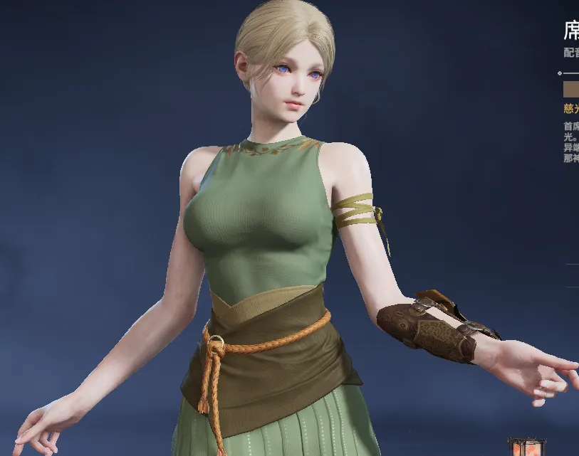
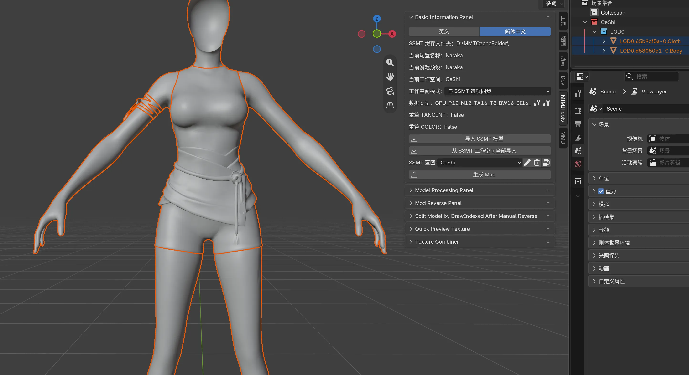
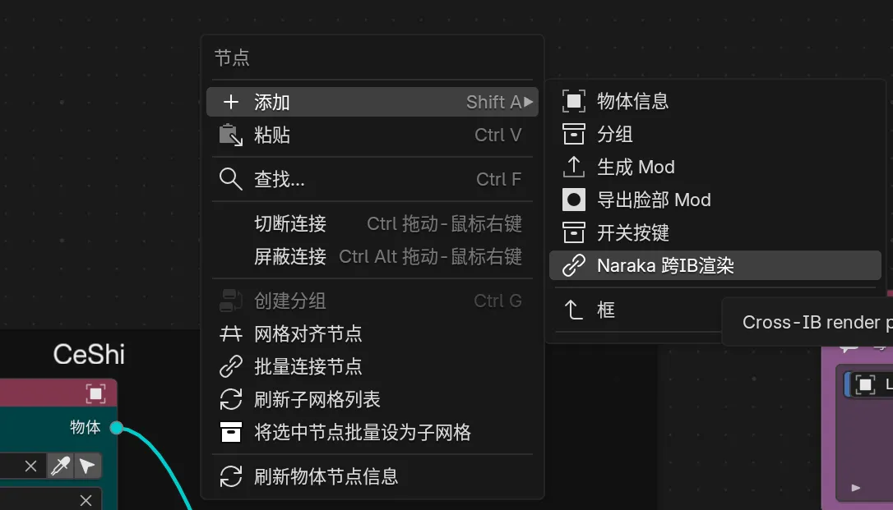
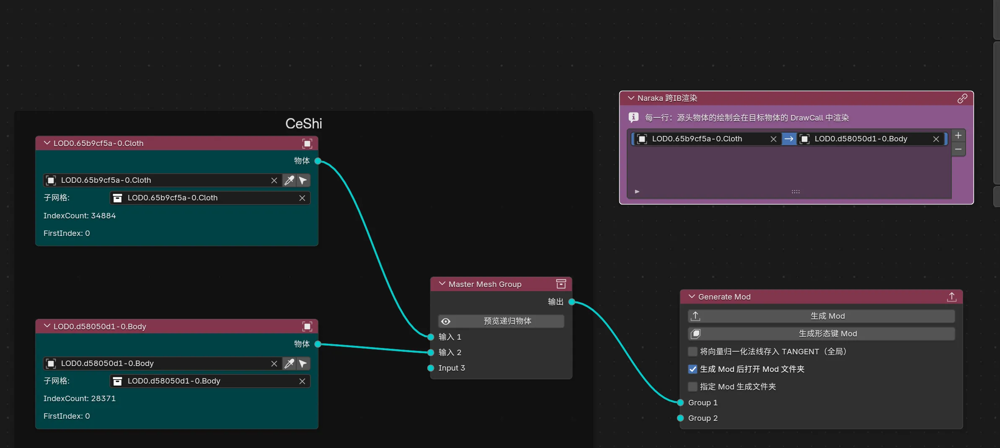
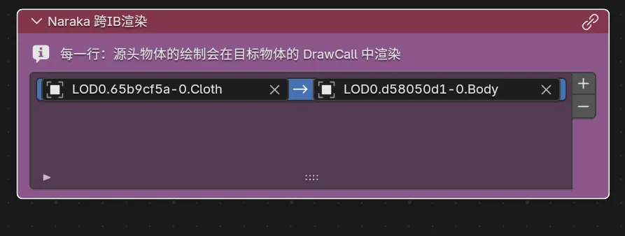
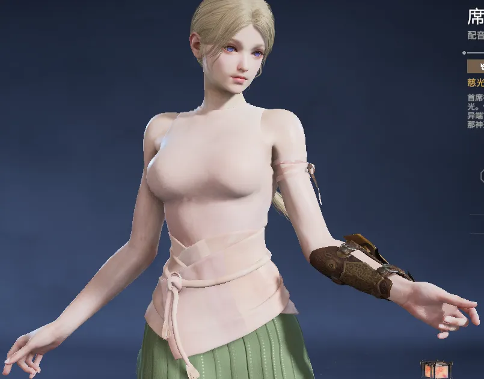
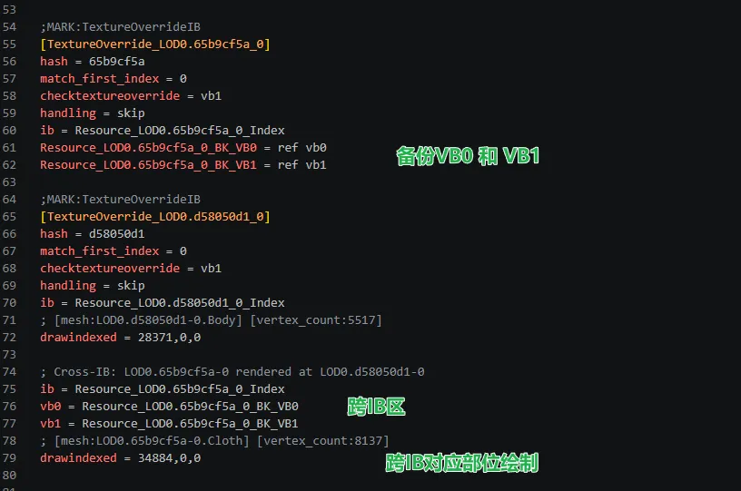
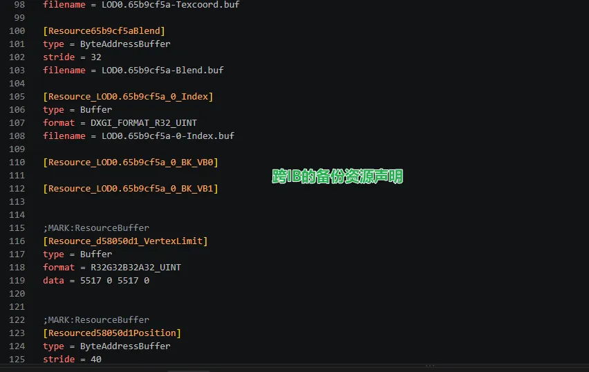

## Naraka快速跨IB渲染功能

以席拉默认皮肤为例：

 

 我们提取出来身体和胸部衣服的IB

 

 然后直接打开蓝图，右键添加一个Naraka 跨IB渲染

 

 然后选择源头物体和目标物体：

 

 例如，衣服使用身体的渲染：

 

 然后直接生成Mod：

 

 注意：这里源头物体和目标物体的Submesh子网格必须不同

生成的ini是标准化的：

备份资源声明统一在下面：

## 总结
相比于每次手写，现在只需要在蓝图里添加这个节点就能全自动写，解放一部分冗余重复性劳动。
