# 🛠️ <font color="#FF5733">崩铁</font><font color="#C70039">槽位</font><font color="#900C3F">风格</font><font color="#581845">贴图</font>问题处理 (Slot Style Texture Problem)

> 本节内容特别感谢群友 **HIKARI** 的支持 💖

我们都知道，目前 **崩铁** (<font color="#FF00FF">SR</font><font color="#00FFFF">MI</font>) 主流的 <font color="#FFD700">Mod</font> 制作，都是使用 **Hash 风格贴图** 的。尤其是如果你使用 <font color="#FF4500">XXMI-Tools</font> 的话，几乎只能使用 **Hash 风格贴图** 🔒。

但是在 <font color="#FF1493">MMT</font> 中，我们可以 **自由** 🕊️ 地通过贴图标记，来使用 **槽位风格贴图**。

::: tip 🤔 为什么要用槽位风格？
相比于 **Hash 风格贴图**，**槽位风格贴图** 在某些 **特殊需求** 下比较有效，例如：

*   🧩 **模型合并**：想把一个 <font color="#FFD700">Mod</font> 里的上半身模型和一个 <font color="#FFD700">Mod</font> 里的下半身模型合并在一起，但是又不想去合并贴图。虽然合并贴图才是标准的步骤，但是使用 **槽位风格** 的话，确实可以做到在对应 `drawindexed` 之前替换对应槽位的贴图来避免贴图合并的问题。
*   👻 **透明通道**：想给每个 <font color="#32CD32">Component</font> 上不同的贴图。因为一些 <font color="#32CD32">Component</font> 可能会读取 <font color="#00BFFF">Alpha</font> 通道实现透明（例如空间站站长艾斯达），但是其它 <font color="#32CD32">Component</font> 由于使用 <font color="#8A2BE2">Shader</font> 不同不会读取透明通道。
*   ⚫ **黑屏修复**：**Hash 风格贴图** 可能会导致部分特殊场景下，<font color="#FFD700">Mod</font> 变黑。
*   🤪 **任性**：不管不管，我就要用 **槽位风格贴图**！
:::

然后就是这样理论上是可以的，只不过因为在 **槽位风格贴图** 下需要对贴图做 `filter_index` 的判断，所以难住了部分萌新 👶。本节文档存在的意义就是科普一下，如果要 **强行** 使用 **槽位风格贴图**，该如何对生成的 `ini` 做 **后处理** 🔧。

为了方便演示，我们这里直接薅一个别人做好的 **Hash 风格贴图** 的 <font color="#FFD700">Mod</font>，逆向出它的模型，然后 **原封不动** 的使用 **槽位风格贴图** 重新生成为 <font color="#FFD700">Mod</font> 来进行演示 🧪。

::: warning ⚠️ 高能预警
在开始之前进行最后一次提示，那就是使用 **槽位风格贴图** 做 **崩铁** <font color="#FFD700">Mod</font> 实在是很 **不优雅** 💃🚫，**非常麻烦** 😫。具体有多麻烦你看过程就知道了，所以建议各位有条件尽量使用 **Hash 风格贴图**。本文档仅做科普演示，扩展知识面使用。
:::

## 1. 🔄 将 <font color="#FFA500">Hash</font> 风格逆向并重生为 <font color="#00CED1">槽位</font> 风格

这一步属于基础内容，我就省略一些常识步骤了。我们先看看这个 <font color="#FFD700">Mod</font> 原本是什么样的：

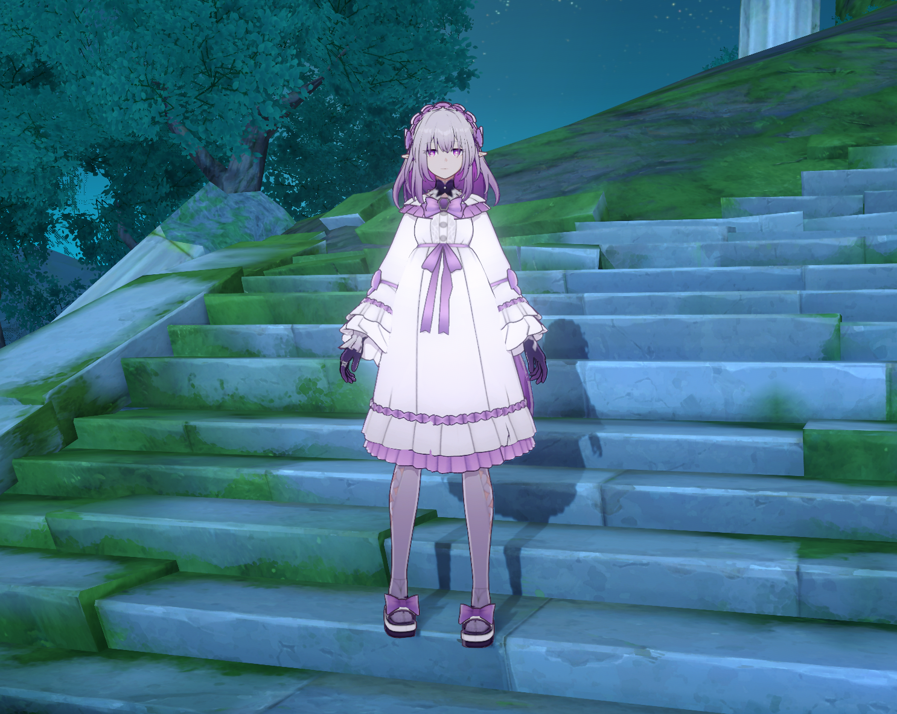

文件内容如下：

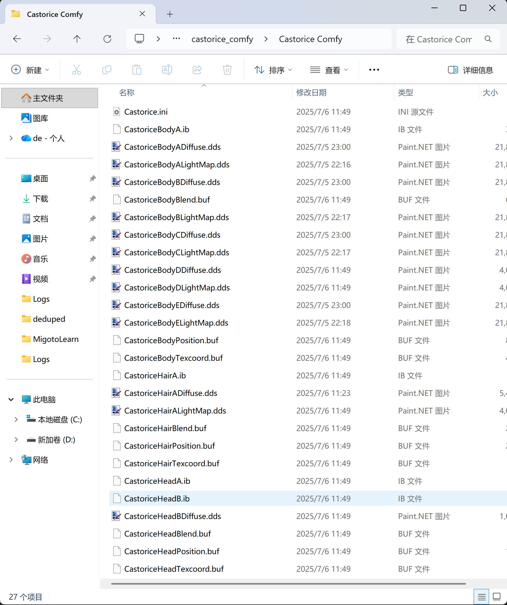

ini内容如下:

<details>
<summary>📜 点击展开查看原始 ini 代码 (太长不看版)</summary>

```ini
; Castorice

; Constants -------------------------

[Constants]
global $active = 0
global $creditinfo = 0

[Present]
post $active = 0
run = CommandListCreditInfo

; Overrides -------------------------

[TextureOverrideCastoriceHairBlend]
hash = 776a0dad
handling = skip
vb2 = ResourceCastoriceHairBlend
if DRAW_TYPE == 1
	vb0 = ResourceCastoriceHairPosition
	draw = 6512, 0
elif DRAW_TYPE == 8
	Resource\SRMI\PositionBuffer = ref ResourceCastoriceHairPositionCS
	Resource\SRMI\BlendBuffer = ref ResourceCastoriceHairBlendCS
	$\SRMI\vertex_count = 6512
endif
$active = 1

[TextureOverrideCastoriceHairTexcoord]
hash = 5e51291b
vb1 = ResourceCastoriceHairTexcoord

[TextureOverrideCastoriceHairDraw]
hash = e6d1f87b
override_vertex_count = 6512
override_byte_stride = 40
uav_byte_stride = 4

[TextureOverrideCastoriceHeadBlend]
hash = e7ea12e0
handling = skip
vb2 = ResourceCastoriceHeadBlend
if DRAW_TYPE == 1
	vb0 = ResourceCastoriceHeadPosition
	draw = 2890, 0
elif DRAW_TYPE == 8
	Resource\SRMI\PositionBuffer = ref ResourceCastoriceHeadPositionCS
	Resource\SRMI\BlendBuffer = ref ResourceCastoriceHeadBlendCS
	$\SRMI\vertex_count = 2890
endif
$active = 1

[TextureOverrideCastoriceHeadTexcoord]
hash = b731ffe4
vb1 = ResourceCastoriceHeadTexcoord

[TextureOverrideCastoriceHeadDraw]
hash = e31bfa54
override_vertex_count = 2890
override_byte_stride = 40
uav_byte_stride = 4

[TextureOverrideCastoriceBodyBlend]
hash = e79ca63a
handling = skip
vb2 = ResourceCastoriceBodyBlend
if DRAW_TYPE == 1
	vb0 = ResourceCastoriceBodyPosition
	draw = 21801, 0
elif DRAW_TYPE == 8
	Resource\SRMI\PositionBuffer = ref ResourceCastoriceBodyPositionCS
	Resource\SRMI\BlendBuffer = ref ResourceCastoriceBodyBlendCS
	$\SRMI\vertex_count = 21801
endif
$active = 1

[TextureOverrideCastoriceBodyTexcoord]
hash = dce61e19
vb1 = ResourceCastoriceBodyTexcoord

[TextureOverrideCastoriceBodyDraw]
hash = cc41f6a0
override_vertex_count = 21801
override_byte_stride = 40
uav_byte_stride = 4

[TextureOverrideCastoriceHairIB]
hash = c5794477
handling = skip

[TextureOverrideCastoriceHairA]
hash = c5794477
match_first_index = 0
ib = ResourceCastoriceHairAIB
; CastoriceHairA-vb0=e28bb3dd.txt.001 (6512)
drawindexed = 23205, 0, 0

[TextureOverrideCastoriceHeadIB]
hash = f2584f98
handling = skip

[TextureOverrideCastoriceHeadA]
hash = f2584f98
match_first_index = 0
ib = ResourceCastoriceHeadAIB
; CastoriceHeadA-vb0=e852e6ad.txt.001 (62)
drawindexed = 150, 0, 0

[TextureOverrideCastoriceHeadB]
hash = f2584f98
match_first_index = 150
ib = ResourceCastoriceHeadBIB
; CastoriceHeadB-vb0=e852e6ad.txt.001 (2828)
drawindexed = 12258, 0, 0

[TextureOverrideCastoriceBodyIB]
hash = 3b4647d4
handling = skip

[TextureOverrideCastoriceBodyA]
hash = 3b4647d4
match_first_index = 0
ib = ResourceCastoriceBodyAIB
; CastoriceBodyA-vb0=f1254d05.txt.002 (21801)
drawindexed = 88515, 0, 0

[TextureOverrideCastoriceHairADiffuse]
hash = e2ce4067
this = ResourceCastoriceHairADiffuse

[TextureOverrideCastoriceHairALightMap]
hash = 8f7f9441
this = ResourceCastoriceHairALightMap

[TextureOverrideCastoriceHeadBDiffuse]
hash = 9e27389e
this = ResourceCastoriceHeadBDiffuse

[TextureOverrideCastoriceBodyADiffuse]
hash = f9761bbf
this = ResourceCastoriceBodyADiffuse

[TextureOverrideCastoriceBodyALightMap]
hash = 87adc723
this = ResourceCastoriceBodyALightMap

[TextureOverrideCastoriceBodyBDiffuse]
hash = f9761bbf
this = ResourceCastoriceBodyBDiffuse

[TextureOverrideCastoriceBodyBLightMap]
hash = 87adc723
this = ResourceCastoriceBodyBLightMap

[TextureOverrideCastoriceBodyCDiffuse]
hash = f9761bbf
this = ResourceCastoriceBodyCDiffuse

[TextureOverrideCastoriceBodyCLightMap]
hash = 87adc723
this = ResourceCastoriceBodyCLightMap

[TextureOverrideCastoriceBodyDDiffuse]
hash = f0226f67
this = ResourceCastoriceBodyDDiffuse

[TextureOverrideCastoriceBodyDLightMap]
hash = 26610bd8
this = ResourceCastoriceBodyDLightMap

[TextureOverrideCastoriceBodyEDiffuse]
hash = f0226f67
this = ResourceCastoriceBodyEDiffuse

[TextureOverrideCastoriceBodyELightMap]
hash = 26610bd8
this = ResourceCastoriceBodyELightMap


; CommandList -----------------------

[CommandListCreditInfo]
if $creditinfo == 0 && $active > 0
	pre Resource\ShaderFixes\help.ini\Notification = ResourceCreditInfo
	pre run = CustomShader\ShaderFixes\help.ini\FormatText
	pre $\ShaderFixes\help.ini\notification_timeout = time + 5.0
	$creditinfo = 1
endif

; Resources -------------------------

[ResourceCastoriceHairPosition]
type = Buffer
stride = 40
filename = CastoriceHairPosition.buf

[ResourceCastoriceHairBlend]
type = Buffer
stride = 32
filename = CastoriceHairBlend.buf

[ResourceCastoriceHairTexcoord]
type = Buffer
stride = 8
filename = CastoriceHairTexcoord.buf

[ResourceCastoriceHairPositionCS]
type = StructuredBuffer
stride = 40
filename = CastoriceHairPosition.buf

[ResourceCastoriceHairBlendCS]
type = StructuredBuffer
stride = 32
filename = CastoriceHairBlend.buf

[ResourceCastoriceHairAIB]
type = Buffer
format = DXGI_FORMAT_R32_UINT
filename = CastoriceHairA.ib

[ResourceCastoriceHeadPosition]
type = Buffer
stride = 40
filename = CastoriceHeadPosition.buf

[ResourceCastoriceHeadBlend]
type = Buffer
stride = 32
filename = CastoriceHeadBlend.buf

[ResourceCastoriceHeadTexcoord]
type = Buffer
stride = 8
filename = CastoriceHeadTexcoord.buf

[ResourceCastoriceHeadPositionCS]
type = StructuredBuffer
stride = 40
filename = CastoriceHeadPosition.buf

[ResourceCastoriceHeadBlendCS]
type = StructuredBuffer
stride = 32
filename = CastoriceHeadBlend.buf

[ResourceCastoriceHeadAIB]
type = Buffer
format = DXGI_FORMAT_R32_UINT
filename = CastoriceHeadA.ib

[ResourceCastoriceHeadBIB]
type = Buffer
format = DXGI_FORMAT_R32_UINT
filename = CastoriceHeadB.ib

[ResourceCastoriceBodyPosition]
type = Buffer
stride = 40
filename = CastoriceBodyPosition.buf

[ResourceCastoriceBodyBlend]
type = Buffer
stride = 32
filename = CastoriceBodyBlend.buf

[ResourceCastoriceBodyTexcoord]
type = Buffer
stride = 20
filename = CastoriceBodyTexcoord.buf

[ResourceCastoriceBodyPositionCS]
type = StructuredBuffer
stride = 40
filename = CastoriceBodyPosition.buf

[ResourceCastoriceBodyBlendCS]
type = StructuredBuffer
stride = 32
filename = CastoriceBodyBlend.buf

[ResourceCastoriceBodyAIB]
type = Buffer
format = DXGI_FORMAT_R32_UINT
filename = CastoriceBodyA.ib

[ResourceCastoriceBodyBIB]
type = Buffer
format = DXGI_FORMAT_R32_UINT
filename = CastoriceBodyB.ib

[ResourceCastoriceBodyCIB]
type = Buffer
format = DXGI_FORMAT_R32_UINT
filename = CastoriceBodyC.ib

[ResourceCastoriceBodyDIB]
type = Buffer
format = DXGI_FORMAT_R32_UINT
filename = CastoriceBodyD.ib

[ResourceCastoriceBodyEIB]
type = Buffer
format = DXGI_FORMAT_R32_UINT
filename = CastoriceBodyE.ib

[ResourceCastoriceBodyFIB]
type = Buffer
format = DXGI_FORMAT_R32_UINT
filename = CastoriceBodyF.ib

[ResourceCastoriceHairADiffuse]
filename = CastoriceHairADiffuse.dds

[ResourceCastoriceHairALightMap]
filename = CastoriceHairALightMap.dds

[ResourceCastoriceHeadBDiffuse]
filename = CastoriceHeadBDiffuse.dds

[ResourceCastoriceBodyADiffuse]
filename = CastoriceBodyADiffuse.dds

[ResourceCastoriceBodyALightMap]
filename = CastoriceBodyALightMap.dds

[ResourceCastoriceBodyBDiffuse]
filename = CastoriceBodyBDiffuse.dds

[ResourceCastoriceBodyBLightMap]
filename = CastoriceBodyBLightMap.dds

[ResourceCastoriceBodyCDiffuse]
filename = CastoriceBodyCDiffuse.dds

[ResourceCastoriceBodyCLightMap]
filename = CastoriceBodyCLightMap.dds

[ResourceCastoriceBodyDDiffuse]
filename = CastoriceBodyDDiffuse.dds

[ResourceCastoriceBodyDLightMap]
filename = CastoriceBodyDLightMap.dds

[ResourceCastoriceBodyEDiffuse]
filename = CastoriceBodyEDiffuse.dds

[ResourceCastoriceBodyELightMap]
filename = CastoriceBodyELightMap.dds

[ResourceCreditInfo]
type = Buffer
data = "Created by scopeophilia"

; .ini generated by XXMI (XX-Model-Importer) v1.5.4
; If you have any issues or find any bugs, please open a ticket at https://github.com/leotorrez/XXMI-Tools/issues

```
</details>
可以看到这是一个标准的 **Hash 风格贴图** 的 <font color="#FFD700">Mod</font>。那么我们逆向出来看看：

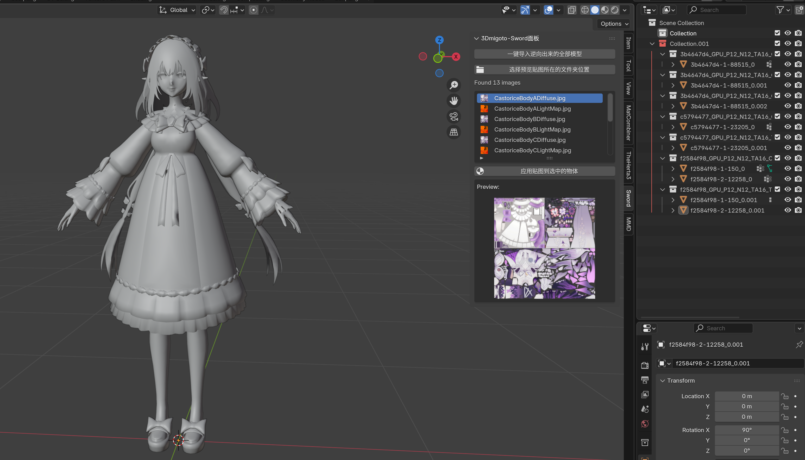

可以看到这个 <font color="#FFD700">Mod</font> 改了很多东西，但是为了让教程内容更加简单，我决定只演示 **身体部位**，其它部位也是同理。

然后我们提取出来模型，进入 **贴图标记页面**，可以发现身体居然有 **6个** <font color="#32CD32">Component</font> 😱。

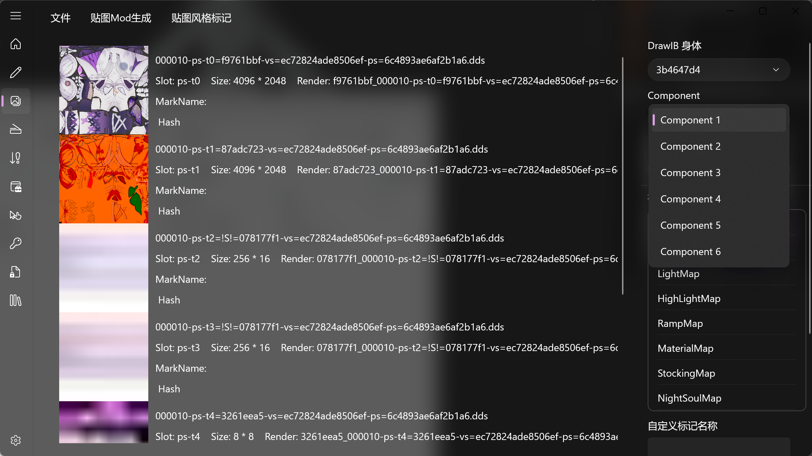

此时我们先原地生成，然后对比 `ini` 中的替换部分，来找到它使用的具体是哪一个 <font color="#32CD32">Component</font>。因为逆向出来只有一个模型，所以可以确定它只使用了其中一个 <font color="#32CD32">Component</font>，我们必须和他保持同步。

可以看到它的里面使用的是第一个，也就是 `match_first_index = 0` 的那个 <font color="#32CD32">Component</font>：

```ini
[TextureOverrideCastoriceBodyIB]
hash = 3b4647d4
handling = skip

[TextureOverrideCastoriceBodyA]
hash = 3b4647d4
match_first_index = 0
ib = ResourceCastoriceBodyAIB
; CastoriceBodyA-vb0=f1254d05.txt.002 (21801)
drawindexed = 88515, 0, 0
```

所以我们在 **贴图标记** 时，就只在第一个 <font color="#32CD32">Component</font> 上标记 ✅。

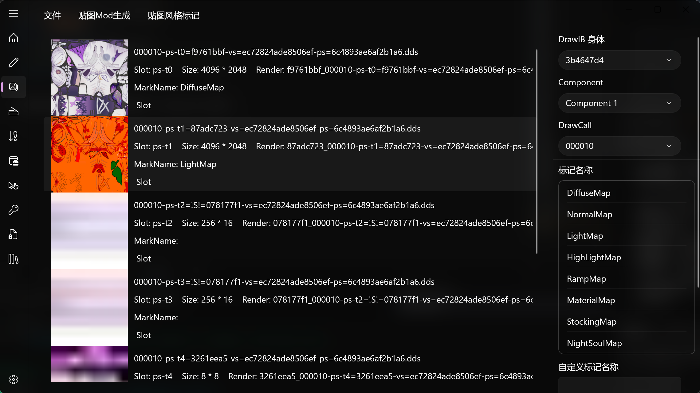

标记完成后按照正常流程生成 <font color="#FFD700">Mod</font>：

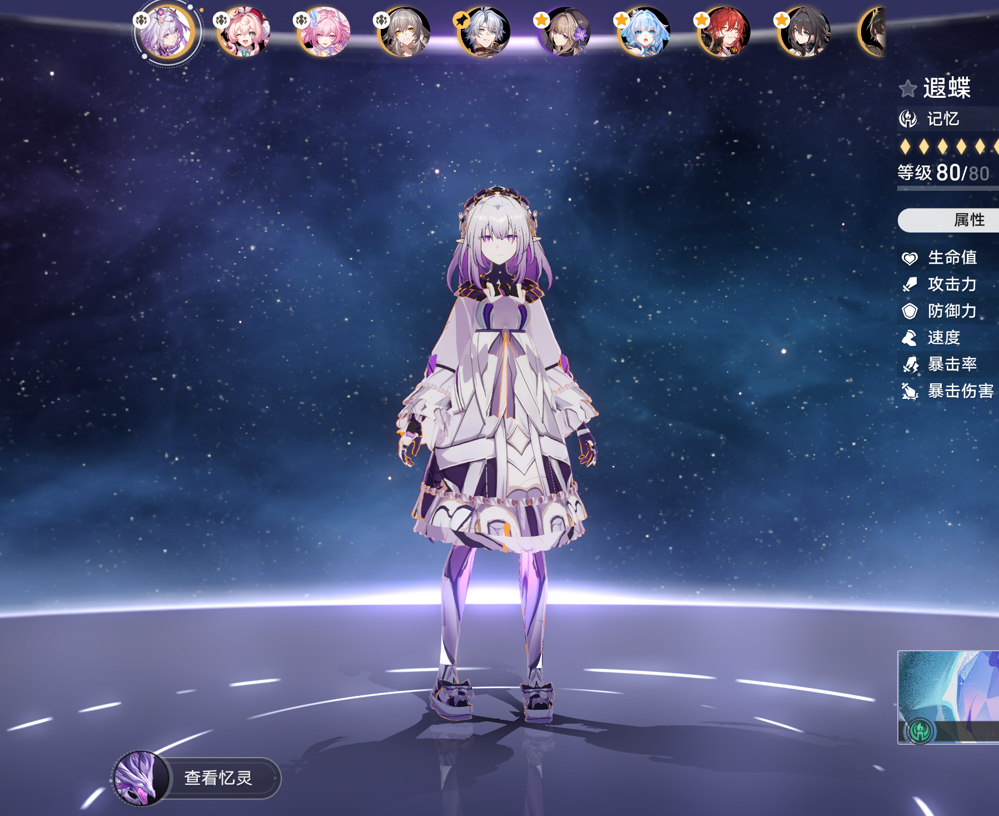

此时贴图还没有生效，我们需要替换一下 <font color="#FFD700">Mod</font> 文件里对应位置的贴图过来，到我们生成的 <font color="#FFD700">Mod</font> 文件夹中对应的贴图：

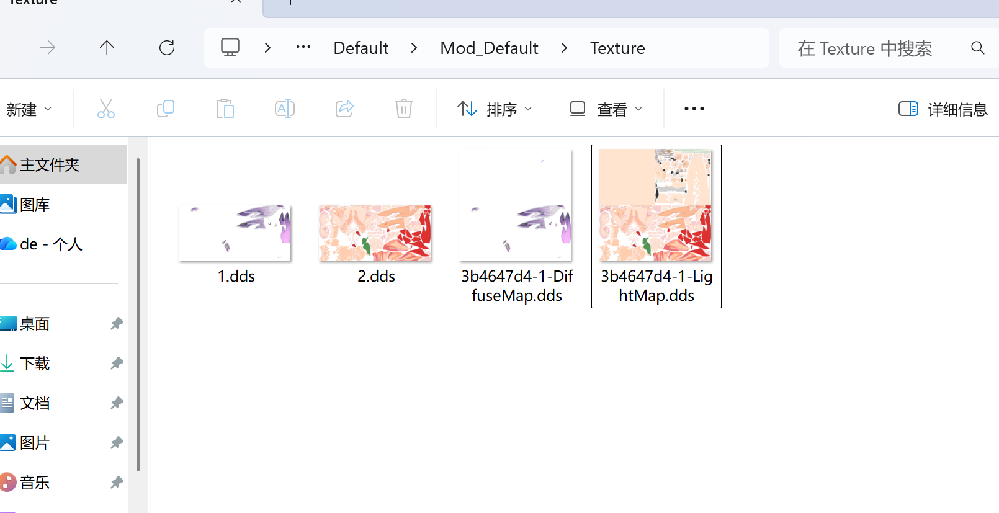

替换完成后呢，我们游戏里 <kbd>F10</kbd> 刷新看一下效果：

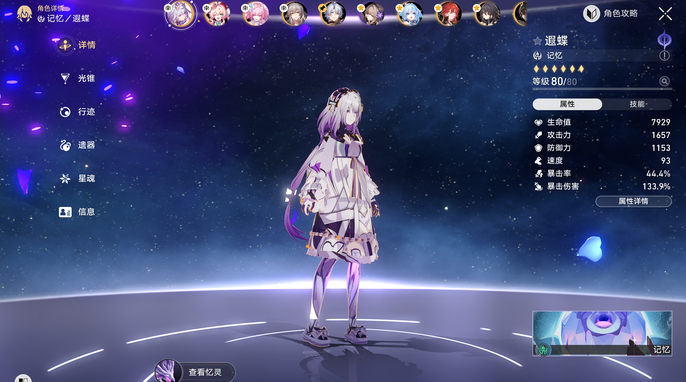

你会发现，**完全看不出效果** 😑。这是为什么呢？因为 <font color="#FF00FF">SR</font><font color="#00FFFF">MI</font> 新版本中很有可能没有添加全局的对 **槽位风格贴图** 的 `check`，所以我们需要在 `ini` 中手动添加：

```ini
;MARK:TextureOverrideIB
[TextureOverride_IB_3b4647d4_身体_Component1]
hash = 3b4647d4
match_first_index = 0
handling = skip
checktextureoverride = ps-t0
checktextureoverride = ps-t1
ib = Resource_3b4647d4_Component1
ps-t0 = Resource-3b4647d4-1-DiffuseMap
ps-t1 = Resource-3b4647d4-1-LightMap
; [mesh:3b4647d4-1-88515_0.001] [vertex_count:21816]
drawindexed = 88515,0,0

```

游戏里 <kbd>F10</kbd> 刷新 **仍然没有生效** 😫。此时我们怀疑是 **贴图槽位** 没有标记正确，也就是实际上当前场景使用的槽位并不是 `ps-t0` 和 `ps-t1`。

所以我们去 **贴图标记页面** 寻找其他的 <font color="#FF4500">DrawCall</font>，发现果然，是 `ps-t2` 和 `ps-t3` 🕵️‍♂️。

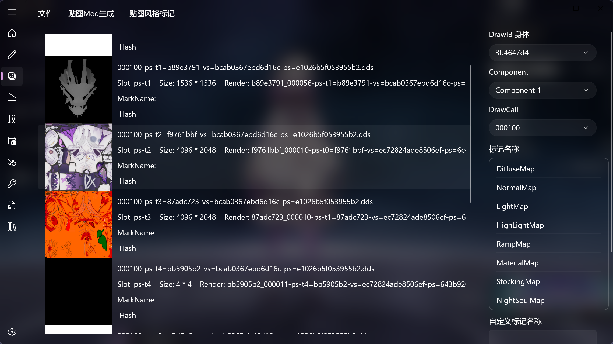

此时我们重新标记，标记完成后，重新生成 <font color="#FFD700">Mod</font>。可以发现此次生成后，<font color="#FFD700">Mod</font> 直接就生效了，甚至不需要添加 `checktextureoverride`，这可能是由于全局 `check` 中 `check` 了 `ib` 的原因：

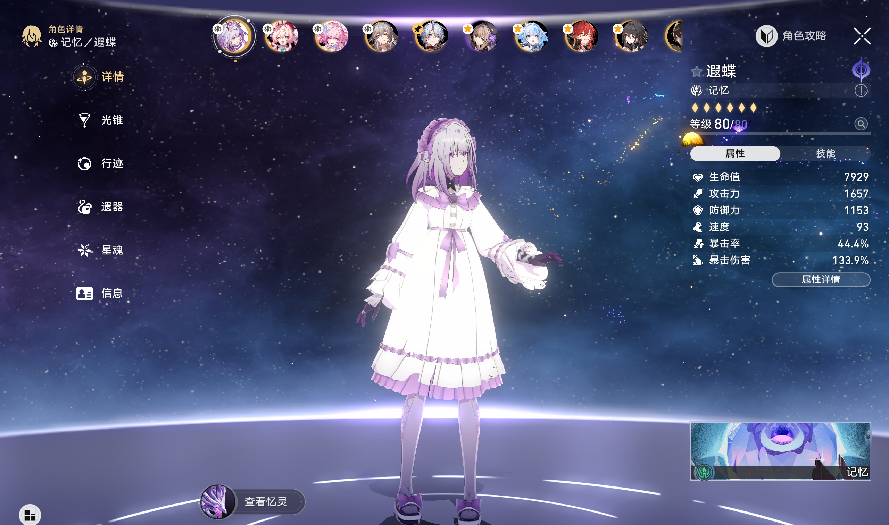

可以看到，人物 **特别的亮** 💡，我们 **假设** 这个就是使用 **槽位风格** 会导致的问题。因为在不同的 <font color="#FF4500">DrawCall</font> 中使用了不同的 <font color="#8A2BE2">Pixel Shader</font>，不同的 <font color="#8A2BE2">Pixel Shader</font> 读取的贴图槽位又不同，所以导致部分 <font color="#8A2BE2">Shader</font> 读取不到正确的贴图，就导致贴图可能出现异常。这个问题在其他的场景中可能会更严重，这里时间有限就不一一测试了，我们直接上 **解决方案** 💊。

首先我们需要看看这个场景下所有的 <font color="#FF4500">DrawCall</font>，看看每个贴图都用到了哪些槽位。没错，这个修复 **非常麻烦** 🤯，需要逐个 <font color="#8A2BE2">Shader</font> 测试并记录所有的槽位，这意味着你要对所有的可能出错的场景都测试一遍，并且记录其槽位。

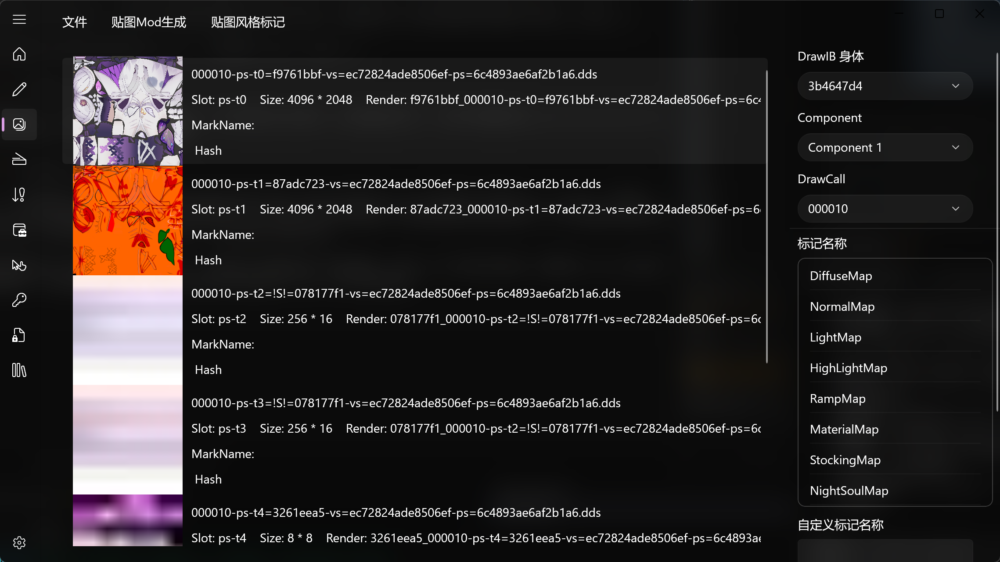

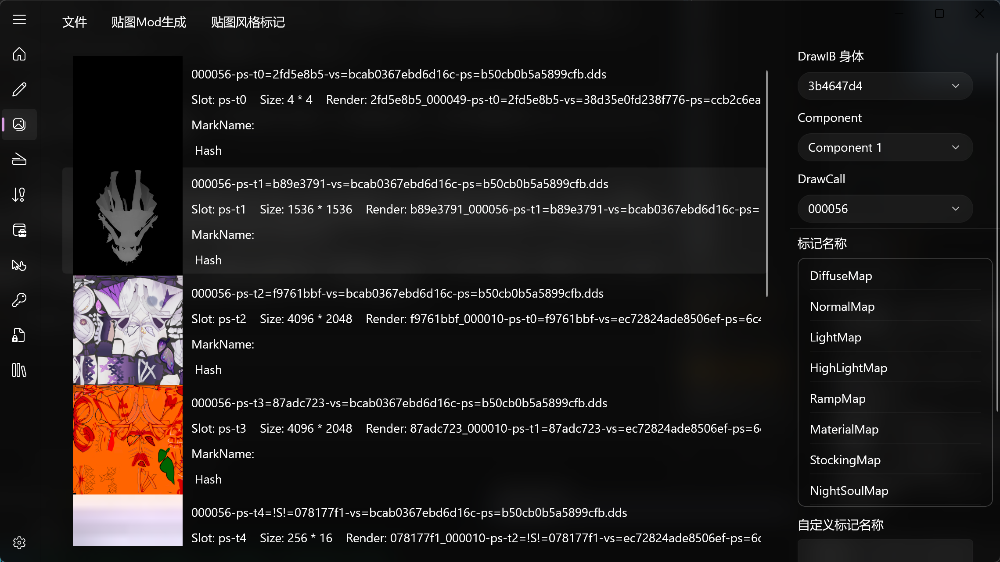

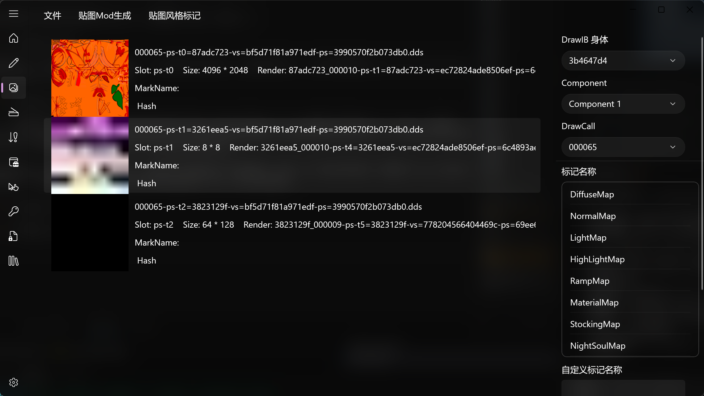

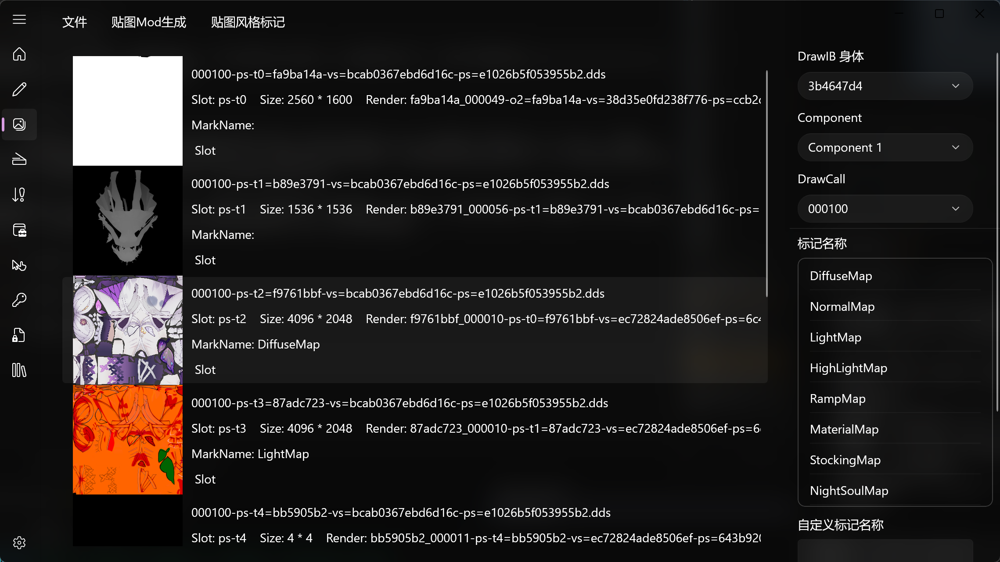

大概就这些，可以总结出来：

*   <font color="#1E90FF">DiffuseMap</font> 在 `ps-t0` 和 `ps-t2` 出现过
*   <font color="#FFD700">LightMap</font> 在 `ps-t0`, `ps-t1`, `ps-t3` 出现过

然后我们需要给用到的这两个贴图的 **Hash 值**，加上一个 `filter_index` 的值，作为 **过滤标签** 🏷️。

首先我们得知道这俩贴图的 **Hash 值** 分别是什么。可以看到 <font color="#FFD700">Mod</font> 文件里居然没有显示 **Hash 值**（这个是 <font color="#FF1493">MMT</font> 的一个缺陷，当前版本存在问题，后续会改进，后续版本应该能直接看到 **Hash 值** 才对 🐛）。

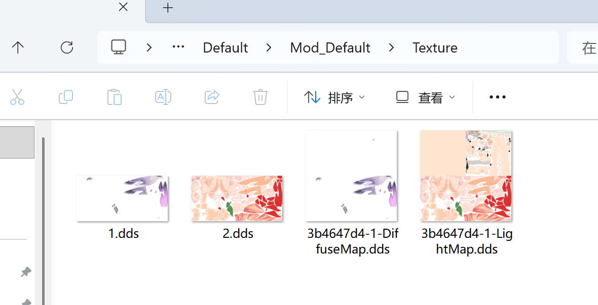

所以我们去 **贴图标记页面** 查看它们的 **Hash 值**：

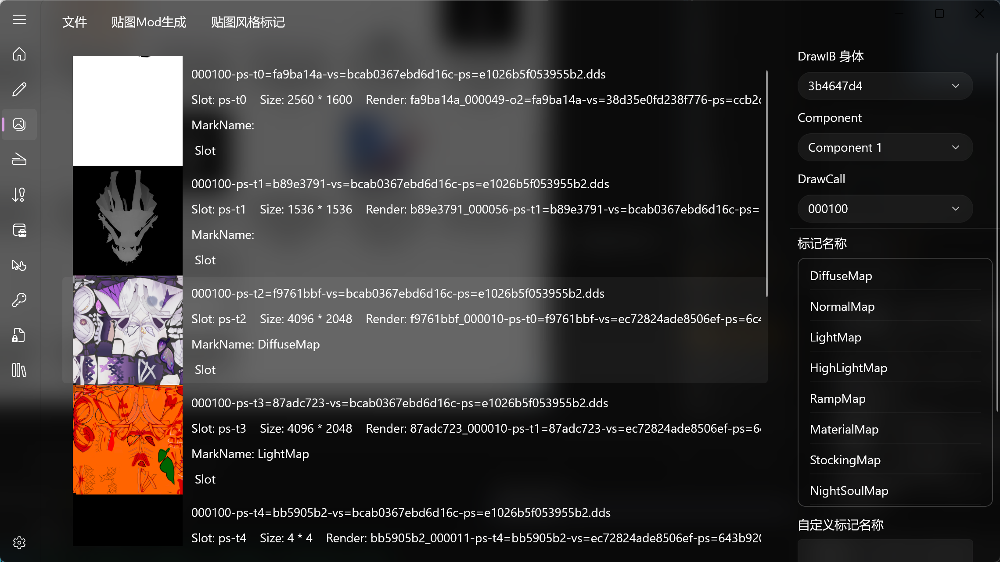

*   <font color="#1E90FF">DiffuseMap</font> 的 Hash 值为：`f9761bbf`
*   <font color="#FFD700">LightMap</font> 的 Hash 值为：`87adc723`

然后我们需要在 <font color="#FFD700">Mod</font> 的 `ini` 中添加如下内容：

```ini
[TextureOverride_Texture_f9761bbf]
hash = f9761bbf
filter_index = 1001

[TextureOverride_Texture_87adc723]
hash = 87adc723
filter_index = 1002
```

这里的 `1001` 和 `1002` 是随便加的值，是多少都行只要能做出区分即可 🔢。

然后呢，我们需要在对应的 **槽位风格贴图** 的资源替换部分，也就是这里：

```ini
;MARK:TextureOverrideIB
[TextureOverride_IB_3b4647d4_身体_Component1]
hash = 3b4647d4
match_first_index = 0
handling = skip
ib = Resource_3b4647d4_Component1
ps-t2 = Resource-3b4647d4-1-DiffuseMap
ps-t3 = Resource-3b4647d4-1-LightMap
; [mesh:3b4647d4-1-88515_0.001] [vertex_count:21816]
drawindexed = 88515,0,0
```

新增基于 `filter_index` 的值来判断是否进行贴图替换，`ini` 如下：

基于每个贴图在哪里出现过，就添加对应槽位的 `if` 判断来替换对应资源。

*   <font color="#1E90FF">DiffuseMap</font> 在 `ps-t0` 和 `ps-t2` 出现过
*   <font color="#FFD700">LightMap</font> 在 `ps-t0`, `ps-t1`, `ps-t3` 出现过

<details>
<summary>📜 点击展开查看修改后的 ini 代码</summary>

```ini
;MARK:TextureOverrideIB
[TextureOverride_IB_3b4647d4_身体_Component1]
hash = 3b4647d4
match_first_index = 0
handling = skip
ib = Resource_3b4647d4_Component1

if ps-t0 == 1001
  ps-t0 = Resource-3b4647d4-1-DiffuseMap
endif 

if ps-t2 == 1001
  ps-t2 = Resource-3b4647d4-1-DiffuseMap
endif 

if ps-t0 == 1002
  ps-t0 = Resource-3b4647d4-1-LightMap
endif 
if ps-t1 == 1002
  ps-t1 = Resource-3b4647d4-1-LightMap
endif 
if ps-t3 == 1002
  ps-t3 = Resource-3b4647d4-1-LightMap
endif 

; [mesh:3b4647d4-1-88515_0.001] [vertex_count:21816]
drawindexed = 88515,0,0
```
</details>

到这里游戏里 <kbd>F10</kbd> 刷新，发现还是没变化 😐。

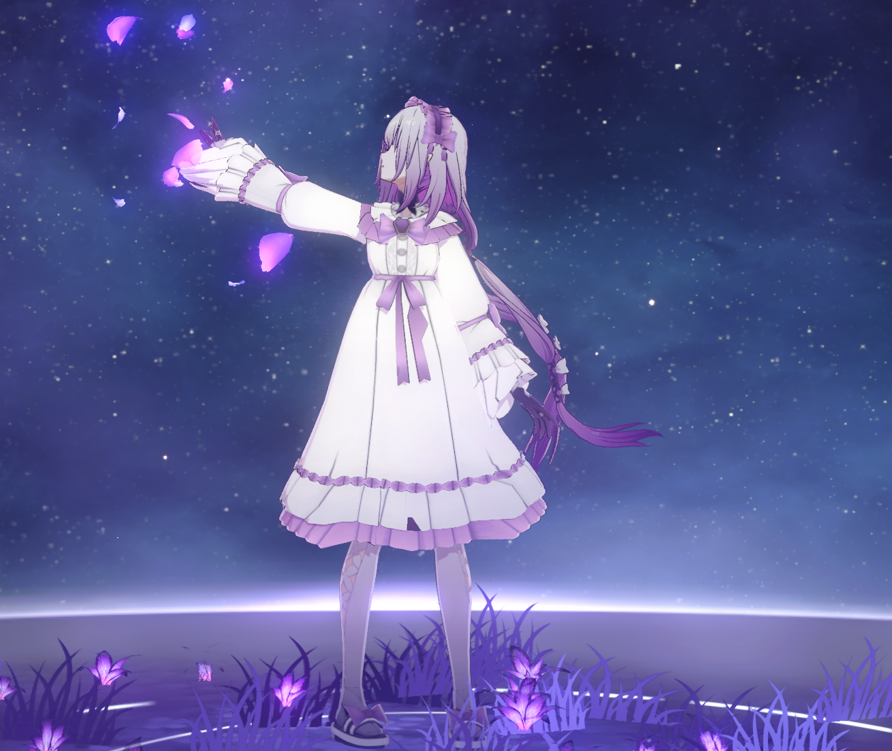

我们此时再看看原本的 **Hash 风格贴图** 的光效是什么样的？

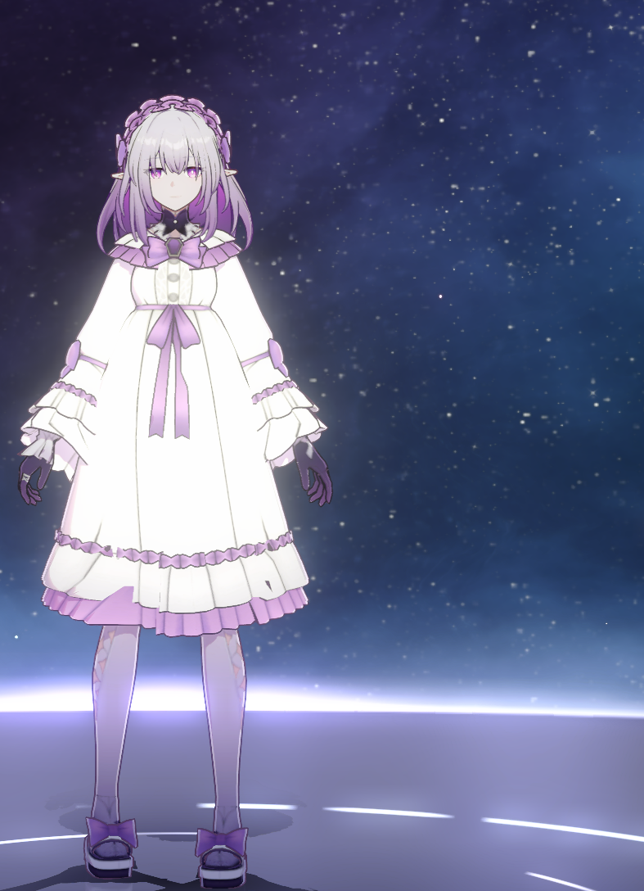

嗯，发现原来原本的 <font color="#FFD700">Mod</font> 的光效就是这样发光的 ✨。算是一个误解把，因为我并没有实际碰上对应的问题，所以随便选了一个 <font color="#FFD700">Mod</font> 来进行举例，不必在意这些细节 🙈。总之上面的流程就是 **崩铁** 在使用 **槽位风格贴图** 时，必须要做的事情。

那就是在使用 **槽位风格贴图** <font color="#FFD700">Mod</font> 时，对于每一个贴图出错的场景，都要 <kbd>F8</kbd> <font color="#FF4500">Dump</font>，提取模型，贴图标记中找到每个贴图用到的所有的槽位，然后在这里的 `if` 判断逻辑中补充其出现的槽位。

我们来看一下一个 <font color="#FFD700">Mod</font> 作者做的 **槽位风格** 的大黑塔的 `ini`：

<details>
<summary>📜 点击展开查看大黑塔 Mod 的 ini 代码 (超级长警告)</summary>

```ini

;MARK:Key----------------------------------------------------------
[KeySwap_0]
condition = $active0 == 1
key = down
key = XB_LEFT_SHOULDER XB_A
type = cycle
$swapkey0 = 0,1,2,3,4,5,6,


;MARK:Constants----------------------------------------------------------
[Constants]
global $active0
global $active1
global persist $swapkey0 = 0

;MARK:Present----------------------------------------------------------
[Present]
post $active0 = 0
post $active1 = 0

;MARK:TextureOverrideVertexLimitRaise----------------------------------------------------------
[TextureOverride_9f57a0dc_body_Draw]
hash = f68aa938
override_byte_stride = 40
override_vertex_count = 206859
uav_byte_stride = 4


;MARK:TextureOverrideVertexLimitRaise----------------------------------------------------------
[TextureOverride_2f0ef6c8_hair_Draw]
hash = 2deaf0ab
override_byte_stride = 40
override_vertex_count = 4720
uav_byte_stride = 4


;MARK:TextureOverrideVB----------------------------------------------------------
; 9f57a0dc ----------------------------
$active0 = 1

[TextureOverride_VB_9f57a0dc_body_Texcoord]
hash = 4e369eb5
vb1 = Resource9f57a0dcTexcoord

[TextureOverride_VB_9f57a0dc_body_Blend]
hash = e9d9a8f1
handling = skip
vb2 = Resource9f57a0dcBlend
if DRAW_TYPE == 1
  vb0 = Resource9f57a0dcPosition
draw = 206859, 0
endif
if DRAW_TYPE == 8
  Resource\SRMI\PositionBuffer = ref Resource9f57a0dcPositionCS
  Resource\SRMI\BlendBuffer = ref Resource9f57a0dcBlendCS
  $\SRMI\vertex_count = 206859
endif


;MARK:TextureOverrideVB----------------------------------------------------------
; 2f0ef6c8 ----------------------------
$active1 = 1

[TextureOverride_VB_2f0ef6c8_hair_Blend]
hash = 7419ffaa
handling = skip
vb2 = Resource2f0ef6c8Blend
if DRAW_TYPE == 1
  vb0 = Resource2f0ef6c8Position
draw = 4720, 0
endif
if DRAW_TYPE == 8
  Resource\SRMI\PositionBuffer = ref Resource2f0ef6c8PositionCS
  Resource\SRMI\BlendBuffer = ref Resource2f0ef6c8BlendCS
  $\SRMI\vertex_count = 4720
endif

[TextureOverride_VB_2f0ef6c8_hair_Texcoord]
hash = 363f05e0
vb1 = Resource2f0ef6c8Texcoord


;MARK:TextureOverrideIB----------------------------------------------------------
[TextureOverride_IB_9f57a0dc_body_Component1]
hash = 9f57a0dc
match_first_index = 0
handling = skip
ib = Resource_9f57a0dc_Component1
if ps-t0 == 39
	ps-t0 = Resource_9f57a0dc-2293151f-1-DiffuseMap
endif
if ps-t0 == 40
	ps-t0 = Resource_9f57a0dc-aa33ce8e-1-LightMap
endif

if ps-t1 == 40
	ps-t1 = Resource_9f57a0dc-aa33ce8e-1-LightMap
endif

if ps-t2 == 39
	ps-t2 = Resource_9f57a0dc-2293151f-1-DiffuseMap
endif

if ps-t3 == 40
	ps-t3 = Resource_9f57a0dc-aa33ce8e-1-LightMap
endif

if ps-t4 == 39
	ps-t4 = Resource_9f57a0dc-2293151f-1-DiffuseMap
endif

if ps-t5 == 40
	ps-t5 = Resource_9f57a0dc-aa33ce8e-1-LightMap
endif

if ps-t4 == 37
	ps-t4 = Resource_9f57a0dc-681099df-1-siwaMap
endif

if ps-t5 == 39
	ps-t5 = Resource_9f57a0dc-2293151f-1-DiffuseMap
endif

if ps-t5 == 38
	ps-t5 = Resource_9f57a0dc-fb82d938-1-zhezhaoMap
endif

if ps-t6 == 37
	ps-t6 = Resource_9f57a0dc-681099df-1-siwaMap
endif
if ps-t6 == 38
	ps-t6 = Resource_9f57a0dc-fb82d938-1-zhezhaoMap
endif

if ps-t7 == 39
	ps-t7 = Resource_9f57a0dc-2293151f-1-DiffuseMap
	endif
endif

if ps-t8 == 37
	ps-t8 = Resource_9f57a0dc-681099df-1-siwaMap
endif

if ps-t8 == 38
	ps-t8 = Resource_9f57a0dc-fb82d938-1-zhezhaoMap
endif

if ps-t9 == 39
	ps-t9 = Resource_9f57a0dc-2293151f-1-DiffuseMap
endif

if ps-t10 == 38
	ps-t10 = Resource_9f57a0dc-fb82d938-1-zhezhaoMap
endif
if $swapkey0 == 0
  ; [mesh:9f57a0dc-1-bodybig  og.qieshou] [vertex_count:17109]
  drawindexed = 85038,0,0
  ; [mesh:9f57a0dc-1-bodyJieshou shoubi] [vertex_count:7148]
  drawindexed = 23052,85038,0
  ; [mesh:9f57a0dc-1-bodyyifu1] [vertex_count:5748]
  drawindexed = 17934,108090,0
endif

if $swapkey0 == 1
  ; [mesh:9f57a0dc-1-bodyyifu2] [vertex_count:3196]
  drawindexed = 10308,126024,0
  ; [mesh:9f57a0dc-1-bodyJieshou shoubi.001] [vertex_count:7148]
  drawindexed = 23052,136332,0
  ; [mesh:9f57a0dc-1-bodybig  og.qieshou.001] [vertex_count:17109]
  drawindexed = 85038,159384,0
endif

if $swapkey0 == 2
  ; [mesh:9f57a0dc-1-bodyJieshou shoubi.002] [vertex_count:7148]
  drawindexed = 23052,244422,0
  ; [mesh:9f57a0dc-1-bodybig  og.qieshou.002] [vertex_count:17109]
  drawindexed = 85038,267474,0
endif

if $swapkey0 == 3
  ; [mesh:9f57a0dc-1-bodybig  og] [vertex_count:29061]
  drawindexed = 149868,352512,0
endif

if $swapkey0 == 4
  ; [mesh:9f57a0dc-1-bodybig .001] [vertex_count:28140]
  drawindexed = 149574,502380,0
  ; [mesh:9f57a0dc-1-bodyyifu1.006] [vertex_count:5748]
  drawindexed = 17934,651954,0
endif

if $swapkey0 == 5
  ; [mesh:9f57a0dc-1-bodybig .002] [vertex_count:28140]
  drawindexed = 149574,669888,0
  ; [mesh:9f57a0dc-1-bodyyifu2.001] [vertex_count:3196]
  drawindexed = 10308,819462,0
endif

if $swapkey0 == 6
  ; [mesh:9f57a0dc-1-bodybig ] [vertex_count:28140]
  drawindexed = 149574,829770,0
endif

[TextureOverride_IB_9f57a0dc_body_Component2]
hash = 9f57a0dc
match_first_index = 32367
handling = skip
ib = Resource_9f57a0dc_Component2
if ps-t0 == 39
	ps-t0 = Resource_9f57a0dc-2293151f-1-DiffuseMap
endif
if ps-t0 == 40
	ps-t0 = Resource_9f57a0dc-aa33ce8e-1-LightMap
endif

if ps-t1 == 40
	ps-t1 = Resource_9f57a0dc-aa33ce8e-1-LightMap
endif

if ps-t2 == 39
	ps-t2 = Resource_9f57a0dc-2293151f-1-DiffuseMap
endif

if ps-t3 == 40
	ps-t3 = Resource_9f57a0dc-aa33ce8e-1-LightMap
endif

if ps-t4 == 39
	ps-t4 = Resource_9f57a0dc-2293151f-1-DiffuseMap
endif

if ps-t5 == 40
	ps-t5 = Resource_9f57a0dc-aa33ce8e-1-LightMap
endif

if ps-t4 == 37
	ps-t4 = Resource_9f57a0dc-681099df-1-siwaMap
endif

if ps-t5 == 39
	ps-t5 = Resource_9f57a0dc-2293151f-1-DiffuseMap
endif

if ps-t5 == 38
	ps-t5 = Resource_9f57a0dc-fb82d938-1-zhezhaoMap
endif

if ps-t6 == 37
	ps-t6 = Resource_9f57a0dc-681099df-1-siwaMap
endif
if ps-t6 == 38
	ps-t6 = Resource_9f57a0dc-fb82d938-1-zhezhaoMap
endif

if ps-t7 == 39
	ps-t7 = Resource_9f57a0dc-2293151f-1-DiffuseMap
	endif
endif

if ps-t8 == 37
	ps-t8 = Resource_9f57a0dc-681099df-1-siwaMap
endif

if ps-t8 == 38
	ps-t8 = Resource_9f57a0dc-fb82d938-1-zhezhaoMap
endif

if ps-t9 == 39
	ps-t9 = Resource_9f57a0dc-2293151f-1-DiffuseMap
endif

if ps-t10 == 38
	ps-t10 = Resource_9f57a0dc-fb82d938-1-zhezhaoMap
endif
; [mesh:9f57a0dc-2-body] [vertex_count:2719]
drawindexed = 7806,0,0


;MARK:TextureOverrideIB----------------------------------------------------------
[TextureOverride_IB_2f0ef6c8_hair_Component1]
hash = 2f0ef6c8
match_first_index = 0
handling = skip
ib = Resource_2f0ef6c8_Component1
; [mesh:2f0ef6c8-1-hair] [vertex_count:4720]
drawindexed = 17937,0,0


;MARK:ResourceBuffer----------------------------------------------------------
[Resource9f57a0dcPosition]
type = Buffer
stride = 40
filename = Buffer/9f57a0dc-Position.buf

[Resource9f57a0dcTexcoord]
type = Buffer
stride = 20
filename = Buffer/9f57a0dc-Texcoord.buf

[Resource9f57a0dcBlend]
type = Buffer
stride = 32
filename = Buffer/9f57a0dc-Blend.buf

[Resource9f57a0dcPositionCS]
type = StructuredBuffer
stride = 40
filename = Buffer/9f57a0dc-Position.buf

[Resource9f57a0dcBlendCS]
type = StructuredBuffer
stride = 32
filename = Buffer/9f57a0dc-Blend.buf

[Resource_9f57a0dc_Component1]
type = Buffer
format = DXGI_FORMAT_R32_UINT
filename = Buffer/9f57a0dc-Component1.buf

[Resource_9f57a0dc_Component2]
type = Buffer
format = DXGI_FORMAT_R32_UINT
filename = Buffer/9f57a0dc-Component2.buf


;MARK:ResourceBuffer----------------------------------------------------------
[Resource2f0ef6c8Position]
type = Buffer
stride = 40
filename = Buffer/2f0ef6c8-Position.buf

[Resource2f0ef6c8Blend]
type = Buffer
stride = 32
filename = Buffer/2f0ef6c8-Blend.buf

[Resource2f0ef6c8Texcoord]
type = Buffer
stride = 8
filename = Buffer/2f0ef6c8-Texcoord.buf

[Resource2f0ef6c8PositionCS]
type = StructuredBuffer
stride = 40
filename = Buffer/2f0ef6c8-Position.buf

[Resource2f0ef6c8BlendCS]
type = StructuredBuffer
stride = 32
filename = Buffer/2f0ef6c8-Blend.buf

[Resource_2f0ef6c8_Component1]
type = Buffer
format = DXGI_FORMAT_R32_UINT
filename = Buffer/2f0ef6c8-Component1.buf


[Resource_9f57a0dc-2293151f-1-DiffuseMap]
filename = Texture/9f57a0dc-2293151f-1-DiffuseMap.dds

[Resource_9f57a0dc-aa33ce8e-1-LightMap]
filename = Texture/9f57a0dc-aa33ce8e-1-LightMap.dds

[Resource_9f57a0dc-681099df-1-siwaMap]
filename = Texture/9f57a0dc-681099df-1-siwaMap.dds

[Resource_9f57a0dc-fb82d938-1-zhezhaoMap]
filename = Texture/9f57a0dc-fb82d938-1-zhezhaoMap.dds


[TextureOverride_Texture_2293151f]
hash = 2293151f
filter_index = 39

[TextureOverride_Texture_aa33ce8e]
hash = aa33ce8e
filter_index = 40

[TextureOverride_Texture_681099df]
hash = 681099df
filter_index = 37

[TextureOverride_Texture_fb82d938]
hash = fb82d938
filter_index = 38
;sha256=00339bd90465d6381647cfe1385fb0b37d954b7fdfc229b4499065b73e18a5d0


```
</details>

可以看到作者为了使用 **槽位风格贴图** 的同时确保兼容性，添加了大量的基于 `filter` 的 `if` 逻辑 🤯。

总之上面就是 **崩铁** 使用 **槽位风格** 所必须要做的步骤。

虽然本节文档中并没有演示出具体的 <font color="#FFD700">Mod</font> 破损和修复的效果，但是流程都是一样的，参考我这个流程进行修复即可。

::: tip 💡 最后的建议
当然，可以看出来确实是 **超级麻烦** 😫。我建议还是用 **Hash 风格贴图** 算了，没有必要折磨自己。
:::

---

**📅 更新日期:** 2025年12月15日
**📝 结语:** 祝你在 <font color="#FFD700">Mod</font> 制作的道路上少踩坑，多出货！如果真的要挑战 **槽位风格**，请做好心理准备！💪