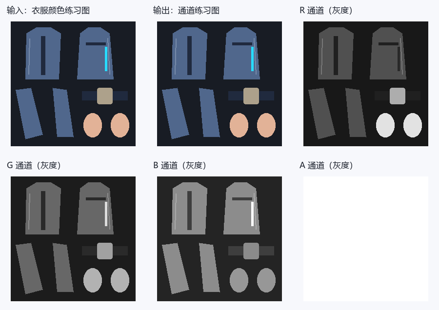
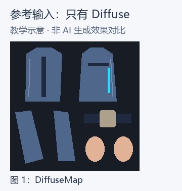
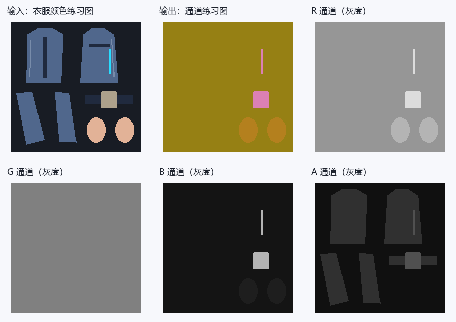
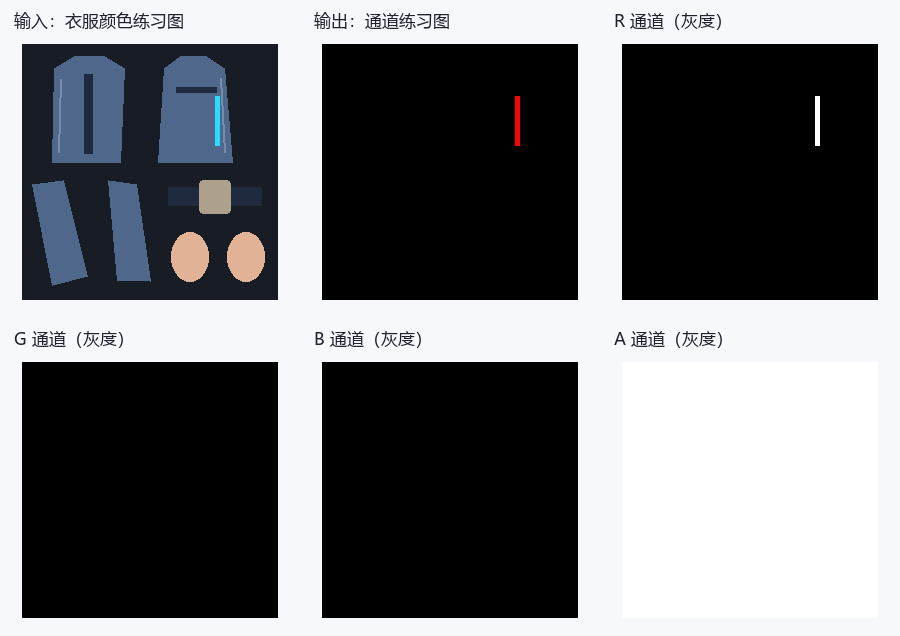
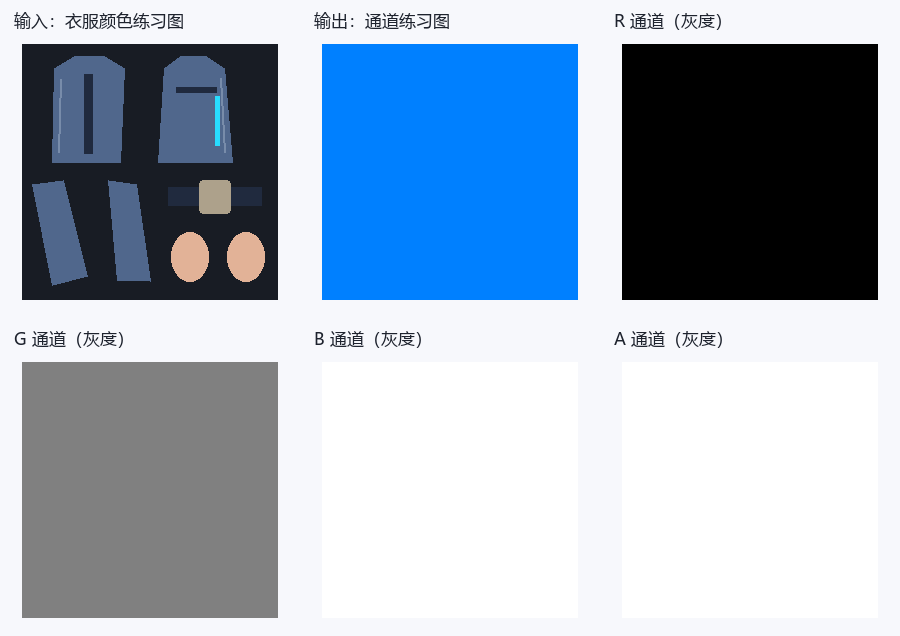
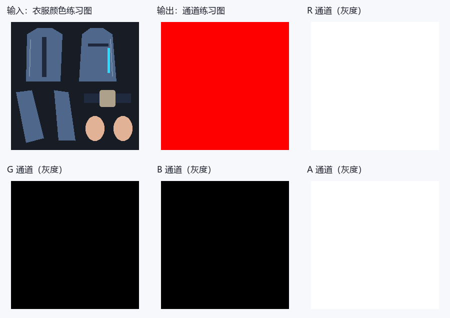
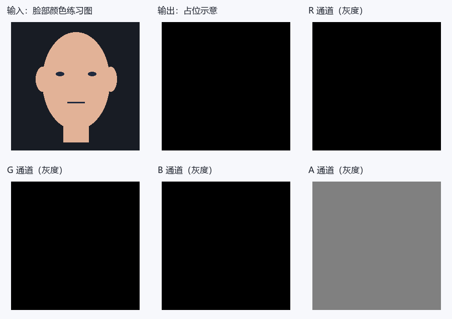
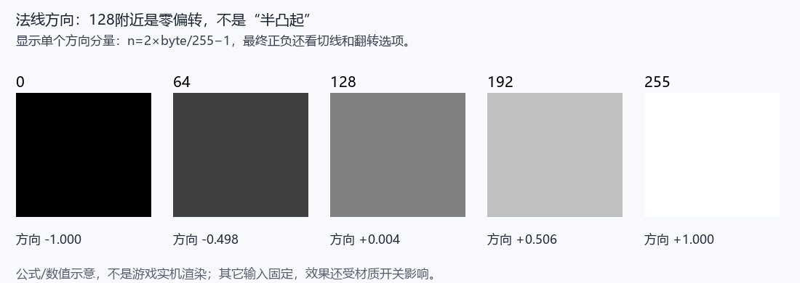

# 崩坏：星穹铁道：逐贴图通道图解与建议提示词

选好下面的贴图类型，就可以查看 RGBA 通道的作用、数值示例和建议提示词。每个分区都提供两种模板：**只有 DiffuseMap**，或 **DiffuseMap＋Blender 导出的 UV 分布图**，可用于 ChatGPT 等支持参考图的图像模型。

如果手边有模型，建议一起提供 UV 图：模型会更容易辨认 UV 岛、边界和细条，通常有助于对齐。只有 Diffuse 也可以尝试；请补充皮肤、布料、裸金属或发光区域的文字说明。

这里的提示词是可调整的参考模板，数字是练习预设，不是角色原始参数。图解是教学示意，不是 AI 实测结果。生成后仍需检查尺寸、UV 和通道数值；UV 图也不能代替材质参数、几何法线或 SDF 方向信息。

## 找到你要生成的贴图

- [DiffuseMap / 颜色图](#map-diffuse)
- [LightMap / 身体与头发](#map-lightmap)
- [EmissionTex / 独立发光](#map-emission)
- [FaceExpression / 表情图](#map-expression)
- [StockRangeTex / 丝袜控制](#map-stock)
- [AlphaTex / 自定义配色索引](#map-alphatex)
- [FaceMap / 脸部方向阴影图](#map-sdf)
- [Ramp / 漫反射色带](#map-ramp)
- [MatCap / 球面外观图](#map-matcap)
- [LUT / 精确布局与适用范围](#map-lut)
- [第二颜色贴图](#map-secondary-diffuse)
- [溶解图与RGBA溶解遮罩](#map-dissolve-map)
- [焦散图](#map-caustic)
- [描边颜色图](#map-outline-color)
- [RGBA换色遮罩](#map-hue-mask)
- [星空底色及RG遮罩](#map-sky-color)
- [星点RGBA与独立遮罩](#map-sky-star)
- [MatCap遮罩与CubeMap](#map-matcap-mask)
- [未消费的旋涡纹理槽](#map-unused-swirl)

## 准备参考图

- **单图方式：** 上传对应材质的 DiffuseMap 颜色贴图，再复制该分区的单图模板。
- **双图方式：** 第一张上传 DiffuseMap，第二张上传同一材质、同一 UV 层的 UV 分布图，再复制双图模板。两张图保持相同宽高、方向和 0～1 范围，不裁切、不镜像，也不要把 UV 线直接画进 Diffuse。
- **Blender 导出：** 选中目标网格，进入编辑模式并选中该材质对应的面；在 UV 编辑器中选择正确的 UV 层，使用 **UV → 导出 UV 布局（Export UV Layout）**。尺寸设为 Diffuse 的宽高，填充不透明度设为 0，导出 PNG。若没有该选项，可在 Blender 的扩展/插件设置中启用 UV Layout。多材质请分别导出；UDIM 请注明 tile 编号，不要拼成截图。
- 可以下载本页的[教学 Diffuse](./assets/reference-inputs/diffuse.png)与[教学 UV 图](./assets/reference-inputs/uv.png)了解输入形式。它们是通用衣片示意；脸部或头发贴图请换成自己的对应材质参考图，不要用衣服 UV 代替。
- 模板按文中预设开始练习。想调整材质时，可以改预设数值，并补充“哪些区域是什么材质”；UV 只提供边界，不提供材质标签。

## 通道阅读小提示

- 数据值用0～255；线性UNORM中除以255得到0～1。字节128约0.502，若RGB被sRGB解码则约0.216，不能对控制图做自动Gamma或美化。Alpha通常不经过sRGB转换，仍要核对加载路径。
- 灰度白只意味着数值大：乘子、反向遮罩、材质ID、方向数据的“白”含义不同。下面逐图解释，不用一条规则概括。
- 只上传Diffuse时，材质分类是猜测。裸金属、丝袜、发光区域最好在文字里指出；不明区域有保守默认值，但它不恢复原角色ID。
- 合成预览可能受Alpha显示影响；灰度A图是真正的第四通道。下载各层后用取色器看字节，不靠预览颜色判断。

## 1. DiffuseMap / 颜色图 {#map-diffuse}

先看输入的蓝色衣片：颜色图里它就该是蓝色，R/G/B是颜色分量。到了控制图，同一片蓝布可能变成红橙色，那不是改了衣服颜色，而是几个控制值叠在一起。



**教学示意：** 数字对应本节练习预设，图例不属于贴图数据。

[原始RGBA图](./assets/maps/diffuse/diffuse.png) · [R灰度层](./assets/maps/diffuse/diffuse-r.png) · [G灰度层](./assets/maps/diffuse/diffuse-g.png) · [B灰度层](./assets/maps/diffuse/diffuse-b.png) · [A灰度层](./assets/maps/diffuse/diffuse-a.png)

**R怎么用：** R是基础颜色红分量，0最低、255最高。

**G怎么用：** G是基础颜色绿分量，0最低、255最高。

**B怎么用：** B是基础颜色蓝分量，0最低、255最高。

**A怎么用：** A在主模式提供发光源，Emission模式2改用EmissionTex.R；还参与AlphaCutoff、透明输出及UseDifAlphaStencil选择。没有独立的Diffuse材质ID编码。

颜色分量不是金属、高光或AO；不要增加新的方向光、投影和高光。

**实际消费来源：** [固定版本逐通道读取](https://github.com/Hoyotoon/HoyoToon/blob/d9e5ca2f312bf16fba89dee67d32c08b482dcda4/Shaders/Honkai%20Star%20Rail/Includes/HoyoToonStarRail-program.hlsl#L526-L547)。“未消费”指所引实现正常渲染，不代表游戏全部版本。

### 建议提示词

有 UV 分布图时可选双图模板，更方便核对边界；单图模板同样可以作为起点。

::: tabs

== 只有 DiffuseMap



```text
请根据我上传的这一张崩坏：星穹铁道角色DiffuseMap颜色贴图，生成DiffuseMap / 颜色图的颜色贴图草稿。

生成图片必须与上传Diffuse的像素尺寸、UV岛位置、空白区域、缝线、扣件和所有细条完全对齐，不缩放、镜像、移动或重新排UV。

通道数值采用8位0～255，不做Gamma、自动对比度、美化或预乘Alpha。

完整通道规则：R是基础颜色红分量，0最低、255最高；
G是基础颜色绿分量，0最低、255最高；
B是基础颜色蓝分量，0最低、255最高；
A在主模式提供发光源，Emission模式2改用EmissionTex.R；还参与AlphaCutoff、透明输出及UseDifAlphaStencil选择。没有独立的Diffuse材质ID编码。

本次明确采用的生成预设：本次生成同UV、不透明Diffuse颜色草稿：R/G/B按我给出的新配色修改，未指定改色时保留上传图的RGB颜色；
A固定255，不猜透明、发光或材质ID。

不要把自然衣服颜色、RGB明暗或金色油漆直接当成金属、AO或高光值；
只修改我指定的配色，未指定处保留上传Diffuse的颜色和绘制细节。

输出只有目标贴图，不加文字、通道标签、图例、拼图、背景场景、3D渲染或光晕。

这是按给定预设生成的候选，不视为角色原始通道的还原；
不能输出真实Alpha时明确说明，不要以白底预览代替 RGBA 文件。
```

== DiffuseMap＋UV 分布图


```text
我上传了两张参考图：第一张是崩坏：星穹铁道角色 DiffuseMap 颜色贴图，第二张是 Blender 导出的同一材质 UV 分布图。请结合这两张参考图，生成DiffuseMap / 颜色图的颜色贴图草稿。

生成图片必须与上传Diffuse的像素尺寸、UV岛位置、空白区域、缝线、扣件和所有细条完全对齐，不缩放、镜像、移动或重新排UV。

通道数值采用8位0～255，不做Gamma、自动对比度、美化或预乘Alpha。

完整通道规则：R是基础颜色红分量，0最低、255最高；
G是基础颜色绿分量，0最低、255最高；
B是基础颜色蓝分量，0最低、255最高；
A在主模式提供发光源，Emission模式2改用EmissionTex.R；还参与AlphaCutoff、透明输出及UseDifAlphaStencil选择。没有独立的Diffuse材质ID编码。

本次明确采用的生成预设：本次生成同UV、不透明Diffuse颜色草稿：R/G/B按我给出的新配色修改，未指定改色时保留上传图的RGB颜色；
A固定255，不猜透明、发光或材质ID。

不要把自然衣服颜色、RGB明暗或金色油漆直接当成金属、AO或高光值；
只修改我指定的配色，未指定处保留上传Diffuse的颜色和绘制细节。

输出只有目标贴图，不加文字、通道标签、图例、拼图、背景场景、3D渲染或光晕。

这是按给定预设生成的候选，不视为角色原始通道的还原；
不能输出真实Alpha时明确说明，不要以白底预览代替 RGBA 文件。

以 Diffuse 的像素画布为基准，用 UV 分布图核对岛轮廓、细条、边界与空白区域。UV 线是参考标记，不得画入结果，也不作为 AO、缝线、法线或高光。

若两图尺寸、朝向或岛位置不一致，请先让我确认，不自行缩放或对齐。

UV 图没有材质标签或几何方向；
未确认区域仍按上述预设，不据 UV 线推断真实法线、SDF 或材质 ID。
```

:::


**拿到结果先看：** 尺寸、UV边界和每通道数值，并检查 Alpha、常量与阈值。模型输出有偏色或渐变时，用通道编辑器精确赋值，确认无误后再导出目标格式并测试。

## 2. LightMap / 身体与头发 {#map-lightmap}

先找图中的衣片和扣件，再分别看R/G/B/A。同一位置在不同通道里的灰度可以完全不同：一层选材质，一层管高光，一层管阴影。不要为了让合成预览“像原衣服”而把四层一起涂。



**教学示意：** 数字对应本节练习预设，图例不属于贴图数据。

[原始RGBA图](./assets/maps/lightmap/lightmap.png) · [R灰度层](./assets/maps/lightmap/lightmap-r.png) · [G灰度层](./assets/maps/lightmap/lightmap-g.png) · [B灰度层](./assets/maps/lightmap/lightmap-b.png) · [A灰度层](./assets/maps/lightmap/lightmap-a.png)

**R怎么用：** R乘边缘光：RimLightMode=1时0关闭该项、255完整；Mode=0不受R影响。

**G怎么用：** G增大提高Ramp受光坐标；原始min(1,4×半Lambert×G×顶点AO×投影阴影)，0在主pass仍有约0.15085下限。

**B怎么用：** B是普通高光阈值/范围，增大降低1−B门槛，羽化另由参数控制；0不保证严格无高光。

**A怎么用：** A为floor(8A)索引：0～31ID0、32～63ID1、64～95ID2、96～127ID3、128～159ID4、160～191ID5、192～223ID6、224～254ID7；255产生8不安全。

**固定源码证据：** LightMap主UV读取和原UV独立Alpha取样；[采样及消费1](https://github.com/Hoyotoon/HoyoToon/blob/d9e5ca2f312bf16fba89dee67d32c08b482dcda4/Shaders/Honkai%20Star%20Rail/Includes/HoyoToonStarRail-program.hlsl#L319-L330)。这是固定社区实现的依据，不宣称原游戏全版本通用。

### 建议提示词

有 UV 分布图时可选双图模板，更方便核对边界；单图模板同样可以作为起点。

::: tabs

== 只有 DiffuseMap


```text
请根据我上传的这一张崩坏：星穹铁道角色DiffuseMap颜色贴图，生成LightMap / 身体与头发的技术数据草稿。

生成图片必须与上传Diffuse的像素尺寸、UV岛位置、空白区域、缝线、扣件和所有细条完全对齐，不缩放、镜像、移动或重新排UV。

通道数值采用8位0～255，不做Gamma、自动对比度、美化或预乘Alpha。

完整通道规则：R乘边缘光：RimLightMode=1时0关闭该项、255完整；
Mode=0不受R影响；
G增大提高Ramp受光坐标；
原始min(1,4×半Lambert×G×顶点AO×投影阴影)，0在主pass仍有约0.15085下限；
B是普通高光阈值/范围，增大降低1−B门槛，羽化另由参数控制；
0不保证严格无高光；
A为floor(8A)索引：0～31ID0、32～63ID1、64～95ID2、96～127ID3、128～159ID4、160～191ID5、192～223ID6、224～254ID7；
255产生8不安全。

本次明确采用的生成预设：皮肤RGBA(180,128,30,16)、布料(150,128,20,48)、普通饰件(220,128,180,80)、未知(150,128,20,16)。ID是本次练习参数组，不能当角色原编号。

不要把自然衣服颜色、RGB明暗或金色油漆直接当成金属、AO或高光值；
只按我文字确认的材质区域分类，无法判断的区域使用上述未知默认值，没有默认时使用本次占位规则而不推断原游戏数据。

输出只有目标贴图，不加文字、通道标签、图例、拼图、背景场景、3D渲染或光晕。

这是按给定预设生成的候选，不视为角色原始通道的还原；
不能输出真实Alpha时明确说明，不要以白底预览代替 RGBA 文件。

除上面明确要求的连续阴影或灰度过渡外，每个确认材质区按预设定值填充；
材质ID禁止渐变，不要因为白布/黑布就另设控制值。背景和未识别区按本次默认编码，不自行补未给出的游戏规则。
```

== DiffuseMap＋UV 分布图


```text
我上传了两张参考图：第一张是崩坏：星穹铁道角色 DiffuseMap 颜色贴图，第二张是 Blender 导出的同一材质 UV 分布图。请结合这两张参考图，生成LightMap / 身体与头发的技术数据草稿。

生成图片必须与上传Diffuse的像素尺寸、UV岛位置、空白区域、缝线、扣件和所有细条完全对齐，不缩放、镜像、移动或重新排UV。

通道数值采用8位0～255，不做Gamma、自动对比度、美化或预乘Alpha。

完整通道规则：R乘边缘光：RimLightMode=1时0关闭该项、255完整；
Mode=0不受R影响；
G增大提高Ramp受光坐标；
原始min(1,4×半Lambert×G×顶点AO×投影阴影)，0在主pass仍有约0.15085下限；
B是普通高光阈值/范围，增大降低1−B门槛，羽化另由参数控制；
0不保证严格无高光；
A为floor(8A)索引：0～31ID0、32～63ID1、64～95ID2、96～127ID3、128～159ID4、160～191ID5、192～223ID6、224～254ID7；
255产生8不安全。

本次明确采用的生成预设：皮肤RGBA(180,128,30,16)、布料(150,128,20,48)、普通饰件(220,128,180,80)、未知(150,128,20,16)。ID是本次练习参数组，不能当角色原编号。

不要把自然衣服颜色、RGB明暗或金色油漆直接当成金属、AO或高光值；
只按我文字确认的材质区域分类，无法判断的区域使用上述未知默认值，没有默认时使用本次占位规则而不推断原游戏数据。

输出只有目标贴图，不加文字、通道标签、图例、拼图、背景场景、3D渲染或光晕。

这是按给定预设生成的候选，不视为角色原始通道的还原；
不能输出真实Alpha时明确说明，不要以白底预览代替 RGBA 文件。

除上面明确要求的连续阴影或灰度过渡外，每个确认材质区按预设定值填充；
材质ID禁止渐变，不要因为白布/黑布就另设控制值。背景和未识别区按本次默认编码，不自行补未给出的游戏规则。

以 Diffuse 的像素画布为基准，用 UV 分布图核对岛轮廓、细条、边界与空白区域。UV 线是参考标记，不得画入结果，也不作为 AO、缝线、法线或高光。

若两图尺寸、朝向或岛位置不一致，请先让我确认，不自行缩放或对齐。

UV 图没有材质标签或几何方向；
未确认区域仍按上述预设，不据 UV 线推断真实法线、SDF 或材质 ID。
```

:::


**拿到结果先看：** 尺寸、UV边界和每通道数值，并检查 Alpha、常量与阈值。模型输出有偏色或渐变时，用通道编辑器精确赋值，确认无误后再导出目标格式并测试。

## 3. EmissionTex / 独立发光 {#map-emission}

只有明确的灯带才属于发光区。白衣服、金属反光和蓝色装饰都不自动算发光；黑底表示这一项不贡献，不是在画黑色衣服。



**教学示意：** 数字对应本节练习预设，图例不属于贴图数据。

[原始RGBA图](./assets/maps/emission/emission.png) · [R灰度层](./assets/maps/emission/emission-r.png) · [G灰度层](./assets/maps/emission/emission-g.png) · [B灰度层](./assets/maps/emission/emission-b.png) · [A灰度层](./assets/maps/emission/emission-a.png)

**R怎么用：** R在独立模式作为源s，超过Threshold后重映射增强。

**G怎么用：** G在核心发光链未单独使用。

**B怎么用：** B在核心发光链未单独使用。

**A怎么用：** A作门控，要求s×A>Threshold，0可阻断、255允许正常比较。

**固定源码证据：** EmissionTex RGBA主采样及后续分支，保留对应版本合同；[采样及消费1](https://github.com/Hoyotoon/HoyoToon/blob/d9e5ca2f312bf16fba89dee67d32c08b482dcda4/Shaders/Honkai%20Star%20Rail/Includes/HoyoToonStarRail-program.hlsl#L319-L330)。这是固定社区实现的依据，不宣称原游戏全版本通用。

### 建议提示词

有 UV 分布图时可选双图模板，更方便核对边界；单图模板同样可以作为起点。

::: tabs

== 只有 DiffuseMap


```text
请根据我上传的这一张崩坏：星穹铁道角色DiffuseMap颜色贴图，生成EmissionTex / 独立发光的技术数据草稿。

生成图片必须与上传Diffuse的像素尺寸、UV岛位置、空白区域、缝线、扣件和所有细条完全对齐，不缩放、镜像、移动或重新排UV。

通道数值采用8位0～255，不做Gamma、自动对比度、美化或预乘Alpha。

完整通道规则：R在独立模式作为源s，超过Threshold后重映射增强；
G在核心发光链未单独使用；
B在核心发光链未单独使用；
A作门控，要求s×A>Threshold，0可阻断、255允许正常比较。

本次明确采用的生成预设：R只有用户明确指定的灯带255、其它0；
G=0、B=0、A=255。没有灯带说明时R全0；
不靠Diffuse颜色猜发光。

不要把自然衣服颜色、RGB明暗或金色油漆直接当成金属、AO或高光值；
只按我文字确认的材质区域分类，无法判断的区域使用上述未知默认值，没有默认时使用本次占位规则而不推断原游戏数据。

输出只有目标贴图，不加文字、通道标签、图例、拼图、背景场景、3D渲染或光晕。

这是按给定预设生成的候选，不视为角色原始通道的还原；
不能输出真实Alpha时明确说明，不要以白底预览代替 RGBA 文件。

除上面明确要求的连续阴影或灰度过渡外，每个确认材质区按预设定值填充；
材质ID禁止渐变，不要因为白布/黑布就另设控制值。背景和未识别区按本次默认编码，不自行补未给出的游戏规则。
```

== DiffuseMap＋UV 分布图


```text
我上传了两张参考图：第一张是崩坏：星穹铁道角色 DiffuseMap 颜色贴图，第二张是 Blender 导出的同一材质 UV 分布图。请结合这两张参考图，生成EmissionTex / 独立发光的技术数据草稿。

生成图片必须与上传Diffuse的像素尺寸、UV岛位置、空白区域、缝线、扣件和所有细条完全对齐，不缩放、镜像、移动或重新排UV。

通道数值采用8位0～255，不做Gamma、自动对比度、美化或预乘Alpha。

完整通道规则：R在独立模式作为源s，超过Threshold后重映射增强；
G在核心发光链未单独使用；
B在核心发光链未单独使用；
A作门控，要求s×A>Threshold，0可阻断、255允许正常比较。

本次明确采用的生成预设：R只有用户明确指定的灯带255、其它0；
G=0、B=0、A=255。没有灯带说明时R全0；
不靠Diffuse颜色猜发光。

不要把自然衣服颜色、RGB明暗或金色油漆直接当成金属、AO或高光值；
只按我文字确认的材质区域分类，无法判断的区域使用上述未知默认值，没有默认时使用本次占位规则而不推断原游戏数据。

输出只有目标贴图，不加文字、通道标签、图例、拼图、背景场景、3D渲染或光晕。

这是按给定预设生成的候选，不视为角色原始通道的还原；
不能输出真实Alpha时明确说明，不要以白底预览代替 RGBA 文件。

除上面明确要求的连续阴影或灰度过渡外，每个确认材质区按预设定值填充；
材质ID禁止渐变，不要因为白布/黑布就另设控制值。背景和未识别区按本次默认编码，不自行补未给出的游戏规则。

以 Diffuse 的像素画布为基准，用 UV 分布图核对岛轮廓、细条、边界与空白区域。UV 线是参考标记，不得画入结果，也不作为 AO、缝线、法线或高光。

若两图尺寸、朝向或岛位置不一致，请先让我确认，不自行缩放或对齐。

UV 图没有材质标签或几何方向；
未确认区域仍按上述预设，不据 UV 线推断真实法线、SDF 或材质 ID。
```

:::


**拿到结果先看：** 尺寸、UV边界和每通道数值，并检查 Alpha、常量与阈值。模型输出有偏色或渐变时，用通道编辑器精确赋值，确认无误后再导出目标格式并测试。

## 4. FaceExpression / 表情图 {#map-expression}

表情图不是在Diffuse上画腮红，而是存几层表情权重。特别留意Alpha的正反方向：有的实现255关闭这一层，0才最强。


**教学示意：** 数字对应本节练习预设，图例不属于贴图数据。

[原始RGBA图](./assets/maps/expression/expression.png) · [R灰度层](./assets/maps/expression/expression-r.png) · [G灰度层](./assets/maps/expression/expression-g.png) · [B灰度层](./assets/maps/expression/expression-b.png) · [A灰度层](./assets/maps/expression/expression-a.png)

**R怎么用：** R超过ExMapThreshold后才贡献脸颊色，越大通常贡献越多。

**G怎么用：** G乘害羞强度，0无贡献、增大靠近指定害羞色。

**B怎么用：** B乘表情阴影强度，0无贡献、增大靠近指定阴影色。

**A怎么用：** A在当前FaceExpression脸部颜色链未消费，只取RGB；不将A误写成表情第四层。

**实际消费来源：** [固定版本逐通道读取](https://github.com/Hoyotoon/HoyoToon/blob/d9e5ca2f312bf16fba89dee67d32c08b482dcda4/Shaders/Honkai%20Star%20Rail/Includes/HoyoToonStarRail-program.hlsl#L796-L813)。“未消费”指所引实现正常渲染，不代表游戏全部版本。

### 建议提示词

有 UV 分布图时可选双图模板，更方便核对边界；单图模板同样可以作为起点。

::: tabs

== 只有 DiffuseMap


```text
请根据我上传的这一张崩坏：星穹铁道角色DiffuseMap颜色贴图，生成FaceExpression / 表情图的技术数据草稿。

生成图片必须与上传Diffuse的像素尺寸、UV岛位置、空白区域、缝线、扣件和所有细条完全对齐，不缩放、镜像、移动或重新排UV。

通道数值采用8位0～255，不做Gamma、自动对比度、美化或预乘Alpha。

完整通道规则：R超过ExMapThreshold后才贡献脸颊色，越大通常贡献越多；
G乘害羞强度，0无贡献、增大靠近指定害羞色；
B乘表情阴影强度，0无贡献、增大靠近指定阴影色；
A在当前FaceExpression脸部颜色链未消费，只取RGB；不将A误写成表情第四层。

本次明确采用的生成预设：R=0、G=0、B=0、A=255作为无表情占位；
用户明确要求脸红时只在相应脸颊R画180，其余仍0。

不要把自然衣服颜色、RGB明暗或金色油漆直接当成金属、AO或高光值；
只按我文字确认的材质区域分类，无法判断的区域使用上述未知默认值，没有默认时使用本次占位规则而不推断原游戏数据。

输出只有目标贴图，不加文字、通道标签、图例、拼图、背景场景、3D渲染或光晕。

这是按给定预设生成的候选，不视为角色原始通道的还原；
不能输出真实Alpha时明确说明，不要以白底预览代替 RGBA 文件。
```

== DiffuseMap＋UV 分布图


```text
我上传了两张参考图：第一张是崩坏：星穹铁道角色 DiffuseMap 颜色贴图，第二张是 Blender 导出的同一材质 UV 分布图。请结合这两张参考图，生成FaceExpression / 表情图的技术数据草稿。

生成图片必须与上传Diffuse的像素尺寸、UV岛位置、空白区域、缝线、扣件和所有细条完全对齐，不缩放、镜像、移动或重新排UV。

通道数值采用8位0～255，不做Gamma、自动对比度、美化或预乘Alpha。

完整通道规则：R超过ExMapThreshold后才贡献脸颊色，越大通常贡献越多；
G乘害羞强度，0无贡献、增大靠近指定害羞色；
B乘表情阴影强度，0无贡献、增大靠近指定阴影色；
A在当前FaceExpression脸部颜色链未消费，只取RGB；不将A误写成表情第四层。

本次明确采用的生成预设：R=0、G=0、B=0、A=255作为无表情占位；
用户明确要求脸红时只在相应脸颊R画180，其余仍0。

不要把自然衣服颜色、RGB明暗或金色油漆直接当成金属、AO或高光值；
只按我文字确认的材质区域分类，无法判断的区域使用上述未知默认值，没有默认时使用本次占位规则而不推断原游戏数据。

输出只有目标贴图，不加文字、通道标签、图例、拼图、背景场景、3D渲染或光晕。

这是按给定预设生成的候选，不视为角色原始通道的还原；
不能输出真实Alpha时明确说明，不要以白底预览代替 RGBA 文件。

以 Diffuse 的像素画布为基准，用 UV 分布图核对岛轮廓、细条、边界与空白区域。UV 线是参考标记，不得画入结果，也不作为 AO、缝线、法线或高光。

若两图尺寸、朝向或岛位置不一致，请先让我确认，不自行缩放或对齐。

UV 图没有材质标签或几何方向；
未确认区域仍按上述预设，不据 UV 线推断真实法线、SDF 或材质 ID。
```

:::


**拿到结果先看：** 尺寸、UV边界和每通道数值，并检查 Alpha、常量与阈值。模型输出有偏色或渐变时，用通道编辑器精确赋值，确认无误后再导出目标格式并测试。

## 5. StockRangeTex / 丝袜控制 {#map-stock}

先找图中的衣片和扣件，再分别看R/G/B/A。同一位置在不同通道里的灰度可以完全不同：一层选材质，一层管高光，一层管阴影。不要为了让合成预览“像原衣服”而把四层一起涂。



**教学示意：** 数字对应本节练习预设，图例不属于贴图数据。

[原始RGBA图](./assets/maps/stock/stock.png) · [R灰度层](./assets/maps/stock/stock-r.png) · [G灰度层](./assets/maps/stock/stock-g.png) · [B灰度层](./assets/maps/stock/stock-b.png) · [A灰度层](./assets/maps/stock/stock-a.png)

**R怎么用：** R>0.001判作用区并作权重，0不作用、255最大纹理权重。

**G怎么用：** G参与丝袜高光细节权重，增大通常增强。

**B怎么用：** B在平铺UV采样，变成1+StockRoughness×(B/2−0.5)，255保留因子1、0降低，不是越白越粗糙。

**A怎么用：** A在当前丝袜运算未消费，只使用原UV的RG和ST平铺UV的B。

**实际消费来源：** [固定版本逐通道读取](https://github.com/Hoyotoon/HoyoToon/blob/d9e5ca2f312bf16fba89dee67d32c08b482dcda4/Shaders/Honkai%20Star%20Rail/Includes/HoyoToonStarRail-program.hlsl#L700-L733)。“未消费”指所引实现正常渲染，不代表游戏全部版本。

### 建议提示词

有 UV 分布图时可选双图模板，更方便核对边界；单图模板同样可以作为起点。

::: tabs

== 只有 DiffuseMap


```text
请根据我上传的这一张崩坏：星穹铁道角色DiffuseMap颜色贴图，生成StockRangeTex / 丝袜控制的技术数据草稿。

生成图片必须与上传Diffuse的像素尺寸、UV岛位置、空白区域、缝线、扣件和所有细条完全对齐，不缩放、镜像、移动或重新排UV。

通道数值采用8位0～255，不做Gamma、自动对比度、美化或预乘Alpha。

完整通道规则：R>0.001判作用区并作权重，0不作用、255最大纹理权重；
G参与丝袜高光细节权重，增大通常增强；
B在平铺UV采样，变成1+StockRoughness×(B/2−0.5)，255保留因子1、0降低，不是越白越粗糙；
A在当前丝袜运算未消费，只使用原UV的RG和ST平铺UV的B。

本次明确采用的生成预设：只在用户明确指出的丝袜区R=255，其它R=0；
G=128练习权重、B=255无平铺细节衰减、A=255占位。没有丝袜区域说明时R全0。

不要把自然衣服颜色、RGB明暗或金色油漆直接当成金属、AO或高光值；
只按我文字确认的材质区域分类，无法判断的区域使用上述未知默认值，没有默认时使用本次占位规则而不推断原游戏数据。

输出只有目标贴图，不加文字、通道标签、图例、拼图、背景场景、3D渲染或光晕。

这是按给定预设生成的候选，不视为角色原始通道的还原；
不能输出真实Alpha时明确说明，不要以白底预览代替 RGBA 文件。

除上面明确要求的连续阴影或灰度过渡外，每个确认材质区按预设定值填充；
材质ID禁止渐变，不要因为白布/黑布就另设控制值。背景和未识别区按本次默认编码，不自行补未给出的游戏规则。
```

== DiffuseMap＋UV 分布图


```text
我上传了两张参考图：第一张是崩坏：星穹铁道角色 DiffuseMap 颜色贴图，第二张是 Blender 导出的同一材质 UV 分布图。请结合这两张参考图，生成StockRangeTex / 丝袜控制的技术数据草稿。

生成图片必须与上传Diffuse的像素尺寸、UV岛位置、空白区域、缝线、扣件和所有细条完全对齐，不缩放、镜像、移动或重新排UV。

通道数值采用8位0～255，不做Gamma、自动对比度、美化或预乘Alpha。

完整通道规则：R>0.001判作用区并作权重，0不作用、255最大纹理权重；
G参与丝袜高光细节权重，增大通常增强；
B在平铺UV采样，变成1+StockRoughness×(B/2−0.5)，255保留因子1、0降低，不是越白越粗糙；
A在当前丝袜运算未消费，只使用原UV的RG和ST平铺UV的B。

本次明确采用的生成预设：只在用户明确指出的丝袜区R=255，其它R=0；
G=128练习权重、B=255无平铺细节衰减、A=255占位。没有丝袜区域说明时R全0。

不要把自然衣服颜色、RGB明暗或金色油漆直接当成金属、AO或高光值；
只按我文字确认的材质区域分类，无法判断的区域使用上述未知默认值，没有默认时使用本次占位规则而不推断原游戏数据。

输出只有目标贴图，不加文字、通道标签、图例、拼图、背景场景、3D渲染或光晕。

这是按给定预设生成的候选，不视为角色原始通道的还原；
不能输出真实Alpha时明确说明，不要以白底预览代替 RGBA 文件。

除上面明确要求的连续阴影或灰度过渡外，每个确认材质区按预设定值填充；
材质ID禁止渐变，不要因为白布/黑布就另设控制值。背景和未识别区按本次默认编码，不自行补未给出的游戏规则。

以 Diffuse 的像素画布为基准，用 UV 分布图核对岛轮廓、细条、边界与空白区域。UV 线是参考标记，不得画入结果，也不作为 AO、缝线、法线或高光。

若两图尺寸、朝向或岛位置不一致，请先让我确认，不自行缩放或对齐。

UV 图没有材质标签或几何方向；
未确认区域仍按上述预设，不据 UV 线推断真实法线、SDF 或材质 ID。
```

:::


**拿到结果先看：** 尺寸、UV边界和每通道数值，并检查 Alpha、常量与阈值。模型输出有偏色或渐变时，用通道编辑器精确赋值，确认无误后再导出目标格式并测试。

## 6. AlphaTex / 自定义配色索引 {#map-alphatex}

这张图是分类，不是照明。一个类别应保持在同一安全区间；画得很漂亮的渐变反而可能让像素跨到另一个材质组。



**教学示意：** 数字对应本节练习预设，图例不属于贴图数据。

[原始RGBA图](./assets/maps/alphatex/alphatex.png) · [R灰度层](./assets/maps/alphatex/alphatex-r.png) · [G灰度层](./assets/maps/alphatex/alphatex-g.png) · [B灰度层](./assets/maps/alphatex/alphatex-b.png) · [A灰度层](./assets/maps/alphatex/alphatex-a.png)

**R怎么用：** R按floor(8R)选配色，0～31skin、32～63第一对、之后每32切组；224～242第七对，243～255保留原色。

**G怎么用：** G在AlphaTex自定义颜色索引与描边索引路径未消费，仅取R。

**B怎么用：** B在AlphaTex自定义颜色索引与描边索引路径未消费，仅取R。

**A怎么用：** A在AlphaTex颜色索引与描边索引路径未消费，仅取R。

**实际消费来源：** [固定版本逐通道读取](https://github.com/Hoyotoon/HoyoToon/blob/d9e5ca2f312bf16fba89dee67d32c08b482dcda4/Shaders/Honkai%20Star%20Rail/Includes/HoyoToonStarRail-program.hlsl#L558-L563)。“未消费”指所引实现正常渲染，不代表游戏全部版本。

### 建议提示词

有 UV 分布图时可选双图模板，更方便核对边界；单图模板同样可以作为起点。

::: tabs

== 只有 DiffuseMap


```text
请根据我上传的这一张崩坏：星穹铁道角色DiffuseMap颜色贴图，生成AlphaTex / 自定义配色索引的技术数据草稿。

生成图片必须与上传Diffuse的像素尺寸、UV岛位置、空白区域、缝线、扣件和所有细条完全对齐，不缩放、镜像、移动或重新排UV。

通道数值采用8位0～255，不做Gamma、自动对比度、美化或预乘Alpha。

完整通道规则：R按floor(8R)选配色，0～31skin、32～63第一对、之后每32切组；
224～242第七对，243～255保留原色；
G在AlphaTex自定义颜色索引与描边索引路径未消费，仅取R；
B在AlphaTex自定义颜色索引与描边索引路径未消费，仅取R；
A在AlphaTex颜色索引与描边索引路径未消费，仅取R。

本次明确采用的生成预设：R=255保留原色的练习默认；
G=0、B=0、A=255占位。只有用户另给配色组时才用16/48/80等区间内部值。

不要把自然衣服颜色、RGB明暗或金色油漆直接当成金属、AO或高光值；
只按我文字确认的材质区域分类，无法判断的区域使用上述未知默认值，没有默认时使用本次占位规则而不推断原游戏数据。

输出只有目标贴图，不加文字、通道标签、图例、拼图、背景场景、3D渲染或光晕。

这是按给定预设生成的候选，不视为角色原始通道的还原；
不能输出真实Alpha时明确说明，不要以白底预览代替 RGBA 文件。

除上面明确要求的连续阴影或灰度过渡外，每个确认材质区按预设定值填充；
材质ID禁止渐变，不要因为白布/黑布就另设控制值。背景和未识别区按本次默认编码，不自行补未给出的游戏规则。
```

== DiffuseMap＋UV 分布图


```text
我上传了两张参考图：第一张是崩坏：星穹铁道角色 DiffuseMap 颜色贴图，第二张是 Blender 导出的同一材质 UV 分布图。请结合这两张参考图，生成AlphaTex / 自定义配色索引的技术数据草稿。

生成图片必须与上传Diffuse的像素尺寸、UV岛位置、空白区域、缝线、扣件和所有细条完全对齐，不缩放、镜像、移动或重新排UV。

通道数值采用8位0～255，不做Gamma、自动对比度、美化或预乘Alpha。

完整通道规则：R按floor(8R)选配色，0～31skin、32～63第一对、之后每32切组；
224～242第七对，243～255保留原色；
G在AlphaTex自定义颜色索引与描边索引路径未消费，仅取R；
B在AlphaTex自定义颜色索引与描边索引路径未消费，仅取R；
A在AlphaTex颜色索引与描边索引路径未消费，仅取R。

本次明确采用的生成预设：R=255保留原色的练习默认；
G=0、B=0、A=255占位。只有用户另给配色组时才用16/48/80等区间内部值。

不要把自然衣服颜色、RGB明暗或金色油漆直接当成金属、AO或高光值；
只按我文字确认的材质区域分类，无法判断的区域使用上述未知默认值，没有默认时使用本次占位规则而不推断原游戏数据。

输出只有目标贴图，不加文字、通道标签、图例、拼图、背景场景、3D渲染或光晕。

这是按给定预设生成的候选，不视为角色原始通道的还原；
不能输出真实Alpha时明确说明，不要以白底预览代替 RGBA 文件。

除上面明确要求的连续阴影或灰度过渡外，每个确认材质区按预设定值填充；
材质ID禁止渐变，不要因为白布/黑布就另设控制值。背景和未识别区按本次默认编码，不自行补未给出的游戏规则。

以 Diffuse 的像素画布为基准，用 UV 分布图核对岛轮廓、细条、边界与空白区域。UV 线是参考标记，不得画入结果，也不作为 AO、缝线、法线或高光。

若两图尺寸、朝向或岛位置不一致，请先让我确认，不自行缩放或对齐。

UV 图没有材质标签或几何方向；
未确认区域仍按上述预设，不据 UV 线推断真实法线、SDF 或材质 ID。
```

:::


**拿到结果先看：** 尺寸、UV边界和每通道数值，并检查 Alpha、常量与阈值。模型输出有偏色或渐变时，用通道编辑器精确赋值，确认无误后再导出目标格式并测试。

## 7. FaceMap / 脸部方向阴影图 {#map-sdf}

这张示意图展示常量占位，用来认识通道，并不具备正确的脸部方向阴影。颜色图没有告诉我们每个脸部像素在哪个光向开始转暗；正确方向场需要额外设计或几何信息。



**常量占位示意：** 用于认识通道，不具备正确的脸部方向阴影。

[原始RGBA图](./assets/maps/sdf/sdf.png) · [R灰度层](./assets/maps/sdf/sdf-r.png) · [G灰度层](./assets/maps/sdf/sdf-g.png) · [B灰度层](./assets/maps/sdf/sdf-b.png) · [A灰度层](./assets/maps/sdf/sdf-a.png)

**R怎么用：** R眼发光仅0.45<R<0.55即115～140，0/255不在区间。

**G怎么用：** G自阴影pass减掉该遮罩再clip，增大更易丢弃该pass，不外推全pass。

**B怎么用：** B鼻高光比较B×视角项>0.1，0～25无法通过，26起还看视角。

**A怎么用：** A方向阈值场，固定光向增大更偏亮面，镜像读取。

只上传Diffuse无法唯一确定方向场。下面建议模板仅生成标明用途的占位草稿，不是正确SDF生成配方；要重建必须增加几何/光向设计信息。

**固定源码证据：** FaceMap.A的镜像UV方向阴影；[采样及消费1](https://github.com/Hoyotoon/HoyoToon/blob/d9e5ca2f312bf16fba89dee67d32c08b482dcda4/Shaders/Honkai%20Star%20Rail/Includes/HoyoToonStarRail-common.hlsl#L115-L145)。这是固定社区实现的依据，不宣称原游戏全版本通用。

### 建议提示词（占位练习）

有 UV 分布图时可选双图模板，更方便核对边界；单图模板同样可以作为起点。

::: tabs

== 只有 DiffuseMap


```text
请根据我上传的这一张崩坏：星穹铁道角色DiffuseMap颜色贴图，生成FaceMap / 脸部方向阴影图的占位草稿。

生成图片必须与上传Diffuse的像素尺寸、UV岛位置、空白区域、缝线、扣件和所有细条完全对齐，不缩放、镜像、移动或重新排UV。

通道数值采用8位0～255，不做Gamma、自动对比度、美化或预乘Alpha。

完整通道规则：R眼发光仅0.45<R<0.55即115～140，0/255不在区间；
G自阴影pass减掉该遮罩再clip，增大更易丢弃该pass，不外推全pass；
B鼻高光比较B×视角项>0.1，0～25无法通过，26起还看视角；
A方向阈值场，固定光向增大更偏亮面，镜像读取。

本次明确采用的生成预设：只做不能用于角色还原的方向场占位：R=0、G=0、B=0、A=128。A全128没有方向梯度，不声称有正确随光阴影。

不要把自然衣服颜色、RGB明暗或金色油漆直接当成金属、AO或高光值；
只按我文字确认的材质区域分类，无法判断的区域使用上述未知默认值，没有默认时使用本次占位规则而不推断原游戏数据。

输出只有目标贴图，不加文字、通道标签、图例、拼图、背景场景、3D渲染或光晕。

这是按给定预设生成的候选，不视为角色原始通道的还原；
不能输出真实Alpha时明确说明，不要以白底预览代替 RGBA 文件。
```

== DiffuseMap＋UV 分布图


```text
我上传了两张参考图：第一张是崩坏：星穹铁道角色 DiffuseMap 颜色贴图，第二张是 Blender 导出的同一材质 UV 分布图。请结合这两张参考图，生成FaceMap / 脸部方向阴影图的占位草稿。

生成图片必须与上传Diffuse的像素尺寸、UV岛位置、空白区域、缝线、扣件和所有细条完全对齐，不缩放、镜像、移动或重新排UV。

通道数值采用8位0～255，不做Gamma、自动对比度、美化或预乘Alpha。

完整通道规则：R眼发光仅0.45<R<0.55即115～140，0/255不在区间；
G自阴影pass减掉该遮罩再clip，增大更易丢弃该pass，不外推全pass；
B鼻高光比较B×视角项>0.1，0～25无法通过，26起还看视角；
A方向阈值场，固定光向增大更偏亮面，镜像读取。

本次明确采用的生成预设：只做不能用于角色还原的方向场占位：R=0、G=0、B=0、A=128。A全128没有方向梯度，不声称有正确随光阴影。

不要把自然衣服颜色、RGB明暗或金色油漆直接当成金属、AO或高光值；
只按我文字确认的材质区域分类，无法判断的区域使用上述未知默认值，没有默认时使用本次占位规则而不推断原游戏数据。

输出只有目标贴图，不加文字、通道标签、图例、拼图、背景场景、3D渲染或光晕。

这是按给定预设生成的候选，不视为角色原始通道的还原；
不能输出真实Alpha时明确说明，不要以白底预览代替 RGBA 文件。

以 Diffuse 的像素画布为基准，用 UV 分布图核对岛轮廓、细条、边界与空白区域。UV 线是参考标记，不得画入结果，也不作为 AO、缝线、法线或高光。

若两图尺寸、朝向或岛位置不一致，请先让我确认，不自行缩放或对齐。

UV 图没有材质标签或几何方向；
未确认区域仍按上述预设，不据 UV 线推断真实法线、SDF 或材质 ID。
```

:::


**拿到结果先看：** 尺寸、UV边界和每通道数值，并检查 Alpha、常量与阈值。模型输出有偏色或渐变时，用通道编辑器精确赋值，确认无误后再导出目标格式并测试。

## 8. Ramp / 漫反射色带 {#map-ramp}

看横向色带：它按受光坐标查颜色，不是按衣服UV读。四通道图里白色Alpha可能只是占位，也可能控制混合，要看这一种表的定义。


**教学示意：** 数字对应本节练习预设，图例不属于贴图数据。

[原始RGBA图](./assets/maps/ramp/ramp.png) · [R灰度层](./assets/maps/ramp/ramp-r.png) · [G灰度层](./assets/maps/ramp/ramp-g.png) · [B灰度层](./assets/maps/ramp/ramp-b.png) · [A灰度层](./assets/maps/ramp/ramp-a.png)

**R怎么用：** R是查表颜色红分量，值增大增加所采样红贡献。

**G怎么用：** G是查表颜色绿分量，值增大增加所采样绿贡献。

**B怎么用：** B是查表颜色蓝分量，值增大增加所采样蓝贡献。

**A怎么用：** A在DiffuseRampMultiTex／DiffuseCoolRampMultiTex采样中未消费，只取RGB；保留原值兼容其他实现。

这是查表坐标图，不使用衣服UV；Diffuse只提供配色/风格线索，不能推回原查表参数。

**明确坐标与两张色带：** `material_ID=floor(8*LightMap.a)`，`v=(2*ID+1)/16`，u来自shadow_rate；ID0…7对应八行的中点。颜色LUT是另一类型，不能互换。该版本虽然同时读取暖色DiffuseRampMultiTex和冷色DiffuseCoolRampMultiTex，却以 `lerp(warm,cool,0)` 固定选择暖色，因此冷色表在这个主阴影输出中未生效。颜色通道都是RGB分量，Alpha不消费。[坐标、两张样本及固定混合](https://github.com/Hoyotoon/HoyoToon/blob/d9e5ca2f312bf16fba89dee67d32c08b482dcda4/Shaders/Honkai%20Star%20Rail/Includes/HoyoToonStarRail-program.hlsl#L567-L583)。下方“每行相同”的预设仅是教学草稿，实际成品应按八材质行分别设计。

### 建议提示词

这类图不沿服装 UV 排列，双图模板也保持指定的查表/平铺结构。

::: tabs

== 只有 DiffuseMap


```text
请根据我上传的这一张崩坏：星穹铁道角色DiffuseMap颜色贴图，生成Ramp / 漫反射色带的技术数据草稿。

这是查表或平铺纹理，不是衣服UV图，按下面指定尺寸和坐标结构输出，不把衣服轮廓放进图里。

通道数值采用8位0～255，不做Gamma、自动对比度、美化或预乘Alpha。

完整通道规则：R是查表颜色红分量，值增大增加所采样红贡献；
G是查表颜色绿分量，值增大增加所采样绿贡献；
B是查表颜色蓝分量，值增大增加所采样蓝贡献；
A在DiffuseRampMultiTex／DiffuseCoolRampMultiTex采样中未消费，只取RGB；保留原值兼容其他实现。

本次明确采用的生成预设：256×16练习色带，8个区每区两行且成对相同；
每行左RGB(45,50,65)、中(150,160,180)、右(255,255,255)，A255；
不声称复原冷暖Ramp。

不要把自然衣服颜色、RGB明暗或金色油漆直接当成金属、AO或高光值；
只按我文字确认的材质区域分类，无法判断的区域使用上述未知默认值，没有默认时使用本次占位规则而不推断原游戏数据。

输出只有目标贴图，不加文字、通道标签、图例、拼图、背景场景、3D渲染或光晕。

这是按给定预设生成的候选，不视为角色原始通道的还原；
不能输出真实Alpha时明确说明，不要以白底预览代替 RGBA 文件。
```

== DiffuseMap＋UV 分布图


```text
我上传了两张参考图：第一张是崩坏：星穹铁道角色 DiffuseMap 颜色贴图，第二张是 Blender 导出的同一材质 UV 分布图。请结合这两张参考图，生成Ramp / 漫反射色带的技术数据草稿。

这是查表或平铺纹理，不是衣服UV图，按下面指定尺寸和坐标结构输出，不把衣服轮廓放进图里。

通道数值采用8位0～255，不做Gamma、自动对比度、美化或预乘Alpha。

完整通道规则：R是查表颜色红分量，值增大增加所采样红贡献；
G是查表颜色绿分量，值增大增加所采样绿贡献；
B是查表颜色蓝分量，值增大增加所采样蓝贡献；
A在DiffuseRampMultiTex／DiffuseCoolRampMultiTex采样中未消费，只取RGB；保留原值兼容其他实现。

本次明确采用的生成预设：256×16练习色带，8个区每区两行且成对相同；
每行左RGB(45,50,65)、中(150,160,180)、右(255,255,255)，A255；
不声称复原冷暖Ramp。

不要把自然衣服颜色、RGB明暗或金色油漆直接当成金属、AO或高光值；
只按我文字确认的材质区域分类，无法判断的区域使用上述未知默认值，没有默认时使用本次占位规则而不推断原游戏数据。

输出只有目标贴图，不加文字、通道标签、图例、拼图、背景场景、3D渲染或光晕。

这是按给定预设生成的候选，不视为角色原始通道的还原；
不能输出真实Alpha时明确说明，不要以白底预览代替 RGBA 文件。

UV 图仅作为材质关联参考，不作为输出布局；
查表、球面或平铺图仍严格按上面的尺寸与坐标结构生成。
```

:::


**拿到结果先看：** 尺寸、查表/平铺布局和边缘连续性；再按上面的规则检查Alpha、常量与阈值。模型输出有偏色或渐变时，用通道编辑器精确赋值，确认无误后再导出目标格式并测试。

## 9. MatCap / 球面外观图 {#map-matcap}

这里看的是球面查表外观，不是扣件在UV中的位置。转视角时材质去球面图取样；直接把服装图变成橙色不可能得到正确MatCap。


**教学示意：** 数字对应本节练习预设，图例不属于贴图数据。

[原始RGBA图](./assets/maps/matcap/matcap.png) · [R灰度层](./assets/maps/matcap/matcap-r.png) · [G灰度层](./assets/maps/matcap/matcap-g.png) · [B灰度层](./assets/maps/matcap/matcap-b.png) · [A灰度层](./assets/maps/matcap/matcap-a.png)

**R怎么用：** R为MatCap颜色红分量，乘MatCapColor、高光颜色、区域遮罩和强度后参与替换或相加。

**G怎么用：** G为MatCap颜色绿分量，同样受遮罩与颜色属性调制，不是粗糙度。

**B怎么用：** B为MatCap颜色蓝分量，同样受遮罩与颜色属性调制，不是AO。

**A怎么用：** A在这个matcap_color函数的最终RGB运算中未消费；混合遮罩来自独立MatCapMaskTex.R及LightMap.B，不来自MatCap.A。

这是查表坐标图，不使用衣服UV；Diffuse只提供配色/风格线索，不能推回原查表参数。

**坐标与绑定：** [matcap_color](https://github.com/Hoyotoon/HoyoToon/blob/d9e5ca2f312bf16fba89dee67d32c08b482dcda4/Shaders/Honkai%20Star%20Rail/Includes/HoyoToonStarRail-common.hlsl#L734-L762)。启用UseCubeMap时改采CubeMap反射方向；这是立方体纹理，不是二维MatCap改名。OnlyMask控制是否再乘LightMap.B。独立mask.R×LightMap.B大于0.01才通过ceil门控，Alpha不承担此门控。

### 建议提示词

这类图不沿服装 UV 排列，双图模板也保持指定的查表/平铺结构。

::: tabs

== 只有 DiffuseMap


```text
请根据我上传的这一张崩坏：星穹铁道角色DiffuseMap颜色贴图，生成MatCap / 球面外观图的技术数据草稿。

这是查表或平铺纹理，不是衣服UV图，按下面指定尺寸和坐标结构输出，不把衣服轮廓放进图里。

通道数值采用8位0～255，不做Gamma、自动对比度、美化或预乘Alpha。

完整通道规则：R为MatCap颜色红分量，乘MatCapColor、高光颜色、区域遮罩和强度后参与替换或相加；
G为MatCap颜色绿分量，同样受遮罩与颜色属性调制，不是粗糙度；
B为MatCap颜色蓝分量，同样受遮罩与颜色属性调制，不是AO；
A在这个matcap_color函数的最终RGB运算中未消费；混合遮罩来自独立MatCapMaskTex.R及LightMap.B，不来自MatCap.A。

本次明确采用的生成预设：256×256球面练习图，中心RGB(220,220,220)、边缘(40,40,40)，平滑球面高光，无背景物体；
A255，仅用户确认该MatCap路径后试用。

不要把自然衣服颜色、RGB明暗或金色油漆直接当成金属、AO或高光值；
只按我文字确认的材质区域分类，无法判断的区域使用上述未知默认值，没有默认时使用本次占位规则而不推断原游戏数据。

输出只有目标贴图，不加文字、通道标签、图例、拼图、背景场景、3D渲染或光晕。

这是按给定预设生成的候选，不视为角色原始通道的还原；
不能输出真实Alpha时明确说明，不要以白底预览代替 RGBA 文件。
```

== DiffuseMap＋UV 分布图


```text
我上传了两张参考图：第一张是崩坏：星穹铁道角色 DiffuseMap 颜色贴图，第二张是 Blender 导出的同一材质 UV 分布图。请结合这两张参考图，生成MatCap / 球面外观图的技术数据草稿。

这是查表或平铺纹理，不是衣服UV图，按下面指定尺寸和坐标结构输出，不把衣服轮廓放进图里。

通道数值采用8位0～255，不做Gamma、自动对比度、美化或预乘Alpha。

完整通道规则：R为MatCap颜色红分量，乘MatCapColor、高光颜色、区域遮罩和强度后参与替换或相加；
G为MatCap颜色绿分量，同样受遮罩与颜色属性调制，不是粗糙度；
B为MatCap颜色蓝分量，同样受遮罩与颜色属性调制，不是AO；
A在这个matcap_color函数的最终RGB运算中未消费；混合遮罩来自独立MatCapMaskTex.R及LightMap.B，不来自MatCap.A。

本次明确采用的生成预设：256×256球面练习图，中心RGB(220,220,220)、边缘(40,40,40)，平滑球面高光，无背景物体；
A255，仅用户确认该MatCap路径后试用。

不要把自然衣服颜色、RGB明暗或金色油漆直接当成金属、AO或高光值；
只按我文字确认的材质区域分类，无法判断的区域使用上述未知默认值，没有默认时使用本次占位规则而不推断原游戏数据。

输出只有目标贴图，不加文字、通道标签、图例、拼图、背景场景、3D渲染或光晕。

这是按给定预设生成的候选，不视为角色原始通道的还原；
不能输出真实Alpha时明确说明，不要以白底预览代替 RGBA 文件。

UV 图仅作为材质关联参考，不作为输出布局；
查表、球面或平铺图仍严格按上面的尺寸与坐标结构生成。
```

:::


**拿到结果先看：** 尺寸、查表/平铺布局和边缘连续性；再按上面的规则检查Alpha、常量与阈值。模型输出有偏色或渐变时，用通道编辑器精确赋值，确认无误后再导出目标格式并测试。

## 10. LUT：材质参数表与颜色分级表 {#map-lut}

### MaterialValuesPackLUT：逐行 RGBA 定义

这张表和颜色 LUT 完全不同。`x=material_ID=floor(8*LightMap.a)`，`y=0…7`；代码使用 `Load(x,y,0)`，**整数像素读取，无双线性混合**。有效材质列 0…7；A=255 会产生 ID=8，必须核对表宽和原材质，不要盲目把 LightMap A 涂满白。下表的行号是着色器纹理坐标，不是图片查看器必然一致的上下方向。

| y 行 | R | G | B | A | 实际使用及数值方向 |
| --- | --- | --- | --- | --- | --- |
| 0 | 高光颜色红 | 高光颜色绿 | 高光颜色蓝 | 常规高光函数不消费 | RGB 乘全局高光色；不是金属 ID |
| 1 | shininess 指数 | 高光阈值平滑半宽 roughness | 高光强度 | 不消费 | 当前复刻取 RGB×(10,2,2)；R 增大使正向 N·H 峰更尖，G 扩大阈值平滑区，B 增强此项 |
| 2 | 描边颜色红 | 描边颜色绿 | 描边颜色蓝 | 读取float4但最终描边A强制1 | 描边 pass 按材质 ID 读取；颜色值不是描边宽度 |
| 3 | rim 颜色红（作者命名） | rim 颜色绿 | rim 颜色蓝 | 已读取但未接入常规边缘光 | 此版本只 Load／debug，实际 rim 颜色仍来自材质属性，修改该行不会改变常规 rim |
| 4 | rim 类型 | rim 边缘柔和参数 | rim 暗部参数 | 不消费 | `.yxz` 写入 rim 参数的 softness/type/dark；此复刻R直接用于减边缘光／加边缘光的lerp，0为减光侧、1为加光侧；原材质类型值须按版本确认 |
| 5 | rim-shadow 红 | rim-shadow 绿 | rim-shadow 蓝 | 后续只取 RGB | 计算 RGB×2−1；低于0.5产生减色侧，大于0.5增色侧；受全局颜色／强度调制 |
| 6 | rim-shadow width（作者命名） | rim-shadow feather（作者命名） | Bloom 强度 | 不消费 | 此版本 R/G 未接进阴影宽度数组，仅 B 实际作为 bloom_intensity；不要凭注释声称 R/G 已生效 |
| 7 | Bloom 颜色红 | Bloom 颜色绿 | Bloom 颜色蓝 | increase_bloom 不消费 | RGB与第6行B形成outRGB×(1+RGB*强度)，此函数不是独立模糊Bloom pass，也不是衣服自发光区域遮罩 |

“未消费”指这份固定实现的正常渲染，调试可以显示所有四通道，并不证明原游戏同样忽略。表内值可能依赖浮点／HDR 格式；不能擅自量化为8位、Gamma校正或套用默认填255。作者也明确说第1行倍率是复刻修正，并非原游戏精确代码。

**证据：** [八行 Load 定义](https://github.com/Hoyotoon/HoyoToon/blob/d9e5ca2f312bf16fba89dee67d32c08b482dcda4/Shaders/Honkai%20Star%20Rail/Includes/HoyoToonStarRail-program.hlsl#L360-L377)、[rim 参数接入](https://github.com/Hoyotoon/HoyoToon/blob/d9e5ca2f312bf16fba89dee67d32c08b482dcda4/Shaders/Honkai%20Star%20Rail/Includes/HoyoToonStarRail-program.hlsl#L432-L460)、[高光倍率](https://github.com/Hoyotoon/HoyoToon/blob/d9e5ca2f312bf16fba89dee67d32c08b482dcda4/Shaders/Honkai%20Star%20Rail/Includes/HoyoToonStarRail-program.hlsl#L680-L683)、[rim-shadow 与 Bloom](https://github.com/Hoyotoon/HoyoToon/blob/d9e5ca2f312bf16fba89dee67d32c08b482dcda4/Shaders/Honkai%20Star%20Rail/Includes/HoyoToonStarRail-program.hlsl#L755-L835)、[描边读取](https://github.com/Hoyotoon/HoyoToon/blob/d9e5ca2f312bf16fba89dee67d32c08b482dcda4/Shaders/Honkai%20Star%20Rail/Includes/HoyoToonStarRail-program.hlsl#L1191)。

### _Lut2DTex：颜色分级

这里的 LUT 是**颜色变换表**，不是服装 UV 图，也不是金属度／粗糙度／AO 的四通道打包。输入颜色决定取样坐标；像素 RGB 存取样后输出的颜色。

**R怎么用：** R 存输出颜色的红分量；提高某个表格像素的 R，只改变落在该颜色区间的红色输出，不是增加材质金属度。

**G怎么用：** G 存输出颜色的绿分量；不是粗糙度，也不是受光遮罩。

**B怎么用：** B 存输出颜色的蓝分量；不是 AO、法线 Z 或材质编号。

**A怎么用：** 以下固定版本的颜色 LUT 采样只取 `.rgb`，A 不进入颜色变换。保留原 Alpha 便于兼容其他工具；在这一已核对路径中新建 A=255 不会改变 RGB 结果。这不适用于材质参数 LUT。

### 输入编码和切片坐标

先把输入颜色按 **B、R、G** 重排，逐分量算：

```text
q = clamp(log2(color.brg * 5.55555582 + 0.0479959995)
          * 0.0734997839 + 0.386036009, 0, 1)
p = q * (N-1)
s = floor(p.x)
u0 = s/N + p.y/(N*N) + 0.5/(N*N)
v  = p.z/N + 0.5/N
u1 = u0 + 1/N
outputRGB = lerp(LUT(u0,v).rgb, LUT(u1,v).rgb, frac(p.x))
```

`N=32` 时对应 32 个水平切片，每片 32×32，整体 1024×32。**B 控制切片编号，R 控制片内横坐标，G 控制片内纵坐标**；此处 B/R/G 指经过上式编码的输入分量，不是纹理输出通道。实际函数用材质中的 `_Lut2DTexParam.xy` 代替上式精确倒数，默认近似 `(0.00098,0.03125,31,0)`，应保留目标材质参数。采样使用线性 Clamp，在两片之间插值；不能按材质 ID 列去画这个表。

数值经加载器解码后再取样，不能把纹理字节和输出线性颜色直接等同。需要确认 sRGB 导入设置和最终显示变换；这张表也不是“原始颜色输入＝输出”的普通 RGB 恒等渐变。

**证据：** [颜色 LUT 算法](https://github.com/Hoyotoon/HoyoToon/blob/d9e5ca2f312bf16fba89dee67d32c08b482dcda4/Shaders/Honkai%20Star%20Rail/Includes/HoyoToonStarRail-common.hlsl#L844-L875)。

### 如何制作或修改

Diffuse 和 UV 不决定完整的颜色变换：请提供原 LUT、目标调色及目标着色器。用脚本／颜色查表工具按上述坐标生成，或对原表逐像素修改 RGB；不要让图像模型画衣服形状、自动改对比度或跨切片涂抹。先测试黑、白、灰、红、绿、蓝和高亮输入，再比较启用／关闭 LUT 的渲染。这个步骤需要准确数值文件，不提供声称能从一张 Diffuse 还原原表的 AI 提示词。

## 11. SecondaryDiff / 第二颜色贴图 {#map-secondary-diffuse}

**R怎么用：** 第二颜色的红分量，`diffuse=lerp(MainTex,SecondaryDiff,SecondaryFade)`逐通道混合。

**G怎么用：** 第二颜色的绿分量，同样按Fade混合。

**B怎么用：** 第二颜色的蓝分量，同样按Fade混合；不是AO。

**A怎么用：** 同一float4插值也混Alpha，之后进入Diffuse Alpha的发光／透明分支。不能只把RGB拷贝而默认第二图A无用。

编译second_diffuse、UseSecondaryTex开启后读取；SecondaryUV%3选择uv0、uv1或第三组UV。该采样未乘SecondaryDiff_ST，不应假设导入器ST在此生效。Fade=0保留Main，1完整选第二图。证据：[RGBA和UV选择](https://github.com/Hoyotoon/HoyoToon/blob/d9e5ca2f312bf16fba89dee67d32c08b482dcda4/Shaders/Honkai%20Star%20Rail/Includes/HoyoToonStarRail-program.hlsl#L331-L340)。

## 12. DissolveMap / RG扰动与B溶解场 {#map-dissolve-map}

**R怎么用：** 第一遍采样的R（减0.5）乘负DistortionIntensity，作为第二遍采样U的扰动；0.5中性，增大R通常使U向负方向移动，最终可见性取决于B场而不是R强弱。

**G怎么用：** 第一遍G同理扰动V，0.5中性；不是粗糙度。

**B怎么用：** 第二遍读B+DissolveMapAdd作为溶解场，乘方向遮罩、DissolveMask点积和位置遮罩形成裁剪／边缘输入，也乘Diffuse形成溶解边缘底色。其他乘子非负时提高B更偏保留，不是白消失。

**A怎么用：** 这些溶解函数不读取DissolveMap.A。

两遍各自使用DissolveUVSpeed.zw／xy滚动与不同dis_uv；Repeat采样，不是固定衣服UV图。裁剪分支用 `max(floor(field*1.01−0.01−rate+1),0)`，为0丢弃；InvertRate将rate改为1−rate。UseDirection分支直接按世界位置方向discard，绕过纹理场。**颜色函数另有实现差异：float2 dissolveMap后仅覆盖x为第二遍B值，y仍保留扰动V，而后续float2乘法赋给float取首分量；以裁剪函数和颜色函数分别核对，不能凭名字认为RGBA四层同用。** 证据：[裁剪两遍采样](https://github.com/Hoyotoon/HoyoToon/blob/d9e5ca2f312bf16fba89dee67d32c08b482dcda4/Shaders/Honkai%20Star%20Rail/Includes/HoyoToonStarRail-common.hlsl#L338-L382)、[颜色及边缘](https://github.com/Hoyotoon/HoyoToon/blob/d9e5ca2f312bf16fba89dee67d32c08b482dcda4/Shaders/Honkai%20Star%20Rail/Includes/HoyoToonStarRail-common.hlsl#L385-L454)。

## 13. DissolveMask / RGBA可加权溶解遮罩 {#map-dissolve-mask}

**R怎么用：** 权重为DissolveComponent.x；点积贡献R*x。该权重为0时R不参与，正值时增大R增大场，负值时方向反转。

**G怎么用：** 权重为DissolveComponent.y，规则同R；不是固定第二个AO。

**B怎么用：** 权重为DissolveComponent.z，规则同R。

**A怎么用：** 权重为DissolveComponent.w，是真正可被点积使用的第四遮罩，不是输出透明度。

函数以模型uv读取完整float4，再算 `dot(mask,DissolveComponent)`，所以必须记录四个材质权重。使用(1,0,0,0)才是只取R；全权重1会累加超过1，不是自动平均。不能统一设置A255或四层白。证据：[点积与场乘法](https://github.com/Hoyotoon/HoyoToon/blob/d9e5ca2f312bf16fba89dee67d32c08b482dcda4/Shaders/Honkai%20Star%20Rail/Includes/HoyoToonStarRail-common.hlsl#L364-L380)、[颜色路径点积](https://github.com/Hoyotoon/HoyoToon/blob/d9e5ca2f312bf16fba89dee67d32c08b482dcda4/Shaders/Honkai%20Star%20Rail/Includes/HoyoToonStarRail-common.hlsl#L413-L419)。

## 14. CausTexture / 焦散灰度图 {#map-caustic}

**R怎么用：** 唯一读取的焦散响应；用两组滚动UV采R，逐分量min、pow(CausExp)，再乘CausColor与CausInt相加。正指数／正强度时增大R通常增强此项，任一组低值会限制min结果。

**G怎么用：** 不读取图G；EnableSplit产生的输出绿色也是偏移UV采R，不是采图G。

**B怎么用：** 不读取图B；分色输出蓝色同样来自不同坐标采R。

**A怎么用：** 此焦散链未读取A。

CausUV选择模型uv或世界投影 `(world.x+world.z,world.y)`；两组STA／STB和速度独立，RGB分色通过CausSplit偏移。不能把彩色贴图的RGB当三束焦散输入，也不能按Diffuse岛布局替换世界投影图。证据：[两组R采样与分色](https://github.com/Hoyotoon/HoyoToon/blob/d9e5ca2f312bf16fba89dee67d32c08b482dcda4/Shaders/Honkai%20Star%20Rail/Includes/HoyoToonStarRail-program.hlsl#L891-L923)。

## 15. OutlineColorTex / 描边颜色乘图 {#map-outline-color}

**R怎么用：** 描边红分量乘图，乘材质组OutlineColor.R后再受光色影响。

**G怎么用：** 同理为绿色乘图；不是描边宽度。

**B怎么用：** 同理为蓝色乘图；不是AO或几何法线。

**A怎么用：** color_tex虽然采float4，后续只乘结果xyz，最终out_color.a强制1；图A未决定这条描边透明度。MainTex.A另有裁剪读取，不能混淆。

使用当前uv；FaceMaterial会直接把结果换成OutlineColor，因而此图RGB的乘法在脸分支被覆盖。启用材质LUT时第2行RGB提供描边色，但该行A仍被最终强制1覆盖。证据：[读取及覆盖顺序](https://github.com/Hoyotoon/HoyoToon/blob/d9e5ca2f312bf16fba89dee67d32c08b482dcda4/Shaders/Honkai%20Star%20Rail/Includes/HoyoToonStarRail-program.hlsl#L1148-L1196)。

## 16. HueMaskTexture / RGBA换色遮罩 {#map-hue-mask}

**R怎么用：** selector=0读取R作为对应Diffuse／Rim／Emission／Outline换色混合权重，0不换色，1完整选色相变换结果。

**G怎么用：** selector=1读取G，功能同R，不是粗糙度。

**B怎么用：** selector=2读取B，功能同R，不是AO。

**A怎么用：** selector=3读取A，功能同R，是第四个独立可选遮罩而不是透明度。

各效果分别选择MaskSource，UseHueMask关闭改用1；只能用0…3有效selector。证据：[四通道选取](https://github.com/Hoyotoon/HoyoToon/blob/d9e5ca2f312bf16fba89dee67d32c08b482dcda4/Shaders/Honkai%20Star%20Rail/Includes/HoyoToonStarRail-common.hlsl#L17-L28)、[三个mask输入](https://github.com/Hoyotoon/HoyoToon/blob/d9e5ca2f312bf16fba89dee67d32c08b482dcda4/Shaders/Honkai%20Star%20Rail/Includes/HoyoToonStarRail-program.hlsl#L348-L357)、[Diffuse实际传mask](https://github.com/Hoyotoon/HoyoToon/blob/d9e5ca2f312bf16fba89dee67d32c08b482dcda4/Shaders/Honkai%20Star%20Rail/Includes/HoyoToonStarRail-program.hlsl#L855-L856)、[描边独立mask](https://github.com/Hoyotoon/HoyoToon/blob/d9e5ca2f312bf16fba89dee67d32c08b482dcda4/Shaders/Honkai%20Star%20Rail/Includes/HoyoToonStarRail-program.hlsl#L1197-L1200)。

## 17. SkyTex / 星空底色 {#map-sky-color}

**R怎么用：** 星空底色红分量，与原Diffuse乘色结果按SkyMask.R+SkyRange混合。

**G怎么用：** 星空底色绿分量，同上。

**B怎么用：** 星空底色蓝分量，同上。

**A怎么用：** 样本赋给float3，SkyTex.A不进入此星空底色链。

只在StarrySky、非脸非头发的starry_sky调用中读，UV乘SkyTex_ST。混合权重没有在该函数clamp，因此不保证权重大于1仍是普通插值；不要把遮罩过曝当材质正确。证据：[星空底色RGB与遮罩](https://github.com/Hoyotoon/HoyoToon/blob/d9e5ca2f312bf16fba89dee67d32c08b482dcda4/Shaders/Honkai%20Star%20Rail/Includes/HoyoToonStarRail-common.hlsl#L617-L634)、[角色分支调用](https://github.com/Hoyotoon/HoyoToon/blob/d9e5ca2f312bf16fba89dee67d32c08b482dcda4/Shaders/Honkai%20Star%20Rail/Includes/HoyoToonStarRail-program.hlsl#L847)。

## 18. SkyMask / 星空和Fresnel双遮罩 {#map-sky-mask}

**R怎么用：** R+SkyRange控制星空层权重和StarsAreDiffuse时基础色压低；也用于StarAffectedByLight关闭时的反向受光filter，以及fake_reflection的部分反射权重。

**G怎么用：** G+SkyRange控制星空Fresnel颜色与fake_reflection另一组混合，不是第二个普通阴影AO。

**B怎么用：** 当前星空函数和调用仅取R/G，B未消费。

**A怎么用：** 当前星空函数和调用仅取R/G，A未消费。

采样UV乘SkyMask_ST；R/G不是相同遮罩，不要在编辑时一起涂。R增大可增加星空同时减少基础受光，未必增加最终亮度。证据：[RG来源与Fresnel](https://github.com/Hoyotoon/HoyoToon/blob/d9e5ca2f312bf16fba89dee67d32c08b482dcda4/Shaders/Honkai%20Star%20Rail/Includes/HoyoToonStarRail-common.hlsl#L649-L725)、[反向受光](https://github.com/Hoyotoon/HoyoToon/blob/d9e5ca2f312bf16fba89dee67d32c08b482dcda4/Shaders/Honkai%20Star%20Rail/Includes/HoyoToonStarRail-program.hlsl#L925-L932)、[反射RG消费](https://github.com/Hoyotoon/HoyoToon/blob/d9e5ca2f312bf16fba89dee67d32c08b482dcda4/Shaders/Honkai%20Star%20Rail/Includes/HoyoToonStarRail-common.hlsl#L919-L921)。

## 19. SkyStarTex / 星点、密度与投影混合打包 {#map-sky-star}

**R怎么用：** 星点灰度形状，既在屏幕空间滚动坐标采R，也在位置投影的两组坐标采R；乘SkyStarColor／Scale生成彩色星点。

**G怎么用：** 模型UV上的密度控制，`density=saturate((projectedA−G*StarDensity)/(1−StarDensity))`；StarDensity>0且<1时提高G降低密度，与R强度方向不同。

**B怎么用：** 模型UV上的两组位置投影R采样混合权重，`lerp(sample2,sample1,B)`；B选形状来源而非星点蓝色。

**A怎么用：** 位置投影UV上读取A作为密度场，和模型UV读取的G共同形成density；不是透明度。StarDensity=1会使分母0，不能作为可用练习预设。

四通道不同坐标／功能，不能从一张Diffuse恢复。屏幕星点UV依sspos.w、视向长度、DepthScale和Time；密度A另按spos.yz*20采样。证据：[多坐标RGBA和密度](https://github.com/Hoyotoon/HoyoToon/blob/d9e5ca2f312bf16fba89dee67d32c08b482dcda4/Shaders/Honkai%20Star%20Rail/Includes/HoyoToonStarRail-common.hlsl#L637-L680)。

## 20. SkyStarMaskTex / 滚动星点遮罩 {#map-sky-star-mask}

**R怎么用：** 星点层覆盖乘子，UV乘ST后加Time*Speed，再取R*Scale，乘屏幕／投影星点结果。

**G怎么用：** 此链只读R，G未消费。

**B怎么用：** 此链只读R，B未消费。

**A怎么用：** 此链只读R，A未消费；不决定角色透明度。

注意星空Fresnel层用SkyMask.G而不是这个mask，所以R=0并不关闭所有星空附加效果。证据：[R采样与最后组合](https://github.com/Hoyotoon/HoyoToon/blob/d9e5ca2f312bf16fba89dee67d32c08b482dcda4/Shaders/Honkai%20Star%20Rail/Includes/HoyoToonStarRail-common.hlsl#L651-L719)。

## 21. MatCapMaskTex / 独立球面效果遮罩 {#map-matcap-mask}

**R怎么用：** 模型UV上的MatCap区域乘子；OnlyMask开启只用此R，否则再乘LightMap.B。另有ceil门控 `ceil(clamp(R*LightMap.B−0.01,0,1))`，即这条门控仍依LightMap.B，不因OnlyMask而完全取消。

**G怎么用：** 此采样只读R，G未消费。

**B怎么用：** 此采样只读R，B未消费；不要与LightMap.B混淆。

**A怎么用：** 此采样只读R，A未消费。MatCap自身Alpha也不是此遮罩的替代。

0关闭这一MatCap项，正值是否生效还需过门控并受强度参数影响。证据：[R、OnlyMask及ceil](https://github.com/Hoyotoon/HoyoToon/blob/d9e5ca2f312bf16fba89dee67d32c08b482dcda4/Shaders/Honkai%20Star%20Rail/Includes/HoyoToonStarRail-common.hlsl#L734-L762)。

## 22. CubeMap / MatCap替代的立方体反射 {#map-cubemap}

**R怎么用：** 反射方向采样的环境红分量，后续乘MatCap颜色与遮罩。

**G怎么用：** 环境绿分量，同上。

**B怎么用：** 环境蓝分量，同上。

**A怎么用：** 当前matcap_color最终仅消费RGB，CubeMap.A没有单独作用。

UseCubeMap开启后用 `reflect(view,normal)` 的三维方向采CubeMap，而不是二维球面UV。需要六面／正确cubemap格式，不能把一张经纬图或1024×32 LUT直接作为cube贴图替换。此槽用`TextureCube`声明，不是Texture2D，因此清单同时覆盖二维和立方体纹理声明。证据：[条件切换和RGB消费](https://github.com/Hoyotoon/HoyoToon/blob/d9e5ca2f312bf16fba89dee67d32c08b482dcda4/Shaders/Honkai%20Star%20Rail/Includes/HoyoToonStarRail-common.hlsl#L741-L761)。

## 23. DisTex / MaskTex / NoiseTex：被注释的粒子旋涡槽 {#map-unused-swirl}

| 纹理 | R | G | B | A | 本固定版本的状态 |
| --- | --- | --- | --- | --- | --- |
| DisTex | 未消费 | 未消费 | 未消费 | 未消费 | main_dis／mask_dis采样全部位于注释块 |
| MaskTex | 未消费 | 未消费 | 未消费 | 未消费 | 粒子mask采样被注释，无正常输出消费 |
| NoiseTex | 未消费 | 未消费 | 未消费 | 未消费 | 有声明但没有实际纹理采样，不要按同名别游戏噪声图推断用途 |

这些是角色shader里的备用／未完成效果槽，不等于所有星铁粒子shader都不使用它们。若做该效果的原生重建，需要另一份实际shader；不给未运行的注释代码发明“完整RGBA参数”。证据：[粒子旋涡函数注释范围](https://github.com/Hoyotoon/HoyoToon/blob/d9e5ca2f312bf16fba89dee67d32c08b482dcda4/Shaders/Honkai%20Star%20Rail/Includes/HoyoToonStarRail-common.hlsl#L472-L615)、[槽声明](https://github.com/Hoyotoon/HoyoToon/blob/d9e5ca2f312bf16fba89dee67d32c08b482dcda4/Shaders/Honkai%20Star%20Rail/Includes/HoyoToonStarRail-declarations.hlsl#L46-L51)。

## 法线贴图补充

不同材质的法线绑定与解包方式可能不同。若目标材质另有 NormalMap，请先确认实际读取规则，不要直接套用其他游戏的 RGBA 布局。

## 看数值方向，不要只看合成颜色



## 导出前的小检查

1. 同UV目标用原Diffuse半透明叠加，检查岛边界、细条、镜像和空白；查表图则检查行列与采样坐标。
2. 拆RGBA取样，确认常量、离散ID和阈值没有被模型偏色、抗锯齿、Gamma改变；ID不做普通模糊渐变。
3. PNG/TGA用于编辑，中间图不是DDS；BC5仅两路、BC6H没有Alpha且HDR转8位会损失范围，最终格式按游戏加载器要求。
4. 材质参数、版本、关键词、采样UV一起记录。转光、转视角、远近mip都比较；开关关闭时改通道可能看不出作用。

建议提示词解决表达歧义，不解决Diffuse缺少的数据，也不代替实机验证。SDF、LUT、双法线几何方向仍有明确限制。

## 自己查看 RGBA 通道

将 DDS 转为 PNG，再拆出灰度层，就能分别检查每个通道。输出请放在新目录，保留原文件。以下命令只处理第一层 mip，不做 sRGB 转换或预乘 Alpha：

```powershell
texconv.exe -m 1 -f R8G8B8A8_UNORM -ft png -o output input.dds
texconv.exe -m 1 -f R8G8B8A8_UNORM -ft png -swizzle rrr1 -sx -r -o output input.dds
texconv.exe -m 1 -f R8G8B8A8_UNORM -ft png -swizzle ggg1 -sx -g -o output input.dds
texconv.exe -m 1 -f R8G8B8A8_UNORM -ft png -swizzle bbb1 -sx -b -o output input.dds
texconv.exe -m 1 -f R8G8B8A8_UNORM -ft png -swizzle aaa1 -sx -a -o output input.dds
```

`rrr1` 将原 R 复制到显示用 RGB；`aaa1` 显示原 Alpha 的灰度，不会把原数据变成白色。PNG 输入也可用。BC5 只有两路，BC6H 是无 Alpha 的 HDR 格式，转成 8 位会量化；立方体、数组和多 mip 贴图需要选择对应子资源。

## 参考仓库与资料

- [HoyoToon Star Rail](https://github.com/Hoyotoon/HoyoToon/blob/d9e5ca2f312bf16fba89dee67d32c08b482dcda4/Shaders/Honkai%20Star%20Rail/Includes/HoyoToonStarRail-program.hlsl)
- [材质与Ramp行](https://github.com/Hoyotoon/HoyoToon/blob/d9e5ca2f312bf16fba89dee67d32c08b482dcda4/Shaders/Honkai%20Star%20Rail/Includes/HoyoToonStarRail-program.hlsl#L321-L367)
- [R边缘光](https://github.com/Hoyotoon/HoyoToon/blob/d9e5ca2f312bf16fba89dee67d32c08b482dcda4/Shaders/Honkai%20Star%20Rail/Includes/HoyoToonStarRail-program.hlsl#L499-L506)
- [G阴影](https://github.com/Hoyotoon/HoyoToon/blob/d9e5ca2f312bf16fba89dee67d32c08b482dcda4/Shaders/Honkai%20Star%20Rail/Includes/HoyoToonStarRail-program.hlsl#L567-L581)
- [B高光](https://github.com/Hoyotoon/HoyoToon/blob/d9e5ca2f312bf16fba89dee67d32c08b482dcda4/Shaders/Honkai%20Star%20Rail/Includes/HoyoToonStarRail-program.hlsl#L690-L737)
- [计算](https://github.com/Hoyotoon/HoyoToon/blob/d9e5ca2f312bf16fba89dee67d32c08b482dcda4/Shaders/Honkai%20Star%20Rail/Includes/HoyoToonStarRail-common.hlsl#L102-L113)
- [公式](https://github.com/Hoyotoon/HoyoToon/blob/d9e5ca2f312bf16fba89dee67d32c08b482dcda4/Shaders/Honkai%20Star%20Rail/Includes/HoyoToonStarRail-common.hlsl#L150-L164)
- [发光路径](https://github.com/Hoyotoon/HoyoToon/blob/d9e5ca2f312bf16fba89dee67d32c08b482dcda4/Shaders/Honkai%20Star%20Rail/Includes/HoyoToonStarRail-program.hlsl#L526-L547)
- [FaceMap G的Stencil](https://github.com/Hoyotoon/HoyoToon/blob/d9e5ca2f312bf16fba89dee67d32c08b482dcda4/Shaders/Honkai%20Star%20Rail/Includes/HoyoToonStarRail-program.hlsl#L380-L397)
- [A镜像SDF](https://github.com/Hoyotoon/HoyoToon/blob/d9e5ca2f312bf16fba89dee67d32c08b482dcda4/Shaders/Honkai%20Star%20Rail/Includes/HoyoToonStarRail-program.hlsl#L584-L590)
- [B鼻区与Expression](https://github.com/Hoyotoon/HoyoToon/blob/d9e5ca2f312bf16fba89dee67d32c08b482dcda4/Shaders/Honkai%20Star%20Rail/Includes/HoyoToonStarRail-program.hlsl#L789-L805)
- [丝袜路径](https://github.com/Hoyotoon/HoyoToon/blob/d9e5ca2f312bf16fba89dee67d32c08b482dcda4/Shaders/Honkai%20Star%20Rail/Includes/HoyoToonStarRail-program.hlsl#L700-L731)
- [自定义颜色路径](https://github.com/Hoyotoon/HoyoToon/blob/d9e5ca2f312bf16fba89dee67d32c08b482dcda4/Shaders/Honkai%20Star%20Rail/Includes/HoyoToonStarRail-program.hlsl#L558-L563)
- [自定义颜色函数](https://github.com/Hoyotoon/HoyoToon/blob/d9e5ca2f312bf16fba89dee67d32c08b482dcda4/Shaders/Honkai%20Star%20Rail/Includes/HoyoToonStarRail-common.hlsl#L779-L833)
- [读入代码](https://github.com/Hoyotoon/HoyoToon/blob/d9e5ca2f312bf16fba89dee67d32c08b482dcda4/Shaders/Honkai%20Star%20Rail/Includes/HoyoToonStarRail-program.hlsl#L369-L377)


- [微软 DirectXTex / texconv 下载](https://github.com/microsoft/DirectXTex/releases)
- [Blender UV 布局导出说明](https://docs.blender.org/manual/en/latest/addons/import_export/mesh_uv_layout.html)

## 共享后处理模块的适用范围

以下仅为HoyoToon共享Bloom实现，原神GameType=1、星铁=2、鸣潮=3。不是角色资产贴图，也不推定其它游戏原生后处理一致。输入是运行时RenderTexture，色彩编码由实际渲染目标/导入设置决定，不能给全部RT强制套sRGB。

## Post MainTex / OriginalTexture / HDRTexture / 场景输入 {#map-post-color}

屏幕UV，linear_clamp；Original→prefilter，HDR→sharpen/vignette→tone mapping。该版本sharpening输出saturate，不能写成无限HDR值完整保留。白平衡pass当前两条layer分支均返回MainTex，不实现注释掉的矩阵。

**R怎么用：** 场景颜色红分量；参与预滤波、锐化或显示颜色。

**G怎么用：** 场景颜色绿分量；非独立材质通道。

**B怎么用：** 场景颜色蓝分量；非法线或粗糙度。

**A怎么用：** 输入Alpha不是统一透明度契约：OriginalTexture在GI/WW预滤波中与RGB一并max(A−threshold,0)×scaler，SR预滤波保留A；HDR锐化先恢复中心Alpha再saturate，GI又随col×0.95缩放；MainTex白平衡pass返回原RGBA。

源码：[passes](https://github.com/Hoyotoon/HoyoToon/blob/d9e5ca2f312bf16fba89dee67d32c08b482dcda4/Shaders/Post%20Processing/Includes/BloomProgram.hlsl#L13-L35)、[tone/white balance](https://github.com/Hoyotoon/HoyoToon/blob/d9e5ca2f312bf16fba89dee67d32c08b482dcda4/Shaders/Post%20Processing/Includes/BloomProgram.hlsl#L138-L193)、[prefilter/sharpen](https://github.com/Hoyotoon/HoyoToon/blob/d9e5ca2f312bf16fba89dee67d32c08b482dcda4/Shaders/Post%20Processing/Includes/BloomCommon.hlsl#L12-L29)、[sharpen](https://github.com/Hoyotoon/HoyoToon/blob/d9e5ca2f312bf16fba89dee67d32c08b482dcda4/Shaders/Post%20Processing/Includes/BloomCommon.hlsl#L286-L301)。

## Post PreFilter / BloomH,V / BloomAH,AV,BH,BV,CH,CV / MHYBloomTex {#map-post-bloom}

实际链为Original→PreFilter→BloomH→BloomV→AH→AV→BH→BV→CH→CV；combined使用PreFilter×weight.x与同一个CV×(weight.y+z+w)，不是分别采三块atlas（旧atlas组合代码已注释）。MHYBloomTex是最终bloom采样输入，UV为屏幕UV。

**R怎么用：** Bloom红色能量，逐通道卷积和加权。

**G怎么用：** Bloom绿色能量，非阈值图。

**B怎么用：** Bloom蓝色能量，非材质ID。

**A怎么用：** 模糊和合成使用float4，同RGB被卷积及加权，并不强制A=1；tone mapping仅加Bloom.RGB，Bloom.A不进入最终颜色/Alpha。

源码：[完整pass链](https://github.com/Hoyotoon/HoyoToon/blob/d9e5ca2f312bf16fba89dee67d32c08b482dcda4/Shaders/Post%20Processing/Includes/BloomProgram.hlsl#L13-L171)、[float4卷积](https://github.com/Hoyotoon/HoyoToon/blob/d9e5ca2f312bf16fba89dee67d32c08b482dcda4/Shaders/Post%20Processing/Includes/BloomCommon.hlsl#L31-L283)。

## Post LayerTex / 图层选择 {#map-post-layer}

屏幕UV，sampler_LayerTex，线性数据。white balance同样读取R但两分支相同，当前对该pass的返回颜色没有作用。

**R怎么用：** R>0时选tone-mapped final，否则选原col；不是二进制材质ID查表，也不使用IncludedLayers做位运算。

**G怎么用：** 未使用。

**B怎么用：** 未使用。

**A怎么用：** 未使用。

源码：[layer selection](https://github.com/Hoyotoon/HoyoToon/blob/d9e5ca2f312bf16fba89dee67d32c08b482dcda4/Shaders/Post%20Processing/Includes/BloomProgram.hlsl#L168-L193)。

## Post Lut2DTex / 颜色分级二维LUT {#map-post-lut}

先对输入color.zxy执行log2(color.zxy×5.55555582+0.0479959995)×0.0734997839+0.386036009并clamp；乘param.z。B变换值沿水平方向选相邻两片，R/G分别决定片内U/V，param.xy给出texel/slice尺度，0.5像素偏移后线性插值；WW反转V并平方输出。GI GameType1不调用LUT，不应生成角色UV色块或从Diffuse推导精确颜色分级表。

**R怎么用：** 查表输出红分量，SR直接saturate，WW额外pow(RGB,2)。

**G怎么用：** 查表输出绿分量，同样颜色编码规则。

**B怎么用：** 查表输出蓝分量，不是控制参数。

**A怎么用：** 采样仅.rgb，Alpha未使用。

源码：[实际LUT坐标及编码](https://github.com/Hoyotoon/HoyoToon/blob/d9e5ca2f312bf16fba89dee67d32c08b482dcda4/Shaders/Post%20Processing/Includes/BloomCommon.hlsl#L352-L403)。

## Post CharacterMask / BloomAtlas / FinalImage / LayerRT / 声明未使用 {#map-post-unused}

这些名字出现在声明中；BloomAtlas的旧组合代码是注释，不能按名字猜为有效atlas输入。LayerRT不等于实际采样的LayerTex。

**R怎么用：** 该固定版本有效pass未采样。

**G怎么用：** 未采样。

**B怎么用：** 未采样。

**A怎么用：** 未采样。

源码：[声明](https://github.com/Hoyotoon/HoyoToon/blob/d9e5ca2f312bf16fba89dee67d32c08b482dcda4/Shaders/Post%20Processing/Includes/BloomDeclarations.hlsl#L19-L95)、[有效pass与已注释atlas](https://github.com/Hoyotoon/HoyoToon/blob/d9e5ca2f312bf16fba89dee67d32c08b482dcda4/Shaders/Post%20Processing/Includes/BloomProgram.hlsl#L90-L193)。
