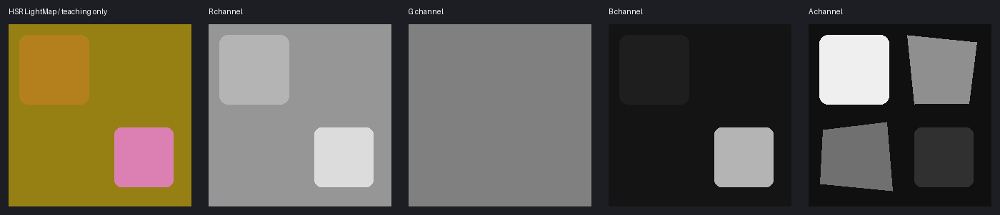

# 崩坏：星穹铁道：贴图通道详解与生成提示词

[通用基础与验收](../../../newbie/tools/TextureChannelGuide/TextureChannelGuide.md)。核心证据是 [HoyoToon Star Rail](https://github.com/Hoyotoon/HoyoToon/blob/d9e5ca2f312bf16fba89dee67d32c08b482dcda4/Shaders/Honkai%20Star%20Rail/Includes/HoyoToonStarRail-program.hlsl)，固定提交 `d9e5ca2f312bf16fba89dee67d32c08b482dcda4`。下表是公开复刻实现的约定，不能无条件套用原游戏全部更新、新角色和特效。



## 相邻教学资源

[合成Diffuse](./assets/synthetic-diffuse.png) · [同UV语义分区](./assets/synthetic-regions.png) · [原始RGBA教学数据](./assets/lightmap-data.png) · [资源来源与边界](./assets/README.md) · [SHA256清单](./assets/manifest.json)

这些资源只用于学习如何拆通道、量化与合并；分区颜色和材质ID的对应是教学预设，不是游戏官方规则。

## 1. 总表：不要把原神的 LightMap 原样搬过来

| 贴图 | R | G | B | A |
| --- | --- | --- | --- | --- |
| Diffuse / MainTex | RGB颜色 | 同左 | 同左 | 裁剪/透明或发光候选，取决于材质 |
| LightMap（身体/头发核心路径） | 边缘光控制，可由RimLightMode决定权重 | AO式阴影阈值控制 | 普通高光/MatCap强度控制 | 8区材质索引与Ramp行选择 |
| FaceMap | 眼部发光区域的特殊阈值判定 | Stencil遮罩 | 鼻部高光/亮区遮罩 | 脸部SDF/阴影阈值，镜像采样 |
| FaceExpression | 脸颊/表情阈值层 | 害羞/脸红层 | 表情阴影层 | 核心计算未确认用途，保留 |
| StockRangeTex | 丝袜作用区域/权重 | 丝袜高光/细节权重 | 单独平铺采样的细节层 | 核心路径未确认，保留 |
| EmissionTex（独立模式） | 可替代Diffuse A作为发光强度来源 | 未见该核心路径独立使用，保留 | 同左 | 与发光来源相乘、参与阈值门控 |
| AlphaTex | 自定义颜色/轮廓索引来源，依选项 | 未确认 | 未确认 | 未确认 |
| DiffuseRamp / CoolRamp | RGB查表颜色 | 同左 | 同左 | 依原表，保留 |
| MaterialValuesLUT / MatCap | 查表数据/外观，不是服装UV | 依表定义 | 依表定义 | 依表定义 |

**Normal补充：**此固定版本的核心角色程序没有像身体LightMap那样明确的独立NormalMap采样链。本页不因此宣称“星铁永远没有法线贴图”；如新Shader绑定了法线，必须单独追踪解包。不要凭蓝紫外观把LightMap解释成法线。

## 2. LightMap：R边缘、G阴影、B高光、A分区

[材质与Ramp行](https://github.com/Hoyotoon/HoyoToon/blob/d9e5ca2f312bf16fba89dee67d32c08b482dcda4/Shaders/Honkai%20Star%20Rail/Includes/HoyoToonStarRail-program.hlsl#L321-L367)按 `floor(8×A)` 获得索引，Ramp Y为 `(2×ID+1)/16`。[R边缘光](https://github.com/Hoyotoon/HoyoToon/blob/d9e5ca2f312bf16fba89dee67d32c08b482dcda4/Shaders/Honkai%20Star%20Rail/Includes/HoyoToonStarRail-program.hlsl#L499-L506)由选项控制；[G阴影](https://github.com/Hoyotoon/HoyoToon/blob/d9e5ca2f312bf16fba89dee67d32c08b482dcda4/Shaders/Honkai%20Star%20Rail/Includes/HoyoToonStarRail-program.hlsl#L567-L581)和[B高光](https://github.com/Hoyotoon/HoyoToon/blob/d9e5ca2f312bf16fba89dee67d32c08b482dcda4/Shaders/Honkai%20Star%20Rail/Includes/HoyoToonStarRail-program.hlsl#L690-L737)是不同功能。

8区安全中心示例字节：16、48、80、112、143、175、207、239。A=255会得到8，在8项数组路径下不安全，不要对这种ID图要求“Alpha全部255”。索引号不天然代表皮肤或金属；材质参数、LUT与Ramp决定表现。

```text
将<image1>角色服装UV颜色图转为星穹铁道身体LightMap候选，保持原尺寸与UV布局完全相同，R编码边缘光控制而不是金属度，教学值皮肤180、普通布料150、光滑饰件220，G编码阴影阈值并以128为基础、仅明确结构遮蔽处90而不复制布料明暗，B编码高光强度且皮肤30、哑光布料20、光滑饰件180，所以RGB分别为(180,128,30)、(150,128,20)、(220,128,180)，所有区域必须变成技术数据色而非自然颜色；A逐像素继承<image2>同UV原LightMap的八区材质ID、不设成255、不按颜色猜索引，不加文字或场景光、不镜像和重排，保留缝线扣件位置，仅输出候选，Alpha无法准确输出则只生成RGB供外部合成。
```

**只生成ID层：**

```text
以<image1>为UV边界参考并依据<image2>同UV原LightMap的A层制作材质ID灰度草稿，保持原八区对应关系，只使用原图对应的16、48、80、112、143、175、207、239这些安全区间中心值，绝不使用255或连续渐变，不擅自规定皮肤/金属的索引，不改变任何UV位置，未知区域继承原图，只输出无文字灰度层供定值量化与Alpha合并。
```

这些示例只定义教学数字，不是从角色图片测得的真实参数。最安全的是只改B高光或原图局部，不重建全部通道。

## 3. Diffuse与EmissionTex

[发光路径](https://github.com/Hoyotoon/HoyoToon/blob/d9e5ca2f312bf16fba89dee67d32c08b482dcda4/Shaders/Honkai%20Star%20Rail/Includes/HoyoToonStarRail-program.hlsl#L526-L547)从Diffuse A开始，独立模式切换到EmissionTex R，同时乘入EmissionTex A并与阈值比较。不能简单描述为“独立EmissionTex RGB就是发光颜色”；这里颜色仍来自Diffuse和材质Tint。

**Diffuse：**

```text
编辑<image1>星穹铁道角色UV颜色图，只按我指定的配色改RGB，严格保持尺寸、UV岛、缝线与装饰形状，不新增光照、不把控制值画成自然颜色，Alpha由外部工具逐像素继承<image2>原Diffuse以保留已确认的发光或裁剪数据，输出无文字同UV颜色候选，不能精确继承Alpha则只输出RGB，不把所有亮色区域认作发光。
```

**独立EmissionTex候选：**

```text
将<image1>服装UV图转为单独EmissionTex的R灰度候选，只把我明确标记的发光灯带和图案设255、其它区域0，保留原尺寸、UV边界与细条位置，不把金属高光、白布或皮肤算作发光、不做光晕，G/B/A继承<image2>同UV原EmissionTex并保留A的门控作用，不加文字、场景照明或3D效果，无法保留其它通道时只输出R层供外部合并；最终发光还受材质模式与阈值影响。
```

## 4. FaceMap与FaceExpression

[FaceMap G的Stencil](https://github.com/Hoyotoon/HoyoToon/blob/d9e5ca2f312bf16fba89dee67d32c08b482dcda4/Shaders/Honkai%20Star%20Rail/Includes/HoyoToonStarRail-program.hlsl#L380-L397)、[A镜像SDF](https://github.com/Hoyotoon/HoyoToon/blob/d9e5ca2f312bf16fba89dee67d32c08b482dcda4/Shaders/Honkai%20Star%20Rail/Includes/HoyoToonStarRail-program.hlsl#L584-L590)、[B鼻区与Expression](https://github.com/Hoyotoon/HoyoToon/blob/d9e5ca2f312bf16fba89dee67d32c08b482dcda4/Shaders/Honkai%20Star%20Rail/Includes/HoyoToonStarRail-program.hlsl#L789-L805)均在不同计算里。FaceMap R的眼部发光仅对0.45–0.55附近判定，不能把它当线性“越白越亮”的普通Mask。

**FaceMap保守修补：**

```text
以<image1>脸部UV为位置参考修补<image2>同角色原FaceMap，只修复我标出的破损区域，A保留原方向阴影阈值场及左右镜像关系，G保留Stencil边界、B保留鼻部亮区遮罩、R保留原眼区特殊编码，不把R改成普通黑白发光图，不根据肤色猜SDF，不重排UV、不加阴影光照或文字，输出同尺寸候选；没有原图时不要生成声称正确的四通道脸图。
```

**FaceExpression：**

```text
依据<image1>脸部UV和<image2>同UV原FaceExpression，只在我指定的表情区域制作R脸颊阈值、G害羞层、B表情阴影层的候选遮罩，未修改处保持原值、A完整继承原图，全部保留原尺寸与眼鼻嘴位置，不在自然RGB上画腮红、不改变SDF、不增文字或3D渲染，无法保持其它通道时分别输出所修改的单通道灰度层外部合并。
```

## 5. StockRangeTex：同一B还会平铺采样

[丝袜路径](https://github.com/Hoyotoon/HoyoToon/blob/d9e5ca2f312bf16fba89dee67d32c08b482dcda4/Shaders/Honkai%20Star%20Rail/Includes/HoyoToonStarRail-program.hlsl#L700-L731)将R当作用区/权重、G参与细节高光，B以另一个tile_uv采样。不能把B简单画成“服装UV上的光滑度”。

```text
以<image1>为UV参考和<image2>同UV原StockRangeTex为模板，仅制作R丝袜区域遮罩候选，明确丝袜区域255、其它0并保留边缘，G维持原细节权重、B完整保留用于平铺采样的原纹理、A保持原值，不把丝袜自然颜色写入控制图、不把B改成普通粗糙度，不添加文字和照明，输出候选；无法继承其它通道时只输出R灰度层由外部工具合并。
```

## 6. AlphaTex、Ramp、LUT与MatCap

AlphaTex R在 [自定义颜色路径](https://github.com/Hoyotoon/HoyoToon/blob/d9e5ca2f312bf16fba89dee67d32c08b482dcda4/Shaders/Honkai%20Star%20Rail/Includes/HoyoToonStarRail-program.hlsl#L558-L563)作为编码输入。其含义由custom_coloring与选项决定，不能命名“透明图”就全涂白。

**AlphaTex：**

```text
以<image2>同UV原AlphaTex为编码模板，对照<image1>只修补我明确指定的自定义颜色索引区域，R沿用原离散编码、G/B/A保持原值，不按透明度重画、不做渐变、不改变UV位置，不加文字，只输出候选或独立R灰度层供外部合并；没有索引规则时原图不动。
```

**Ramp：**

```text
编辑<image1>星穹铁道原DiffuseRamp或CoolRamp，只按我指定的色板修改对应行的RGB，保留原尺寸与八区行中心、冷暖表对应关系、Alpha和取样边界，不输入衣服UV、不重排行、不加物体或文字，只输出同布局色带候选供逐行取样检查。
```

**MaterialValuesLUT：**

```text
保持<image1>原MaterialValuesLUT的尺寸、行列与RGBA数据完全不变，只修补我提供精确目标值的指定像素或矩形，不把它美化成颜色渐变，不改变查表布局、不加文字、不重新生成未知材质参数；没有坐标和数值规范时返回保留原表的操作建议而非猜测图。
```

**MatCap：**

```text
以<image1>原MatCap为球面外观参考，按指定材质外观生成相同尺寸和球面布局的MatCap候选，保留中心方向与边缘过渡，不把衣服UV放进图中，不加背景物体或文字，Alpha继承原图，结果仅用于已确认的MatCap采样路径，需在模型旋转视角下验证而不是当服装Mask使用。
```

## 验收与不覆盖范围

本页不把每个角色的天空、星光、眼特效或独立技能图都归入通用LightMap。先保留原配置，检查材质ID对应Ramp行、G阴影、R边缘、B高光、Alpha与表情开关。文生图数字不准确时，采用“语义分区→人工确认→通道定值”。脸SDF和LUT不能由Diffuse可靠恢复。

源码中部分LUT高光系数带作者近似实现注释；因此“能在HoyoToon渲染”也不代表原游戏参数完全复现。PNG/TGA导出、真实通道合并与实际引擎验证仍是必需步骤。
