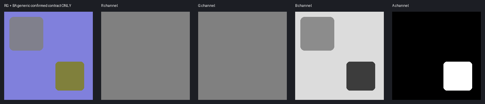

# 鸣潮：N、Mask、TypeMask与版本差异详解

[通用基础与验收](../../../newbie/tools/TextureChannelGuide/TextureChannelGuide.md)。本页核心证据为 [HoyoToon Wuthering Waves](https://github.com/Hoyotoon/HoyoToon/blob/d9e5ca2f312bf16fba89dee67d32c08b482dcda4/Shaders/Wuthering%20Waves/Include/HoyoToonWutheringWaves-program.hlsl)，固定提交 `d9e5ca2f312bf16fba89dee67d32c08b482dcda4`。它存在近似、待完成路径与标签错误，所以本页明确区分“实际读取”与“从名字推断”。



::: danger 一个真实标签冲突
界面写着 `Normal Map(RG)|Roughness(B)|Metallic(G)`，但RG已经用于法线，实际程序另将B/A传入高光/材质计算。**不能因为标签写Metallic(G)就覆盖法线G。** 本页将B/A描述为该复刻中的roughness/metallic命名控制候选及实际高光作用，不保证它与原游戏所有材质的PBR语义相同。
:::

## 相邻教学资源

[合成Diffuse](./assets/synthetic-diffuse.png) · [同UV语义分区](./assets/synthetic-regions.png) · [原始RGBA教学数据](./assets/normal-packed-data.png) · [资源来源与边界](./assets/README.md) · [SHA256清单](./assets/manifest.json)

这些资源只用于学习如何拆通道、量化与合并；分区颜色和材质ID的对应是教学预设，不是游戏官方规则。

## 1. 总表

| 贴图/核心绑定 | R | G | B | A |
| --- | --- | --- | --- | --- |
| Diffuse / MainTex | RGB颜色 | 同左 | 同左 | 可选shadow_mask来源；头发Stencil来源等，不一定透明 |
| Normal_Roughness_Metallic | 切线法线X | 切线法线Y | high/spec control，标签称roughness，实际还用于MatCap/高光判定 | metallic命名控制候选，实际参加高光与衰减 |
| MaskTex（身体） | 身体核心未确认，保留 | Shadow/AO式控制，可被Diffuse A替代 | 核心未确认，保留 | SDF路径可作脸阈值，不能统一称透明 |
| MaskTex（头发） | 高光控制 | 阴影控制 | 核心未确认，保留 | 核心头发路径未确认，保留 |
| TypeMask | 与顶点R二选一用于皮肤/丝袜/普通区判断 | Face路径传递，但当前核心计算未证明独立效果 | Ramp mask命名输入，当前函数内未实际用于最终混合 | 核心未确认，保留 |
| Mask（独立，不同于MaskTex） | Stencil/眼区遮罩 | 核心未确认 | 同左 | 同左 |
| Eye EM | 二级眼高光读取 | 眼视差高度读取 | 核心未确认，保留 | 眼作用区读取 |
| HeightLightMap | RGB眼高光外观 | 同左 | 同左 | 核心未确认，保留 |
| Ramp / MatCap / LUT | 查表颜色或数值，不是服装UV | 依表 | 依表 | 依表 |

### 文件名 `_N/_HM/_HN/_HET/_ID/_RGID/_LD/_FTM` 不是统一规范

[Gacha Setup导入映射](https://github.com/PaoloESAN/gacha-setup/blob/3e40423dbec489368696c4f89a2bfb285662cdc1/setup_wizard/utils/wuwa_texture_utils.py#L11-L32)可见更多命名和节点路径，包含LD(sRGB)、FTM(Non-Color)标识。这证明存在不同工作流，不证明它们各通道与HoyoToon表一一对应。本页不把未知的HN/HET/RGID/LD/FTM硬编成普通R金属/G粗糙/B AO；未获得实际节点或Shader读取时保留原图。

## 2. packed N：保留BA比猜金属更重要

[RG法线与spec来源](https://github.com/Hoyotoon/HoyoToon/blob/d9e5ca2f312bf16fba89dee67d32c08b482dcda4/Shaders/Wuthering%20Waves/Include/HoyoToonWutheringWaves-program.hlsl#L109-L149)明确：RG用于法线，`spec = normalmap.zww`。身体分支 [高光](https://github.com/Hoyotoon/HoyoToon/blob/d9e5ca2f312bf16fba89dee67d32c08b482dcda4/Shaders/Wuthering%20Waves/Include/HoyoToonWutheringWaves-program.hlsl#L169-L181)还乘 `1−A`；[material_basic](https://github.com/Hoyotoon/HoyoToon/blob/d9e5ca2f312bf16fba89dee67d32c08b482dcda4/Shaders/Wuthering%20Waves/Include/HoyoToonWutheringWaves-common.hlsl#L607-L630)对B/A做非线性与阈值逻辑，不是标准PBR的简单关系。

```text
以<image1>鸣潮服装UV颜色图生成浅浮雕法线RG候选，原尺寸和UV布局完全不变，平坦R/G约128、明确缝线凸起扣件产生细微连贯XY梯度，不把蓝灰黑布颜色当凹凸、不加入噪点和场景光照；B/A逐像素继承<image2>同UV原packed N以保留实际材质高光控制，不把B写成标准法线Z、不把G改成金属度，不加文字或3D渲染，仅输出候选或独立RG层供外部合并和目标NormalFlip校验。
```

**已确认另一套真正RG法线+B粗糙+A金属契约时，才能使用如下通用打包候选：**

```text
在已经独立确认目标Shader采用RG法线、B粗糙度、A金属度的前提下，将<image1>服装UV图生成同尺寸技术候选，平坦RG约128、浅缝线弱梯度，B教学值皮肤140、哑光布220、光滑金属60，A非金属0、明确裸金属255，未知材质继承<image2>原图，不按金色油漆猜金属，不把B当法线Z，不保留自然颜色、不加文字、不改变UV，最终由外部工具定值并验证；这不是本页HoyoToon复杂BA路径的直接推荐预设。
```

## 3. MaskTex身体与头发

[shadow_mask选择](https://github.com/Hoyotoon/HoyoToon/blob/d9e5ca2f312bf16fba89dee67d32c08b482dcda4/Shaders/Wuthering%20Waves/Include/HoyoToonWutheringWaves-program.hlsl#L113-L118)由 `_UseMainTexA` 决定读Diffuse A还是MaskTex G。头发 [material_hair](https://github.com/Hoyotoon/HoyoToon/blob/d9e5ca2f312bf16fba89dee67d32c08b482dcda4/Shaders/Wuthering%20Waves/Include/HoyoToonWutheringWaves-common.hlsl#L670-L675)把R传入高光，G参与阴影。

**身体MaskTex：**

```text
以<image2>同UV原MaskTex为模板，对照<image1>服装UV仅生成G阴影控制修补候选，无明显遮蔽处沿用原值、明确缝隙只作轻微降低而不按布料黑白直接绘制AO，R/B/A完整保留原图，保持尺寸、UV边界和小配件位置，不加自然颜色、文字或3D光照，无法保持其它通道则只输出G灰度层外部合并；材质启用UseMainTexA时这张G可能不参与该路径。
```

**头发MaskTex / 已确认对应的HM：**

```text
以<image1>头发UV位置与<image2>同UV原头发MaskTex为模板，只修补R高光控制和G阴影控制的指定区域，保持原发丝方向、UV边界与数值梯度，B/A完整保留，不直接把自然头发颜色或高光渲染画进控制图，不加文字、不镜像重排，只输出候选或独立修改灰度层由外部合并；HM文件仅在绑定确认对应此MaskTex时使用该规则。
```

## 4. TypeMask：分类由阈值与开关决定

[skin_type](https://github.com/Hoyotoon/HoyoToon/blob/d9e5ca2f312bf16fba89dee67d32c08b482dcda4/Shaders/Wuthering%20Waves/Include/HoyoToonWutheringWaves-common.hlsl#L53-L71)在UseSkinMask开启时读TypeMask R，否则读顶点R；头发还会用顶点R覆盖TypeMask R。其判断包含0.05/0.3/0.5/0.9阈值，不能凭“黑=布白=皮肤”忽略代码与边界。

TypeMask B虽传入名为ramp_mask的参数，[函数](https://github.com/Hoyotoon/HoyoToon/blob/d9e5ca2f312bf16fba89dee67d32c08b482dcda4/Shaders/Wuthering%20Waves/Include/HoyoToonWutheringWaves-common.hlsl#L384-L408)只赋值而未将该变量用于最终混合；所以不能把“B必然控制Ramp效果”写成已确认功能。

```text
对照<image1>服装UV和<image2>原TypeMask，只制作已确认R材质分类的灰度修补候选，沿用原皮肤、丝袜和普通区域的各自安全阈值区间，不自动重新编号、不按浅色深色分类、不把未确认金属写进R，G/B/A逐像素继承原图，保持原尺寸与UV边界，不加渐变照明或文字，仅输出R层供外部量化合并与UseSkinMask开关验证。
```

## 5. 脸SDF：MaskTex A

[face_shadow](https://github.com/Hoyotoon/HoyoToon/blob/d9e5ca2f312bf16fba89dee67d32c08b482dcda4/Shaders/Wuthering%20Waves/Include/HoyoToonWutheringWaves-common.hlsl#L299-L328)根据头部方向和镜像UV采样MaskTex A。这里A不是透明。

```text
以<image1>脸部UV为定位参考修补<image2>原脸部MaskTex，只修复我明确标记的破损，A保留原随光向改变的阴影阈值场和左右镜像关系，R/G/B保持原值，不把A改成普通透明或AO、不从脸部颜色猜SDF、不改变UV岛和尺寸，不加文字自然阴影或3D效果，输出候选或独立A层外部合并，没有原SDF时不声称准确恢复。
```

## 6. Diffuse Alpha、独立Mask与眼图

**Diffuse：**

```text
编辑<image1>鸣潮角色Diffuse，只按指定配色改RGB且保持UV尺寸、岛边界和纹理细节，A由外部工具完整继承<image2>原图以保留可能的阴影或Stencil控制，不按深色布料判断透明、不新增场景照明、不加文字，只输出颜色候选，不将A一律置255。
```

**独立Mask R：**

```text
以<image2>同UV原独立Mask为模板对照<image1>，只修补我明确指定的R Stencil或眼部遮罩边界，G/B/A全部保留原值，不与MaskTex的G阴影和A脸SDF混淆，不增加自然颜色光照、不改变UV和尺寸，不加文字，输出R灰度候选供外部合并。
```

[眼路径](https://github.com/Hoyotoon/HoyoToon/blob/d9e5ca2f312bf16fba89dee67d32c08b482dcda4/Shaders/Wuthering%20Waves/Include/HoyoToonWutheringWaves-common.hlsl#L678-L751)读EM G作高度、A作作用区、R作二级高光；HeightLightMap RGB以变换后的UV采样。眼视差/高光并不一定按同一坐标。

**Eye EM：**

```text
以<image2>原眼部EM为编码模板，对照<image1>眼UV仅修补指定区域，R保留二级高光控制、G保留视差高度、B未知用途保持原值、A保留眼作用遮罩，不把EM重绘成RGB发光颜色、不按白眼球全涂255，不改变尺寸和眼纹位置、不加文字，只输出指定修改通道的灰度候选外部合并并检验眼视差。
```

**HeightLightMap：**

```text
以<image1>原眼高光HeightLightMap为采样布局模板，按指定外观编辑RGB高光纹样，保留尺寸、图案位置、Alpha与原边界，不擅自套服装UV、不生成眼睛3D渲染，不加文字，只输出候选供原材质变换UV与视差路径验证。
```

## 7. 其它命名、Ramp、MatCap、LUT

仅有 `.blend` 的 [Jonn Shader](https://github.com/fnoji/Blender-WuWa-Jonn-Shader/tree/07529f5aa14546873afff140bd242571fc67880d)未在本次按真实节点图审计，因此不能把它当成R/G/B/A独立交叉确认。HN、HET、RGID、LD、FTM、FX、Skin等名字存在不代表用途已查清。

**这些未知图逐图可用的保守提示词：**

```text
以<image1>原HN或HET或RGID或LD或FTM或FX或Skin贴图为唯一编码模板，仅修补我明确提供坐标、通道和目标值的区域，原尺寸、采样布局、全部其它RGBA逐像素保持不变，不凭文件缩写猜法线金属粗糙AO或发光，不根据Diffuse重绘未知控制图、不加文字，若没有对应Shader采样定义则保留原图而不是生成声称正确的新图。
```

该段不是万能新生成公式，而是每个未知资产在取得契约前的安全策略。

**Ramp：**

```text
编辑<image1>原Ramp，只按指定色板修改指定行RGB，保留原尺寸、行坐标、采样边界与Alpha，不放服装UV、不重排行、不生成物体或文字，只输出查表候选供目标RampPosition与材质路径验证。
```

**MatCap：**

```text
以<image1>原MatCap球面外观为模板修改指定高光样式，保留尺寸、中心方向与Alpha，不放服装UV、不加背景或文字，仅输出球面外观候选并在模型转视角时检查。
```

**LUT：**

```text
以<image1>原LUT为精确数值模板，只按我明确给定的坐标与RGBA值修改指定区域，保留查表网格、尺寸和其它像素，不美化、不重绘颜色渐变、不增加文字；没有表定义时不生成替代LUT。
```

## 验收与实现缺口

固定复刻的glass路径仍含占位clip，部分ramp_mask未生效；这些不能通过模型提示词修好。别把“复刻缺少效果”归咎于自己的图。核心版本、材质类型、顶点色、UseSkinMask、UseMainTexA、NormalFlip、UV/ST要一起记录。

先检查packed N的RG/BA与Alpha，逐通道A/B测试，尤其头发、脸与眼不能共用身体规则。更新改变Hash/绑定时先修资源对应，不能仅重画纹理。数字与示意是教学，不代表实际游戏渲染已验收。
