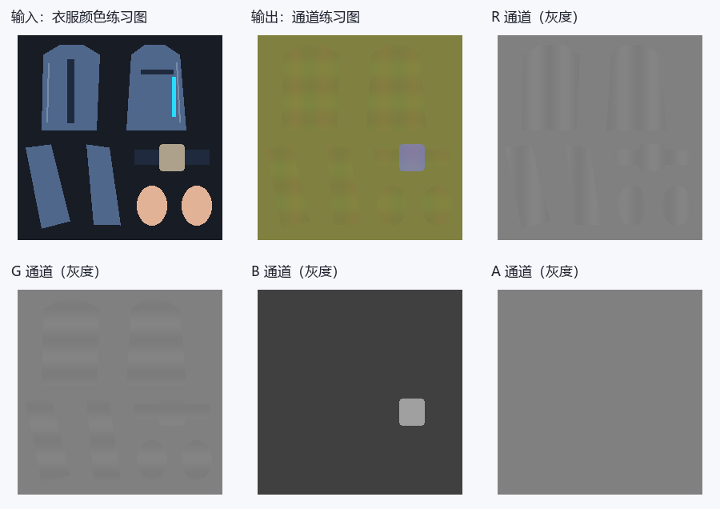
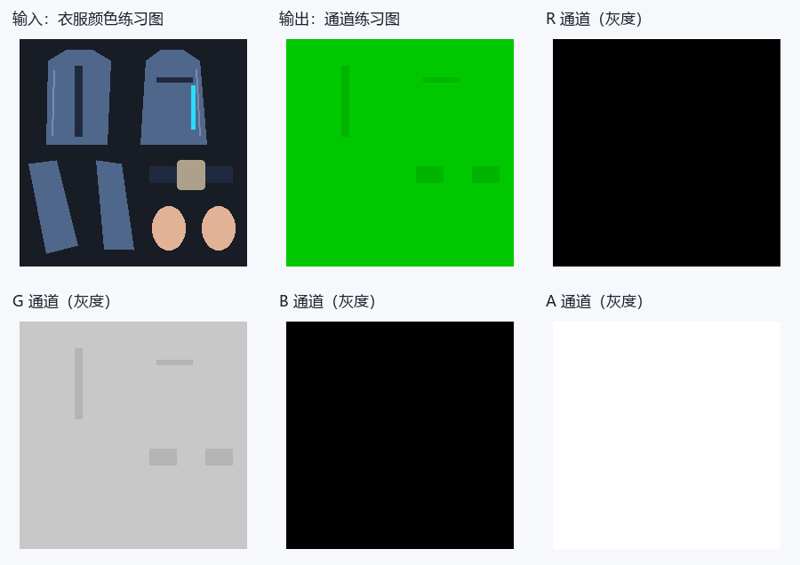
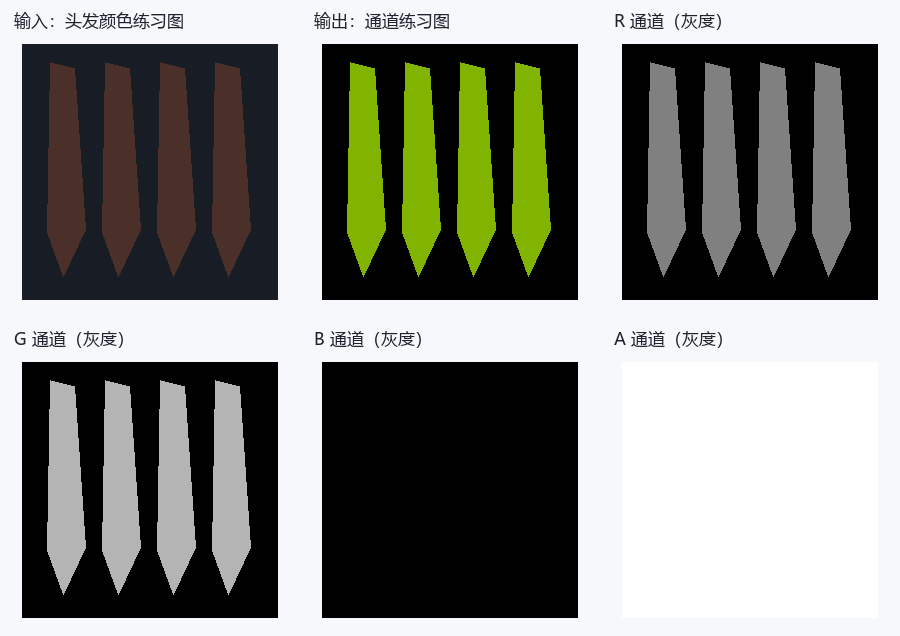
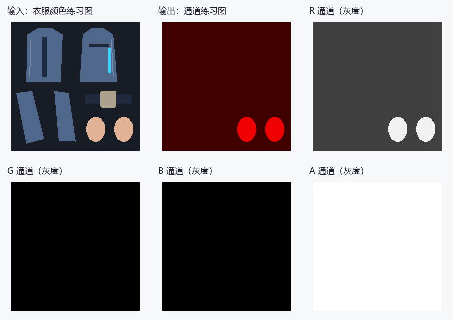
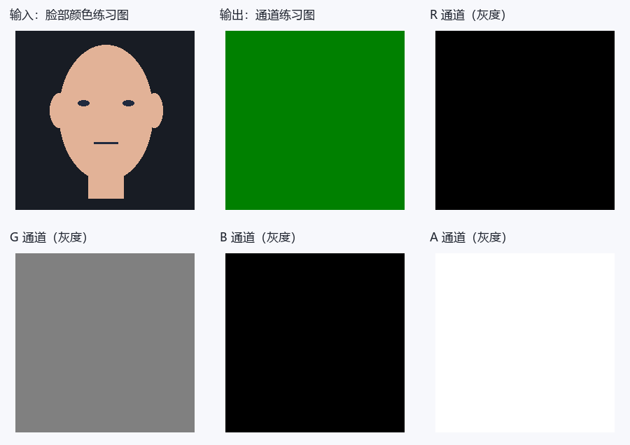
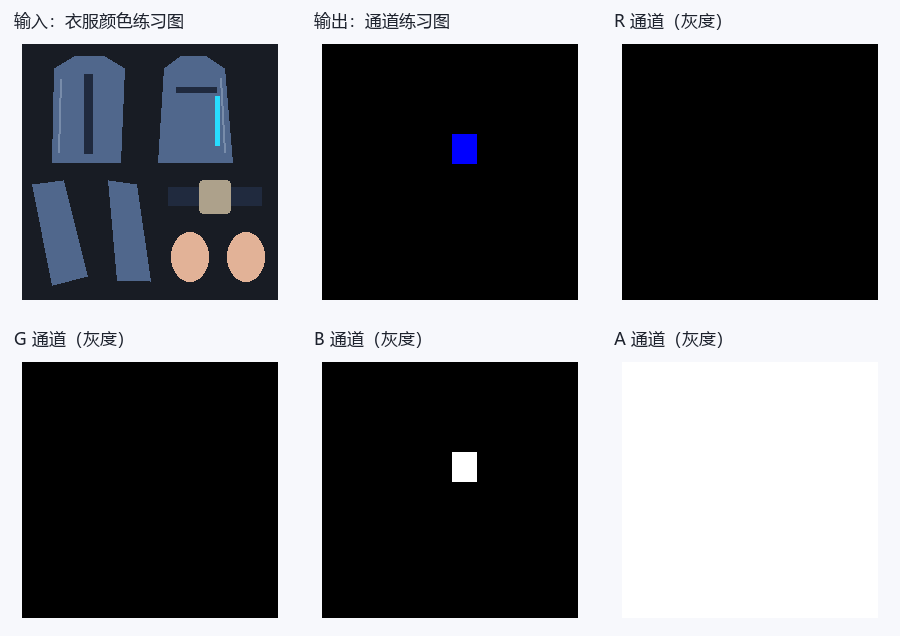

# 鸣潮：逐贴图通道图解与建议提示词

选好下面的贴图类型，就可以查看 RGBA 通道的作用、数值示例和建议提示词。每个分区都提供两种模板：**只有 DiffuseMap**，或 **DiffuseMap＋Blender 导出的 UV 分布图**，可用于 ChatGPT 等支持参考图的图像模型。

如果手边有模型，建议一起提供 UV 图：模型会更容易辨认 UV 岛、边界和细条，通常有助于对齐。只有 Diffuse 也可以尝试；请补充皮肤、布料、裸金属或发光区域的文字说明。

这里的提示词是可调整的参考模板，数字是练习预设，不是角色原始参数。图解是教学示意，不是 AI 实测结果。生成后仍需检查尺寸、UV 和通道数值；UV 图也不能代替材质参数、几何法线或 SDF 方向信息。

## 找到你要生成的贴图

- [DiffuseMap / 颜色图](#map-diffuse)
- [packed N / 法线与高光控制](#map-normal)
- [身体 MaskTex](#map-bodymask)
- [头发 MaskTex / 已确认HM绑定](#map-hairmask)
- [TypeMask / 类型图](#map-typemask)
- [Eye EM / 眼部视差与高光](#map-eye-em)
- [HeightLightMap / 眼高光图](#map-highlight)
- [FaceMap / 脸部方向阴影图](#map-sdf)
- [独立 Mask / Stencil图](#map-independent-mask)
- [HN / HET / RGID / LD / FTM 等未确认资产](#map-unknown-assets)
- [Ramp / 漫反射色带](#map-ramp)
- [MatCap / 球面外观图](#map-matcap)
- [LUT / 参数查表图](#map-lut)

## 准备参考图

- **单图方式：** 上传对应材质的 DiffuseMap 颜色贴图，再复制该分区的单图模板。
- **双图方式：** 第一张上传 DiffuseMap，第二张上传同一材质、同一 UV 层的 UV 分布图，再复制双图模板。两张图保持相同宽高、方向和 0～1 范围，不裁切、不镜像，也不要把 UV 线直接画进 Diffuse。
- **Blender 导出：** 选中目标网格，进入编辑模式并选中该材质对应的面；在 UV 编辑器中选择正确的 UV 层，使用 **UV → 导出 UV 布局（Export UV Layout）**。尺寸设为 Diffuse 的宽高，填充不透明度设为 0，导出 PNG。若没有该选项，可在 Blender 的扩展/插件设置中启用 UV Layout。多材质请分别导出；UDIM 请注明 tile 编号，不要拼成截图。
- 可以下载本页的[教学 Diffuse](./assets/reference-inputs/diffuse.png)与[教学 UV 图](./assets/reference-inputs/uv.png)了解输入形式。它们是通用衣片示意；脸部或头发贴图请换成自己的对应材质参考图，不要用衣服 UV 代替。
- 模板按文中预设开始练习。想调整材质时，可以改预设数值，并补充“哪些区域是什么材质”；UV 只提供边界，不提供材质标签。

## 通道阅读小提示

- 数据值用0～255；线性UNORM中除以255得到0～1。字节128约0.502，若RGB被sRGB解码则约0.216，不能对控制图做自动Gamma或美化。Alpha通常不经过sRGB转换，仍要核对加载路径。
- 灰度白只意味着数值大：乘子、反向遮罩、材质ID、方向数据的“白”含义不同。下面逐图解释，不用一条规则概括。
- 只上传Diffuse时，材质分类是猜测。裸金属、丝袜、发光区域最好在文字里指出；不明区域有保守默认值，但它不恢复原角色ID。
- 合成预览可能受Alpha显示影响；灰度A图是真正的第四通道。下载各层后用取色器看字节，不靠预览颜色判断。

## 1. DiffuseMap / 颜色图 {#map-diffuse}

先看输入的蓝色衣片：颜色图里它就该是蓝色，R/G/B是颜色分量。到了控制图，同一片蓝布可能变成红橙色，那不是改了衣服颜色，而是几个控制值叠在一起。


**教学示意：** 数字对应本节练习预设，图例不属于贴图数据。

[原始RGBA图](./assets/maps/diffuse/diffuse.png) · [R灰度层](./assets/maps/diffuse/diffuse-r.png) · [G灰度层](./assets/maps/diffuse/diffuse-g.png) · [B灰度层](./assets/maps/diffuse/diffuse-b.png) · [A灰度层](./assets/maps/diffuse/diffuse-a.png)

**R怎么用：** R是基础颜色红分量，0最低、255最高。

**G怎么用：** G是基础颜色绿分量，0最低、255最高。

**B怎么用：** B是基础颜色蓝分量，0最低、255最高。

**A怎么用：** A用途由材质决定，单张Diffuse不能推断透明、发光或ID。

颜色分量不是金属、高光或AO；不要增加新的方向光、投影和高光。

### 建议提示词

有 UV 分布图时可选双图模板，更方便核对边界；单图模板同样可以作为起点。

::: tabs

== 只有 DiffuseMap


```text
请根据我上传的这一张鸣潮角色DiffuseMap颜色贴图，生成DiffuseMap / 颜色图的颜色贴图草稿。

生成图片必须与上传Diffuse的像素尺寸、UV岛位置、空白区域、缝线、扣件和所有细条完全对齐，不缩放、镜像、移动或重新排UV。

通道数值采用8位0～255，不做Gamma、自动对比度、美化或预乘Alpha。

完整通道规则：R是基础颜色红分量，0最低、255最高；
G是基础颜色绿分量，0最低、255最高；
B是基础颜色蓝分量，0最低、255最高；
A用途由材质决定，单张Diffuse不能推断透明、发光或ID。

本次明确采用的生成预设：本次生成同UV、不透明Diffuse颜色草稿：R/G/B按我给出的新配色修改，未指定改色时保留上传图的RGB颜色；
A固定255，不猜透明、发光或材质ID。

不要把自然衣服颜色、RGB明暗或金色油漆直接当成金属、AO或高光值；
只修改我指定的配色，未指定处保留上传Diffuse的颜色和绘制细节。

输出只有目标贴图，不加文字、通道标签、图例、拼图、背景场景、3D渲染或光晕。

这是按给定预设生成的候选，不视为角色原始通道的还原；
不能输出真实Alpha时明确说明，不要以白底预览代替 RGBA 文件。
```

== DiffuseMap＋UV 分布图


```text
我上传了两张参考图：第一张是鸣潮角色 DiffuseMap 颜色贴图，第二张是 Blender 导出的同一材质 UV 分布图。请结合这两张参考图，生成DiffuseMap / 颜色图的颜色贴图草稿。

生成图片必须与上传Diffuse的像素尺寸、UV岛位置、空白区域、缝线、扣件和所有细条完全对齐，不缩放、镜像、移动或重新排UV。

通道数值采用8位0～255，不做Gamma、自动对比度、美化或预乘Alpha。

完整通道规则：R是基础颜色红分量，0最低、255最高；
G是基础颜色绿分量，0最低、255最高；
B是基础颜色蓝分量，0最低、255最高；
A用途由材质决定，单张Diffuse不能推断透明、发光或ID。

本次明确采用的生成预设：本次生成同UV、不透明Diffuse颜色草稿：R/G/B按我给出的新配色修改，未指定改色时保留上传图的RGB颜色；
A固定255，不猜透明、发光或材质ID。

不要把自然衣服颜色、RGB明暗或金色油漆直接当成金属、AO或高光值；
只修改我指定的配色，未指定处保留上传Diffuse的颜色和绘制细节。

输出只有目标贴图，不加文字、通道标签、图例、拼图、背景场景、3D渲染或光晕。

这是按给定预设生成的候选，不视为角色原始通道的还原；
不能输出真实Alpha时明确说明，不要以白底预览代替 RGBA 文件。

以 Diffuse 的像素画布为基准，用 UV 分布图核对岛轮廓、细条、边界与空白区域。UV 线是参考标记，不得画入结果，也不作为 AO、缝线、法线或高光。

若两图尺寸、朝向或岛位置不一致，请先让我确认，不自行缩放或对齐。

UV 图没有材质标签或几何方向；
未确认区域仍按上述预设，不据 UV 线推断真实法线、SDF 或材质 ID。
```

:::


**拿到结果先看：** 尺寸、UV边界和每通道数值，并检查 Alpha、常量与阈值。模型输出有偏色或渐变时，用通道编辑器精确赋值，确认无误后再导出目标格式并测试。

## 2. packed N / 法线与高光控制 {#map-normal}

看R和G里的细小变化，方向信息藏在这些梯度里，而不是藏在“蓝紫色外观”里。平坦区域约128；从128向两侧偏移表示向不同切线方向倾斜，不是越白越凸。



**教学示意：** 数字对应本节练习预设，图例不属于贴图数据。

[原始RGBA图](./assets/maps/normal/normal.png) · [R灰度层](./assets/maps/normal/normal-r.png) · [G灰度层](./assets/maps/normal/normal-g.png) · [B灰度层](./assets/maps/normal/normal-b.png) · [A灰度层](./assets/maps/normal/normal-a.png)

**R怎么用：** R编码切线法线X：0负方向、128附近零偏转、255正方向。

**G怎么用：** G编码切线法线Y：0负方向、128附近零偏转、255正方向，最终翻转依Shader。

**B怎么用：** B在该复刻≥128允许第一高光、≥217触发另一MatCap判断；≤216仍可走第二高光，不是单调粗糙度。

**A怎么用：** A身体普通高光乘1−A，0保留128约49.8%255抑制；同时参与非线性和MatCap，不是全反射单调控制。

### 建议提示词

有 UV 分布图时可选双图模板，更方便核对边界；单图模板同样可以作为起点。

::: tabs

== 只有 DiffuseMap


```text
请根据我上传的这一张鸣潮角色DiffuseMap颜色贴图，生成packed N / 法线与高光控制的技术数据草稿。

生成图片必须与上传Diffuse的像素尺寸、UV岛位置、空白区域、缝线、扣件和所有细条完全对齐，不缩放、镜像、移动或重新排UV。

通道数值采用8位0～255，不做Gamma、自动对比度、美化或预乘Alpha。

完整通道规则：R编码切线法线X：0负方向、128附近零偏转、255正方向；
G编码切线法线Y：0负方向、128附近零偏转、255正方向，最终翻转依Shader；
B在该复刻≥128允许第一高光、≥217触发另一MatCap判断；
≤216仍可走第二高光，不是单调粗糙度；
A身体普通高光乘1−A，0保留128约49.8%255抑制；
同时参与非线性和MatCap，不是全反射单调控制。

本次明确采用的生成预设：固定复刻普通身体练习：平坦RG128，皮肤/布B=64抑制第一高光、普通饰件B=160允许第一高光，A=128弱权重，未知B64A128。不要把B填标准Z或G填金属。

不要把自然衣服颜色、RGB明暗或金色油漆直接当成金属、AO或高光值；
只按我文字确认的材质区域分类，无法判断的区域使用上述未知默认值，没有默认时使用本次占位规则而不推断原游戏数据。

输出只有目标贴图，不加文字、通道标签、图例、拼图、背景场景、3D渲染或光晕。

这是按给定预设生成的候选，不视为角色原始通道的还原；
不能输出真实Alpha时明确说明，不要以白底预览代替 RGBA 文件。

法线细节仅来自我明确指出的浅缝线、压边、扣件和发丝结构，不把Diffuse明暗转成高度，不新增织物噪点；
XY解码为2×值/255−1，保持X²+Y²≤1并按目标定义重建或填写Z，不能把方向极值当凹凸强度。
```

== DiffuseMap＋UV 分布图


```text
我上传了两张参考图：第一张是鸣潮角色 DiffuseMap 颜色贴图，第二张是 Blender 导出的同一材质 UV 分布图。请结合这两张参考图，生成packed N / 法线与高光控制的技术数据草稿。

生成图片必须与上传Diffuse的像素尺寸、UV岛位置、空白区域、缝线、扣件和所有细条完全对齐，不缩放、镜像、移动或重新排UV。

通道数值采用8位0～255，不做Gamma、自动对比度、美化或预乘Alpha。

完整通道规则：R编码切线法线X：0负方向、128附近零偏转、255正方向；
G编码切线法线Y：0负方向、128附近零偏转、255正方向，最终翻转依Shader；
B在该复刻≥128允许第一高光、≥217触发另一MatCap判断；
≤216仍可走第二高光，不是单调粗糙度；
A身体普通高光乘1−A，0保留128约49.8%255抑制；
同时参与非线性和MatCap，不是全反射单调控制。

本次明确采用的生成预设：固定复刻普通身体练习：平坦RG128，皮肤/布B=64抑制第一高光、普通饰件B=160允许第一高光，A=128弱权重，未知B64A128。不要把B填标准Z或G填金属。

不要把自然衣服颜色、RGB明暗或金色油漆直接当成金属、AO或高光值；
只按我文字确认的材质区域分类，无法判断的区域使用上述未知默认值，没有默认时使用本次占位规则而不推断原游戏数据。

输出只有目标贴图，不加文字、通道标签、图例、拼图、背景场景、3D渲染或光晕。

这是按给定预设生成的候选，不视为角色原始通道的还原；
不能输出真实Alpha时明确说明，不要以白底预览代替 RGBA 文件。

法线细节仅来自我明确指出的浅缝线、压边、扣件和发丝结构，不把Diffuse明暗转成高度，不新增织物噪点；
XY解码为2×值/255−1，保持X²+Y²≤1并按目标定义重建或填写Z，不能把方向极值当凹凸强度。

以 Diffuse 的像素画布为基准，用 UV 分布图核对岛轮廓、细条、边界与空白区域。UV 线是参考标记，不得画入结果，也不作为 AO、缝线、法线或高光。

若两图尺寸、朝向或岛位置不一致，请先让我确认，不自行缩放或对齐。

UV 图没有材质标签或几何方向；
未确认区域仍按上述预设，不据 UV 线推断真实法线、SDF 或材质 ID。
```

:::


**拿到结果先看：** 尺寸、UV边界和每通道数值，并检查 Alpha、常量与阈值。模型输出有偏色或渐变时，用通道编辑器精确赋值，确认无误后再导出目标格式并测试。

## 3. 身体 MaskTex {#map-bodymask}

颜色图里的黑色腰带不该自动变成重遮蔽。AO应该对应结构重叠、接缝，而不是布料本身的颜色；灰度较白通常保留更多受光。



**教学示意：** 数字对应本节练习预设，图例不属于贴图数据。

[原始RGBA图](./assets/maps/bodymask/bodymask.png) · [R灰度层](./assets/maps/bodymask/bodymask-r.png) · [G灰度层](./assets/maps/bodymask/bodymask-g.png) · [B灰度层](./assets/maps/bodymask/bodymask-b.png) · [A灰度层](./assets/maps/bodymask/bodymask-a.png)

**R怎么用：** R身体核心未确认用途。

**G怎么用：** G或Diffuse A按UseMainTexA选择为shadow_mask；增大通常更受光，26起允许常规高光内部门控，函数有下限。

**B怎么用：** B核心未确认用途。

**A怎么用：** A脸路径可作SDF，身体不能当透明度。

### 建议提示词

有 UV 分布图时可选双图模板，更方便核对边界；单图模板同样可以作为起点。

::: tabs

== 只有 DiffuseMap


```text
请根据我上传的这一张鸣潮角色DiffuseMap颜色贴图，生成身体 MaskTex的技术数据草稿。

生成图片必须与上传Diffuse的像素尺寸、UV岛位置、空白区域、缝线、扣件和所有细条完全对齐，不缩放、镜像、移动或重新排UV。

通道数值采用8位0～255，不做Gamma、自动对比度、美化或预乘Alpha。

完整通道规则：R身体核心未确认用途；
G或Diffuse A按UseMainTexA选择为shadow_mask；
增大通常更受光，26起允许常规高光内部门控，函数有下限；
B核心未确认用途；
A脸路径可作SDF，身体不能当透明度。

本次明确采用的生成预设：仅普通身体同UV练习：R0、B0、A255占位，G普通200、明确缝隙180；
UseMainTexA关闭，未确认身体用途不用于成品。

不要把自然衣服颜色、RGB明暗或金色油漆直接当成金属、AO或高光值；
只按我文字确认的材质区域分类，无法判断的区域使用上述未知默认值，没有默认时使用本次占位规则而不推断原游戏数据。

输出只有目标贴图，不加文字、通道标签、图例、拼图、背景场景、3D渲染或光晕。

这是按给定预设生成的候选，不视为角色原始通道的还原；
不能输出真实Alpha时明确说明，不要以白底预览代替 RGBA 文件。

除上面明确要求的连续阴影或灰度过渡外，每个确认材质区按预设定值填充；
材质ID禁止渐变，不要因为白布/黑布就另设控制值。背景和未识别区按本次默认编码，不自行补未给出的游戏规则。
```

== DiffuseMap＋UV 分布图


```text
我上传了两张参考图：第一张是鸣潮角色 DiffuseMap 颜色贴图，第二张是 Blender 导出的同一材质 UV 分布图。请结合这两张参考图，生成身体 MaskTex的技术数据草稿。

生成图片必须与上传Diffuse的像素尺寸、UV岛位置、空白区域、缝线、扣件和所有细条完全对齐，不缩放、镜像、移动或重新排UV。

通道数值采用8位0～255，不做Gamma、自动对比度、美化或预乘Alpha。

完整通道规则：R身体核心未确认用途；
G或Diffuse A按UseMainTexA选择为shadow_mask；
增大通常更受光，26起允许常规高光内部门控，函数有下限；
B核心未确认用途；
A脸路径可作SDF，身体不能当透明度。

本次明确采用的生成预设：仅普通身体同UV练习：R0、B0、A255占位，G普通200、明确缝隙180；
UseMainTexA关闭，未确认身体用途不用于成品。

不要把自然衣服颜色、RGB明暗或金色油漆直接当成金属、AO或高光值；
只按我文字确认的材质区域分类，无法判断的区域使用上述未知默认值，没有默认时使用本次占位规则而不推断原游戏数据。

输出只有目标贴图，不加文字、通道标签、图例、拼图、背景场景、3D渲染或光晕。

这是按给定预设生成的候选，不视为角色原始通道的还原；
不能输出真实Alpha时明确说明，不要以白底预览代替 RGBA 文件。

除上面明确要求的连续阴影或灰度过渡外，每个确认材质区按预设定值填充；
材质ID禁止渐变，不要因为白布/黑布就另设控制值。背景和未识别区按本次默认编码，不自行补未给出的游戏规则。

以 Diffuse 的像素画布为基准，用 UV 分布图核对岛轮廓、细条、边界与空白区域。UV 线是参考标记，不得画入结果，也不作为 AO、缝线、法线或高光。

若两图尺寸、朝向或岛位置不一致，请先让我确认，不自行缩放或对齐。

UV 图没有材质标签或几何方向；
未确认区域仍按上述预设，不据 UV 线推断真实法线、SDF 或材质 ID。
```

:::


**拿到结果先看：** 尺寸、UV边界和每通道数值，并检查 Alpha、常量与阈值。模型输出有偏色或渐变时，用通道编辑器精确赋值，确认无误后再导出目标格式并测试。

## 4. 头发 MaskTex / 已确认HM绑定 {#map-hairmask}

先找图中的衣片和扣件，再分别看R/G/B/A。同一位置在不同通道里的灰度可以完全不同：一层选材质，一层管高光，一层管阴影。不要为了让合成预览“像原衣服”而把四层一起涂。



**教学示意：** 数字对应本节练习预设，图例不属于贴图数据。

[原始RGBA图](./assets/maps/hairmask/hairmask.png) · [R灰度层](./assets/maps/hairmask/hairmask-r.png) · [G灰度层](./assets/maps/hairmask/hairmask-g.png) · [B灰度层](./assets/maps/hairmask/hairmask-b.png) · [A灰度层](./assets/maps/hairmask/hairmask-a.png)

**R怎么用：** R高光控制，0无该项、增大扩大或增强。

**G怎么用：** G增大通常提高受光偏移并改变Ramp混合，0/255不是全路径暗亮保证。

**B怎么用：** B核心头发未确认用途。

**A怎么用：** A核心头发未确认用途。

### 建议提示词

有 UV 分布图时可选双图模板，更方便核对边界；单图模板同样可以作为起点。

::: tabs

== 只有 DiffuseMap


```text
请根据我上传的这一张鸣潮角色DiffuseMap颜色贴图，生成头发 MaskTex / 已确认HM绑定的技术数据草稿。

生成图片必须与上传Diffuse的像素尺寸、UV岛位置、空白区域、缝线、扣件和所有细条完全对齐，不缩放、镜像、移动或重新排UV。

通道数值采用8位0～255，不做Gamma、自动对比度、美化或预乘Alpha。

完整通道规则：R高光控制，0无该项、增大扩大或增强；
G增大通常提高受光偏移并改变Ramp混合，0/255不是全路径暗亮保证；
B核心头发未确认用途；
A核心头发未确认用途。

本次明确采用的生成预设：头发岛RGBA(128,180,0,255)，背景(0,0,0,255)，沿发丝方向仅弱连续梯度；
不是发丝切线还原。

不要把自然衣服颜色、RGB明暗或金色油漆直接当成金属、AO或高光值；
只按我文字确认的材质区域分类，无法判断的区域使用上述未知默认值，没有默认时使用本次占位规则而不推断原游戏数据。

输出只有目标贴图，不加文字、通道标签、图例、拼图、背景场景、3D渲染或光晕。

这是按给定预设生成的候选，不视为角色原始通道的还原；
不能输出真实Alpha时明确说明，不要以白底预览代替 RGBA 文件。

除上面明确要求的连续阴影或灰度过渡外，每个确认材质区按预设定值填充；
材质ID禁止渐变，不要因为白布/黑布就另设控制值。背景和未识别区按本次默认编码，不自行补未给出的游戏规则。
```

== DiffuseMap＋UV 分布图


```text
我上传了两张参考图：第一张是鸣潮角色 DiffuseMap 颜色贴图，第二张是 Blender 导出的同一材质 UV 分布图。请结合这两张参考图，生成头发 MaskTex / 已确认HM绑定的技术数据草稿。

生成图片必须与上传Diffuse的像素尺寸、UV岛位置、空白区域、缝线、扣件和所有细条完全对齐，不缩放、镜像、移动或重新排UV。

通道数值采用8位0～255，不做Gamma、自动对比度、美化或预乘Alpha。

完整通道规则：R高光控制，0无该项、增大扩大或增强；
G增大通常提高受光偏移并改变Ramp混合，0/255不是全路径暗亮保证；
B核心头发未确认用途；
A核心头发未确认用途。

本次明确采用的生成预设：头发岛RGBA(128,180,0,255)，背景(0,0,0,255)，沿发丝方向仅弱连续梯度；
不是发丝切线还原。

不要把自然衣服颜色、RGB明暗或金色油漆直接当成金属、AO或高光值；
只按我文字确认的材质区域分类，无法判断的区域使用上述未知默认值，没有默认时使用本次占位规则而不推断原游戏数据。

输出只有目标贴图，不加文字、通道标签、图例、拼图、背景场景、3D渲染或光晕。

这是按给定预设生成的候选，不视为角色原始通道的还原；
不能输出真实Alpha时明确说明，不要以白底预览代替 RGBA 文件。

除上面明确要求的连续阴影或灰度过渡外，每个确认材质区按预设定值填充；
材质ID禁止渐变，不要因为白布/黑布就另设控制值。背景和未识别区按本次默认编码，不自行补未给出的游戏规则。

以 Diffuse 的像素画布为基准，用 UV 分布图核对岛轮廓、细条、边界与空白区域。UV 线是参考标记，不得画入结果，也不作为 AO、缝线、法线或高光。

若两图尺寸、朝向或岛位置不一致，请先让我确认，不自行缩放或对齐。

UV 图没有材质标签或几何方向；
未确认区域仍按上述预设，不据 UV 线推断真实法线、SDF 或材质 ID。
```

:::


**拿到结果先看：** 尺寸、UV边界和每通道数值，并检查 Alpha、常量与阈值。模型输出有偏色或渐变时，用通道编辑器精确赋值，确认无误后再导出目标格式并测试。

## 5. TypeMask / 类型图 {#map-typemask}

这张图是分类，不是照明。一个类别应保持在同一安全区间；画得很漂亮的渐变反而可能让像素跨到另一个材质组。



**教学示意：** 数字对应本节练习预设，图例不属于贴图数据。

[原始RGBA图](./assets/maps/typemask/typemask.png) · [R灰度层](./assets/maps/typemask/typemask-r.png) · [G灰度层](./assets/maps/typemask/typemask-g.png) · [B灰度层](./assets/maps/typemask/typemask-b.png) · [A灰度层](./assets/maps/typemask/typemask-a.png)

**R怎么用：** R在UseSkinMask=1时：0～127普通、128～229丝袜、230～255皮肤；无强度意义。

**G怎么用：** G传入脸路径但核心未证实一般独立效果。

**B怎么用：** B虽名Ramp mask，当前最终混合没用到它。

**A怎么用：** A未确认用途。

### 建议提示词

有 UV 分布图时可选双图模板，更方便核对边界；单图模板同样可以作为起点。

::: tabs

== 只有 DiffuseMap


```text
请根据我上传的这一张鸣潮角色DiffuseMap颜色贴图，生成TypeMask / 类型图的技术数据草稿。

生成图片必须与上传Diffuse的像素尺寸、UV岛位置、空白区域、缝线、扣件和所有细条完全对齐，不缩放、镜像、移动或重新排UV。

通道数值采用8位0～255，不做Gamma、自动对比度、美化或预乘Alpha。

完整通道规则：R在UseSkinMask=1时：0～127普通、128～229丝袜、230～255皮肤；
无强度意义；
G传入脸路径但核心未证实一般独立效果；
B虽名Ramp mask，当前最终混合没用到它；
A未确认用途。

本次明确采用的生成预设：普通布与未知R64、用户确认丝袜R180、确认皮肤R240；
G0、B0、A255。开启UseSkinMask；
没有区域说明不能猜肤色就是皮肤类别。

不要把自然衣服颜色、RGB明暗或金色油漆直接当成金属、AO或高光值；
只按我文字确认的材质区域分类，无法判断的区域使用上述未知默认值，没有默认时使用本次占位规则而不推断原游戏数据。

输出只有目标贴图，不加文字、通道标签、图例、拼图、背景场景、3D渲染或光晕。

这是按给定预设生成的候选，不视为角色原始通道的还原；
不能输出真实Alpha时明确说明，不要以白底预览代替 RGBA 文件。

除上面明确要求的连续阴影或灰度过渡外，每个确认材质区按预设定值填充；
材质ID禁止渐变，不要因为白布/黑布就另设控制值。背景和未识别区按本次默认编码，不自行补未给出的游戏规则。
```

== DiffuseMap＋UV 分布图


```text
我上传了两张参考图：第一张是鸣潮角色 DiffuseMap 颜色贴图，第二张是 Blender 导出的同一材质 UV 分布图。请结合这两张参考图，生成TypeMask / 类型图的技术数据草稿。

生成图片必须与上传Diffuse的像素尺寸、UV岛位置、空白区域、缝线、扣件和所有细条完全对齐，不缩放、镜像、移动或重新排UV。

通道数值采用8位0～255，不做Gamma、自动对比度、美化或预乘Alpha。

完整通道规则：R在UseSkinMask=1时：0～127普通、128～229丝袜、230～255皮肤；
无强度意义；
G传入脸路径但核心未证实一般独立效果；
B虽名Ramp mask，当前最终混合没用到它；
A未确认用途。

本次明确采用的生成预设：普通布与未知R64、用户确认丝袜R180、确认皮肤R240；
G0、B0、A255。开启UseSkinMask；
没有区域说明不能猜肤色就是皮肤类别。

不要把自然衣服颜色、RGB明暗或金色油漆直接当成金属、AO或高光值；
只按我文字确认的材质区域分类，无法判断的区域使用上述未知默认值，没有默认时使用本次占位规则而不推断原游戏数据。

输出只有目标贴图，不加文字、通道标签、图例、拼图、背景场景、3D渲染或光晕。

这是按给定预设生成的候选，不视为角色原始通道的还原；
不能输出真实Alpha时明确说明，不要以白底预览代替 RGBA 文件。

除上面明确要求的连续阴影或灰度过渡外，每个确认材质区按预设定值填充；
材质ID禁止渐变，不要因为白布/黑布就另设控制值。背景和未识别区按本次默认编码，不自行补未给出的游戏规则。

以 Diffuse 的像素画布为基准，用 UV 分布图核对岛轮廓、细条、边界与空白区域。UV 线是参考标记，不得画入结果，也不作为 AO、缝线、法线或高光。

若两图尺寸、朝向或岛位置不一致，请先让我确认，不自行缩放或对齐。

UV 图没有材质标签或几何方向；
未确认区域仍按上述预设，不据 UV 线推断真实法线、SDF 或材质 ID。
```

:::


**拿到结果先看：** 尺寸、UV边界和每通道数值，并检查 Alpha、常量与阈值。模型输出有偏色或渐变时，用通道编辑器精确赋值，确认无误后再导出目标格式并测试。

## 6. Eye EM / 眼部视差与高光 {#map-eye-em}

脸图和身体图不能共用解释。图中常量只是把每个通道的位置拆给你看，不代表脸的方向阴影已经恢复；眼鼻嘴的对应关系、视角和材质分支都很重要。



**教学示意：** 数字对应本节练习预设，图例不属于贴图数据。

[原始RGBA图](./assets/maps/eye-em/eye-em.png) · [R灰度层](./assets/maps/eye-em/eye-em-r.png) · [G灰度层](./assets/maps/eye-em/eye-em-g.png) · [B灰度层](./assets/maps/eye-em/eye-em-b.png) · [A灰度层](./assets/maps/eye-em/eye-em-a.png)

**R怎么用：** R二级高光输入增大通常增强，但被A压制。

**G怎么用：** G用于视差高度比较，位移方向由视角和参数决定，不是越白越凸。

**B怎么用：** B核心未确认用途。

**A怎么用：** A接近255时混回原UV且压二级高光，0更保留视差，不是白作用最大。

### 建议提示词

有 UV 分布图时可选双图模板，更方便核对边界；单图模板同样可以作为起点。

::: tabs

== 只有 DiffuseMap


```text
请根据我上传的这一张鸣潮角色DiffuseMap颜色贴图，生成Eye EM / 眼部视差与高光的技术数据草稿。

生成图片必须与上传Diffuse的像素尺寸、UV岛位置、空白区域、缝线、扣件和所有细条完全对齐，不缩放、镜像、移动或重新排UV。

通道数值采用8位0～255，不做Gamma、自动对比度、美化或预乘Alpha。

完整通道规则：R二级高光输入增大通常增强，但被A压制；
G用于视差高度比较，位移方向由视角和参数决定，不是越白越凸；
B核心未确认用途；
A接近255时混回原UV且压二级高光，0更保留视差，不是白作用最大。

本次明确采用的生成预设：眼部无视差安全练习：R0、G128平高度、B0、A255；
不要凭Diffuse重建真实虹膜深度。

不要把自然衣服颜色、RGB明暗或金色油漆直接当成金属、AO或高光值；
只按我文字确认的材质区域分类，无法判断的区域使用上述未知默认值，没有默认时使用本次占位规则而不推断原游戏数据。

输出只有目标贴图，不加文字、通道标签、图例、拼图、背景场景、3D渲染或光晕。

这是按给定预设生成的候选，不视为角色原始通道的还原；
不能输出真实Alpha时明确说明，不要以白底预览代替 RGBA 文件。
```

== DiffuseMap＋UV 分布图


```text
我上传了两张参考图：第一张是鸣潮角色 DiffuseMap 颜色贴图，第二张是 Blender 导出的同一材质 UV 分布图。请结合这两张参考图，生成Eye EM / 眼部视差与高光的技术数据草稿。

生成图片必须与上传Diffuse的像素尺寸、UV岛位置、空白区域、缝线、扣件和所有细条完全对齐，不缩放、镜像、移动或重新排UV。

通道数值采用8位0～255，不做Gamma、自动对比度、美化或预乘Alpha。

完整通道规则：R二级高光输入增大通常增强，但被A压制；
G用于视差高度比较，位移方向由视角和参数决定，不是越白越凸；
B核心未确认用途；
A接近255时混回原UV且压二级高光，0更保留视差，不是白作用最大。

本次明确采用的生成预设：眼部无视差安全练习：R0、G128平高度、B0、A255；
不要凭Diffuse重建真实虹膜深度。

不要把自然衣服颜色、RGB明暗或金色油漆直接当成金属、AO或高光值；
只按我文字确认的材质区域分类，无法判断的区域使用上述未知默认值，没有默认时使用本次占位规则而不推断原游戏数据。

输出只有目标贴图，不加文字、通道标签、图例、拼图、背景场景、3D渲染或光晕。

这是按给定预设生成的候选，不视为角色原始通道的还原；
不能输出真实Alpha时明确说明，不要以白底预览代替 RGBA 文件。

以 Diffuse 的像素画布为基准，用 UV 分布图核对岛轮廓、细条、边界与空白区域。UV 线是参考标记，不得画入结果，也不作为 AO、缝线、法线或高光。

若两图尺寸、朝向或岛位置不一致，请先让我确认，不自行缩放或对齐。

UV 图没有材质标签或几何方向；
未确认区域仍按上述预设，不据 UV 线推断真实法线、SDF 或材质 ID。
```

:::


**拿到结果先看：** 尺寸、UV边界和每通道数值，并检查 Alpha、常量与阈值。模型输出有偏色或渐变时，用通道编辑器精确赋值，确认无误后再导出目标格式并测试。

## 7. HeightLightMap / 眼高光图 {#map-highlight}

这类图通常平铺或沿特定坐标取样。输入Diffuse可以给风格线索，却不能让模型知道原来使用的ST缩放和发丝切线；练习图只演示灰度数据。



**教学示意：** 数字对应本节练习预设，图例不属于贴图数据。

[原始RGBA图](./assets/maps/highlight/highlight.png) · [R灰度层](./assets/maps/highlight/highlight-r.png) · [G灰度层](./assets/maps/highlight/highlight-g.png) · [B灰度层](./assets/maps/highlight/highlight-b.png) · [A灰度层](./assets/maps/highlight/highlight-a.png)

**R怎么用：** R当前眼高光链未单独取用。

**G怎么用：** G当前眼高光链未单独取用。

**B怎么用：** B是主要高光输入，低值弱、高值强。

**A怎么用：** A未确认用途。

### 建议提示词

这类图不沿服装 UV 排列，双图模板也保持指定的查表/平铺结构。

::: tabs

== 只有 DiffuseMap


```text
请根据我上传的这一张鸣潮角色DiffuseMap颜色贴图，生成HeightLightMap / 眼高光图的技术数据草稿。

这是查表或平铺纹理，不是衣服UV图，按下面指定尺寸和坐标结构输出，不把衣服轮廓放进图里。

通道数值采用8位0～255，不做Gamma、自动对比度、美化或预乘Alpha。

完整通道规则：R当前眼高光链未单独取用；
G当前眼高光链未单独取用；
B是主要高光输入，低值弱、高值强；
A未确认用途。

本次明确采用的生成预设：256×256采样图R0G0A255，B黑底0、用户指定高光斑255柔和边缘；
不是整张服装UV。

不要把自然衣服颜色、RGB明暗或金色油漆直接当成金属、AO或高光值；
只按我文字确认的材质区域分类，无法判断的区域使用上述未知默认值，没有默认时使用本次占位规则而不推断原游戏数据。

输出只有目标贴图，不加文字、通道标签、图例、拼图、背景场景、3D渲染或光晕。

这是按给定预设生成的候选，不视为角色原始通道的还原；
不能输出真实Alpha时明确说明，不要以白底预览代替 RGBA 文件。
```

== DiffuseMap＋UV 分布图


```text
我上传了两张参考图：第一张是鸣潮角色 DiffuseMap 颜色贴图，第二张是 Blender 导出的同一材质 UV 分布图。请结合这两张参考图，生成HeightLightMap / 眼高光图的技术数据草稿。

这是查表或平铺纹理，不是衣服UV图，按下面指定尺寸和坐标结构输出，不把衣服轮廓放进图里。

通道数值采用8位0～255，不做Gamma、自动对比度、美化或预乘Alpha。

完整通道规则：R当前眼高光链未单独取用；
G当前眼高光链未单独取用；
B是主要高光输入，低值弱、高值强；
A未确认用途。

本次明确采用的生成预设：256×256采样图R0G0A255，B黑底0、用户指定高光斑255柔和边缘；
不是整张服装UV。

不要把自然衣服颜色、RGB明暗或金色油漆直接当成金属、AO或高光值；
只按我文字确认的材质区域分类，无法判断的区域使用上述未知默认值，没有默认时使用本次占位规则而不推断原游戏数据。

输出只有目标贴图，不加文字、通道标签、图例、拼图、背景场景、3D渲染或光晕。

这是按给定预设生成的候选，不视为角色原始通道的还原；
不能输出真实Alpha时明确说明，不要以白底预览代替 RGBA 文件。

UV 图仅作为材质关联参考，不作为输出布局；
查表、球面或平铺图仍严格按上面的尺寸与坐标结构生成。
```

:::


**拿到结果先看：** 尺寸、查表/平铺布局和边缘连续性；再按上面的规则检查Alpha、常量与阈值。模型输出有偏色或渐变时，用通道编辑器精确赋值，确认无误后再导出目标格式并测试。

## 8. FaceMap / 脸部方向阴影图 {#map-sdf}

这张示意图展示常量占位，用来认识通道，并不具备正确的脸部方向阴影。颜色图没有告诉我们每个脸部像素在哪个光向开始转暗；正确方向场需要额外设计或几何信息。


**常量占位示意：** 用于认识通道，不具备正确的脸部方向阴影。

[原始RGBA图](./assets/maps/sdf/sdf.png) · [R灰度层](./assets/maps/sdf/sdf-r.png) · [G灰度层](./assets/maps/sdf/sdf-g.png) · [B灰度层](./assets/maps/sdf/sdf-b.png) · [A灰度层](./assets/maps/sdf/sdf-a.png)

**R怎么用：** R核心脸SDF链未确认用途。

**G怎么用：** G核心脸SDF链未确认用途。

**B怎么用：** B核心脸SDF链未确认用途。

**A怎么用：** A方向场，固定光向增大更偏亮面，头部朝向有门控。

只上传Diffuse无法唯一确定方向场。下面建议模板仅生成标明用途的占位草稿，不是正确SDF生成配方；要重建必须增加几何/光向设计信息。

### 建议提示词（占位练习）

有 UV 分布图时可选双图模板，更方便核对边界；单图模板同样可以作为起点。

::: tabs

== 只有 DiffuseMap


```text
请根据我上传的这一张鸣潮角色DiffuseMap颜色贴图，生成FaceMap / 脸部方向阴影图的占位草稿。

生成图片必须与上传Diffuse的像素尺寸、UV岛位置、空白区域、缝线、扣件和所有细条完全对齐，不缩放、镜像、移动或重新排UV。

通道数值采用8位0～255，不做Gamma、自动对比度、美化或预乘Alpha。

完整通道规则：R核心脸SDF链未确认用途；
G核心脸SDF链未确认用途；
B核心脸SDF链未确认用途；
A方向场，固定光向增大更偏亮面，头部朝向有门控。

本次明确采用的生成预设：只做不能用于角色还原的方向场占位：R=0、G=0、B=0、A=128。A全128没有方向梯度，不声称有正确随光阴影。

不要把自然衣服颜色、RGB明暗或金色油漆直接当成金属、AO或高光值；
只按我文字确认的材质区域分类，无法判断的区域使用上述未知默认值，没有默认时使用本次占位规则而不推断原游戏数据。

输出只有目标贴图，不加文字、通道标签、图例、拼图、背景场景、3D渲染或光晕。

这是按给定预设生成的候选，不视为角色原始通道的还原；
不能输出真实Alpha时明确说明，不要以白底预览代替 RGBA 文件。
```

== DiffuseMap＋UV 分布图


```text
我上传了两张参考图：第一张是鸣潮角色 DiffuseMap 颜色贴图，第二张是 Blender 导出的同一材质 UV 分布图。请结合这两张参考图，生成FaceMap / 脸部方向阴影图的占位草稿。

生成图片必须与上传Diffuse的像素尺寸、UV岛位置、空白区域、缝线、扣件和所有细条完全对齐，不缩放、镜像、移动或重新排UV。

通道数值采用8位0～255，不做Gamma、自动对比度、美化或预乘Alpha。

完整通道规则：R核心脸SDF链未确认用途；
G核心脸SDF链未确认用途；
B核心脸SDF链未确认用途；
A方向场，固定光向增大更偏亮面，头部朝向有门控。

本次明确采用的生成预设：只做不能用于角色还原的方向场占位：R=0、G=0、B=0、A=128。A全128没有方向梯度，不声称有正确随光阴影。

不要把自然衣服颜色、RGB明暗或金色油漆直接当成金属、AO或高光值；
只按我文字确认的材质区域分类，无法判断的区域使用上述未知默认值，没有默认时使用本次占位规则而不推断原游戏数据。

输出只有目标贴图，不加文字、通道标签、图例、拼图、背景场景、3D渲染或光晕。

这是按给定预设生成的候选，不视为角色原始通道的还原；
不能输出真实Alpha时明确说明，不要以白底预览代替 RGBA 文件。

以 Diffuse 的像素画布为基准，用 UV 分布图核对岛轮廓、细条、边界与空白区域。UV 线是参考标记，不得画入结果，也不作为 AO、缝线、法线或高光。

若两图尺寸、朝向或岛位置不一致，请先让我确认，不自行缩放或对齐。

UV 图没有材质标签或几何方向；
未确认区域仍按上述预设，不据 UV 线推断真实法线、SDF 或材质 ID。
```

:::


**拿到结果先看：** 尺寸、UV边界和每通道数值，并检查 Alpha、常量与阈值。模型输出有偏色或渐变时，用通道编辑器精确赋值，确认无误后再导出目标格式并测试。

## 9. 独立 Mask / Stencil图 {#map-independent-mask}

这类贴图需要结合具体材质的采样坐标、开关和参数使用。先确认目标用途，再决定每个通道如何填写；仅凭颜色图或文件名无法确定。

**R怎么用：** R为所选Stencil/眼路径遮罩输入，实际裁剪方向和阈值依pass。

**G怎么用：** G核心未确认用途。

**B怎么用：** B核心未确认用途。

**A怎么用：** A核心未确认用途。

这个Mask不是MaskTex；没有pass规则不能把0/255叫全游戏显示/隐藏。

### 建议提示词（需补充定义）

UV 能帮助对齐边界，但不能补齐这类贴图的参数定义。

::: tabs

== 只有 DiffuseMap


```text
我只上传了这张鸣潮角色Diffuse颜色图。我想生成独立 Mask / Stencil图，但你没有目标采样/参数定义。完整规则是：R为所选Stencil/眼路径遮罩输入，实际裁剪方向和阈值依pass；
G核心未确认用途；
B核心未确认用途；
A核心未确认用途。只上传Diffuse无法确定该图的采样布局和阈值，因此不生成声称可替换的四通道图，不自行填RGBA常量；
需要取得目标Shader、参数或几何信息。不要编RGBA常量或行列，说明还缺哪些尺寸、采样UV、通道和阈值参数；
Diffuse 提供颜色与位置线索，但不足以确定这些数据。
```

== DiffuseMap＋UV 分布图


```text
我上传了两张参考图：第一张是鸣潮角色 DiffuseMap，第二张是 Blender 导出的对应 UV 分布图。我想生成独立 Mask / Stencil图，但你没有目标采样/参数定义。完整规则是：R为所选Stencil/眼路径遮罩输入，实际裁剪方向和阈值依pass；
G核心未确认用途；
B核心未确认用途；
A核心未确认用途。Diffuse 和 UV 分布图仍无法确定该图的采样布局和阈值，因此不生成声称可替换的四通道图，不自行填RGBA常量；
需要取得目标Shader、参数或几何信息。不要编RGBA常量或行列，说明还缺哪些尺寸、采样UV、通道和阈值参数；
Diffuse 提供颜色与位置线索，但不足以确定这些数据。

UV 图只用来核对坐标，不包含采样函数或参数表；
若还缺定义，请先列出需要补充的信息，不猜测替代数据。
```

:::


**拿到结果先看：** 尺寸、UV边界和每通道数值，并检查 Alpha、常量与阈值。模型输出有偏色或渐变时，用通道编辑器精确赋值，确认无误后再导出目标格式并测试。

## 10. HN / HET / RGID / LD / FTM 等未确认资产 {#map-unknown-assets}

这类贴图需要结合具体材质的采样坐标、开关和参数使用。先确认目标用途，再决定每个通道如何填写；仅凭颜色图或文件名无法确定。

**R怎么用：** R没有取得对应节点或Shader完整读取定义。

**G怎么用：** G没有取得对应读取定义。

**B怎么用：** B没有取得对应读取定义。

**A怎么用：** A没有取得对应读取定义。

这些缩写在导入工作流存在，但仅文件名不证明通道用途；请先确认对应材质的读取规则。

### 建议提示词（需补充定义）

UV 能帮助对齐边界，但不能补齐这类贴图的参数定义。

::: tabs

== 只有 DiffuseMap


```text
我只上传了这张鸣潮角色Diffuse颜色图。我想生成HN / HET / RGID / LD / FTM 等未确认资产，但你没有目标采样/参数定义。完整规则是：R没有取得对应节点或Shader完整读取定义；
G没有取得对应读取定义；
B没有取得对应读取定义；
A没有取得对应读取定义。只上传Diffuse无法确定该图的采样布局和阈值，因此不生成声称可替换的四通道图，不自行填RGBA常量；
需要取得目标Shader、参数或几何信息。不要编RGBA常量或行列，说明还缺哪些尺寸、采样UV、通道和阈值参数；
Diffuse 提供颜色与位置线索，但不足以确定这些数据。
```

== DiffuseMap＋UV 分布图


```text
我上传了两张参考图：第一张是鸣潮角色 DiffuseMap，第二张是 Blender 导出的对应 UV 分布图。我想生成HN / HET / RGID / LD / FTM 等未确认资产，但你没有目标采样/参数定义。完整规则是：R没有取得对应节点或Shader完整读取定义；
G没有取得对应读取定义；
B没有取得对应读取定义；
A没有取得对应读取定义。Diffuse 和 UV 分布图仍无法确定该图的采样布局和阈值，因此不生成声称可替换的四通道图，不自行填RGBA常量；
需要取得目标Shader、参数或几何信息。不要编RGBA常量或行列，说明还缺哪些尺寸、采样UV、通道和阈值参数；
Diffuse 提供颜色与位置线索，但不足以确定这些数据。

UV 图只用来核对坐标，不包含采样函数或参数表；
若还缺定义，请先列出需要补充的信息，不猜测替代数据。
```

:::


**拿到结果先看：** 尺寸、UV边界和每通道数值，并检查 Alpha、常量与阈值。模型输出有偏色或渐变时，用通道编辑器精确赋值，确认无误后再导出目标格式并测试。

## 11. Ramp / 漫反射色带 {#map-ramp}

看横向色带：它按受光坐标查颜色，不是按衣服UV读。四通道图里白色Alpha可能只是占位，也可能控制混合，要看这一种表的定义。


**教学示意：** 数字对应本节练习预设，图例不属于贴图数据。

[原始RGBA图](./assets/maps/ramp/ramp.png) · [R灰度层](./assets/maps/ramp/ramp-r.png) · [G灰度层](./assets/maps/ramp/ramp-g.png) · [B灰度层](./assets/maps/ramp/ramp-b.png) · [A灰度层](./assets/maps/ramp/ramp-a.png)

**R怎么用：** R是查表颜色红分量，值增大增加所采样红贡献。

**G怎么用：** G是查表颜色绿分量，值增大增加所采样绿贡献。

**B怎么用：** B是查表颜色蓝分量，值增大增加所采样蓝贡献。

**A怎么用：** A必须按表定义，仅凭 Diffuse 无法恢复；以下只给不透明练习占位。

这是查表坐标图，不使用衣服UV；Diffuse只提供配色/风格线索，不能推回原查表参数。

### 建议提示词

这类图不沿服装 UV 排列，双图模板也保持指定的查表/平铺结构。

::: tabs

== 只有 DiffuseMap


```text
请根据我上传的这一张鸣潮角色DiffuseMap颜色贴图，生成Ramp / 漫反射色带的技术数据草稿。

这是查表或平铺纹理，不是衣服UV图，按下面指定尺寸和坐标结构输出，不把衣服轮廓放进图里。

通道数值采用8位0～255，不做Gamma、自动对比度、美化或预乘Alpha。

完整通道规则：R是查表颜色红分量，值增大增加所采样红贡献；
G是查表颜色绿分量，值增大增加所采样绿贡献；
B是查表颜色蓝分量，值增大增加所采样蓝贡献；
A必须按表定义，仅凭 Diffuse 无法恢复；
以下只给不透明练习占位。

本次明确采用的生成预设：256×16练习色带：每一行相同，左RGB(45,50,65)、中(150,160,180)、右(255,255,255)，A255，沿X平滑变化、不重排成衣服UV。

不要把自然衣服颜色、RGB明暗或金色油漆直接当成金属、AO或高光值；
只按我文字确认的材质区域分类，无法判断的区域使用上述未知默认值，没有默认时使用本次占位规则而不推断原游戏数据。

输出只有目标贴图，不加文字、通道标签、图例、拼图、背景场景、3D渲染或光晕。

这是按给定预设生成的候选，不视为角色原始通道的还原；
不能输出真实Alpha时明确说明，不要以白底预览代替 RGBA 文件。
```

== DiffuseMap＋UV 分布图


```text
我上传了两张参考图：第一张是鸣潮角色 DiffuseMap 颜色贴图，第二张是 Blender 导出的同一材质 UV 分布图。请结合这两张参考图，生成Ramp / 漫反射色带的技术数据草稿。

这是查表或平铺纹理，不是衣服UV图，按下面指定尺寸和坐标结构输出，不把衣服轮廓放进图里。

通道数值采用8位0～255，不做Gamma、自动对比度、美化或预乘Alpha。

完整通道规则：R是查表颜色红分量，值增大增加所采样红贡献；
G是查表颜色绿分量，值增大增加所采样绿贡献；
B是查表颜色蓝分量，值增大增加所采样蓝贡献；
A必须按表定义，仅凭 Diffuse 无法恢复；
以下只给不透明练习占位。

本次明确采用的生成预设：256×16练习色带：每一行相同，左RGB(45,50,65)、中(150,160,180)、右(255,255,255)，A255，沿X平滑变化、不重排成衣服UV。

不要把自然衣服颜色、RGB明暗或金色油漆直接当成金属、AO或高光值；
只按我文字确认的材质区域分类，无法判断的区域使用上述未知默认值，没有默认时使用本次占位规则而不推断原游戏数据。

输出只有目标贴图，不加文字、通道标签、图例、拼图、背景场景、3D渲染或光晕。

这是按给定预设生成的候选，不视为角色原始通道的还原；
不能输出真实Alpha时明确说明，不要以白底预览代替 RGBA 文件。

UV 图仅作为材质关联参考，不作为输出布局；
查表、球面或平铺图仍严格按上面的尺寸与坐标结构生成。
```

:::


**拿到结果先看：** 尺寸、查表/平铺布局和边缘连续性；再按上面的规则检查Alpha、常量与阈值。模型输出有偏色或渐变时，用通道编辑器精确赋值，确认无误后再导出目标格式并测试。

## 12. MatCap / 球面外观图 {#map-matcap}

这里看的是球面查表外观，不是扣件在UV中的位置。转视角时材质去球面图取样；直接把服装图变成橙色不可能得到正确MatCap。


**教学示意：** 数字对应本节练习预设，图例不属于贴图数据。

[原始RGBA图](./assets/maps/matcap/matcap.png) · [R灰度层](./assets/maps/matcap/matcap-r.png) · [G灰度层](./assets/maps/matcap/matcap-g.png) · [B灰度层](./assets/maps/matcap/matcap-b.png) · [A灰度层](./assets/maps/matcap/matcap-a.png)

**R怎么用：** R是查表颜色红分量，值增大增加所采样红贡献。

**G怎么用：** G是查表颜色绿分量，值增大增加所采样绿贡献。

**B怎么用：** B是查表颜色蓝分量，值增大增加所采样蓝贡献。

**A怎么用：** A必须按表定义，仅凭 Diffuse 无法恢复；以下只给不透明练习占位。

这是查表坐标图，不使用衣服UV；Diffuse只提供配色/风格线索，不能推回原查表参数。

### 建议提示词

这类图不沿服装 UV 排列，双图模板也保持指定的查表/平铺结构。

::: tabs

== 只有 DiffuseMap


```text
请根据我上传的这一张鸣潮角色DiffuseMap颜色贴图，生成MatCap / 球面外观图的技术数据草稿。

这是查表或平铺纹理，不是衣服UV图，按下面指定尺寸和坐标结构输出，不把衣服轮廓放进图里。

通道数值采用8位0～255，不做Gamma、自动对比度、美化或预乘Alpha。

完整通道规则：R是查表颜色红分量，值增大增加所采样红贡献；
G是查表颜色绿分量，值增大增加所采样绿贡献；
B是查表颜色蓝分量，值增大增加所采样蓝贡献；
A必须按表定义，仅凭 Diffuse 无法恢复；
以下只给不透明练习占位。

本次明确采用的生成预设：256×256球面练习图，中心RGB(220,220,220)、边缘(40,40,40)，平滑球面高光，无背景物体；
A255，仅用户确认该MatCap路径后试用。

不要把自然衣服颜色、RGB明暗或金色油漆直接当成金属、AO或高光值；
只按我文字确认的材质区域分类，无法判断的区域使用上述未知默认值，没有默认时使用本次占位规则而不推断原游戏数据。

输出只有目标贴图，不加文字、通道标签、图例、拼图、背景场景、3D渲染或光晕。

这是按给定预设生成的候选，不视为角色原始通道的还原；
不能输出真实Alpha时明确说明，不要以白底预览代替 RGBA 文件。
```

== DiffuseMap＋UV 分布图


```text
我上传了两张参考图：第一张是鸣潮角色 DiffuseMap 颜色贴图，第二张是 Blender 导出的同一材质 UV 分布图。请结合这两张参考图，生成MatCap / 球面外观图的技术数据草稿。

这是查表或平铺纹理，不是衣服UV图，按下面指定尺寸和坐标结构输出，不把衣服轮廓放进图里。

通道数值采用8位0～255，不做Gamma、自动对比度、美化或预乘Alpha。

完整通道规则：R是查表颜色红分量，值增大增加所采样红贡献；
G是查表颜色绿分量，值增大增加所采样绿贡献；
B是查表颜色蓝分量，值增大增加所采样蓝贡献；
A必须按表定义，仅凭 Diffuse 无法恢复；
以下只给不透明练习占位。

本次明确采用的生成预设：256×256球面练习图，中心RGB(220,220,220)、边缘(40,40,40)，平滑球面高光，无背景物体；
A255，仅用户确认该MatCap路径后试用。

不要把自然衣服颜色、RGB明暗或金色油漆直接当成金属、AO或高光值；
只按我文字确认的材质区域分类，无法判断的区域使用上述未知默认值，没有默认时使用本次占位规则而不推断原游戏数据。

输出只有目标贴图，不加文字、通道标签、图例、拼图、背景场景、3D渲染或光晕。

这是按给定预设生成的候选，不视为角色原始通道的还原；
不能输出真实Alpha时明确说明，不要以白底预览代替 RGBA 文件。

UV 图仅作为材质关联参考，不作为输出布局；
查表、球面或平铺图仍严格按上面的尺寸与坐标结构生成。
```

:::


**拿到结果先看：** 尺寸、查表/平铺布局和边缘连续性；再按上面的规则检查Alpha、常量与阈值。模型输出有偏色或渐变时，用通道编辑器精确赋值，确认无误后再导出目标格式并测试。

## 13. LUT / 参数查表图 {#map-lut}

LUT的一个像素可能就是一个精确参数。它不必有衣服形状，也没有一张图通用的“越白越强”；没有表定义时不能靠生成模型补出可替换文件。

**R怎么用：** R依表行列存特定参数，没有全图单调强弱方向。

**G怎么用：** G依表行列存特定参数，不能当统一粗糙度。

**B怎么用：** B依表行列存特定参数，不能当统一AO。

**A怎么用：** A依表行列定义，不能统一填255；缺少布局不生成替代图。

这类贴图需要明确的采样与参数定义；仅有 Diffuse 或 UV 图还不足以制作可替换文件。

### 建议提示词（需补充定义）

UV 能帮助对齐边界，但不能补齐这类贴图的参数定义。

::: tabs

== 只有 DiffuseMap


```text
我只上传了这张鸣潮角色Diffuse颜色图。我想生成LUT / 参数查表图，但你没有目标采样/参数定义。完整规则是：R依表行列存特定参数，没有全图单调强弱方向；
G依表行列存特定参数，不能当统一粗糙度；
B依表行列存特定参数，不能当统一AO；
A依表行列定义，不能统一填255；
缺少布局不生成替代图。不生成替代图；
仅说明缺少的表尺寸、行列和RGBA参数，让用户用编辑器按规范填写。不要编RGBA常量或行列，说明还缺哪些尺寸、采样UV、通道和阈值参数；
Diffuse 提供颜色与位置线索，但不足以确定这些数据。
```

== DiffuseMap＋UV 分布图


```text
我上传了两张参考图：第一张是鸣潮角色 DiffuseMap，第二张是 Blender 导出的对应 UV 分布图。我想生成LUT / 参数查表图，但你没有目标采样/参数定义。完整规则是：R依表行列存特定参数，没有全图单调强弱方向；
G依表行列存特定参数，不能当统一粗糙度；
B依表行列存特定参数，不能当统一AO；
A依表行列定义，不能统一填255；
缺少布局不生成替代图。不生成替代图；
仅说明缺少的表尺寸、行列和RGBA参数，让用户用编辑器按规范填写。不要编RGBA常量或行列，说明还缺哪些尺寸、采样UV、通道和阈值参数；
Diffuse 提供颜色与位置线索，但不足以确定这些数据。

UV 图只用来核对坐标，不包含采样函数或参数表；
若还缺定义，请先列出需要补充的信息，不猜测替代数据。
```

:::


**拿到结果先看：** 尺寸、查表/平铺布局和边缘连续性；再按上面的规则检查Alpha、常量与阈值。模型输出有偏色或渐变时，用通道编辑器精确赋值，确认无误后再导出目标格式并测试。

## 看数值方向，不要只看合成颜色


## 导出前的小检查

1. 同UV目标用原Diffuse半透明叠加，检查岛边界、细条、镜像和空白；查表图则检查行列与采样坐标。
2. 拆RGBA取样，确认常量、离散ID和阈值没有被模型偏色、抗锯齿、Gamma改变；ID不做普通模糊渐变。
3. PNG/TGA用于编辑，中间图不是DDS；BC5仅两路、BC6H没有Alpha且HDR转8位会损失范围，最终格式按游戏加载器要求。
4. 材质参数、版本、关键词、采样UV一起记录。转光、转视角、远近mip都比较；开关关闭时改通道可能看不出作用。

建议提示词解决表达歧义，不解决Diffuse缺少的数据，也不代替实机验证。SDF、LUT、双法线几何方向仍有明确限制。

## 自己查看 RGBA 通道

将 DDS 转为 PNG，再拆出灰度层，就能分别检查每个通道。输出请放在新目录，保留原文件。以下命令只处理第一层 mip，不做 sRGB 转换或预乘 Alpha：

```powershell
texconv.exe -m 1 -f R8G8B8A8_UNORM -ft png -o output input.dds
texconv.exe -m 1 -f R8G8B8A8_UNORM -ft png -swizzle rrr1 -sx -r -o output input.dds
texconv.exe -m 1 -f R8G8B8A8_UNORM -ft png -swizzle ggg1 -sx -g -o output input.dds
texconv.exe -m 1 -f R8G8B8A8_UNORM -ft png -swizzle bbb1 -sx -b -o output input.dds
texconv.exe -m 1 -f R8G8B8A8_UNORM -ft png -swizzle aaa1 -sx -a -o output input.dds
```

`rrr1` 将原 R 复制到显示用 RGB；`aaa1` 显示原 Alpha 的灰度，不会把原数据变成白色。PNG 输入也可用。BC5 只有两路，BC6H 是无 Alpha 的 HDR 格式，转成 8 位会量化；立方体、数组和多 mip 贴图需要选择对应子资源。

## 参考仓库与资料

- [HoyoToon Wuthering Waves](https://github.com/Hoyotoon/HoyoToon/blob/d9e5ca2f312bf16fba89dee67d32c08b482dcda4/Shaders/Wuthering%20Waves/Include/HoyoToonWutheringWaves-program.hlsl)
- [Gacha Setup导入映射](https://github.com/PaoloESAN/gacha-setup/blob/3e40423dbec489368696c4f89a2bfb285662cdc1/setup_wizard/utils/wuwa_texture_utils.py#L11-L32)
- [RG法线与spec来源](https://github.com/Hoyotoon/HoyoToon/blob/d9e5ca2f312bf16fba89dee67d32c08b482dcda4/Shaders/Wuthering%20Waves/Include/HoyoToonWutheringWaves-program.hlsl#L109-L149)
- [高光](https://github.com/Hoyotoon/HoyoToon/blob/d9e5ca2f312bf16fba89dee67d32c08b482dcda4/Shaders/Wuthering%20Waves/Include/HoyoToonWutheringWaves-program.hlsl#L169-L181)
- [material_basic](https://github.com/Hoyotoon/HoyoToon/blob/d9e5ca2f312bf16fba89dee67d32c08b482dcda4/Shaders/Wuthering%20Waves/Include/HoyoToonWutheringWaves-common.hlsl#L607-L630)
- [shadow_mask选择](https://github.com/Hoyotoon/HoyoToon/blob/d9e5ca2f312bf16fba89dee67d32c08b482dcda4/Shaders/Wuthering%20Waves/Include/HoyoToonWutheringWaves-program.hlsl#L113-L118)
- [material_hair](https://github.com/Hoyotoon/HoyoToon/blob/d9e5ca2f312bf16fba89dee67d32c08b482dcda4/Shaders/Wuthering%20Waves/Include/HoyoToonWutheringWaves-common.hlsl#L670-L675)
- [skin_type](https://github.com/Hoyotoon/HoyoToon/blob/d9e5ca2f312bf16fba89dee67d32c08b482dcda4/Shaders/Wuthering%20Waves/Include/HoyoToonWutheringWaves-common.hlsl#L53-L71)
- [判断代码](https://github.com/Hoyotoon/HoyoToon/blob/d9e5ca2f312bf16fba89dee67d32c08b482dcda4/Shaders/Wuthering%20Waves/Include/HoyoToonWutheringWaves-common.hlsl#L53-L71)
- [函数](https://github.com/Hoyotoon/HoyoToon/blob/d9e5ca2f312bf16fba89dee67d32c08b482dcda4/Shaders/Wuthering%20Waves/Include/HoyoToonWutheringWaves-common.hlsl#L384-L408)
- [face_shadow](https://github.com/Hoyotoon/HoyoToon/blob/d9e5ca2f312bf16fba89dee67d32c08b482dcda4/Shaders/Wuthering%20Waves/Include/HoyoToonWutheringWaves-common.hlsl#L299-L328)
- [眼路径](https://github.com/Hoyotoon/HoyoToon/blob/d9e5ca2f312bf16fba89dee67d32c08b482dcda4/Shaders/Wuthering%20Waves/Include/HoyoToonWutheringWaves-common.hlsl#L678-L751)


- [微软 DirectXTex / texconv 下载](https://github.com/microsoft/DirectXTex/releases)
- [Blender UV 布局导出说明](https://docs.blender.org/manual/en/latest/addons/import_export/mesh_uv_layout.html)
