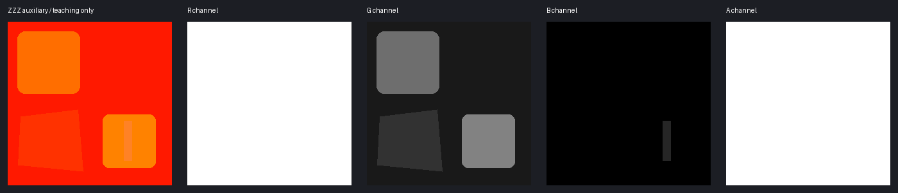

# 绝区零：N / M / A、旧版Alpha与脸图通道详解

[通道基础、UV与AI验收](../../../newbie/tools/TextureChannelGuide/TextureChannelGuide.md)。核心来源：[HoyoToon ZZZ](https://github.com/Hoyotoon/HoyoToon/blob/d9e5ca2f312bf16fba89dee67d32c08b482dcda4/Shaders/ZenlessZoneZero/Include/zzz-program.hlsl)，固定提交 `d9e5ca2f312bf16fba89dee67d32c08b482dcda4`。贴图文件名N/M/A只是常用辨识，必须核对实际材质绑定。

::: warning 不能忽略旧版布局
新辅助图与旧版Alpha打包方式不同。源码 `_LegacyOtherData` 将 Diffuse A、Light A、Material A 分别作为可见性、光滑度、发光来源。把所有A强制255只适合已经确认的新辅助布局与未使用Alpha，**不能推广到全部ZZZ贴图**。
:::



## 相邻教学资源

[合成Diffuse](./assets/synthetic-diffuse.png) · [同UV语义分区](./assets/synthetic-regions.png) · [原始RGBA教学数据](./assets/auxiliary-data.png) · [资源来源与边界](./assets/README.md) · [SHA256清单](./assets/manifest.json)

这些资源只用于学习如何拆通道、量化与合并；分区颜色和材质ID的对应是教学预设，不是游戏官方规则。

## 1. 身体/服装主图总表

[明确采样契约](https://github.com/Hoyotoon/HoyoToon/blob/d9e5ca2f312bf16fba89dee67d32c08b482dcda4/Shaders/ZenlessZoneZero/Include/zzz-program.hlsl#L73-L82)：

| 图与布局 | R | G | B | A |
| --- | --- | --- | --- | --- |
| Diffuse / MainTex（新辅助布局） | RGB自然颜色 | 同左 | 同左 | 依材质透明、鼻线等分支，保留 |
| N / LightTex（身体） | 切线法线X | 切线法线Y | 阴影/漫反射偏置 | 新布局核心路径未统一使用，旧版为光滑度 |
| M / OtherDataTex | 材质区域ID | 金属控制 | 高光遮罩 | 新布局未统一使用，旧版为发光遮罩 |
| A / OtherDataTex2 | 可见性/透明控制 | 光滑度 | 发光遮罩 | 核心路径未确认一般作用，保留 |
| 旧版Diffuse | RGB颜色 | 同左 | 同左 | 辅助可见性来源 |

“LightTex”名字并不等于烘焙LightMap；“A图”名字不代表它只使用Alpha。BC6H的M图是RGB HDR、没有A，因此具体资产组合必须核实。

## 2. N：RG法线，B不是Z

[normal_mapping](https://github.com/Hoyotoon/HoyoToon/blob/d9e5ca2f312bf16fba89dee67d32c08b482dcda4/Shaders/ZenlessZoneZero/Include/zzz-common.hlsl#L186-L209)从RG重建法线；[shadow_body](https://github.com/Hoyotoon/HoyoToon/blob/d9e5ca2f312bf16fba89dee67d32c08b482dcda4/Shaders/ZenlessZoneZero/Include/zzz-common.hlsl#L606-L632)把B用于阴影计算。平坦N图不是标准(128,128,255)，B由原材质决定，常见教学基值约125而非255。

```text
将<image1>这张二次元角色服装UV颜色图转换为ZZZ身体N技术数据图，保持原尺寸和UV布局完全相同，R/G编码浅而连贯的切线法线XY、平坦区域约(128,128)，仅明确缝线、凸起边框和扣件产生微弱梯度，不把颜色明暗当凹凸；B是独立阴影偏置不是法线Z，无原图时所有B先设125作为教学基值，有<image2>同UV原N时优先逐像素继承其B；A按目标新旧布局继承原N、不能默认全白，不保留自然颜色、不生成蓝紫XYZ、不加噪点文字或3D照明，不改变岛边界小配件位置，只输出候选并由外部工具校正XY长度和精确B/A。
```

如果只能生成标准XYZ，先取RG，再单独合并B偏置与原A。模型标准Z不能直接作为N的B。

## 3. M：ID、金属、高光

[specular](https://github.com/Hoyotoon/HoyoToon/blob/d9e5ca2f312bf16fba89dee67d32c08b482dcda4/Shaders/ZenlessZoneZero/Include/zzz-common.hlsl#L211-L220)读取G金属控制、B高光、辅助G光滑度并用R阈值分区。R常见区间以0.2/0.4/0.6/0.8分隔，安全内部代表点0.1/0.3/0.5/0.7/0.9（字节26/76/128/178/230）。具体哪个区是某材质依原参数而定，不是“R=0.3永远金属”。

```text
将<image1>服装UV颜色图转为ZZZ M技术控制图，UV布局与尺寸不变，R编码材质区域ID并依据<image2>同UV原M保持原分区，不根据衣服颜色自行换ID；对已确认的教学分区可用皮肤R230、普通布料178、暗布128、金属76，G非金属0、已确认金属74，B皮肤0、普通布料59、暗布38、金属153，所以教学RGB分别为(230,0,0)、(178,0,59)、(128,0,38)、(76,74,153)，不用自然颜色或阴影渐变，A必须按新旧布局继承原图以免破坏旧版发光，不把所有金色区域判为金属，保留UV缝线与小饰件、不加文字和3D效果，仅输出待定值校验的候选。
```

有参考时覆盖教学分区；R量化到安全区间，金属G与高光B保持分开。特别注意：本固定复刻的 [发光函数](https://github.com/Hoyotoon/HoyoToon/blob/d9e5ca2f312bf16fba89dee67d32c08b482dcda4/Shaders/ZenlessZoneZero/Include/zzz-common.hlsl#L351-L365)还用M的B选择发光色分支，不能未经检查就认定所有效果都只按R选择参数。

## 4. 新辅助A图：你要的红橙控制图

[R透明分支](https://github.com/Hoyotoon/HoyoToon/blob/d9e5ca2f312bf16fba89dee67d32c08b482dcda4/Shaders/ZenlessZoneZero/Include/zzz-program.hlsl#L225-L238)与[G光滑度](https://github.com/Hoyotoon/HoyoToon/blob/d9e5ca2f312bf16fba89dee67d32c08b482dcda4/Shaders/ZenlessZoneZero/Include/zzz-common.hlsl#L211-L220)、B发光是独立功能。这张图通常红橙，是R接近255而B低的合成外观，不是“所有游戏的LightMap都红橙”。

```text
将<image1>这张二次元游戏角色服装UV颜色贴图转换为已确认采用ZZZ新辅助A布局的技术控制遮罩图，UV布局与原尺寸必须完全相同，非发光区域输出红橙色平面数据纹理，R所有像素255表示本次教学材质全部可见，G是光滑度且已确认皮肤区域110、白色浅灰布料25、蓝灰黑布50、金属扣件130，B是发光遮罩且除我明确标出的青蓝发光细条设38之外全部0，所以皮肤RGB(255,110,0)、白布(255,25,0)、暗布(255,50,0)、金属(255,130,0)，不要保留自然颜色、不要把白布变白或黑布变黑，不做普通颜色重绘，不将反光金属当发光，保留所有UV边界、缝线、交叉带与小装饰位置，不加文字不改变布局不做3D渲染，A继承<image2>原辅助图、已确认未用时可255，仅输出该UV控制图候选。
```

**重要：**这是一个显式定义的教学预设，不是皮肤固定110、金属固定130的官方规则。发光细条是否真的发光，需原材质证明；不能因为Diffuse青蓝就认定发光。开启特定发光重映射时低B可能被门限压掉，须核查效果。

## 5. 旧版三张Alpha打包

`OtherData2.xyz = (Diffuse.a, Light.a, OtherData.a)` 的旧版模式下，不能直接把新A图导出后就认为已生效。可以先生成三张单通道候选，再外部打包到旧资产A。

**旧Diffuse A可见性：**

```text
根据<image1>UV位置和<image2>原Diffuse Alpha只修补明确的可见性灰度层，原本可见区域保留255、明确镂空保留0、软边保留原灰度，不从衣服黑白颜色猜透明，不加入发光或光滑度，不改UV与尺寸，只输出单通道候选供外部合并到已确认旧版Diffuse A。
```

**旧N A光滑度：**

```text
将<image1>服装UV图生成单通道光滑度候选，按本次已确认材质预设皮肤110、普通布25、暗布50、金属130，其它区域继承<image2>同UV原N的A，不保留自然颜色、不加入阴影或发光、不改变UV尺寸和边界、不加文字，供外部合并到已确认旧版LightTex A，绝不覆盖RG法线与B阴影。
```

**旧M A发光：**

```text
以<image1>UV位置为参考生成单通道发光遮罩，仅我明确标出的灯带区域255、非发光0且保留细边，未知处继承<image2>原M Alpha，不把金属高光或白布当发光、不产生光晕、不改变UV或加文字，供外部合并到已确认旧版OtherDataTex A，保留原RGB材质控制。
```

这些单通道图不是新辅助图本身。原资产没有Alpha时不应凭想象套旧版布局。

## 6. 脸部LightTex与身体N不一样

[shadow_area_face](https://github.com/Hoyotoon/HoyoToon/blob/d9e5ca2f312bf16fba89dee67d32c08b482dcda4/Shaders/ZenlessZoneZero/Include/zzz-common.hlsl#L579-L590)取R构成脸阴影阈值、A作为AO式乘子；[face_high](https://github.com/Hoyotoon/HoyoToon/blob/d9e5ca2f312bf16fba89dee67d32c08b482dcda4/Shaders/ZenlessZoneZero/Include/zzz-common.hlsl#L810-L825)取G参与高光，B还可 [控制轮廓宽度](https://github.com/Hoyotoon/HoyoToon/blob/d9e5ca2f312bf16fba89dee67d32c08b482dcda4/Shaders/ZenlessZoneZero/Include/zzz-program.hlsl#L455-L461)。脸材质ID另可由顶点数据获取，不一定用M的R。

| 脸部LightTex | 用途 |
| --- | --- |
| R | 随头部/光向控制的脸阴影阈值场 |
| G | 脸部高光控制 |
| B | 条件启用的轮廓线宽度采样 |
| A | AO式控制，部分面部子区域可被代码替换为1 |

```text
以<image1>脸部UV为定位参考修补<image2>同角色原脸部LightTex，保持原尺寸与四通道编码，R保留方向阴影阈值场、G保留脸高光、B保留轮廓控制、A保留AO，不把身体RG法线规则套到脸图、不把Alpha全置255、不用鼻部自然投影代替阈值场，仅修复明确标记区域，不改变UV、不加文字或3D效果，输出候选或独立修改层由外部合并。
```

## 7. Diffuse、二级发光与MatCap

**Diffuse：**

```text
编辑<image1>ZZZ服装UV颜色图，只改变指定RGB配色且保持纹理、UV岛、缝线扣件位置，A由外部工具完整继承<image2>原Diffuse以保留透明及特殊脸部数据，不把控制图颜色画进Diffuse、不新增光源或3D阴影、不加文字，输出同尺寸颜色候选。
```

[二级发光](https://github.com/Hoyotoon/HoyoToon/blob/d9e5ca2f312bf16fba89dee67d32c08b482dcda4/Shaders/ZenlessZoneZero/Include/zzz-common.hlsl#L401-L424)可选RGB Mask通道，并对另一张发光图做旋转、平移、UV选择。不是通用服装UV常量。

**SecondaryEmissionMask：**

```text
以<image2>同UV原SecondaryEmissionMask为模板，只对我明确指定且材质配置选中的R或G或B通道制作发光区域灰度候选、区域255其它0，所有其它通道与A保持原图，保留原UV和尺寸，不把发光画成光晕，不凭名字选择通道、不加文字，输出单层供外部合并与ST采样验证。
```

**SecondaryEmissionTex：**

```text
以<image1>原SecondaryEmissionTex为布局模板按指定颜色编辑发光纹样RGB，保持原尺寸、平铺连续性与Alpha，不擅自使用服装UV、不改变运行时旋转或滚动所需的边缘结构，不加背景文字或3D照明，只输出候选供材质UV与ST变换测试。
```

**MatCap：**

```text
以<image1>原MatCap为球面查表布局参考修改指定高光外观，保持尺寸、中心方向与Alpha，不放服装UV或自然场景，不重排查表区、不加文字，只输出外观候选并在模型转视角时检验。
```

## 验收与已有Demo的边界

确认新/旧辅助布局、身体/脸、MainUV/LightUV、Shader参数；检查RG解包、B偏置、M的ID与G/B、A图R/G/B、所有旧Alpha。教学示意与提示词未作为实际模型质量测试；先生成候选，再外部严格赋值、继承原通道并实机验证。此前单组常量Alpha Demo只能说明那组新辅助布局，不是全游戏规则。
