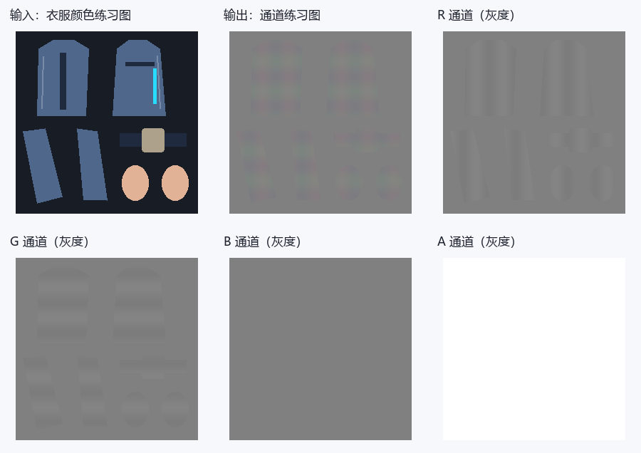
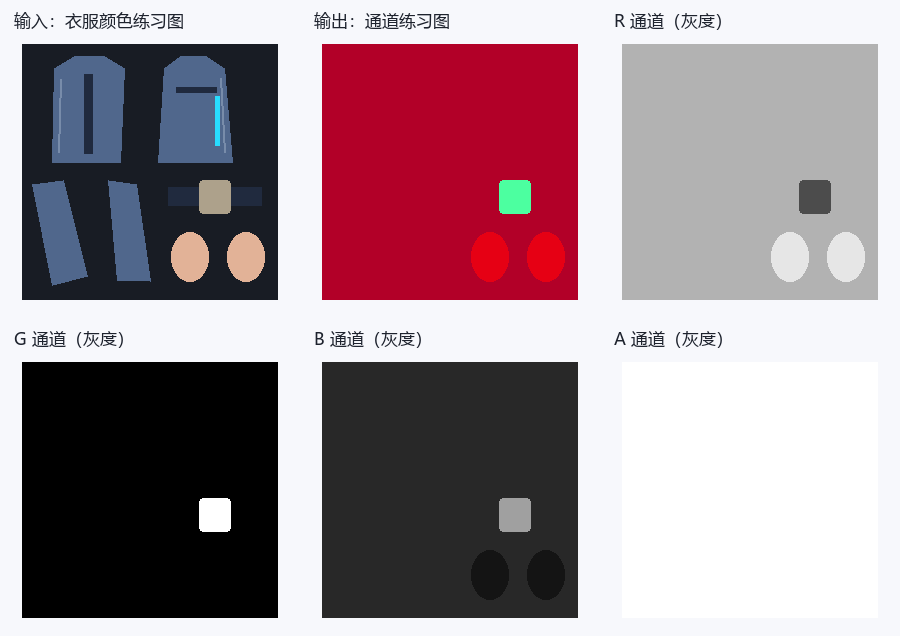
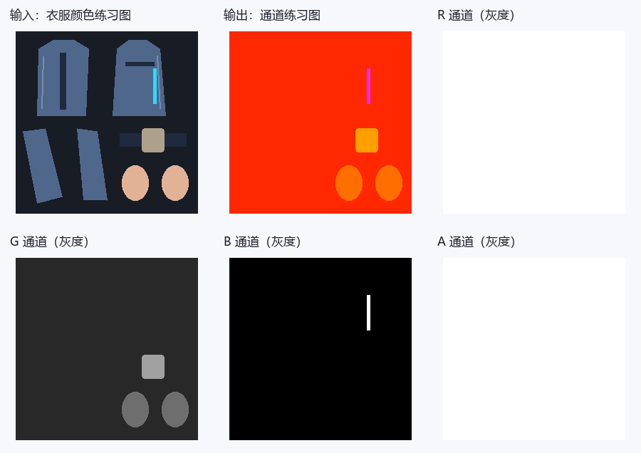
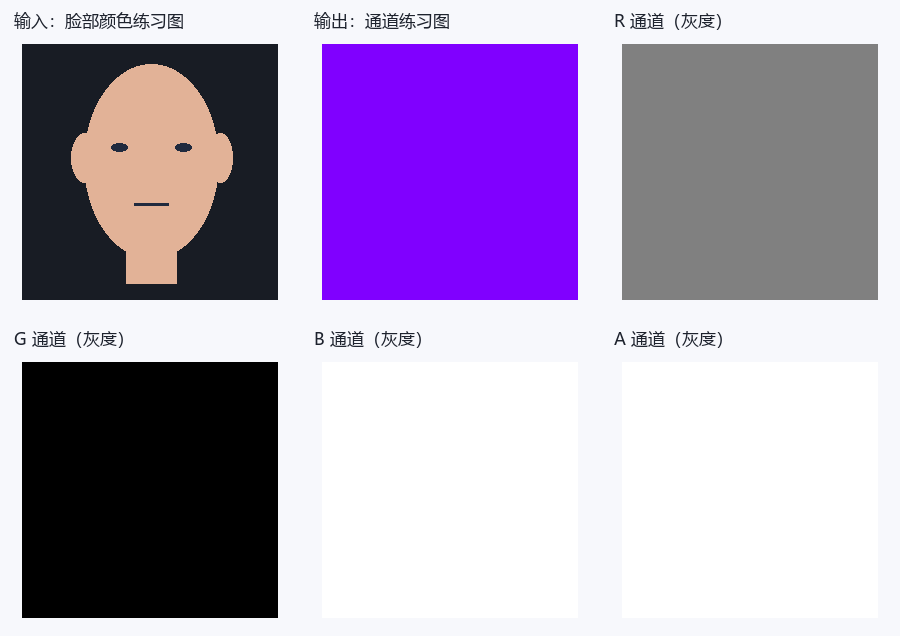
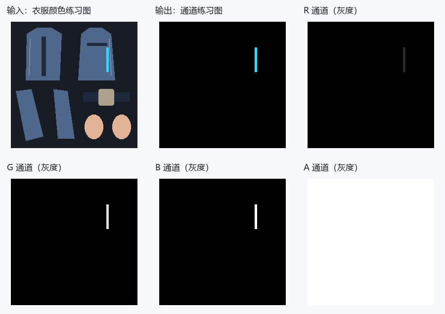
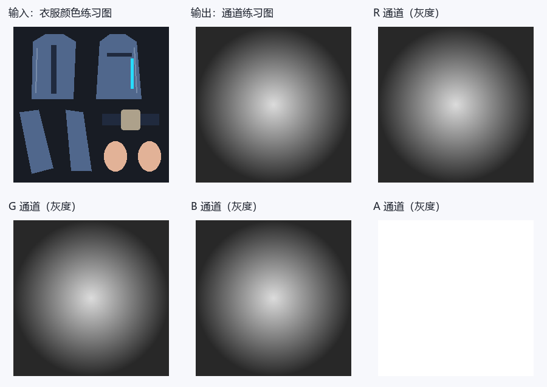

# 绝区零：逐贴图通道图解与建议提示词

选好下面的贴图类型，就可以查看 RGBA 通道的作用、数值示例和建议提示词。每个分区都提供两种模板：**只有 DiffuseMap**，或 **DiffuseMap＋Blender 导出的 UV 分布图**，可用于 ChatGPT 等支持参考图的图像模型。

如果手边有模型，建议一起提供 UV 图：模型会更容易辨认 UV 岛、边界和细条，通常有助于对齐。只有 Diffuse 也可以尝试；请补充皮肤、布料、裸金属或发光区域的文字说明。

这里的提示词是可调整的参考模板，数字是练习预设，不是角色原始参数。图解是教学示意，不是 AI 实测结果。生成后仍需检查尺寸、UV 和通道数值；UV 图也不能代替材质参数、几何法线或 SDF 方向信息。

## 找到你要生成的贴图

- [DiffuseMap / 颜色图](#map-diffuse)
- [身体 N / LightTex](#map-normal)
- [M / OtherDataTex 材质图](#map-material)
- [新辅助 A / OtherDataTex2](#map-auxiliary)
- [旧版三张 Alpha 打包](#map-legacy-alpha)
- [脸部 LightTex](#map-facelight)
- [SecondaryEmissionMask](#map-secondary-mask)
- [SecondaryEmissionTex](#map-secondary-emission)
- [Ramp / 该实现无独立绑定](#map-ramp)
- [MatCap / 球面外观图](#map-matcap)
- [LUT / 精确布局与适用范围](#map-lut)
- [EyeColorMap / 眼色参数表](#map-eye-color)
- [ScreenTex / 投影叠加](#map-screen-texture)
- [ScreenMask / 叠加遮罩](#map-screen-mask)
- [HueMaskTexture / 换色遮罩](#map-hue-mask)

## 准备参考图

- **单图方式：** 上传对应材质的 DiffuseMap 颜色贴图，再复制该分区的单图模板。
- **双图方式：** 第一张上传 DiffuseMap，第二张上传同一材质、同一 UV 层的 UV 分布图，再复制双图模板。两张图保持相同宽高、方向和 0～1 范围，不裁切、不镜像，也不要把 UV 线直接画进 Diffuse。
- **Blender 导出：** 选中目标网格，进入编辑模式并选中该材质对应的面；在 UV 编辑器中选择正确的 UV 层，使用 **UV → 导出 UV 布局（Export UV Layout）**。尺寸设为 Diffuse 的宽高，填充不透明度设为 0，导出 PNG。若没有该选项，可在 Blender 的扩展/插件设置中启用 UV Layout。多材质请分别导出；UDIM 请注明 tile 编号，不要拼成截图。
- 可以下载本页的[教学 Diffuse](./assets/reference-inputs/diffuse.png)与[教学 UV 图](./assets/reference-inputs/uv.png)了解输入形式。它们是通用衣片示意；脸部或头发贴图请换成自己的对应材质参考图，不要用衣服 UV 代替。
- 模板按文中预设开始练习。想调整材质时，可以改预设数值，并补充“哪些区域是什么材质”；UV 只提供边界，不提供材质标签。

## 通道阅读小提示

- 数据值用0～255；线性UNORM中除以255得到0～1。字节128约0.502，若RGB被sRGB解码则约0.216，不能对控制图做自动Gamma或美化。Alpha通常不经过sRGB转换，仍要核对加载路径。
- 灰度白只意味着数值大：乘子、反向遮罩、材质ID、方向数据的“白”含义不同。下面逐图解释，不用一条规则概括。
- 只上传Diffuse时，材质分类是猜测。裸金属、丝袜、发光区域最好在文字里指出；不明区域有保守默认值，但它不恢复原角色ID。
- 合成预览可能受Alpha显示影响；灰度A图是真正的第四通道。下载各层后用取色器看字节，不靠预览颜色判断。

## 1. DiffuseMap / 颜色图 {#map-diffuse}

先看输入的蓝色衣片：颜色图里它就该是蓝色，R/G/B是颜色分量。到了控制图，同一片蓝布可能变成红橙色，那不是改了衣服颜色，而是几个控制值叠在一起。


**教学示意：** 数字对应本节练习预设，图例不属于贴图数据。

[原始RGBA图](./assets/maps/diffuse/diffuse.png) · [R灰度层](./assets/maps/diffuse/diffuse-r.png) · [G灰度层](./assets/maps/diffuse/diffuse-g.png) · [B灰度层](./assets/maps/diffuse/diffuse-b.png) · [A灰度层](./assets/maps/diffuse/diffuse-a.png)

**R怎么用：** R是基础颜色红分量，0最低、255最高。

**G怎么用：** G是基础颜色绿分量，0最低、255最高。

**B怎么用：** B是基础颜色蓝分量，0最低、255最高。

**A怎么用：** A在普通分支参与UseAlpha处理；LegacyOtherData时还复制为辅助R，脸部分支输入鼻线控制，眼影分支乘EyeColorMap.A。不同分支不可统一填255。

颜色分量不是金属、高光或AO；不要增加新的方向光、投影和高光。

**Alpha分支证据：** [apply_alpha](https://github.com/Hoyotoon/HoyoToon/blob/d9e5ca2f312bf16fba89dee67d32c08b482dcda4/Shaders/ZenlessZoneZero/Include/zzz-common.hlsl#L124-L136)在AlphaCutoff≤0时才clip(alpha−cutoff)，AlphaCutoff>0时反而执行结果A乘原Alpha。按通常非负Alpha，cutoff=0不会丢弃A=0像素；不要将这段复刻写成“低于任意正Cutoff就裁剪”的标准规则。[鼻线读Diffuse.A](https://github.com/Hoyotoon/HoyoToon/blob/d9e5ca2f312bf16fba89dee67d32c08b482dcda4/Shaders/ZenlessZoneZero/Include/zzz-program.hlsl#L168-L169)和[Legacy来源](https://github.com/Hoyotoon/HoyoToon/blob/d9e5ca2f312bf16fba89dee67d32c08b482dcda4/Shaders/ZenlessZoneZero/Include/zzz-program.hlsl#L73-L82)需分别选择。

### 建议提示词

有 UV 分布图时可选双图模板，更方便核对边界；单图模板同样可以作为起点。

::: tabs

== 只有 DiffuseMap


```text
请根据我上传的这一张绝区零角色DiffuseMap颜色贴图，生成DiffuseMap / 颜色图的颜色贴图草稿。

生成图片必须与上传Diffuse的像素尺寸、UV岛位置、空白区域、缝线、扣件和所有细条完全对齐，不缩放、镜像、移动或重新排UV。

通道数值采用8位0～255，不做Gamma、自动对比度、美化或预乘Alpha。

完整通道规则：R是基础颜色红分量，0最低、255最高；
G是基础颜色绿分量，0最低、255最高；
B是基础颜色蓝分量，0最低、255最高；
A在普通分支参与UseAlpha处理；LegacyOtherData时还复制为辅助R，脸部分支输入鼻线控制，眼影分支乘EyeColorMap.A。不同分支不可统一填255。

本次明确采用的生成预设：本次生成同UV、不透明Diffuse颜色草稿：R/G/B按我给出的新配色修改，未指定改色时保留上传图的RGB颜色；
A固定255，不猜透明、发光或材质ID。

不要把自然衣服颜色、RGB明暗或金色油漆直接当成金属、AO或高光值；
只修改我指定的配色，未指定处保留上传Diffuse的颜色和绘制细节。

输出只有目标贴图，不加文字、通道标签、图例、拼图、背景场景、3D渲染或光晕。

这是按给定预设生成的候选，不视为角色原始通道的还原；
不能输出真实Alpha时明确说明，不要以白底预览代替 RGBA 文件。
```

== DiffuseMap＋UV 分布图


```text
我上传了两张参考图：第一张是绝区零角色 DiffuseMap 颜色贴图，第二张是 Blender 导出的同一材质 UV 分布图。请结合这两张参考图，生成DiffuseMap / 颜色图的颜色贴图草稿。

生成图片必须与上传Diffuse的像素尺寸、UV岛位置、空白区域、缝线、扣件和所有细条完全对齐，不缩放、镜像、移动或重新排UV。

通道数值采用8位0～255，不做Gamma、自动对比度、美化或预乘Alpha。

完整通道规则：R是基础颜色红分量，0最低、255最高；
G是基础颜色绿分量，0最低、255最高；
B是基础颜色蓝分量，0最低、255最高；
A在普通分支参与UseAlpha处理；LegacyOtherData时还复制为辅助R，脸部分支输入鼻线控制，眼影分支乘EyeColorMap.A。不同分支不可统一填255。

本次明确采用的生成预设：本次生成同UV、不透明Diffuse颜色草稿：R/G/B按我给出的新配色修改，未指定改色时保留上传图的RGB颜色；
A固定255，不猜透明、发光或材质ID。

不要把自然衣服颜色、RGB明暗或金色油漆直接当成金属、AO或高光值；
只修改我指定的配色，未指定处保留上传Diffuse的颜色和绘制细节。

输出只有目标贴图，不加文字、通道标签、图例、拼图、背景场景、3D渲染或光晕。

这是按给定预设生成的候选，不视为角色原始通道的还原；
不能输出真实Alpha时明确说明，不要以白底预览代替 RGBA 文件。

以 Diffuse 的像素画布为基准，用 UV 分布图核对岛轮廓、细条、边界与空白区域。UV 线是参考标记，不得画入结果，也不作为 AO、缝线、法线或高光。

若两图尺寸、朝向或岛位置不一致，请先让我确认，不自行缩放或对齐。

UV 图没有材质标签或几何方向；
未确认区域仍按上述预设，不据 UV 线推断真实法线、SDF 或材质 ID。
```

:::


**拿到结果先看：** 尺寸、UV边界和每通道数值，并检查 Alpha、常量与阈值。模型输出有偏色或渐变时，用通道编辑器精确赋值，确认无误后再导出目标格式并测试。

## 2. 身体 N / LightTex {#map-normal}

看R和G里的细小变化，方向信息藏在这些梯度里，而不是藏在“蓝紫色外观”里。平坦区域约128；从128向两侧偏移表示向不同切线方向倾斜，不是越白越凸。



**教学示意：** 数字对应本节练习预设，图例不属于贴图数据。

[原始RGBA图](./assets/maps/normal/normal.png) · [R灰度层](./assets/maps/normal/normal-r.png) · [G灰度层](./assets/maps/normal/normal-g.png) · [B灰度层](./assets/maps/normal/normal-b.png) · [A灰度层](./assets/maps/normal/normal-a.png)

**R怎么用：** R编码切线法线X：0负方向、128附近零偏转、255正方向。

**G怎么用：** G编码切线法线Y：解包为(2G−1)*BumpScale；此活动函数没有另写G取反，朝向由TBN、tangent.w和正反面决定。

**B怎么用：** B为阴影偏置，无自阴影衰减时输入4B−2+N·L，增大偏亮、减小偏暗，0−2偏置、255+2，128附近0。

**A怎么用：** A在新布局的普通身体渲染中未消费（debug可显示）；LegacyOtherData开启时，LightTex.A复制到辅助G作为光滑度。

**采样范围：** [主程序实际RGBA来源](https://github.com/Hoyotoon/HoyoToon/blob/d9e5ca2f312bf16fba89dee67d32c08b482dcda4/Shaders/ZenlessZoneZero/Include/zzz-program.hlsl#L73-L82)、[普通高光读取](https://github.com/Hoyotoon/HoyoToon/blob/d9e5ca2f312bf16fba89dee67d32c08b482dcda4/Shaders/ZenlessZoneZero/Include/zzz-common.hlsl#L186-L219)、[Stencil R分支](https://github.com/Hoyotoon/HoyoToon/blob/d9e5ca2f312bf16fba89dee67d32c08b482dcda4/Shaders/ZenlessZoneZero/Include/zzz-program.hlsl#L226-L237)。上述“未消费”仅指此固定版本正常渲染，调试显示不是材质用途。

### 建议提示词

有 UV 分布图时可选双图模板，更方便核对边界；单图模板同样可以作为起点。

::: tabs

== 只有 DiffuseMap


```text
请根据我上传的这一张绝区零角色DiffuseMap颜色贴图，生成身体 N / LightTex的技术数据草稿。

生成图片必须与上传Diffuse的像素尺寸、UV岛位置、空白区域、缝线、扣件和所有细条完全对齐，不缩放、镜像、移动或重新排UV。

通道数值采用8位0～255，不做Gamma、自动对比度、美化或预乘Alpha。

完整通道规则：R编码切线法线X：0负方向、128附近零偏转、255正方向；
G编码切线法线Y：解包为(2G−1)*BumpScale；此活动函数没有另写G取反，朝向由TBN、tangent.w和正反面决定；
B为阴影偏置，无自阴影衰减时输入4B−2+N·L，增大偏亮、减小偏暗，0−2偏置、255+2，128附近0；
A新辅助布局未确认一般用途；
旧版A是光滑度。

本次明确采用的生成预设：只针对新辅助布局：平坦RGBA(128,128,128,255)，浅缝线变化RG，B全128近零偏置、A255占位；
不是旧版成品。

不要把自然衣服颜色、RGB明暗或金色油漆直接当成金属、AO或高光值；
只按我文字确认的材质区域分类，无法判断的区域使用上述未知默认值，没有默认时使用本次占位规则而不推断原游戏数据。

输出只有目标贴图，不加文字、通道标签、图例、拼图、背景场景、3D渲染或光晕。

这是按给定预设生成的候选，不视为角色原始通道的还原；
不能输出真实Alpha时明确说明，不要以白底预览代替 RGBA 文件。

法线细节仅来自我明确指出的浅缝线、压边、扣件和发丝结构，不把Diffuse明暗转成高度，不新增织物噪点；
XY解码为2×值/255−1，保持X²+Y²≤1并按目标定义重建或填写Z，不能把方向极值当凹凸强度。
```

== DiffuseMap＋UV 分布图


```text
我上传了两张参考图：第一张是绝区零角色 DiffuseMap 颜色贴图，第二张是 Blender 导出的同一材质 UV 分布图。请结合这两张参考图，生成身体 N / LightTex的技术数据草稿。

生成图片必须与上传Diffuse的像素尺寸、UV岛位置、空白区域、缝线、扣件和所有细条完全对齐，不缩放、镜像、移动或重新排UV。

通道数值采用8位0～255，不做Gamma、自动对比度、美化或预乘Alpha。

完整通道规则：R编码切线法线X：0负方向、128附近零偏转、255正方向；
G编码切线法线Y：解包为(2G−1)*BumpScale；此活动函数没有另写G取反，朝向由TBN、tangent.w和正反面决定；
B为阴影偏置，无自阴影衰减时输入4B−2+N·L，增大偏亮、减小偏暗，0−2偏置、255+2，128附近0；
A新辅助布局未确认一般用途；
旧版A是光滑度。

本次明确采用的生成预设：只针对新辅助布局：平坦RGBA(128,128,128,255)，浅缝线变化RG，B全128近零偏置、A255占位；
不是旧版成品。

不要把自然衣服颜色、RGB明暗或金色油漆直接当成金属、AO或高光值；
只按我文字确认的材质区域分类，无法判断的区域使用上述未知默认值，没有默认时使用本次占位规则而不推断原游戏数据。

输出只有目标贴图，不加文字、通道标签、图例、拼图、背景场景、3D渲染或光晕。

这是按给定预设生成的候选，不视为角色原始通道的还原；
不能输出真实Alpha时明确说明，不要以白底预览代替 RGBA 文件。

法线细节仅来自我明确指出的浅缝线、压边、扣件和发丝结构，不把Diffuse明暗转成高度，不新增织物噪点；
XY解码为2×值/255−1，保持X²+Y²≤1并按目标定义重建或填写Z，不能把方向极值当凹凸强度。

以 Diffuse 的像素画布为基准，用 UV 分布图核对岛轮廓、细条、边界与空白区域。UV 线是参考标记，不得画入结果，也不作为 AO、缝线、法线或高光。

若两图尺寸、朝向或岛位置不一致，请先让我确认，不自行缩放或对齐。

UV 图没有材质标签或几何方向；
未确认区域仍按上述预设，不据 UV 线推断真实法线、SDF 或材质 ID。
```

:::


**拿到结果先看：** 尺寸、UV边界和每通道数值，并检查 Alpha、常量与阈值。模型输出有偏色或渐变时，用通道编辑器精确赋值，确认无误后再导出目标格式并测试。

## 3. M / OtherDataTex 材质图 {#map-material}

先找图中的衣片和扣件，再分别看R/G/B/A。同一位置在不同通道里的灰度可以完全不同：一层选材质，一层管高光，一层管阴影。不要为了让合成预览“像原衣服”而把四层一起涂。



**教学示意：** 数字对应本节练习预设，图例不属于贴图数据。

[原始RGBA图](./assets/maps/material/material.png) · [R灰度层](./assets/maps/material/material-r.png) · [G灰度层](./assets/maps/material/material-g.png) · [B灰度层](./assets/maps/material/material-b.png) · [A灰度层](./assets/maps/material/material-a.png)

**R怎么用：** R参数分组：0～50组5、51～101组4、102～152组3、153～203组2、204～255组1；没有越大越金属。

**G怎么用：** G乘Metallic参数，0非金属端、增大更偏金属响应，不等于更亮。

**B怎么用：** B普通高光权重/特殊形状门槛，增大可增强扩范围；另按0.2/0.4/0.6/0.8分发光颜色。

**A怎么用：** A在新布局的普通身体渲染中未消费（debug可显示）；LegacyOtherData开启时，OtherDataTex.A复制到辅助B作为发光。

**采样范围：** [主程序实际RGBA来源](https://github.com/Hoyotoon/HoyoToon/blob/d9e5ca2f312bf16fba89dee67d32c08b482dcda4/Shaders/ZenlessZoneZero/Include/zzz-program.hlsl#L73-L82)、[普通高光读取](https://github.com/Hoyotoon/HoyoToon/blob/d9e5ca2f312bf16fba89dee67d32c08b482dcda4/Shaders/ZenlessZoneZero/Include/zzz-common.hlsl#L186-L219)、[Stencil R分支](https://github.com/Hoyotoon/HoyoToon/blob/d9e5ca2f312bf16fba89dee67d32c08b482dcda4/Shaders/ZenlessZoneZero/Include/zzz-program.hlsl#L226-L237)。上述“未消费”仅指此固定版本正常渲染，调试显示不是材质用途。

### 建议提示词

有 UV 分布图时可选双图模板，更方便核对边界；单图模板同样可以作为起点。

::: tabs

== 只有 DiffuseMap


```text
请根据我上传的这一张绝区零角色DiffuseMap颜色贴图，生成M / OtherDataTex 材质图的技术数据草稿。

生成图片必须与上传Diffuse的像素尺寸、UV岛位置、空白区域、缝线、扣件和所有细条完全对齐，不缩放、镜像、移动或重新排UV。

通道数值采用8位0～255，不做Gamma、自动对比度、美化或预乘Alpha。

完整通道规则：R参数分组：0～50组5、51～101组4、102～152组3、153～203组2、204～255组1；
没有越大越金属；
G乘Metallic参数，0非金属端、增大更偏金属响应，不等于更亮；
B普通高光权重/特殊形状门槛，增大可增强扩范围；
另按0.2/0.4/0.6/0.8分发光颜色；
A新辅助布局未确认一般用途；
旧版A是发光。

本次明确采用的生成预设：仅新布局练习：皮肤RGBA(230,0,20,255)、布(178,0,40,255)、裸金属(76,255,160,255)、未知(178,0,40,255)。R对应本次人为组别，不恢复角色原ID；
金属需用户明确说明。

不要把自然衣服颜色、RGB明暗或金色油漆直接当成金属、AO或高光值；
只按我文字确认的材质区域分类，无法判断的区域使用上述未知默认值，没有默认时使用本次占位规则而不推断原游戏数据。

输出只有目标贴图，不加文字、通道标签、图例、拼图、背景场景、3D渲染或光晕。

这是按给定预设生成的候选，不视为角色原始通道的还原；
不能输出真实Alpha时明确说明，不要以白底预览代替 RGBA 文件。

除上面明确要求的连续阴影或灰度过渡外，每个确认材质区按预设定值填充；
材质ID禁止渐变，不要因为白布/黑布就另设控制值。背景和未识别区按本次默认编码，不自行补未给出的游戏规则。
```

== DiffuseMap＋UV 分布图


```text
我上传了两张参考图：第一张是绝区零角色 DiffuseMap 颜色贴图，第二张是 Blender 导出的同一材质 UV 分布图。请结合这两张参考图，生成M / OtherDataTex 材质图的技术数据草稿。

生成图片必须与上传Diffuse的像素尺寸、UV岛位置、空白区域、缝线、扣件和所有细条完全对齐，不缩放、镜像、移动或重新排UV。

通道数值采用8位0～255，不做Gamma、自动对比度、美化或预乘Alpha。

完整通道规则：R参数分组：0～50组5、51～101组4、102～152组3、153～203组2、204～255组1；
没有越大越金属；
G乘Metallic参数，0非金属端、增大更偏金属响应，不等于更亮；
B普通高光权重/特殊形状门槛，增大可增强扩范围；
另按0.2/0.4/0.6/0.8分发光颜色；
A新辅助布局未确认一般用途；
旧版A是发光。

本次明确采用的生成预设：仅新布局练习：皮肤RGBA(230,0,20,255)、布(178,0,40,255)、裸金属(76,255,160,255)、未知(178,0,40,255)。R对应本次人为组别，不恢复角色原ID；
金属需用户明确说明。

不要把自然衣服颜色、RGB明暗或金色油漆直接当成金属、AO或高光值；
只按我文字确认的材质区域分类，无法判断的区域使用上述未知默认值，没有默认时使用本次占位规则而不推断原游戏数据。

输出只有目标贴图，不加文字、通道标签、图例、拼图、背景场景、3D渲染或光晕。

这是按给定预设生成的候选，不视为角色原始通道的还原；
不能输出真实Alpha时明确说明，不要以白底预览代替 RGBA 文件。

除上面明确要求的连续阴影或灰度过渡外，每个确认材质区按预设定值填充；
材质ID禁止渐变，不要因为白布/黑布就另设控制值。背景和未识别区按本次默认编码，不自行补未给出的游戏规则。

以 Diffuse 的像素画布为基准，用 UV 分布图核对岛轮廓、细条、边界与空白区域。UV 线是参考标记，不得画入结果，也不作为 AO、缝线、法线或高光。

若两图尺寸、朝向或岛位置不一致，请先让我确认，不自行缩放或对齐。

UV 图没有材质标签或几何方向；
未确认区域仍按上述预设，不据 UV 线推断真实法线、SDF 或材质 ID。
```

:::


**拿到结果先看：** 尺寸、UV边界和每通道数值，并检查 Alpha、常量与阈值。模型输出有偏色或渐变时，用通道编辑器精确赋值，确认无误后再导出目标格式并测试。

## 4. 新辅助 A / OtherDataTex2 {#map-auxiliary}

先找图中的衣片和扣件，再分别看R/G/B/A。同一位置在不同通道里的灰度可以完全不同：一层选材质，一层管高光，一层管阴影。不要为了让合成预览“像原衣服”而把四层一起涂。



**教学示意：** 数字对应本节练习预设，图例不属于贴图数据。

[原始RGBA图](./assets/maps/auxiliary/auxiliary.png) · [R灰度层](./assets/maps/auxiliary/auxiliary-r.png) · [G灰度层](./assets/maps/auxiliary/auxiliary-g.png) · [B灰度层](./assets/maps/auxiliary/auxiliary-b.png) · [A灰度层](./assets/maps/auxiliary/auxiliary-a.png)

**R怎么用：** R在EnableStencil且MaterialType=4的Stencil分支写结果Alpha=max(R,MinStencilAlpha)；这份代码并未把它用于所有普通身体pass的透明度。

**G怎么用：** G光滑度，(1−G×Glossiness)²，增大通常更集中，0粗糙端255光滑端。

**B怎么用：** B发光，普通按B；重映射saturate(1.25(B−0.2))，0～51无贡献、52起开始。

**A怎么用：** A在此固定实现的正常OtherDataTex2渲染中未消费，debug读取不等于存在材质效果。

**采样范围：** [主程序实际RGBA来源](https://github.com/Hoyotoon/HoyoToon/blob/d9e5ca2f312bf16fba89dee67d32c08b482dcda4/Shaders/ZenlessZoneZero/Include/zzz-program.hlsl#L73-L82)、[普通高光读取](https://github.com/Hoyotoon/HoyoToon/blob/d9e5ca2f312bf16fba89dee67d32c08b482dcda4/Shaders/ZenlessZoneZero/Include/zzz-common.hlsl#L186-L219)、[Stencil R分支](https://github.com/Hoyotoon/HoyoToon/blob/d9e5ca2f312bf16fba89dee67d32c08b482dcda4/Shaders/ZenlessZoneZero/Include/zzz-program.hlsl#L226-L237)。上述“未消费”仅指此固定版本正常渲染，调试显示不是材质用途。

### 建议提示词

有 UV 分布图时可选双图模板，更方便核对边界；单图模板同样可以作为起点。

::: tabs

== 只有 DiffuseMap


```text
请根据我上传的这一张绝区零角色DiffuseMap颜色贴图，生成新辅助 A / OtherDataTex2的技术数据草稿。

生成图片必须与上传Diffuse的像素尺寸、UV岛位置、空白区域、缝线、扣件和所有细条完全对齐，不缩放、镜像、移动或重新排UV。

通道数值采用8位0～255，不做Gamma、自动对比度、美化或预乘Alpha。

完整通道规则：R在EnableStencil且MaterialType=4的Stencil分支写结果Alpha=max(R,MinStencilAlpha)；这份代码并未把它用于所有普通身体pass的透明度；
G光滑度，(1−G×Glossiness)²，增大通常更集中，0粗糙端255光滑端；
B发光，普通按B；
重映射saturate(1.25(B−0.2))，0～51无贡献、52起开始；
A在此固定实现的正常OtherDataTex2渲染中未消费，debug读取不等于存在材质效果。

本次明确采用的生成预设：不透明新布局练习：R255、A255；
G皮肤110、布40、金属160、未知40；
B只有用户明确的灯带255，其它0。不要按白布黑布自行设光滑度，不靠青蓝颜色猜发光。

不要把自然衣服颜色、RGB明暗或金色油漆直接当成金属、AO或高光值；
只按我文字确认的材质区域分类，无法判断的区域使用上述未知默认值，没有默认时使用本次占位规则而不推断原游戏数据。

输出只有目标贴图，不加文字、通道标签、图例、拼图、背景场景、3D渲染或光晕。

这是按给定预设生成的候选，不视为角色原始通道的还原；
不能输出真实Alpha时明确说明，不要以白底预览代替 RGBA 文件。

除上面明确要求的连续阴影或灰度过渡外，每个确认材质区按预设定值填充；
材质ID禁止渐变，不要因为白布/黑布就另设控制值。背景和未识别区按本次默认编码，不自行补未给出的游戏规则。
```

== DiffuseMap＋UV 分布图


```text
我上传了两张参考图：第一张是绝区零角色 DiffuseMap 颜色贴图，第二张是 Blender 导出的同一材质 UV 分布图。请结合这两张参考图，生成新辅助 A / OtherDataTex2的技术数据草稿。

生成图片必须与上传Diffuse的像素尺寸、UV岛位置、空白区域、缝线、扣件和所有细条完全对齐，不缩放、镜像、移动或重新排UV。

通道数值采用8位0～255，不做Gamma、自动对比度、美化或预乘Alpha。

完整通道规则：R在EnableStencil且MaterialType=4的Stencil分支写结果Alpha=max(R,MinStencilAlpha)；这份代码并未把它用于所有普通身体pass的透明度；
G光滑度，(1−G×Glossiness)²，增大通常更集中，0粗糙端255光滑端；
B发光，普通按B；
重映射saturate(1.25(B−0.2))，0～51无贡献、52起开始；
A在此固定实现的正常OtherDataTex2渲染中未消费，debug读取不等于存在材质效果。

本次明确采用的生成预设：不透明新布局练习：R255、A255；
G皮肤110、布40、金属160、未知40；
B只有用户明确的灯带255，其它0。不要按白布黑布自行设光滑度，不靠青蓝颜色猜发光。

不要把自然衣服颜色、RGB明暗或金色油漆直接当成金属、AO或高光值；
只按我文字确认的材质区域分类，无法判断的区域使用上述未知默认值，没有默认时使用本次占位规则而不推断原游戏数据。

输出只有目标贴图，不加文字、通道标签、图例、拼图、背景场景、3D渲染或光晕。

这是按给定预设生成的候选，不视为角色原始通道的还原；
不能输出真实Alpha时明确说明，不要以白底预览代替 RGBA 文件。

除上面明确要求的连续阴影或灰度过渡外，每个确认材质区按预设定值填充；
材质ID禁止渐变，不要因为白布/黑布就另设控制值。背景和未识别区按本次默认编码，不自行补未给出的游戏规则。

以 Diffuse 的像素画布为基准，用 UV 分布图核对岛轮廓、细条、边界与空白区域。UV 线是参考标记，不得画入结果，也不作为 AO、缝线、法线或高光。

若两图尺寸、朝向或岛位置不一致，请先让我确认，不自行缩放或对齐。

UV 图没有材质标签或几何方向；
未确认区域仍按上述预设，不据 UV 线推断真实法线、SDF 或材质 ID。
```

:::


**拿到结果先看：** 尺寸、UV边界和每通道数值，并检查 Alpha、常量与阈值。模型输出有偏色或渐变时，用通道编辑器精确赋值，确认无误后再导出目标格式并测试。

## 5. 旧版三张 Alpha 打包 {#map-legacy-alpha}

同样的三项功能，旧版分散在三张贴图的Alpha里。要生成的是三个目标数据层，不是把新辅助A图直接丢进旧版槽位。

**R怎么用：** 辅助R来源是Diffuse A，作可见性0隐藏端255可见端。

**G怎么用：** 辅助G来源是N/LightTex A，作光滑度0粗255光滑。

**B怎么用：** 辅助B来源是M/OtherDataTex A，作发光0无贡献255最大，受重映射门槛。

**A怎么用：** 三个Alpha分别写入三张资产，不是新A图的Alpha。

一次提示词可以请求三个文件，但模型可能只能返回一张，实际按三个目标分别执行。

### 建议提示词

有 UV 分布图时可选双图模板，更方便核对边界；单图模板同样可以作为起点。

::: tabs

== 只有 DiffuseMap


```text
请根据我上传的这一张绝区零角色DiffuseMap颜色贴图，生成旧版三张 Alpha 打包的技术数据草稿。

生成图片必须与上传Diffuse的像素尺寸、UV岛位置、空白区域、缝线、扣件和所有细条完全对齐，不缩放、镜像、移动或重新排UV。

通道数值采用8位0～255，不做Gamma、自动对比度、美化或预乘Alpha。

完整通道规则：辅助R来源是Diffuse A，作可见性0隐藏端255可见端；
辅助G来源是N/LightTex A，作光滑度0粗255光滑；
辅助B来源是M/OtherDataTex A，作发光0无贡献255最大，受重映射门槛；
三个Alpha分别写入三张资产，不是新A图的Alpha。

本次明确采用的生成预设：生成三张独立同UV灰度草稿：可见性全255；
光滑度皮肤110布40金属160未知40；
发光只明确灯带255其余0。PNG本身A=255，标注由用户选择的输出顺序，不把三层塞到一张RGB冒充旧资源。

不要把自然衣服颜色、RGB明暗或金色油漆直接当成金属、AO或高光值；
只按我文字确认的材质区域分类，无法判断的区域使用上述未知默认值，没有默认时使用本次占位规则而不推断原游戏数据。

输出只有目标贴图，不加文字、通道标签、图例、拼图、背景场景、3D渲染或光晕。

这是按给定预设生成的候选，不视为角色原始通道的还原；
不能输出真实Alpha时明确说明，不要以白底预览代替 RGBA 文件。
```

== DiffuseMap＋UV 分布图


```text
我上传了两张参考图：第一张是绝区零角色 DiffuseMap 颜色贴图，第二张是 Blender 导出的同一材质 UV 分布图。请结合这两张参考图，生成旧版三张 Alpha 打包的技术数据草稿。

生成图片必须与上传Diffuse的像素尺寸、UV岛位置、空白区域、缝线、扣件和所有细条完全对齐，不缩放、镜像、移动或重新排UV。

通道数值采用8位0～255，不做Gamma、自动对比度、美化或预乘Alpha。

完整通道规则：辅助R来源是Diffuse A，作可见性0隐藏端255可见端；
辅助G来源是N/LightTex A，作光滑度0粗255光滑；
辅助B来源是M/OtherDataTex A，作发光0无贡献255最大，受重映射门槛；
三个Alpha分别写入三张资产，不是新A图的Alpha。

本次明确采用的生成预设：生成三张独立同UV灰度草稿：可见性全255；
光滑度皮肤110布40金属160未知40；
发光只明确灯带255其余0。PNG本身A=255，标注由用户选择的输出顺序，不把三层塞到一张RGB冒充旧资源。

不要把自然衣服颜色、RGB明暗或金色油漆直接当成金属、AO或高光值；
只按我文字确认的材质区域分类，无法判断的区域使用上述未知默认值，没有默认时使用本次占位规则而不推断原游戏数据。

输出只有目标贴图，不加文字、通道标签、图例、拼图、背景场景、3D渲染或光晕。

这是按给定预设生成的候选，不视为角色原始通道的还原；
不能输出真实Alpha时明确说明，不要以白底预览代替 RGBA 文件。

以 Diffuse 的像素画布为基准，用 UV 分布图核对岛轮廓、细条、边界与空白区域。UV 线是参考标记，不得画入结果，也不作为 AO、缝线、法线或高光。

若两图尺寸、朝向或岛位置不一致，请先让我确认，不自行缩放或对齐。

UV 图没有材质标签或几何方向；
未确认区域仍按上述预设，不据 UV 线推断真实法线、SDF 或材质 ID。
```

:::


**拿到结果先看：** 尺寸、UV边界和每通道数值，并检查 Alpha、常量与阈值。模型输出有偏色或渐变时，用通道编辑器精确赋值，确认无误后再导出目标格式并测试。

## 6. 脸部 LightTex {#map-facelight}

脸图和身体图不能共用解释。图中常量只是把每个通道的位置拆给你看，不代表脸的方向阴影已经恢复；眼鼻嘴的对应关系、视角和材质分支都很重要。



**教学示意：** 数字对应本节练习预设，图例不属于贴图数据。

[原始RGBA图](./assets/maps/facelight/facelight.png) · [R灰度层](./assets/maps/facelight/facelight-r.png) · [G灰度层](./assets/maps/facelight/facelight-g.png) · [B灰度层](./assets/maps/facelight/facelight-b.png) · [A灰度层](./assets/maps/facelight/facelight-a.png)

**R怎么用：** R方向阈值场，先0.9R+0.1，同一光向增大更偏亮面，不能从Diffuse唯一恢复。

**G怎么用：** G高光先max(G−0.5,0)，0～127同输入，128起增加，还受视角/脸子区域限制。

**B怎么用：** B条件轮廓乘子，低值更窄、高值更宽，0抑制该项。

**A怎么用：** A AO乘子0阴影端255保留，眼牙等子区域可强制1。

### 建议提示词（占位练习）

有 UV 分布图时可选双图模板，更方便核对边界；单图模板同样可以作为起点。

::: tabs

== 只有 DiffuseMap


```text
请根据我上传的这一张绝区零角色DiffuseMap颜色贴图，生成脸部 LightTex的技术数据草稿。

生成图片必须与上传Diffuse的像素尺寸、UV岛位置、空白区域、缝线、扣件和所有细条完全对齐，不缩放、镜像、移动或重新排UV。

通道数值采用8位0～255，不做Gamma、自动对比度、美化或预乘Alpha。

完整通道规则：R方向阈值场，先0.9R+0.1，同一光向增大更偏亮面，不能从Diffuse唯一恢复；
G高光先max(G−0.5,0)，0～127同输入，128起增加，还受视角/脸子区域限制；
B条件轮廓乘子，低值更窄、高值更宽，0抑制该项；
A AO乘子0阴影端255保留，眼牙等子区域可强制1。

本次明确采用的生成预设：非还原性脸图占位：R128平场、G0低高光输入、B255保留轮廓乘子、A255无额外AO。该占位不具备角色正确脸阴影变化。

不要把自然衣服颜色、RGB明暗或金色油漆直接当成金属、AO或高光值；
只按我文字确认的材质区域分类，无法判断的区域使用上述未知默认值，没有默认时使用本次占位规则而不推断原游戏数据。

输出只有目标贴图，不加文字、通道标签、图例、拼图、背景场景、3D渲染或光晕。

这是按给定预设生成的候选，不视为角色原始通道的还原；
不能输出真实Alpha时明确说明，不要以白底预览代替 RGBA 文件。
```

== DiffuseMap＋UV 分布图


```text
我上传了两张参考图：第一张是绝区零角色 DiffuseMap 颜色贴图，第二张是 Blender 导出的同一材质 UV 分布图。请结合这两张参考图，生成脸部 LightTex的技术数据草稿。

生成图片必须与上传Diffuse的像素尺寸、UV岛位置、空白区域、缝线、扣件和所有细条完全对齐，不缩放、镜像、移动或重新排UV。

通道数值采用8位0～255，不做Gamma、自动对比度、美化或预乘Alpha。

完整通道规则：R方向阈值场，先0.9R+0.1，同一光向增大更偏亮面，不能从Diffuse唯一恢复；
G高光先max(G−0.5,0)，0～127同输入，128起增加，还受视角/脸子区域限制；
B条件轮廓乘子，低值更窄、高值更宽，0抑制该项；
A AO乘子0阴影端255保留，眼牙等子区域可强制1。

本次明确采用的生成预设：非还原性脸图占位：R128平场、G0低高光输入、B255保留轮廓乘子、A255无额外AO。该占位不具备角色正确脸阴影变化。

不要把自然衣服颜色、RGB明暗或金色油漆直接当成金属、AO或高光值；
只按我文字确认的材质区域分类，无法判断的区域使用上述未知默认值，没有默认时使用本次占位规则而不推断原游戏数据。

输出只有目标贴图，不加文字、通道标签、图例、拼图、背景场景、3D渲染或光晕。

这是按给定预设生成的候选，不视为角色原始通道的还原；
不能输出真实Alpha时明确说明，不要以白底预览代替 RGBA 文件。

以 Diffuse 的像素画布为基准，用 UV 分布图核对岛轮廓、细条、边界与空白区域。UV 线是参考标记，不得画入结果，也不作为 AO、缝线、法线或高光。

若两图尺寸、朝向或岛位置不一致，请先让我确认，不自行缩放或对齐。

UV 图没有材质标签或几何方向；
未确认区域仍按上述预设，不据 UV 线推断真实法线、SDF 或材质 ID。
```

:::


**拿到结果先看：** 尺寸、UV边界和每通道数值，并检查 Alpha、常量与阈值。模型输出有偏色或渐变时，用通道编辑器精确赋值，确认无误后再导出目标格式并测试。

## 7. SecondaryEmissionMask {#map-secondary-mask}

只有明确的灯带才属于发光区。白衣服、金属反光和蓝色装饰都不自动算发光；黑底表示这一项不贡献，不是在画黑色衣服。


**教学示意：** 数字对应本节练习预设，图例不属于贴图数据。

[原始RGBA图](./assets/maps/secondary-mask/secondary-mask.png) · [R灰度层](./assets/maps/secondary-mask/secondary-mask-r.png) · [G灰度层](./assets/maps/secondary-mask/secondary-mask-g.png) · [B灰度层](./assets/maps/secondary-mask/secondary-mask-b.png) · [A灰度层](./assets/maps/secondary-mask/secondary-mask-a.png)

**R怎么用：** R在本次选定R模式下是发光遮罩，0无该项、255最大，重复相乘时128不是一半最终贡献。

**G怎么用：** G只有选中G时参与，规则同R；本次不选。

**B怎么用：** B只有选中B时参与，规则同R；本次不选。

**A怎么用：** A在二级发光遮罩链未消费，选择器仅索引RGB；保留原值兼容其他实现。

**固定源码证据：** 遮罩与发光图UV变换不同，不可把两图统一重排；[采样及消费1](https://github.com/Hoyotoon/HoyoToon/blob/d9e5ca2f312bf16fba89dee67d32c08b482dcda4/Shaders/ZenlessZoneZero/Include/zzz-common.hlsl#L395-L422)。这是固定社区实现的依据，不宣称原游戏全版本通用。

### 建议提示词

有 UV 分布图时可选双图模板，更方便核对边界；单图模板同样可以作为起点。

::: tabs

== 只有 DiffuseMap


```text
请根据我上传的这一张绝区零角色DiffuseMap颜色贴图，生成SecondaryEmissionMask的技术数据草稿。

生成图片必须与上传Diffuse的像素尺寸、UV岛位置、空白区域、缝线、扣件和所有细条完全对齐，不缩放、镜像、移动或重新排UV。

通道数值采用8位0～255，不做Gamma、自动对比度、美化或预乘Alpha。

完整通道规则：R在本次选定R模式下是发光遮罩，0无该项、255最大，重复相乘时128不是一半最终贡献；
G只有选中G时参与，规则同R；
本次不选；
B只有选中B时参与，规则同R；
本次不选；
A在二级发光遮罩链未消费，选择器仅索引RGB；保留原值兼容其他实现。

本次明确采用的生成预设：本次选R：明确灯带R255其它0，G0、B0、A255；
没有灯带说明则RGB全0。

不要把自然衣服颜色、RGB明暗或金色油漆直接当成金属、AO或高光值；
只按我文字确认的材质区域分类，无法判断的区域使用上述未知默认值，没有默认时使用本次占位规则而不推断原游戏数据。

输出只有目标贴图，不加文字、通道标签、图例、拼图、背景场景、3D渲染或光晕。

这是按给定预设生成的候选，不视为角色原始通道的还原；
不能输出真实Alpha时明确说明，不要以白底预览代替 RGBA 文件。

除上面明确要求的连续阴影或灰度过渡外，每个确认材质区按预设定值填充；
材质ID禁止渐变，不要因为白布/黑布就另设控制值。背景和未识别区按本次默认编码，不自行补未给出的游戏规则。
```

== DiffuseMap＋UV 分布图


```text
我上传了两张参考图：第一张是绝区零角色 DiffuseMap 颜色贴图，第二张是 Blender 导出的同一材质 UV 分布图。请结合这两张参考图，生成SecondaryEmissionMask的技术数据草稿。

生成图片必须与上传Diffuse的像素尺寸、UV岛位置、空白区域、缝线、扣件和所有细条完全对齐，不缩放、镜像、移动或重新排UV。

通道数值采用8位0～255，不做Gamma、自动对比度、美化或预乘Alpha。

完整通道规则：R在本次选定R模式下是发光遮罩，0无该项、255最大，重复相乘时128不是一半最终贡献；
G只有选中G时参与，规则同R；
本次不选；
B只有选中B时参与，规则同R；
本次不选；
A在二级发光遮罩链未消费，选择器仅索引RGB；保留原值兼容其他实现。

本次明确采用的生成预设：本次选R：明确灯带R255其它0，G0、B0、A255；
没有灯带说明则RGB全0。

不要把自然衣服颜色、RGB明暗或金色油漆直接当成金属、AO或高光值；
只按我文字确认的材质区域分类，无法判断的区域使用上述未知默认值，没有默认时使用本次占位规则而不推断原游戏数据。

输出只有目标贴图，不加文字、通道标签、图例、拼图、背景场景、3D渲染或光晕。

这是按给定预设生成的候选，不视为角色原始通道的还原；
不能输出真实Alpha时明确说明，不要以白底预览代替 RGBA 文件。

除上面明确要求的连续阴影或灰度过渡外，每个确认材质区按预设定值填充；
材质ID禁止渐变，不要因为白布/黑布就另设控制值。背景和未识别区按本次默认编码，不自行补未给出的游戏规则。

以 Diffuse 的像素画布为基准，用 UV 分布图核对岛轮廓、细条、边界与空白区域。UV 线是参考标记，不得画入结果，也不作为 AO、缝线、法线或高光。

若两图尺寸、朝向或岛位置不一致，请先让我确认，不自行缩放或对齐。

UV 图没有材质标签或几何方向；
未确认区域仍按上述预设，不据 UV 线推断真实法线、SDF 或材质 ID。
```

:::


**拿到结果先看：** 尺寸、UV边界和每通道数值，并检查 Alpha、常量与阈值。模型输出有偏色或渐变时，用通道编辑器精确赋值，确认无误后再导出目标格式并测试。

## 8. SecondaryEmissionTex {#map-secondary-emission}

先看输入的蓝色衣片：颜色图里它就该是蓝色，R/G/B是颜色分量。到了控制图，同一片蓝布可能变成红橙色，那不是改了衣服颜色，而是几个控制值叠在一起。



**教学示意：** 数字对应本节练习预设，图例不属于贴图数据。

[原始RGBA图](./assets/maps/secondary-emission/secondary-emission.png) · [R灰度层](./assets/maps/secondary-emission/secondary-emission-r.png) · [G灰度层](./assets/maps/secondary-emission/secondary-emission-g.png) · [B灰度层](./assets/maps/secondary-emission/secondary-emission-b.png) · [A灰度层](./assets/maps/secondary-emission/secondary-emission-a.png)

**R怎么用：** R是发光颜色红，或灰度模式唯一来源。

**G怎么用：** G是彩色模式绿，灰度模式不单独用。

**B怎么用：** B是彩色模式蓝，灰度模式不单独用。

**A怎么用：** A在二级发光纹理链未消费，只取RGB或R复制成灰度。

**固定源码证据：** 独立ST、旋转及时间滚动UV的发光采样；[采样及消费1](https://github.com/Hoyotoon/HoyoToon/blob/d9e5ca2f312bf16fba89dee67d32c08b482dcda4/Shaders/ZenlessZoneZero/Include/zzz-common.hlsl#L395-L422)。这是固定社区实现的依据，不宣称原游戏全版本通用。

### 建议提示词

有 UV 分布图时可选双图模板，更方便核对边界；单图模板同样可以作为起点。

::: tabs

== 只有 DiffuseMap


```text
请根据我上传的这一张绝区零角色DiffuseMap颜色贴图，生成SecondaryEmissionTex的颜色贴图草稿。

生成图片必须与上传Diffuse的像素尺寸、UV岛位置、空白区域、缝线、扣件和所有细条完全对齐，不缩放、镜像、移动或重新排UV。

通道数值采用8位0～255，不做Gamma、自动对比度、美化或预乘Alpha。

完整通道规则：R是发光颜色红，或灰度模式唯一来源；
G是彩色模式绿，灰度模式不单独用；
B是彩色模式蓝，灰度模式不单独用；
A在二级发光纹理链未消费，只取RGB或R复制成灰度。

本次明确采用的生成预设：本次彩色模式同UV练习：用户明确灯带用RGB(40,220,255)，其它RGB0，A255；
不画光晕；
实际旋转/平移/第二UV时需另指定布局。

不要把自然衣服颜色、RGB明暗或金色油漆直接当成金属、AO或高光值；
只在明确指定的灯带区域填写发光颜色，其他区域按预设保持 RGB 为 0。

输出只有目标贴图，不加文字、通道标签、图例、拼图、背景场景、3D渲染或光晕。

这是按给定预设生成的候选，不视为角色原始通道的还原；
不能输出真实Alpha时明确说明，不要以白底预览代替 RGBA 文件。
```

== DiffuseMap＋UV 分布图


```text
我上传了两张参考图：第一张是绝区零角色 DiffuseMap 颜色贴图，第二张是 Blender 导出的同一材质 UV 分布图。请结合这两张参考图，生成SecondaryEmissionTex的颜色贴图草稿。

生成图片必须与上传Diffuse的像素尺寸、UV岛位置、空白区域、缝线、扣件和所有细条完全对齐，不缩放、镜像、移动或重新排UV。

通道数值采用8位0～255，不做Gamma、自动对比度、美化或预乘Alpha。

完整通道规则：R是发光颜色红，或灰度模式唯一来源；
G是彩色模式绿，灰度模式不单独用；
B是彩色模式蓝，灰度模式不单独用；
A在二级发光纹理链未消费，只取RGB或R复制成灰度。

本次明确采用的生成预设：本次彩色模式同UV练习：用户明确灯带用RGB(40,220,255)，其它RGB0，A255；
不画光晕；
实际旋转/平移/第二UV时需另指定布局。

不要把自然衣服颜色、RGB明暗或金色油漆直接当成金属、AO或高光值；
只在明确指定的灯带区域填写发光颜色，其他区域按预设保持 RGB 为 0。

输出只有目标贴图，不加文字、通道标签、图例、拼图、背景场景、3D渲染或光晕。

这是按给定预设生成的候选，不视为角色原始通道的还原；
不能输出真实Alpha时明确说明，不要以白底预览代替 RGBA 文件。

以 Diffuse 的像素画布为基准，用 UV 分布图核对岛轮廓、细条、边界与空白区域。UV 线是参考标记，不得画入结果，也不作为 AO、缝线、法线或高光。

若两图尺寸、朝向或岛位置不一致，请先让我确认，不自行缩放或对齐。

UV 图没有材质标签或几何方向；
未确认区域仍按上述预设，不据 UV 线推断真实法线、SDF 或材质 ID。
```

:::


**拿到结果先看：** 尺寸、UV边界和每通道数值，并检查 Alpha、常量与阈值。模型输出有偏色或渐变时，用通道编辑器精确赋值，确认无误后再导出目标格式并测试。

## 9. Ramp / 此角色实现没有独立漫反射色带绑定 {#map-ramp}

此前本节给出的彩色练习Ramp只是通用教学图，不能称作该ZZZ角色shader的确定贴图类型。已核对的HoyoToon ZZZ声明与采样没有独立Ramp纹理；身体阴影使用LightTex、材质ID与颜色属性，脸部使用方向阴影和高光控制，颜色分级另走LUT。

**R怎么用：** 没有独立Ramp的R采样入口；新增R层不会改变这份shader的阴影色。

**G怎么用：** 没有独立Ramp的G采样入口；不是该实现的粗糙度。

**B怎么用：** 没有独立Ramp的B采样入口；不是该实现的AO。

**A怎么用：** 没有独立Ramp的A采样入口；不存在统一Ramp Alpha混合规则。

这是“本实现未绑定”，不证明其他ZZZ节点／原生版本没有Ramp。若确有该资产，必须补充材质槽和采样代码后单独定义；不继续提供声称能直接替换该shader的泛用Ramp提示词。证据：[全部纹理声明](https://github.com/Hoyotoon/HoyoToon/blob/d9e5ca2f312bf16fba89dee67d32c08b482dcda4/Shaders/ZenlessZoneZero/Include/zzz-declarations.hlsl#L1-L23)、[主程序采样及阴影调用](https://github.com/Hoyotoon/HoyoToon/blob/d9e5ca2f312bf16fba89dee67d32c08b482dcda4/Shaders/ZenlessZoneZero/Include/zzz-program.hlsl#L73-L182)。

## 10. MatCap / 球面外观图 {#map-matcap}

这里看的是球面查表外观，不是扣件在UV中的位置。转视角时材质去球面图取样；直接把服装图变成橙色不可能得到正确MatCap。



**教学示意：** 数字对应本节练习预设，图例不属于贴图数据。

[原始RGBA图](./assets/maps/matcap/matcap.png) · [R灰度层](./assets/maps/matcap/matcap-r.png) · [G灰度层](./assets/maps/matcap/matcap-g.png) · [B灰度层](./assets/maps/matcap/matcap-b.png) · [A灰度层](./assets/maps/matcap/matcap-a.png)

**R怎么用：** R为所选MatCap的红色外观分量，与对应Tint.R和ColorBurst调制后参与Alpha混合／加法／Overlay。

**G怎么用：** G为所选MatCap的绿色外观分量，受Tint.G与混合模式影响，不是粗糙度。

**B怎么用：** B为所选MatCap的蓝色外观分量，受Tint.B与混合模式影响，不是AO。

**A怎么用：** A为MatCap自身混合权重，先算saturate(A*材质遮罩)，再受AlphaBurst控制；0抑制对应层，1保留遮罩权重。不是角色整体透明度。

这是查表坐标图，不使用衣服UV；Diffuse只提供配色/风格线索，不能推回原查表参数。

**五张独立外观表：** `_MatCapTex`…`_MatCapTex5`分别按材质和开关选择，可有独立平移、折射和混合参数。[RGBA及三个混合分支](https://github.com/Hoyotoon/HoyoToon/blob/d9e5ca2f312bf16fba89dee67d32c08b482dcda4/Shaders/ZenlessZoneZero/Include/zzz-common.hlsl#L1090-L1147)。`_MatCapTexFallback`在声明中存在，但此固定实现没有采样它；不可凭名字声称存在fallback表输出。

### 建议提示词

这类图不沿服装 UV 排列，双图模板也保持指定的查表/平铺结构。

::: tabs

== 只有 DiffuseMap


```text
请根据我上传的这一张绝区零角色DiffuseMap颜色贴图，生成MatCap / 球面外观图的技术数据草稿。

这是查表或平铺纹理，不是衣服UV图，按下面指定尺寸和坐标结构输出，不把衣服轮廓放进图里。

通道数值采用8位0～255，不做Gamma、自动对比度、美化或预乘Alpha。

完整通道规则：R为所选MatCap的红色外观分量，与对应Tint.R和ColorBurst调制后参与Alpha混合／加法／Overlay；
G为所选MatCap的绿色外观分量，受Tint.G与混合模式影响，不是粗糙度；
B为所选MatCap的蓝色外观分量，受Tint.B与混合模式影响，不是AO；
A为MatCap自身混合权重，先算saturate(A*材质遮罩)，再受AlphaBurst控制；0抑制对应层，1保留遮罩权重。不是角色整体透明度。

本次明确采用的生成预设：256×256球面练习图，中心RGB(220,220,220)、边缘(40,40,40)，平滑球面高光，无背景物体；
A255，仅用户确认该MatCap路径后试用。

不要把自然衣服颜色、RGB明暗或金色油漆直接当成金属、AO或高光值；
只按我文字确认的材质区域分类，无法判断的区域使用上述未知默认值，没有默认时使用本次占位规则而不推断原游戏数据。

输出只有目标贴图，不加文字、通道标签、图例、拼图、背景场景、3D渲染或光晕。

这是按给定预设生成的候选，不视为角色原始通道的还原；
不能输出真实Alpha时明确说明，不要以白底预览代替 RGBA 文件。
```

== DiffuseMap＋UV 分布图


```text
我上传了两张参考图：第一张是绝区零角色 DiffuseMap 颜色贴图，第二张是 Blender 导出的同一材质 UV 分布图。请结合这两张参考图，生成MatCap / 球面外观图的技术数据草稿。

这是查表或平铺纹理，不是衣服UV图，按下面指定尺寸和坐标结构输出，不把衣服轮廓放进图里。

通道数值采用8位0～255，不做Gamma、自动对比度、美化或预乘Alpha。

完整通道规则：R为所选MatCap的红色外观分量，与对应Tint.R和ColorBurst调制后参与Alpha混合／加法／Overlay；
G为所选MatCap的绿色外观分量，受Tint.G与混合模式影响，不是粗糙度；
B为所选MatCap的蓝色外观分量，受Tint.B与混合模式影响，不是AO；
A为MatCap自身混合权重，先算saturate(A*材质遮罩)，再受AlphaBurst控制；0抑制对应层，1保留遮罩权重。不是角色整体透明度。

本次明确采用的生成预设：256×256球面练习图，中心RGB(220,220,220)、边缘(40,40,40)，平滑球面高光，无背景物体；
A255，仅用户确认该MatCap路径后试用。

不要把自然衣服颜色、RGB明暗或金色油漆直接当成金属、AO或高光值；
只按我文字确认的材质区域分类，无法判断的区域使用上述未知默认值，没有默认时使用本次占位规则而不推断原游戏数据。

输出只有目标贴图，不加文字、通道标签、图例、拼图、背景场景、3D渲染或光晕。

这是按给定预设生成的候选，不视为角色原始通道的还原；
不能输出真实Alpha时明确说明，不要以白底预览代替 RGBA 文件。

UV 图仅作为材质关联参考，不作为输出布局；
查表、球面或平铺图仍严格按上面的尺寸与坐标结构生成。
```

:::


**拿到结果先看：** 尺寸、查表/平铺布局和边缘连续性；再按上面的规则检查Alpha、常量与阈值。模型输出有偏色或渐变时，用通道编辑器精确赋值，确认无误后再导出目标格式并测试。

## 11. LUT / 颜色分级表 {#map-lut}

这里的 LUT 是**颜色变换表**，不是服装 UV 图，也不是金属度／粗糙度／AO 的四通道打包。输入颜色决定取样坐标；像素 RGB 存取样后输出的颜色。

**R怎么用：** R 存输出颜色的红分量；提高某个表格像素的 R，只改变落在该颜色区间的红色输出，不是增加材质金属度。

**G怎么用：** G 存输出颜色的绿分量；不是粗糙度，也不是受光遮罩。

**B怎么用：** B 存输出颜色的蓝分量；不是 AO、法线 Z 或材质编号。

**A怎么用：** 以下固定版本的颜色 LUT 采样只取 `.rgb`，A 不进入颜色变换。保留原 Alpha 便于兼容其他工具；在这一已核对路径中新建 A=255 不会改变 RGB 结果。这不适用于材质参数 LUT。

### 输入编码和切片坐标

先把输入颜色按 **B、R、G** 重排，逐分量算：

```text
q = clamp(log2(color.brg * 5.55555582 + 0.0479959995)
          * 0.0734997839 + 0.386036009, 0, 1)
p = q * (N-1)
s = floor(p.x)
u0 = s/N + p.y/(N*N) + 0.5/(N*N)
v  = p.z/N + 0.5/N
u1 = u0 + 1/N
outputRGB = lerp(LUT(u0,v).rgb, LUT(u1,v).rgb, frac(p.x))
```

`N=32` 时对应 32 个水平切片，每片 32×32，整体 1024×32。**B 控制切片编号，R 控制片内横坐标，G 控制片内纵坐标**；此处 B/R/G 指经过上式编码的输入分量，不是纹理输出通道。实际函数用材质中的 `_Lut2DTexParam.xy` 代替上式精确倒数，默认近似 `(0.00098,0.03125,31,0)`，应保留目标材质参数。采样使用线性 Clamp，在两片之间插值；不能按材质 ID 列去画这个表。

数值经加载器解码后再取样，不能把纹理字节和输出线性颜色直接等同。需要确认 sRGB 导入设置和最终显示变换；这张表也不是“原始颜色输入＝输出”的普通 RGB 恒等渐变。

**证据与适用范围：** [ZZZ 的 LUT_2D](https://github.com/Hoyotoon/HoyoToon/blob/d9e5ca2f312bf16fba89dee67d32c08b482dcda4/Shaders/ZenlessZoneZero/Include/zzz-common.hlsl#L454-L486)，[参数默认值](https://github.com/Hoyotoon/HoyoToon/blob/d9e5ca2f312bf16fba89dee67d32c08b482dcda4/Shaders/ZenlessZoneZero/HoyoToonZenlessZoneZero.shader#L374-L376)。仅针对 HoyoToon 此固定版本；后续还有完整材质渲染，不能把 LUT 输出称作最终屏幕颜色。

### 如何制作或修改

Diffuse 和 UV 不决定完整的颜色变换：请提供原 LUT、目标调色及目标着色器。用脚本／颜色查表工具按上述坐标生成，或对原表逐像素修改 RGB；不要让图像模型画衣服形状、自动改对比度或跨切片涂抹。先测试黑、白、灰、红、绿、蓝和高亮输入，再比较启用／关闭 LUT 的渲染。这个步骤需要准确数值文件，不提供声称能从一张 Diffuse 还原原表的 AI 提示词。

## 12. EyeColorMap / 16×16眼色与眼影参数表 {#map-eye-color}

不是眼睛UV图。顶点颜色R先乘255并转uint：`index=uint(vertexColor.r*255)`，`x=index&15`，`y=15−(index>>4)`。使用整数 `Load(x,y,0)` 查表，**没有双线性混合**；字节0读(0,15)，15读(15,15)，16读(0,14)，255读(15,0)。顶点字节和查表行列必须匹配，图片查看器的上下方向不能凭印象决定。

**R怎么用：** 表像素R乘2成为眼色／眼影的红色乘子，MaterialType=5或6时再乘MainTex.R。不是虹膜UV位置。

**G怎么用：** 表像素G乘2成为绿色乘子，同样与MainTex.G相乘。

**B怎么用：** 表像素B乘2成为蓝色乘子，同样与MainTex.B相乘。RGB=0.5约为一倍乘色，1为两倍，0清零对应颜色项；还可能经过LUT和Lighting。

**A怎么用：** 表像素A不乘2，但眼／眼影分支是完整float4相乘，所以结果Alpha=MainTex.A×表A。这里Alpha确实被返回，不能写成“未使用”。最终可见透明还取决于pass Blend／深度设置。

**适用范围与证据：** [顶点索引及RGBA倍率](https://github.com/Hoyotoon/HoyoToon/blob/d9e5ca2f312bf16fba89dee67d32c08b482dcda4/Shaders/ZenlessZoneZero/Include/zzz-common.hlsl#L555-L566)、[顶点阶段查表](https://github.com/Hoyotoon/HoyoToon/blob/d9e5ca2f312bf16fba89dee67d32c08b482dcda4/Shaders/ZenlessZoneZero/Include/zzz-program.hlsl#L44)、[眼材质完整乘法与返回](https://github.com/Hoyotoon/HoyoToon/blob/d9e5ca2f312bf16fba89dee67d32c08b482dcda4/Shaders/ZenlessZoneZero/Include/zzz-program.hlsl#L96-L109)。MaterialType=2分支不做此眼影乘法，不能推广到所有眼部材质。修改表时按实际索引逐像素赋值，不从Diffuse用AI猜表。

## 13. ScreenTex / 屏幕或空间投影叠加图 {#map-screen-texture}

**R怎么用：** 屏幕图的红色输出分量，乘ScreenColor.R、可选基础颜色乘子和Blink，再加到原颜色。

**G怎么用：** 对应绿色输出分量；不是位移或粗糙度。

**B怎么用：** 对应蓝色输出分量；不是AO或深度。

**A怎么用：** 此函数只采`.xyz`，不消费ScreenTex.A；覆盖权重来自另一个ScreenMask.R，不来自该图Alpha。

UVSource选择屏幕坐标、世界坐标或指定模型UV；非模型UV源先除screen_pos.w，再乘ScreenScale、按RotationAxis旋转，并加时间滚动。该函数**没有使用声明的ScreenTex_ST**，不要误把ST当已经生效的缩放。只有指定模型UV源才可按该层布局编辑，屏幕／空间投影图应保持平铺结构。证据：[坐标、RGB及叠加](https://github.com/Hoyotoon/HoyoToon/blob/d9e5ca2f312bf16fba89dee67d32c08b482dcda4/Shaders/ZenlessZoneZero/Include/zzz-common.hlsl#L433-L450)、[UV源选择](https://github.com/Hoyotoon/HoyoToon/blob/d9e5ca2f312bf16fba89dee67d32c08b482dcda4/Shaders/ZenlessZoneZero/Include/zzz-program.hlsl#L214-L224)。

## 14. ScreenMask / 屏幕叠加区域 {#map-screen-mask}

**R怎么用：** 主UV或UV2上的叠加遮罩，最后 `lerp(color,color+screen_color,R*ScreenImage)`；R=0无叠加，1保留ScreenImage给出的完整权重。ScreenImage和色彩参数决定实际增色。

**G怎么用：** 此采样仅取R，G未消费。

**B怎么用：** 此采样仅取R，B未消费。

**A怎么用：** 此采样仅取R，A未消费；不是整体透明度。

ScreenMaskUV选择uv_a／uv_b；此实现没有使用声明的ScreenMask_ST。ScreenTex与Mask可以不同坐标体系，不要把两图强行放在同一个服装UV布局。证据：[ScreenMask.R读取](https://github.com/Hoyotoon/HoyoToon/blob/d9e5ca2f312bf16fba89dee67d32c08b482dcda4/Shaders/ZenlessZoneZero/Include/zzz-common.hlsl#L438-L450)。

## 15. HueMaskTexture / 可选RGBA换色遮罩 {#map-hue-mask}

**R怎么用：** selector=0时作为相应换色效果的遮罩；0保留原色，1应用完整目标色相偏移，前提是消费该mask的分支真正开启。

**G怎么用：** selector=1时承担同样的遮罩用途，不是绿材质参数。

**B怎么用：** selector=2时承担同样的遮罩用途，不是AO。

**A怎么用：** selector=3时承担同样的遮罩用途；是第四个可选遮罩，不是透明度。UseHueMask关闭时改用常数1。

Diffuse／Rim／Emission／Outline各自有MaskSource选择，可复用或独立打包四层。**这份版本Diffuse分支虽然读取mask，但调用hue_shift时实参写死为1，DiffuseMaskSource的纹理结果没有生效**；Rim、Emission及Outline分支则传入所选mask。函数没有默认分支，selector必须为0…3。证据：[通道选择](https://github.com/Hoyotoon/HoyoToon/blob/d9e5ca2f312bf16fba89dee67d32c08b482dcda4/Shaders/ZenlessZoneZero/Include/zzz-common.hlsl#L66-L76)、[Diffuse未传mask](https://github.com/Hoyotoon/HoyoToon/blob/d9e5ca2f312bf16fba89dee67d32c08b482dcda4/Shaders/ZenlessZoneZero/Include/zzz-program.hlsl#L83-L89)、[Rim传mask](https://github.com/Hoyotoon/HoyoToon/blob/d9e5ca2f312bf16fba89dee67d32c08b482dcda4/Shaders/ZenlessZoneZero/Include/zzz-program.hlsl#L194-L198)、[Emission传mask](https://github.com/Hoyotoon/HoyoToon/blob/d9e5ca2f312bf16fba89dee67d32c08b482dcda4/Shaders/ZenlessZoneZero/Include/zzz-common.hlsl#L366-L370)、[Outline传mask](https://github.com/Hoyotoon/HoyoToon/blob/d9e5ca2f312bf16fba89dee67d32c08b482dcda4/Shaders/ZenlessZoneZero/Include/zzz-program.hlsl#L500-L505)。

## 看数值方向，不要只看合成颜色


## 导出前的小检查

1. 同UV目标用原Diffuse半透明叠加，检查岛边界、细条、镜像和空白；查表图则检查行列与采样坐标。
2. 拆RGBA取样，确认常量、离散ID和阈值没有被模型偏色、抗锯齿、Gamma改变；ID不做普通模糊渐变。
3. PNG/TGA用于编辑，中间图不是DDS；BC5仅两路、BC6H没有Alpha且HDR转8位会损失范围，最终格式按游戏加载器要求。
4. 材质参数、版本、关键词、采样UV一起记录。转光、转视角、远近mip都比较；开关关闭时改通道可能看不出作用。

建议提示词解决表达歧义，不解决Diffuse缺少的数据，也不代替实机验证。SDF、LUT、双法线几何方向仍有明确限制。

## 自己查看 RGBA 通道

将 DDS 转为 PNG，再拆出灰度层，就能分别检查每个通道。输出请放在新目录，保留原文件。以下命令只处理第一层 mip，不做 sRGB 转换或预乘 Alpha：

```powershell
texconv.exe -m 1 -f R8G8B8A8_UNORM -ft png -o output input.dds
texconv.exe -m 1 -f R8G8B8A8_UNORM -ft png -swizzle rrr1 -sx -r -o output input.dds
texconv.exe -m 1 -f R8G8B8A8_UNORM -ft png -swizzle ggg1 -sx -g -o output input.dds
texconv.exe -m 1 -f R8G8B8A8_UNORM -ft png -swizzle bbb1 -sx -b -o output input.dds
texconv.exe -m 1 -f R8G8B8A8_UNORM -ft png -swizzle aaa1 -sx -a -o output input.dds
```

`rrr1` 将原 R 复制到显示用 RGB；`aaa1` 显示原 Alpha 的灰度，不会把原数据变成白色。PNG 输入也可用。BC5 只有两路，BC6H 是无 Alpha 的 HDR 格式，转成 8 位会量化；立方体、数组和多 mip 贴图需要选择对应子资源。

## 参考仓库与资料

- [HoyoToon ZZZ](https://github.com/Hoyotoon/HoyoToon/blob/d9e5ca2f312bf16fba89dee67d32c08b482dcda4/Shaders/ZenlessZoneZero/Include/zzz-program.hlsl)
- [明确采样规则](https://github.com/Hoyotoon/HoyoToon/blob/d9e5ca2f312bf16fba89dee67d32c08b482dcda4/Shaders/ZenlessZoneZero/Include/zzz-program.hlsl#L73-L82)
- [normal_mapping](https://github.com/Hoyotoon/HoyoToon/blob/d9e5ca2f312bf16fba89dee67d32c08b482dcda4/Shaders/ZenlessZoneZero/Include/zzz-common.hlsl#L186-L209)
- [shadow_body](https://github.com/Hoyotoon/HoyoToon/blob/d9e5ca2f312bf16fba89dee67d32c08b482dcda4/Shaders/ZenlessZoneZero/Include/zzz-common.hlsl#L606-L632)
- [specular](https://github.com/Hoyotoon/HoyoToon/blob/d9e5ca2f312bf16fba89dee67d32c08b482dcda4/Shaders/ZenlessZoneZero/Include/zzz-common.hlsl#L211-L220)
- [发光函数](https://github.com/Hoyotoon/HoyoToon/blob/d9e5ca2f312bf16fba89dee67d32c08b482dcda4/Shaders/ZenlessZoneZero/Include/zzz-common.hlsl#L351-L365)
- [R透明分支](https://github.com/Hoyotoon/HoyoToon/blob/d9e5ca2f312bf16fba89dee67d32c08b482dcda4/Shaders/ZenlessZoneZero/Include/zzz-program.hlsl#L225-L238)
- [G光滑度](https://github.com/Hoyotoon/HoyoToon/blob/d9e5ca2f312bf16fba89dee67d32c08b482dcda4/Shaders/ZenlessZoneZero/Include/zzz-common.hlsl#L211-L220)
- [shadow_area_face](https://github.com/Hoyotoon/HoyoToon/blob/d9e5ca2f312bf16fba89dee67d32c08b482dcda4/Shaders/ZenlessZoneZero/Include/zzz-common.hlsl#L579-L590)
- [face_high](https://github.com/Hoyotoon/HoyoToon/blob/d9e5ca2f312bf16fba89dee67d32c08b482dcda4/Shaders/ZenlessZoneZero/Include/zzz-common.hlsl#L810-L825)
- [控制轮廓宽度](https://github.com/Hoyotoon/HoyoToon/blob/d9e5ca2f312bf16fba89dee67d32c08b482dcda4/Shaders/ZenlessZoneZero/Include/zzz-program.hlsl#L455-L461)
- [二级发光](https://github.com/Hoyotoon/HoyoToon/blob/d9e5ca2f312bf16fba89dee67d32c08b482dcda4/Shaders/ZenlessZoneZero/Include/zzz-common.hlsl#L401-L424)


- [微软 DirectXTex / texconv 下载](https://github.com/microsoft/DirectXTex/releases)
- [Blender UV 布局导出说明](https://docs.blender.org/manual/en/latest/addons/import_export/mesh_uv_layout.html)

## 导入器别名与消费端边界 {#importer-aliases}

以下核对Gacha Setup固定版本的分类/JSON绑定代码：**导入器找到图片，只能证明图片被分配给某个节点，不能证明通道含义与HoyoToon或MME相同**。模糊文件名、角色特例、材质分支仍须看实际消费节点。

| 导入槽或属性 | 对应说明 | 核对源码 |
| --- | --- | --- |
| `_MainTex` | [消费端与通道边界](#map-diffuse) | [固定版本绑定](https://github.com/PaoloESAN/gacha-setup/blob/3e40423dbec489368696c4f89a2bfb285662cdc1/setup_wizard/texture_import_setup/game_texture_importers.py#L565-L578) |
| `_EyeColorMap` | [消费端与通道边界](#map-eye-color) | [固定版本绑定](https://github.com/PaoloESAN/gacha-setup/blob/3e40423dbec489368696c4f89a2bfb285662cdc1/setup_wizard/texture_import_setup/game_texture_importers.py#L565-L578) |
| `_OtherDataTex` | [消费端与通道边界](#map-material) | [固定版本绑定](https://github.com/PaoloESAN/gacha-setup/blob/3e40423dbec489368696c4f89a2bfb285662cdc1/setup_wizard/texture_import_setup/game_texture_importers.py#L565-L578) |
| `_OtherDataTex2` | [消费端与通道边界](#map-auxiliary) | [固定版本绑定](https://github.com/PaoloESAN/gacha-setup/blob/3e40423dbec489368696c4f89a2bfb285662cdc1/setup_wizard/texture_import_setup/game_texture_importers.py#L565-L578) |
| `_LightTex` | [消费端与通道边界](#map-normal) | [固定版本绑定](https://github.com/PaoloESAN/gacha-setup/blob/3e40423dbec489368696c4f89a2bfb285662cdc1/setup_wizard/texture_import_setup/game_texture_importers.py#L565-L578) |
| `_BumpMap` | [消费端与通道边界](#map-normal) | [固定版本绑定](https://github.com/PaoloESAN/gacha-setup/blob/3e40423dbec489368696c4f89a2bfb285662cdc1/setup_wizard/texture_import_setup/game_texture_importers.py#L565-L578) |
| `_FaceLightMap` | [消费端与通道边界](#map-normal) | [固定版本绑定](https://github.com/PaoloESAN/gacha-setup/blob/3e40423dbec489368696c4f89a2bfb285662cdc1/setup_wizard/texture_import_setup/game_texture_importers.py#L565-L578) |
| `_MatCapTex` | [消费端与通道边界](#map-matcap) | [固定版本绑定](https://github.com/PaoloESAN/gacha-setup/blob/3e40423dbec489368696c4f89a2bfb285662cdc1/setup_wizard/texture_import_setup/game_texture_importers.py#L565-L578) |
| `_MatCapTex2` | [消费端与通道边界](#map-matcap) | [固定版本绑定](https://github.com/PaoloESAN/gacha-setup/blob/3e40423dbec489368696c4f89a2bfb285662cdc1/setup_wizard/texture_import_setup/game_texture_importers.py#L565-L578) |
| `_MatCapTex3` | [消费端与通道边界](#map-matcap) | [固定版本绑定](https://github.com/PaoloESAN/gacha-setup/blob/3e40423dbec489368696c4f89a2bfb285662cdc1/setup_wizard/texture_import_setup/game_texture_importers.py#L565-L578) |
| `_MatCapTex4` | [消费端与通道边界](#map-matcap) | [固定版本绑定](https://github.com/PaoloESAN/gacha-setup/blob/3e40423dbec489368696c4f89a2bfb285662cdc1/setup_wizard/texture_import_setup/game_texture_importers.py#L565-L578) |
| `_MatCapTex5` | [消费端与通道边界](#map-matcap) | [固定版本绑定](https://github.com/PaoloESAN/gacha-setup/blob/3e40423dbec489368696c4f89a2bfb285662cdc1/setup_wizard/texture_import_setup/game_texture_importers.py#L565-L578) |

`_EyeColorMap`与`_MainTex`都可能归入d，仍是不同消费契约：前者16×16按顶点字节查表，不是角色UV漫反射。`_BumpMap`/`_FaceLightMap`只是此导入器接受的normal/lightmap别名，当前HoyoToon角色声明没有这两个同名槽；不得因此把它们当成已验证的游戏统一RGBA布局。
