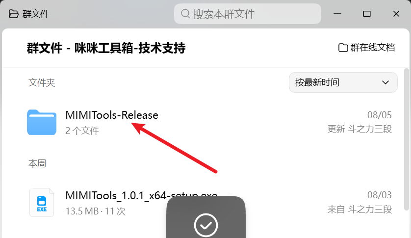
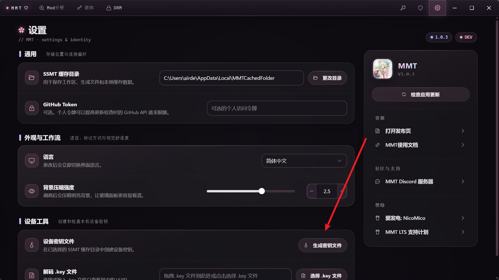
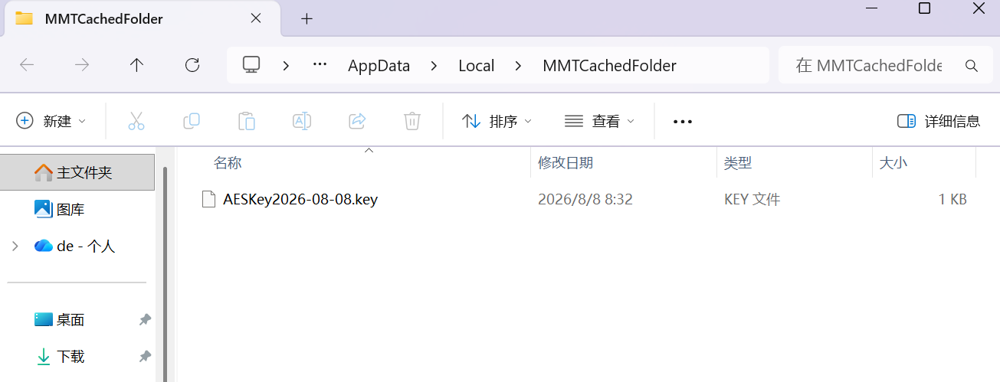

# 如何激活MMT所有功能

## 生成密钥文件并激活

赞助完成后，在爱发电的自动回复中申请加入 `咪咪工具箱-技术支持` QQ群。

在群文件中下载MMT并安装后，进行后续步骤

首先，切换到MMT的设置页面，下拉到最下方，点击生成密钥文件按钮：

点击后自动弹出一个文件夹，并选中了生成的.key文件：

此时你把这个key文件发给我，然后我就可以使用这个key文件为你激活MMT了

当我激活好之后，我会把激活好的MMT的安装包发给你，你安装之后就可以使用了

## 如何更新新版本

新版本MMT会自动附带你的激活，所以不用担心版本更新后无法使用的问题，后续更新MMT正常更新即可。

## 技术支持

在使用MMT的Mod格式转换功能过程中，遇到任何无法解决的问题或违反直觉的设计，记得反馈给我。

