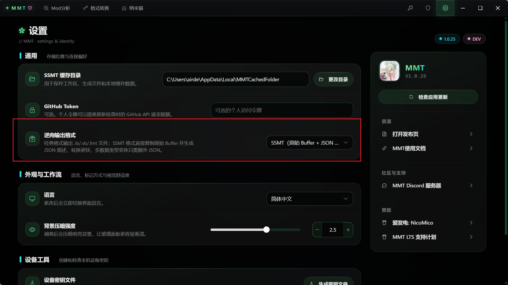
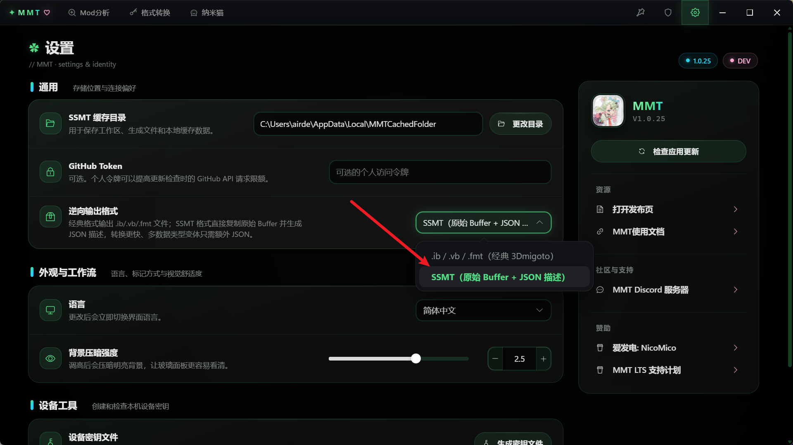
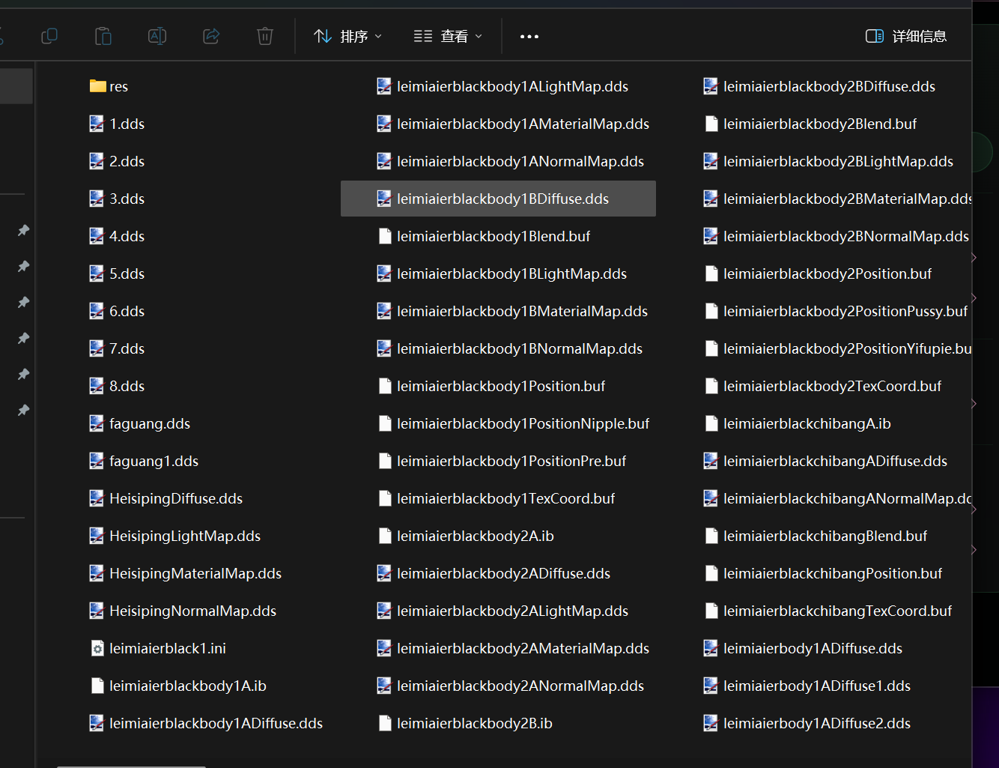
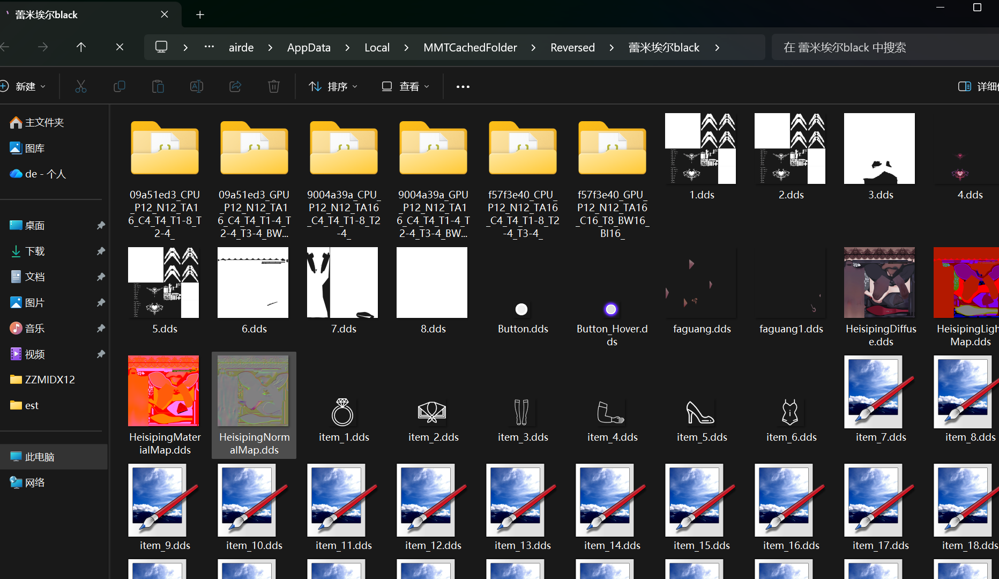
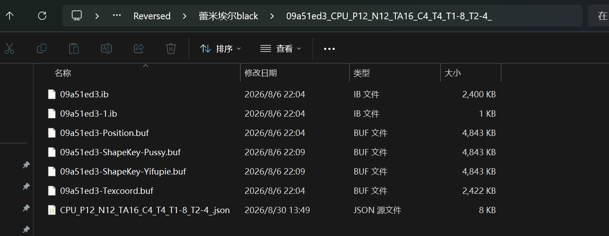
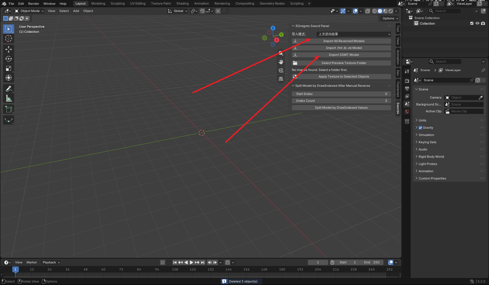
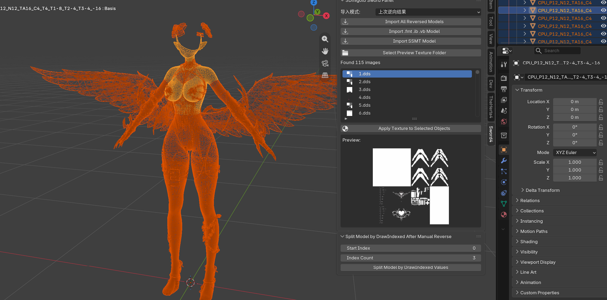
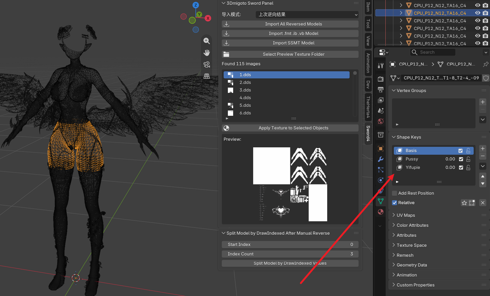
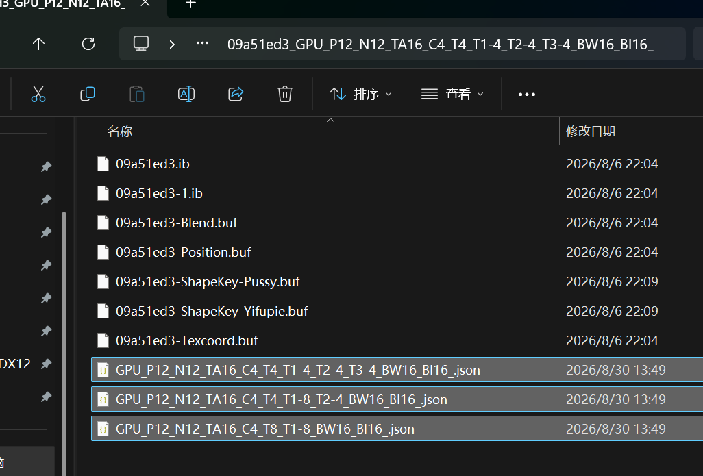

# 📦 ib vb fmt 格式和 SSMT 格式

3Dmigoto类型的Mod的格式有两种，一种是最常见的.ib .vb .fmt格式，XXMI系列工具普遍采用这种格式，另一种是SSMT格式，通过一个json文件和原始Buffer组成，SSMT系列工具普遍采用这种格式


## 两种格式的区别
.ib .vb .fmt格式起源于DrakStarSword写的Python脚本，用来将3Dmigoto Dump出来的.ib .vb文件导入到Blender，然后生成类似 .ib .vb0这种Mod格式，后来的GIMI、SRMI、ZZMI、XXMI系列工具继承了这种格式，逐渐扩充其中字段，变成了现在的普遍版本的 .ib .vb .fmt格式


SSMT格式是一个.json文件，附带着所有的原始buffer，这种格式的诞生是由于.ib .vb .fmt格式无法处理一些特殊的Blend格式而诞生的，它的处理逻辑非常灵活，面向快速迭代，最大兼容性而诞生，可以处理多种变体格式，而且少了模型提取端的格式转换，所有内容都在Blender端进行处理，开发成本更低，提取速度更快，因为本质上json文件里包含的就是对各个buffer文件内容的描述，无需进行额外的转换处理，其诞生包含了我对DirectX11和DirectX12的Mod场景的全部理解。


这里不评论两种格式的优劣，它们都是为了某种需求而诞生的，尤其是SSMT格式，作为初学者你只需要知道存在这样两种格式就好了，其中的细节还需要自己探寻


一般情况下，我们SSMT系列工具都会使用一个json文件加多个原始Buffer的形式来描述模型，这样可以最大程度保存文件中的原始信息，开发迭代新版本也非常方便


**值得注意的是，后续版本中SSMT和TheHerta4以及MIMITools都会逐渐淘汰掉.ib .vb .fmt格式，并且只支持SSMT格式，需要使用旧的.ib .vb .fmt格式可以使用XXMI系列工具。**


## SSMT格式导入说明
因为本文档是MIMITools的使用说明文档，所以这里只演示它在MIMITools里的含义

我们切换到设置页面，可以看到有一个格式选项：



这里我们可以选到SSMT格式：



随后我们随便逆向一个Mod，以这个面板形态键滑条Mod为例：



比如放到纳米猫里逆向成功之后，长这样：



我们随便点进去看一下：



可以看到它是由多个原始Buffer文件，外加一个.json文件表示的

这里的.json文件名称表示的是它的数据类型，我们点进去就能看到完整内容

```json
{
  "GamePreset": "ZZMI",
  "VertexLimitVB": "",
  "CategoryHash": {
    "Position": "leimiaierblackbody2Position",
    "Texcoord": "leimiaierblackbody2Texcoord"
  },
  "CategoryDrawCategoryMap": {
    "Position": "Position",
    "Texcoord": "Texcoord"
  },
  "WorkGameType": "CPU_P12_N12_TA16_C4_T4_T1-8_T2-4_",
  "GPU-PreSkinning": false,
  "CB4Hash": "",
  "VertexOffset": 0,
  "VertexCount": 123966,
  "IndexOffset": 0,
  "IndexCount": 614586,
  "DrawCallIndexList": [
    "12384",
    "8865",
    "5379",
    "6774",
    "144",
    "4344",
    "46992",
    "32328",
    "9414",
    "27450",
    "1662",
    "1044",
    "1368",
    "1650",
    "738",
    "57582",
    "35964",
    "96",
    "5622",
    "756",
    "16896",
    "2040",
    "1164",
    "114"
  ],
  "VGCount": 0,
  "VGOffset": 0,
  "ShapeKeysInfo": {
    "offsets_hash": "",
    "scale_hash": "",
    "vertex_ids_hash": "",
    "vertex_offsets_hash": "",
    "vertex_count": 0,
    "dispatch_y": 0,
    "checksum": 0
  },
  "IndexBufferList": [
    {
      "DXGI_FORMAT": "DXGI_FORMAT_R32_UINT",
      "FileName": "09a51ed3.ib"
    },
    {
      "DXGI_FORMAT": "DXGI_FORMAT_R32_UINT",
      "FileName": "09a51ed3-1.ib"
    }
  ],
  "CategoryBufferList": [
    {
      "FileName": "09a51ed3-Position.buf",
      "Type": "Normal",
      "D3D11ElementList": [
        {
          "SemanticName": "POSITION",
          "SemanticIndex": "0",
          "Format": "R32G32B32_FLOAT",
          "ByteWidth": "12",
          "ExtractSlot": "vb0",
          "ExtractTechnique": "trianglelist",
          "Category": "Position",
          "DrawCategory": "Position"
        },
        {
          "SemanticName": "NORMAL",
          "SemanticIndex": "0",
          "Format": "R32G32B32_FLOAT",
          "ByteWidth": "12",
          "ExtractSlot": "vb0",
          "ExtractTechnique": "trianglelist",
          "Category": "Position",
          "DrawCategory": "Position"
        },
        {
          "SemanticName": "TANGENT",
          "SemanticIndex": "0",
          "Format": "R32G32B32A32_FLOAT",
          "ByteWidth": "16",
          "ExtractSlot": "vb0",
          "ExtractTechnique": "trianglelist",
          "Category": "Position",
          "DrawCategory": "Position"
        }
      ]
    },
    {
      "FileName": "09a51ed3-Texcoord.buf",
      "Type": "Normal",
      "D3D11ElementList": [
        {
          "SemanticName": "COLOR",
          "SemanticIndex": "0",
          "Format": "R8G8B8A8_UNORM",
          "ByteWidth": "4",
          "ExtractSlot": "vb1",
          "ExtractTechnique": "trianglelist",
          "Category": "Texcoord",
          "DrawCategory": "Texcoord"
        },
        {
          "SemanticName": "TEXCOORD",
          "SemanticIndex": "0",
          "Format": "R16G16_FLOAT",
          "ByteWidth": "4",
          "ExtractSlot": "vb1",
          "ExtractTechnique": "trianglelist",
          "Category": "Texcoord",
          "DrawCategory": "Texcoord"
        },
        {
          "SemanticName": "TEXCOORD",
          "SemanticIndex": "1",
          "Format": "R32G32_FLOAT",
          "ByteWidth": "8",
          "ExtractSlot": "vb1",
          "ExtractTechnique": "trianglelist",
          "Category": "Texcoord",
          "DrawCategory": "Texcoord"
        },
        {
          "SemanticName": "TEXCOORD",
          "SemanticIndex": "2",
          "Format": "R16G16_FLOAT",
          "ByteWidth": "4",
          "ExtractSlot": "vb1",
          "ExtractTechnique": "trianglelist",
          "Category": "Texcoord",
          "DrawCategory": "Texcoord"
        }
      ]
    }
  ],
  "ShapeKeyPositionBufferList": [
    {
      "ShapeKeyName": "Pussy",
      "FileName": "09a51ed3-ShapeKey-Pussy.buf"
    },
    {
      "ShapeKeyName": "Yifupie",
      "FileName": "09a51ed3-ShapeKey-Yifupie.buf"
    }
  ],
  "DrawCallSegmentList": [
    {
      "IBIndex": 0,
      "IndexOffset": 271173,
      "IndexCount": 12384,
      "DrawStartIndex": 0
    },
    {
      "IBIndex": 0,
      "IndexOffset": 262308,
      "IndexCount": 8865,
      "DrawStartIndex": 0
    },
    {
      "IBIndex": 0,
      "IndexOffset": 283557,
      "IndexCount": 5379,
      "DrawStartIndex": 0
    },
    {
      "IBIndex": 0,
      "IndexOffset": 288936,
      "IndexCount": 6774,
      "DrawStartIndex": 0
    },
    {
      "IBIndex": 0,
      "IndexOffset": 295710,
      "IndexCount": 144,
      "DrawStartIndex": 0
    },
    {
      "IBIndex": 0,
      "IndexOffset": 342846,
      "IndexCount": 4344,
      "DrawStartIndex": 0
    },
    {
      "IBIndex": 0,
      "IndexOffset": 295854,
      "IndexCount": 46992,
      "DrawStartIndex": 0
    },
    {
      "IBIndex": 0,
      "IndexOffset": 0,
      "IndexCount": 32328,
      "DrawStartIndex": 0
    },
    {
      "IBIndex": 0,
      "IndexOffset": 129312,
      "IndexCount": 9414,
      "DrawStartIndex": 0
    },
    {
      "IBIndex": 0,
      "IndexOffset": 138726,
      "IndexCount": 9414,
      "DrawStartIndex": 0
    },
    {
      "IBIndex": 0,
      "IndexOffset": 148140,
      "IndexCount": 27450,
      "DrawStartIndex": 0
    },
    {
      "IBIndex": 0,
      "IndexOffset": 175590,
      "IndexCount": 27450,
      "DrawStartIndex": 0
    },
    {
      "IBIndex": 0,
      "IndexOffset": 203040,
      "IndexCount": 27450,
      "DrawStartIndex": 0
    },
    {
      "IBIndex": 0,
      "IndexOffset": 230490,
      "IndexCount": 27450,
      "DrawStartIndex": 0
    },
    {
      "IBIndex": 0,
      "IndexOffset": 257940,
      "IndexCount": 1662,
      "DrawStartIndex": 0
    },
    {
      "IBIndex": 0,
      "IndexOffset": 259602,
      "IndexCount": 1662,
      "DrawStartIndex": 0
    },
    {
      "IBIndex": 0,
      "IndexOffset": 261264,
      "IndexCount": 1044,
      "DrawStartIndex": 0
    },
    {
      "IBIndex": 0,
      "IndexOffset": 347190,
      "IndexCount": 1368,
      "DrawStartIndex": 0
    },
    {
      "IBIndex": 0,
      "IndexOffset": 348558,
      "IndexCount": 1368,
      "DrawStartIndex": 0
    },
    {
      "IBIndex": 0,
      "IndexOffset": 349926,
      "IndexCount": 1368,
      "DrawStartIndex": 0
    },
    {
      "IBIndex": 0,
      "IndexOffset": 351294,
      "IndexCount": 1650,
      "DrawStartIndex": 0
    },
    {
      "IBIndex": 0,
      "IndexOffset": 352944,
      "IndexCount": 738,
      "DrawStartIndex": 0
    },
    {
      "IBIndex": 0,
      "IndexOffset": 375930,
      "IndexCount": 57582,
      "DrawStartIndex": 0
    },
    {
      "IBIndex": 0,
      "IndexOffset": 433512,
      "IndexCount": 57582,
      "DrawStartIndex": 0
    },
    {
      "IBIndex": 0,
      "IndexOffset": 491094,
      "IndexCount": 35964,
      "DrawStartIndex": 0
    },
    {
      "IBIndex": 0,
      "IndexOffset": 527058,
      "IndexCount": 96,
      "DrawStartIndex": 0
    },
    {
      "IBIndex": 0,
      "IndexOffset": 587880,
      "IndexCount": 5622,
      "DrawStartIndex": 0
    },
    {
      "IBIndex": 0,
      "IndexOffset": 593502,
      "IndexCount": 756,
      "DrawStartIndex": 0
    },
    {
      "IBIndex": 0,
      "IndexOffset": 594258,
      "IndexCount": 16896,
      "DrawStartIndex": 0
    },
    {
      "IBIndex": 0,
      "IndexOffset": 611154,
      "IndexCount": 2040,
      "DrawStartIndex": 0
    },
    {
      "IBIndex": 0,
      "IndexOffset": 613194,
      "IndexCount": 1164,
      "DrawStartIndex": 0
    },
    {
      "IBIndex": 1,
      "IndexOffset": 0,
      "IndexCount": 114,
      "DrawStartIndex": 0
    },
    {
      "IBIndex": 1,
      "IndexOffset": 114,
      "IndexCount": 114,
      "DrawStartIndex": 0
    }
  ]
}
```


然后我们可以在TheHerta4中进行一键导入：



两种方式都能导入，这里都是基础操作我就不说了



导入进来的内容和.ib .vb .fmt格式没有什么区别


但是有形态键的情况下，SSMT格式可以保留形态键名称，但是.ib .vb .fmt格式不会保留：



## 总结
MIMITools从V1.0.26版本开始支持SSMT格式，并且将在后续版本中移除.ib .vb .fmt格式的支持

TheHerta4从V4.1.47版本开始支持SSMT格式，并且将在后续版本中移除.ib .vb .fmt格式的支持


SSMT格式还有个优点，多个数据类型时，只需要生成多个json文件即可：



这也使得SSMT格式能够最大程度减少无效的空间占用  


总之SSMT格式是面向未来的新格式，灵活性和实用性都远超.ib .vb .fmt格式，并且贴合原始Buffer的描述本质，所有导入逻辑都可以在TheHerta4源码中查看，且逻辑梳理简单对作者和开发者都更友好。


