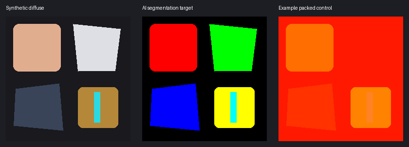

# 贴图通道与 AI 生成：从会改颜色到理解 Shader

这套文档不绑定 ComfyUI。你可以用支持图像输入与编辑的生成模型、Paint.NET / Photoshop、Substance、Blender 烘焙或脚本处理；关键是知道**目标 Shader 怎样读取每一个通道**。

::: warning 先读这三句话
**看起来像某种贴图，不等于它就是那种贴图。文件名不是通道规范。公开复刻 Shader 也不是原游戏全部版本的官方规范。** 本系列把源码确认、条件启用与未知用途分开标注；数字示例是教学起点，不是所有角色的正确值。
:::

## 六款游戏入口

| 游戏 | 阅读入口 |
| --- | --- |
| 原神 | [通道详解与生成提示词](../../../games/gimi/TextureChannelGuide/TextureChannelGuide.md) |
| 崩坏：星穹铁道 | [通道详解与生成提示词](../../../games/srmi/TextureChannelGuide/TextureChannelGuide.md) |
| 崩坏三 | [通道详解与生成提示词](../../../games/himi/TextureChannelGuide/TextureChannelGuide.md) |
| 绝区零 | [通道详解与生成提示词](../../../games/zzmi/TextureChannelGuide/TextureChannelGuide.md) |
| 鸣潮 | [通道详解与生成提示词](../../../games/wwmi/TextureChannelGuide/TextureChannelGuide.md) |
| 明日方舟：终末地 | [通道详解与生成提示词](../../../games/efmi/TextureChannelGuide/TextureChannelGuide.md) |

[来源边界与自行审查记录](./Review.md) · [固定源码来源清单](./sources.json)

## 1. 一张 RGBA 图片是四张灰度数据图

每个通道可以独立存储数据：红色不是“红色材质”，而可能是 R 高、G/B 低的三个控制值叠加。RGBA 中 A 也不一定是透明度；它可能是材质编号、环境遮蔽、发光或未使用通道。



本系列配图是原创合成的教学 UV 图集，**不是原游戏解包贴图，也不是 AI 质量对比实测**。图例与文字不应出现在实际生成贴图中。

| 容易混淆的词 | 正确理解 |
| --- | --- |
| Diffuse / BaseColor / Albedo | 通常存储颜色；Toon 的颜色图可能包含绘制阴影或特殊 Alpha，未必是严格物理 Albedo |
| LightMap / ILM / Mask | 在角色 Toon Shader 中常是控制数据，不等于场景烘焙照明 |
| Normal | 描述方向；可能是 RGB XYZ、RG XY 或 AG XY，并可能共用其它通道 |
| Material / ID | 按范围选择 Shader 参数组；不是一种跨游戏统一的物理材质编号 |
| Roughness / Smoothness | 粗糙度与光滑度方向相反；只有定义一致时才有 smoothness=1−roughness |
| Specular mask / strength / shininess | 高光出现范围、强度、指数/锐度不同；不能互换 |
| AO / shadow bias / SDF | 遮蔽、阴影阈值偏置、带方向信息的阈值场不同；不是都能由灰度 Diffuse 得到 |

## 2. 先认身份，再改数值

不要因为教程说“第二张是 LightMap”，就对自己的第二张照做。最小取证流程：

1. 记录游戏版本、角色、身体/头发/脸/眼/武器材质、DrawCall、Shader Hash、纹理槽、尺寸、格式、UV 集。
2. 拆开 RGBA，观察常量、离散台阶、平滑梯度、镜像和细节的对应关系。
3. 在复刻 Shader 中找纹理声明 → `SAMPLE_TEXTURE` / `tex2D` → `.r/.g/.b/.a` → 实际计算。只看变量名不足以判断用途。
4. 看条件：材质类型、关键词、开关、采样 UV、ST 变换、镜像、法线解包函数。没启用的通道不等于该游戏永远未用。
5. 如能安全测试，复制原图，每次只改一个通道或一块小区域，观察引擎内变化。脸、头发和身体必须分开测试。
6. 保留原图与参数；将结论限定到这个 Shader / 材质，而不是整个游戏。

**槽号、Hash 和文件排序不是稳定标准。** 更新可能改变绑定；同一角色也可能有多套材质路径。

## 3. 0–255、0–1、sRGB 与 Alpha

8-bit UNORM 灰度的数值映射通常是 `value = byte / 255`，`byte = round(clamp(value, 0, 1) × 255)`。0.5 无法精确写成一个 8-bit 数值；127 和 128 位于它两侧。阈值附近必须留余量。

颜色纹理的 RGB 常按 sRGB 解码；**控制图必须按目标 Shader 的实际采样方式解释**。例如字节 128 以线性 UNORM 读取约 0.502，以 sRGB 读取约 0.216，控制效果完全不同。不能对 Mask 做自动 Gamma、美化、色调映射或滤镜。通常 sRGB 只转换 RGB，不转换 Alpha，但仍要核查载入路径。

- Blender 用 Non-Color 看数据图；这不能自动保证最终游戏绑定正确。
- JPEG 有损且没有 Alpha，不用于数值控制图；优先 PNG/TGA，无损不等于色彩管理正确。
- Alpha 预乘会改变 RGB；控制图通常不要预乘，除非目标明确要求。
- BC5 只保留两路；BC6H 是 HDR RGB、没有 Alpha；BC7 可以含 Alpha。不得把丢失的通道当成真实白色。
- BC6H 浮点数可能超过 1；转普通 8-bit PNG 会损失 HDR 范围。须记录裁剪或重映射，不能把预览当原值。
- PNG 改名 `.dds` 不会变 DDS；PNG/TGA 是生成与编辑中间成果，最终部署格式看目标载入器。

## 4. UV 完全相同是一项验收要求，不是模型保证

本系列所有提示词都要求原尺寸与原 UV。但生成模型可能重采样、改变岛边界、镜像、移位、重画细条。更强的视觉模型也不保证逐像素配准。

**建议提供三份输入**：`<image1>` 是新 Diffuse；`<image2>` 是同 UV 的原始目标控制图；`<image3>` 是你确认的分区图或 UV 边界。不同角色的参考只能说明风格/规则，不能直接迁移布局。

每次输出要检查：

- 画布长宽、岛位置、空白区、缝线、镜像方向、细条与装饰位置；透明空白与不透明数值背景不能混淆。
- 使用半透明叠加、差异图、边缘叠加或已知岛 Mask 检查；画布尺寸一致不证明 UV 一致。
- 法线缝线、左右对称、切线手性、Y 方向；不要仅按图片“看起来蓝紫”判断。
- 为 UV 岛做合理边缘扩张，避免 mip 下串色；不能把邻岛数据涂进来。
- 材质 ID 避开阈值；连续通道可滤波，ID 一般不要用普通双线性缩放。mip/压缩仍可能产生中间值，需渲染测试。

## 5. 一段式提示词怎样用

文档中的“一句话”指**一次可复制的一整段指令**，不是承诺一句话就能产生可直接部署的精确数值图。

1. 用模型的图像编辑/参考输入功能上传图片；纯文本生图无法知道原 UV。`<image1>` 只是文档占位符，要替换成产品实际识别的图片编号/引用。
2. 一次生成一种贴图。模型支持尺寸就设为原尺寸，不支持时明确后续配准与重采样。
3. 数字是你声明的目标，不是模型会百分百执行的程序。下载后取样并做通道统计。
4. 示例里的皮肤/布/金属值需要按原材质测量替换；颜色明暗不等于材质，白布不是天然更光滑，金色油漆不一定是金属。
5. 不支持真实 Alpha 的模型，单独生成灰度 Alpha 再合成；“不透明预览”不等于 A 满足目标。

### 两种策略

**A：直接生成 packed RGB/RGBA 候选图**。最快，适合学习、预览与人工修订，但常有数值漂移、通道串色与布局改变。

**B：先生成语义分区，再定值打包（更可靠）**。模型只负责“这片是皮肤/布/扣件”；人工确认分区后，用通道编辑工具或脚本设置目标字节。这样严格常量、离散 ID、继承 Alpha 不再由模型猜。

分区通用提示词：

```text
将<image1>这张二次元角色UV颜色图转换为同尺寸同布局的平面材质分区图，只标出可见且能够辨认的皮肤、普通布料、暗色布料、金属配件与明确发光细节，分别使用纯红RGB(255,0,0)、纯绿RGB(0,255,0)、纯蓝RGB(0,0,255)、纯黄RGB(255,255,0)、纯青RGB(0,255,255)，无法判定区域用纯黑，不按颜色明暗猜金属，不生成照明或渐变，不保留自然颜色，不改变任何UV岛边界、缝线和小配件位置，不加文字，只输出该UV图集且保持不透明；这是用于人工确认后数值打包的分区草稿，不是游戏最终控制图。
```

**本教程不宣称某个模型“最强”或已通过本系列测试。** 选模型看图像编辑能力、输入忠实度、尺寸、Alpha 支持与许可；云模型还要考虑上传素材权限与费用。

## 5.1 不用ComfyUI：通道定值的实际操作配方

在支持RGBA分离/合并的图像编辑器中，保留原图副本并采用以下流程：

1. 将原图拆成R/G/B/A四张灰度层，记录每层尺寸和原值；不要将“看起来灰”当成已经是数值线性。
2. 导入模型分区候选，与原Diffuse半透明叠加。人工修正岛边界和皮肤/布/金属误分类；无法识别的区域沿用原图。
3. 用确认后的区域选区填充每个目标通道的灰度值。例如ZZZ新辅助预设：R整层255；G按区域110/25/50/130；B非发光0、明确候选细条38。不是在RGB图上凭眼睛调成橙色。
4. ID层只使用核查好的安全档位；先选区域再填充，不用色彩平衡或柔光混合。模型输出的红色/绿色分区要转成选区，不能直接当游戏ID。
5. 把未修改通道和原Alpha真正复制回来。需要继承A就从原图复制A，不依赖生成模型“应该已保留”。
6. 合并RGBA并另存PNG/TGA，关闭会改变数据的美化、自动Gamma或预乘步骤。重开文件，用取色器与通道统计确认保存前后没有变值。
7. 对照本文检查尺寸、UV、常量、ID范围、法线和游戏渲染。如果软件不支持精确Alpha合并，换支持通道功能的工具，不靠截图导出。

### 不要误量化

如果按“最近颜色”自动识别AI分区，模型产生的暗边、抗锯齿和偏色会让类别错分。先人工确认并建立无歧义Mask；常量/ID用精确填充值，连续法线/光滑度则保留必要梯度。背景与岛内数据应按实际纹理寻址和mip扩边策略分别处理。

### 怎么知道自己真的学会了

能解释每一个字节为什么这样填，并能在原材质上用单通道修改预测效果，比能复制一串提示词更重要。给每次实验写下“假设、修改、观察、结论、适用版本”；效果与预期不符时先检查绑定/色彩空间/开关，而不是继续随机换模型。

## 6. 法线、SDF 和 Ramp 为什么不能当普通遮罩重绘

### 法线

法线 RGB 常解码为 `n = 2 × rgb − 1`；packed XY 则解码两路并按 Shader 重建 Z，例如 `sqrt(max(0,1−x²−y²))`。中性 XY 约 (128,128)，不是 (0,0)。具体 AG/RG/XY 选路和 Y 翻转由解包函数决定。

Diffuse 不能唯一决定凹凸：画出来的阴影不一定是凸起。生成模型只能提出浅浮雕候选；有 Mesh 时，可信高低模烘焙通常更有几何依据。凹凸反向、UV 镜像与切线空间不匹配需实际渲染判定。

### 脸部 SDF / 阴影阈值场

脸部图可能编码随光向变化的阈值场，并读取镜像 UV 或依赖头部方向。它不是“鼻子下涂黑”的普通 AO。只给脸部 Diffuse，无法可靠恢复原控制场。最安全的是保留同脸 UV 的原图；改变脸型/UV 才考虑专用重建与旋转光源验证。

### Ramp / LUT / MatCap

Ramp 用坐标查找色带；LUT 编码数值映射；MatCap 按视角/法线查外观。它们未必使用衣服 UV。**不要向模型要求“保持衣服UV”去生成 Ramp。** 必须知道查表行列、取样方式与坐标映射。未知布局时保留原图。

## 7. 出错症状速查

| 症状 | 先查什么 |
| --- | --- |
| 全身镜面、像塑料 | spec mask/strength、光滑度方向、ID 选错、sRGB 解码 |
| 衣服无论光向都黑 | AO、阴影阈值、常量范围、采样UV |
| 模型消失/镂空 | Alpha 用途、clip 阈值、预乘、加载格式 |
| 法线凹凸反了 | Y 翻转、凹凸符号、切线基、镜像UV |
| 脸阴影跳变 | SDF 通道、镜像、头部方向、face/body 材质路径 |
| 跨区域高光错色 | ID 阈值、Ramp 行、滤波或压缩串值 |
| 编辑器好看、游戏坏 | 实际资源绑定、Shader 参数、格式、mip、色彩空间 |

## 8. 最小交付清单

保存原图、模型原输出、后处理输出、通道图、提示词、模型版本、素材许可、工作流/Shader 版本、目标游戏/材质、字节档位与处理记录。至少验证：尺寸、RGBA、Alpha、常量、ID 集合、法线约束、UV 叠加、各光向渲染。

**像素校验通过≠Shader 渲染通过；公开源码审查通过≠原游戏全角色验证通过。** 各游戏页会标明我们确实核查到的范围，并为缺少信息的贴图给出保守保留策略。
