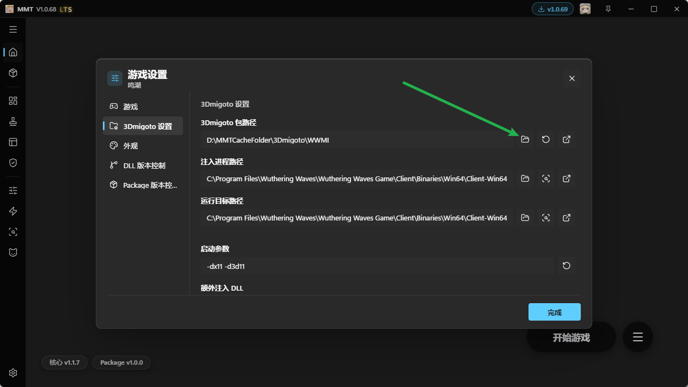
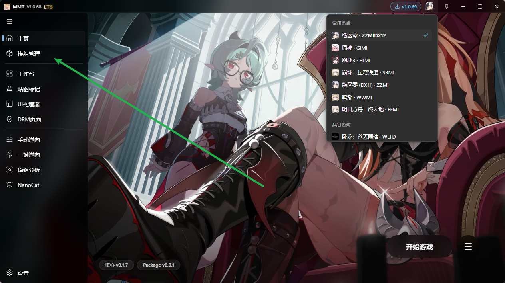
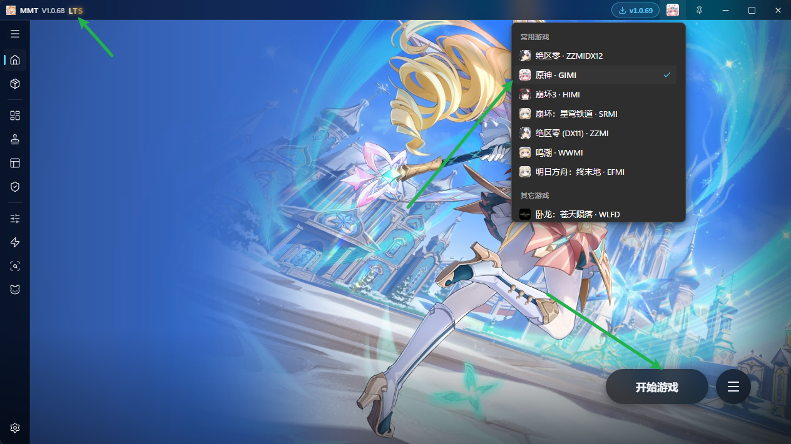

# 原神10612-4001报错

MMT现已采用“第八代原神Mod防报错”，群友已大量测试稳定没问题，这次是从机制上真正意义上的彻底避免了10612-4001报错，走的不是工具对抗的路子。

MMT正式进入永久恒纪元时期，后续MMT直接使用GIMI游戏预设进行启动即可不报错。

后续不再讨论原神防报错相关内容，使用MMT默认永久恒纪元不报错，理论上可以用到原神关服。

总之，由于MMT已进入永久恒纪元，现在是天生不报错了，特此通知。

## 后续失效后是否会继续维护？

会，从2025年3月开始，防报错一直维护至今。

原神防报错只是此工具千分之一的小功能，此工具主要还是聚焦于Mod全流程工具箱。

## 激活后是否可以更换设备？

每份赞助提供一份主板激活以及一份备用激活

备用激活是在你换主板之后生效的，你也可以自行处理

更换主板即视为放弃那份激活

## 如何使用自己的3Dmigoto文件夹？

在这里设成你自己的就行了

## MMT有Mod管理功能吗？

有，基础功能足够用，不够的话反馈给我，我来添加

## Mods目录老被改为Stuffs目录怎么办？

这是MMT的特性，部分Mod管理器可能不兼容这个目录命名，建议使用MMT自带的Mod管理

## 工具里没有任何地方提到防报错，如何确认我生效了？

右上角出现LTS字样，使用 原神 GIMI游戏预设启动即可不报错

