::: info
在 [MIMIBlender](https://github.com/StarBobis/MIMIBlender) 版本更新后，`格式转换后导入` 和 `自动上贴图` 面板已移动至侧边栏的 `Sword` 选项卡中。  
本文档截图使用的是旧版本，操作流程基本一致，请根据实际界面进行调整。

:::

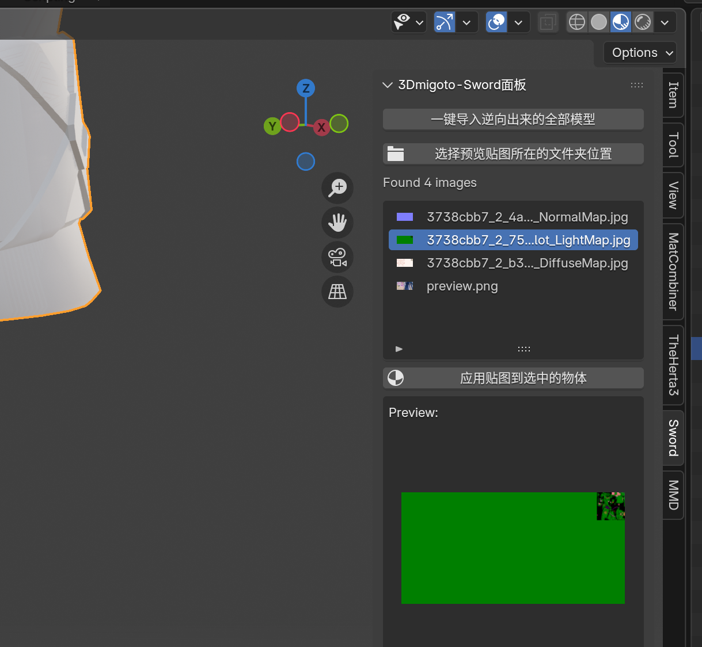

# 🔍 排除并筛选正确的数据类型
::: info
在上一节中，我们在应用贴图后发现显示异常（如下图所示）。  
这通常是由于 **❌**** 数据类型不正确** 导致的。

:::

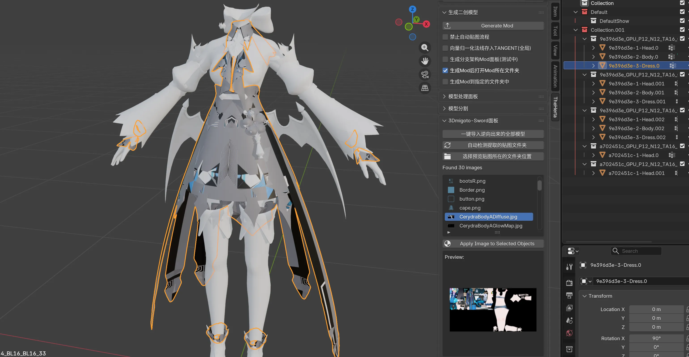

::: info
Mod 格式转换工具会自动分析 Buffer 文件中 **所有可能的数据类型**，并将它们 **全部导出**，以确保没有遗漏。

:::

现在我们回头查看之前格式转换生成的文件夹：

::: info
每个文件夹的名称由三部分组成：

1. `8 位 Hash 值` (代表模型集合/Collection)
2. `_` (下划线)
3. `数据类型名称`

:::

由于工具分析出了多种可能的数据类型，你会看到多个具有 **相同 Hash 前缀** 但 **后缀不同** 的文件夹。

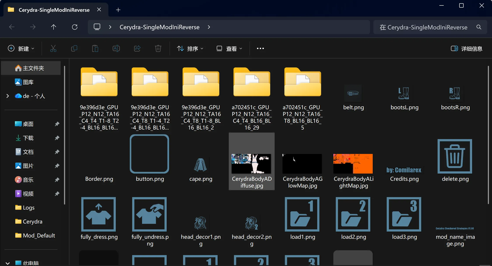

::: info
在这些选项中，通常 **只有一个数据类型是正确的** ✅。  
我们需要 **筛选并保留** 正确的数据类型，**排除** 错误的 ❎。

:::

---

## 🛠️ 筛选步骤详解
首先回到 Blender，查看导入后的集合结构：

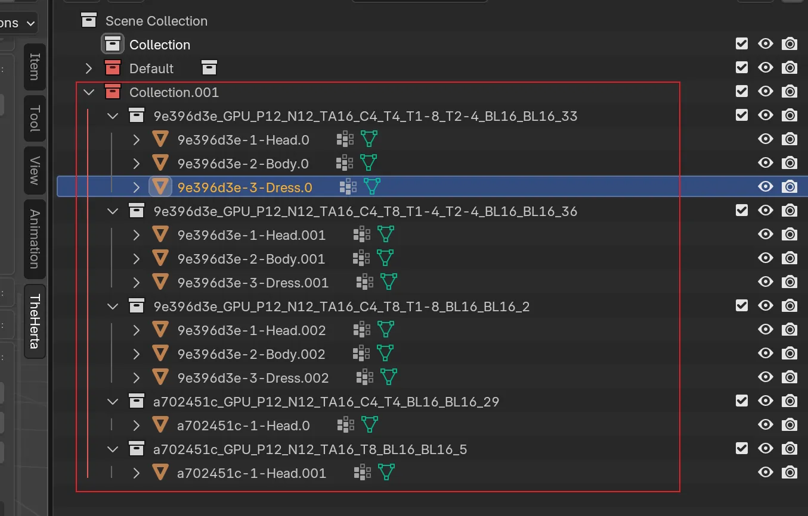

每个白色集合对应一个格式转换导出的子文件夹。我们只需删除名称对应错误数据类型的集合，即可排除错误的模型。

### ❓ 如何分辨数据类型是否错误？
回顾刚才贴图错乱的效果，我们可以通过 **检查 UV** 来确认。

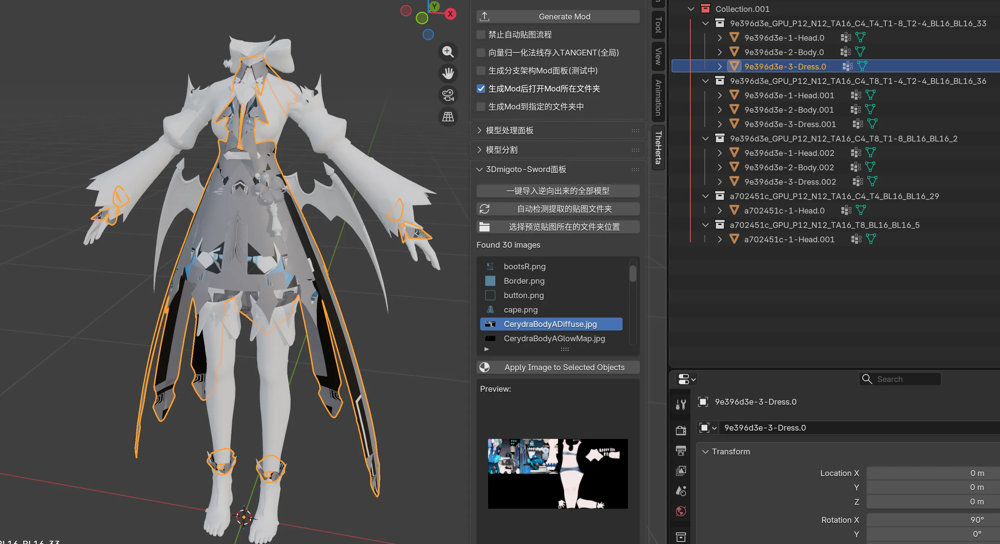

::: info
打开 **UV 编辑器** 查看：

:::

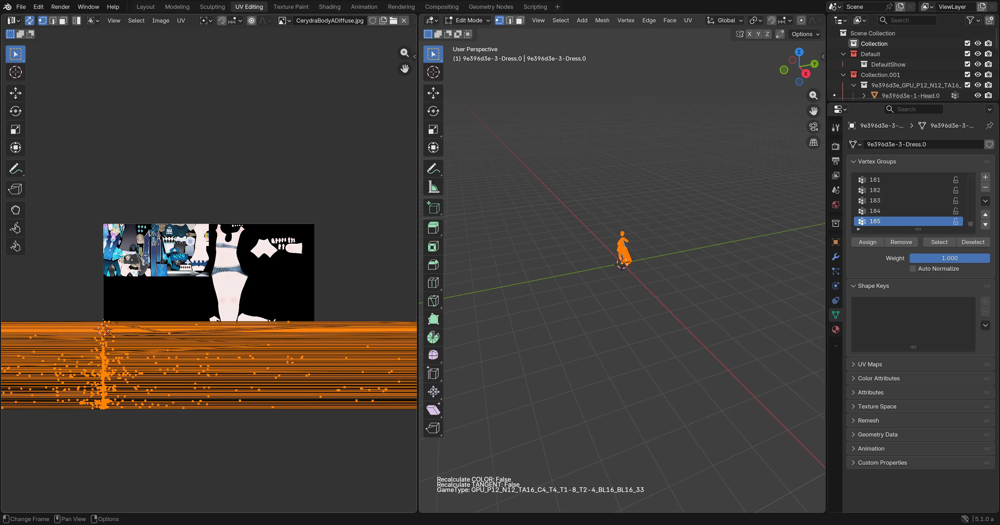

::: info
可以看到 **UV 映射完全混乱** (炸了)，说明该数据类型是 **错误的**。  
我们需要 **删除** 这个错误的集合。

:::

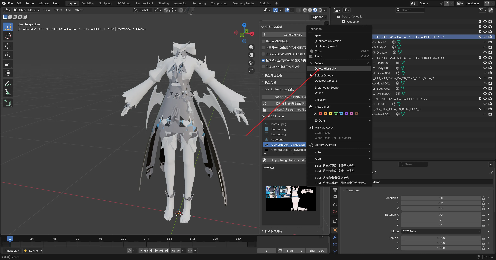

对于 `9e396d3e`，剩余两个候选数据类型。继续检查 UV：

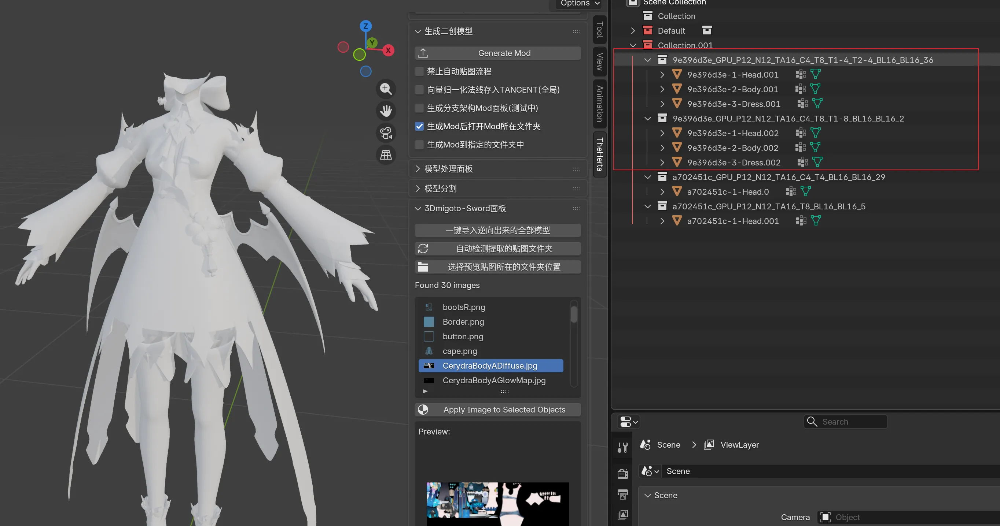

发现其中一个的 **第二套 UV** 是错误的，而另一个的 **所有 UV 均正常**：

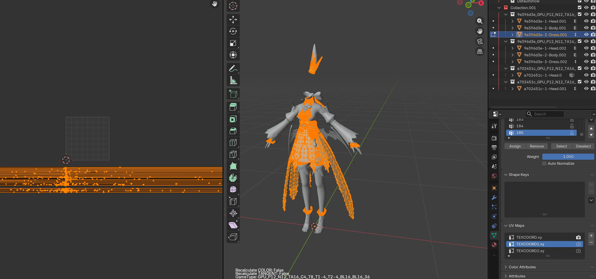

::: info
排除错误选项后，保留 **唯一的正确数据类型**：

:::

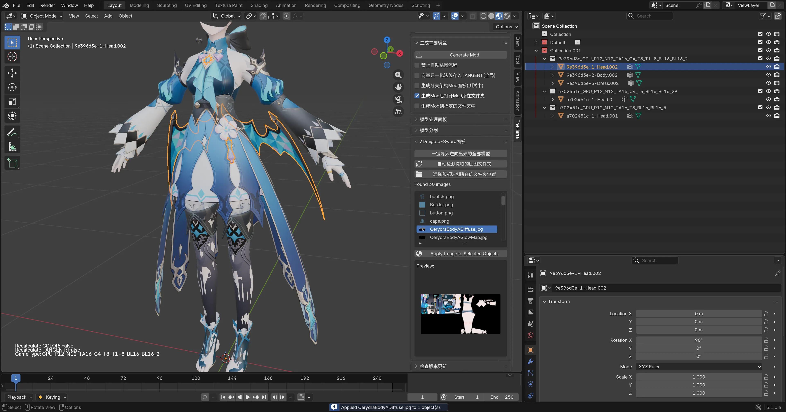

此时，**自动上贴图** 的结果就正常了 ✨。

对于 `a702451c` 也是同理，删除 UV 错误的那个数据类型。

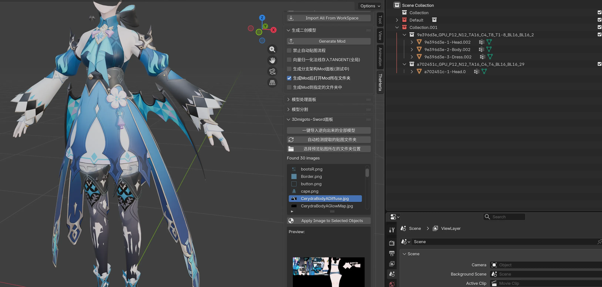

最后得到的结果就可以直接使用了 🎉。

---

## 🚧 重要注意事项：多层 UV 陷阱
::: info
在上述演示中，我们主要通过第一套 UV 进行判断。  
但在实际操作中，可能会遇到 **多个数据类型的第一套 UV 看起来都正确且相同** 的情况。

:::

此时，我们需要检查模型的 **其他 UV 层**。

如下图所示，选中模型后，默认显示的第一套 UV 均正常，无法直接区分正确的数据类型。

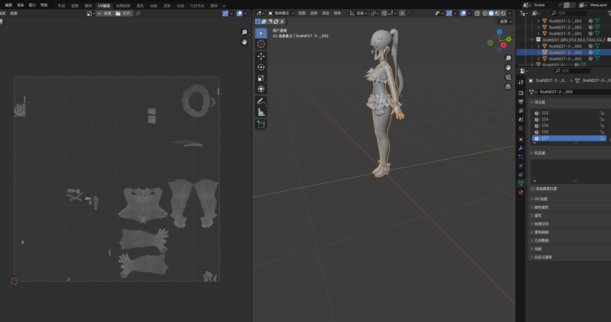

::: info
1. 选中模型。
2. 进入右下角绿色的 `Data` 属性面板。
3. 找到 `UV Maps` 选项。

:::

切换到其他 UV 层（如 `UVMap.001`, `UVMap.002` 等），逐个对比不同数据类型的表现，最终筛选出 **完全正确** 的那个：

::: info
实战中 **不能仅依赖第一套 UV**，必须 **全面检查所有 UV 层**。  
注重细节，才能制作出高质量的 Mod！ 🚀

:::
