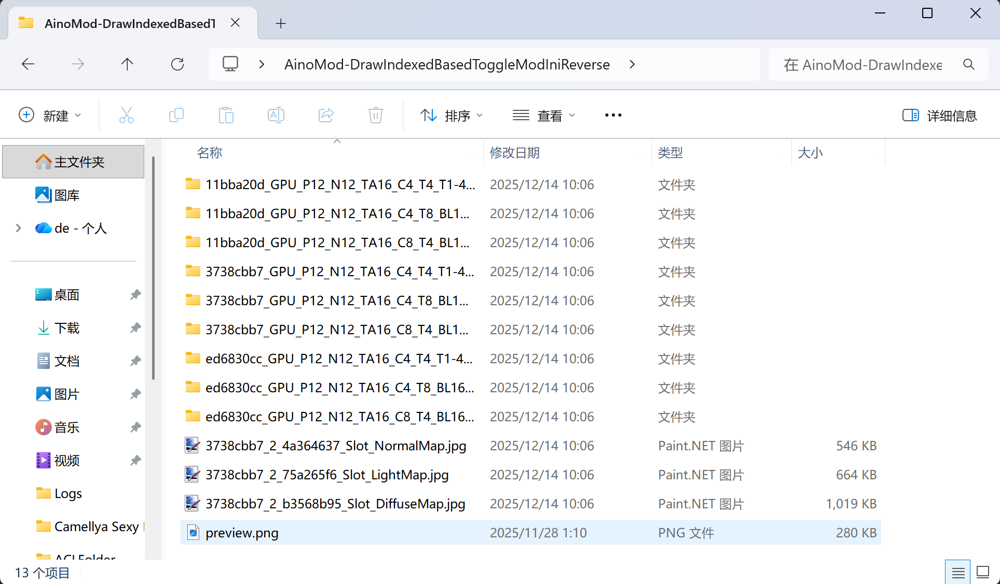
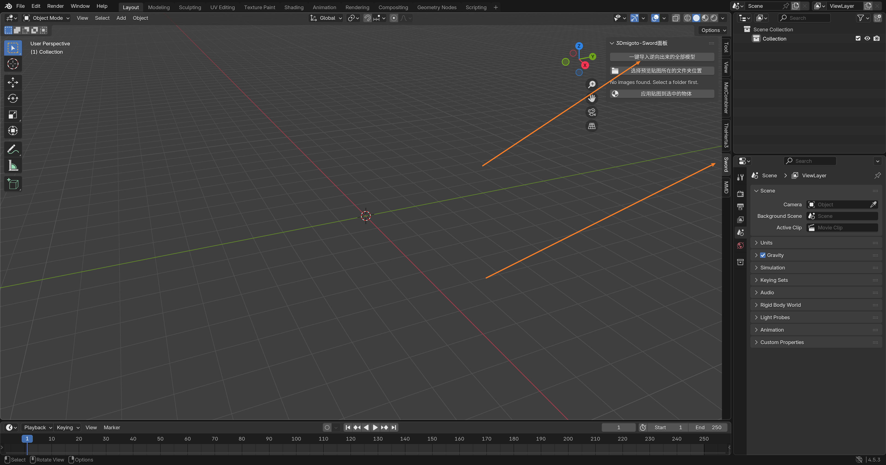
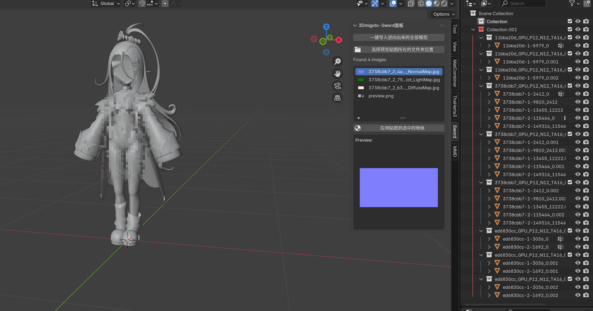
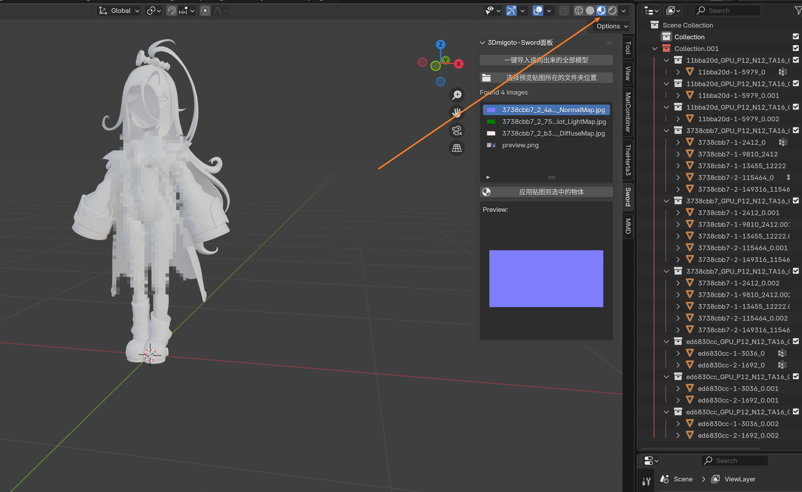
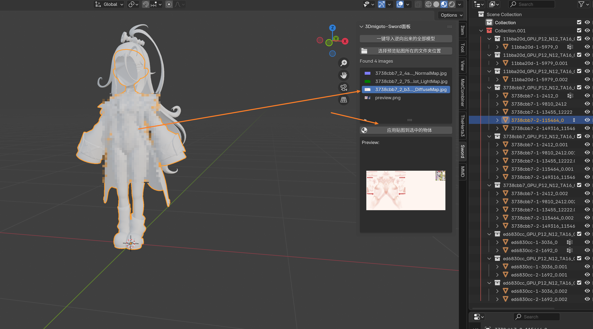
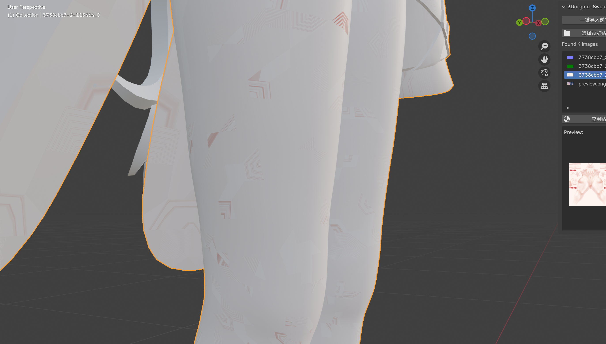

# 📥 一键格式转换后如何导入 Blender
一键格式转换后会自动弹出来转换好的 Mod 文件夹：

里面包含了转换好的模型以及转换过的贴图。

此时我们打开 Blender，点开 [MIMIBlender](https://github.com/StarBobis/MIMIBlender) 插件的**Sword**侧边栏面板，点击【一键导入转换出来的全部模型】：

稍等过后，全部模型都被导入成功了：

# 📂 选择从哪个文件夹导入（导入模式）

**Mod 逆向面板** 里的 **导入模式** 决定了【导入所有逆向模型】会读取哪个文件夹：

| 导入模式 | 读取的文件夹 |
| --- | --- |
| **最新逆向输出** | MMT 最后一次逆向成功后记录下来的输出文件夹（默认） |
| **指定工作空间** | MMT 缓存目录 `Reversed` 下的某个工作空间 |
| **自定义文件夹** | 你手动指定的任意文件夹 |

如果你在 MMT 里把逆向结果导出到了别的位置，或者想把以前逆向好的旧结果再导入一次，就把 **导入模式** 切换成 **自定义文件夹**，然后选中那个文件夹即可。

选完之后，面板会立刻显示一行检查结果，告诉你这个文件夹到底能不能导入：

- **✅ 该目录可以正常导入**：下面还会显示识别到的 DrawIB 文件夹数量和数据类型数量，直接点【导入所有逆向模型】就行。
- **❌ 该目录不可以正常导入**：下面会写明原因，常见的有这几种：
  - **选中的文件夹本身就是 DrawIB 文件夹**：要选它的**上一层**文件夹（也就是逆向输出根目录）。
  - **选中的文件夹下面是多个逆向工作空间**：这时面板会把它下面的工作空间名字列出来，改选其中之一即可。
  - **只有数据文件、没有 `.buf` / `.ib` 缓冲区文件**：说明这个文件夹被复制/移动时丢掉了缓冲区，需要重新逆向或者把缓冲区一起复制过来。
  - **文件夹不存在 / 无法读取**：检查路径是否正确、是否粘贴了多余的引号、是否有访问权限。

文件夹内容变了（比如重新逆向到同一个目录）而路径没变时，点检查结果右侧的 🔄 按钮可以重新检查一次。

> 💡 **小技巧**：如果检查结果显示某几个 DrawIB 文件夹没有缓冲区文件，那这几个会在导入时被跳过，其余正常的 DrawIB 依然会照常导入。

> ⚠️ **注意**：文件夹不能正常导入时，插件会直接提示原因并停止导入，**不会再创建一个空集合**。所以如果你看到空集合，说明集合里对应的数据类型本身没有导入成功，可以看 Blender 左下角的提示信息。

# 🎨 转换出来的 Mod 模型如何上贴图
手动在 Shading 中上贴图已经过时了。我们 Mod 格式转换成功，导入模型到 Blender 之后，可以通过插件的功能非常方便的快速上贴图。

首先我们切换到 **材质模式**。

选中要上贴图的模型，选中要上的贴图，在下方点击 【Apply Image to Selected Objects】 即可将贴图列表中的贴图，快速贴上显示：

嗯，可以看到这里上贴图之后，整个都是错误的，且有很多小纹路，这是因为 **数据类型不正确** 导致的。

> ⚠️ **注意**：在下一节内容中我们将讨论数据类型问题，在本节中我们主要演示自动上贴图的步骤。
>

这里需要注意的是，这里的贴图是 Mod 格式转换后打开的文件夹中被转换好的贴图。

上贴图我们一般只上一个 **Diffuse** 贴图就够用了，如果你需要用到其他的贴图，那么最好还是手动上比较好。

这个自动上贴图功能的目的就是为了快速上 DiffuseMap 贴图，方便显示，因为在 Mod 制作流程中一般只需要上这个 DiffuseMap 贴图。

> 💡 **小技巧**：你可以同时选中多个模型来给他们快速上相同的贴图，操作步骤也是一样的。
>
