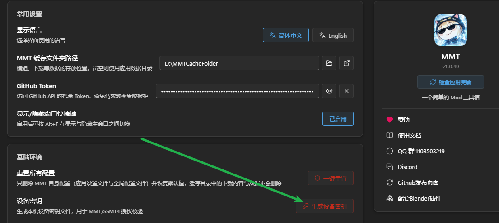
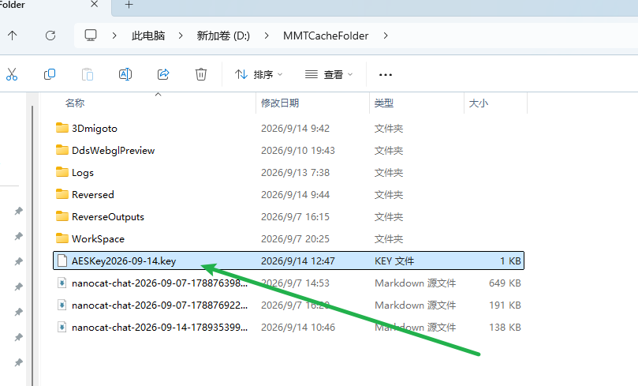
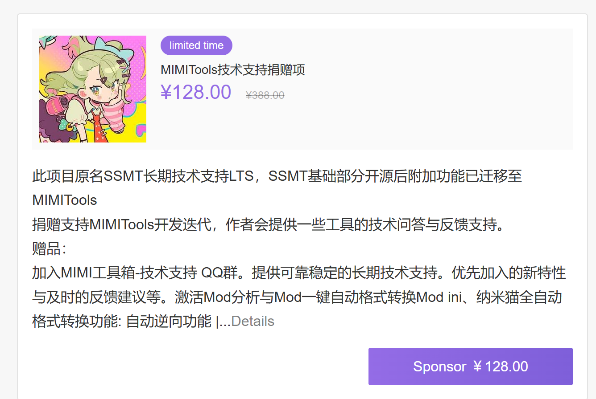

# MMT激活方式

MMT的一部分功能是免费的，另外一部分则仅限赞助后的LTS用户使用。

赞助后需要联系我激活LTS权限，步骤如下：

1.安装MMT，进入设置页面生成Key文件：

2.点击后生成一个以当前日期为名称的.key文件：

3.把这个key文件发给我，然后我会把激活好的MMT发给你。

## 赞助地址
爱发电：[https://afdian.com/item/ec74ee782b2f11efb5a052540025c377](https://afdian.com/item/ec74ee782b2f11efb5a052540025c377)

(如果打不开的话，直接进入爱发电 NicoMico的主页 [https://afdian.com/a/NicoMico666](https://afdian.com/a/NicoMico666) 找下图这个即可)

LTS激活机制的目的，是保障正常用户权益，防止工具被恶意倒卖，损害正常使用体验。

同时也为工具持续开发迭代提供一部分Token成本费用。

每份赞助提供两台设备激活，功能上设计为1台用于激活，另一台用于换主板后的备用激活，非必要请不要合购，合购后虽然有两台设备激活，但只有一个人能加入技术支持群，赞助的主要价值不在功能，而在Long Time Support长期技术支持上，有我随时提供技术支持可以节省你很多不必要的时间浪费。
