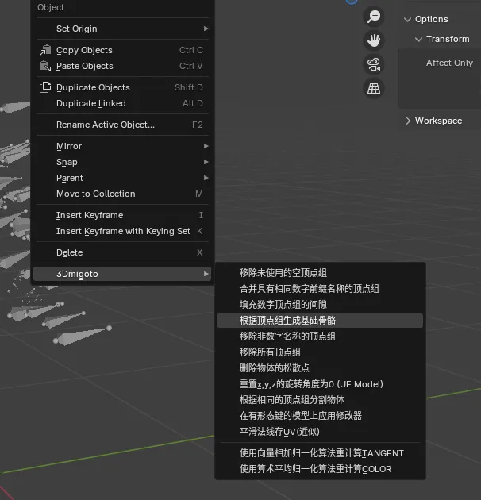

# MMT常见问题

## 我从老版本MMT、DBMT、SSMT升级到新版MMT(MIMITools)是否需要重新赞助或者重新激活？
不需要，我开发的所有3Dmigoto系列工具都是附带老用户激活的，激活绑定主板，只要你不换主板就可以直接下载最新版使用。

每次赞助获得的激活，只要激活到对应主板上，对应的主板就具有我开发的3Dmigoto系列工具的永久LTS权限。

## MMT和SSMT有什么区别？
MMT的前身就是SSMT，你可以理解为SSMT就是开源版MMT，我将SSMT开源后交给 高氙酸 进行维护了，目前完整维护团队包括 高氙酸、希尔、一夏 等社区成员。

MMT是我自己维护的一套，适配我自用的Mod流程，用法上比较有特色。

## Mod逆向出来，有骨骼吗？
3Dmigoto类型的Mod里并不包含骨骼信息，所以无法提取出骨骼

但是Mod里一般会包含顶点组和权重，后续手动创建骨骼并绑定很方便。

## 为什么部分 Mod 作者会抵制MMT的Mod逆向功能
一些 Mod 作者对格式转换工具抱有明显的敌意。表面上，他们的理由是「保护创作者权益」；但真正让这类工具被抵制的核心原因，是它打破了 Mod 作者对自己模型修改的垄断权。

在旧生态里，一个 Mod 只有作者本人能改、能修、能解释；别人一旦失去源文件，就只能求助于作者。格式转换工具的存在，让修复与学习不再依赖某个人的恩赐，也自然让「独家修改权」不再成立。

但我们需要正视一个更根本的事实：Mod 作者制作 Mod 的过程，本身就是在未经授权的情况下使用游戏公司的模型、贴图与资源。 从严格的法律角度看，绝大多数 Mod 制作都建立在侵权基础之上，Mod 作者的作品并不因此天然拥有合法版权，所谓「版权保护」的主张，也往往缺乏坚实的法律根基。

我们尊重每一位 Mod 作者的劳动，但反对以「版权」之名维护垄断、阻碍社区学习与修复。真正健康的社区，应当允许知识流动，允许作品被理解，也允许技术为所有人服务。

## 🖥️ 界面问题
### Q: 为什么工具界面和 BiliBili 视频里的不一样？
**A:** 因为工具一直在更新新版本，目前格式转换工具和 Mod 制作工具已经拆开了。

新版本工具，经过不断的技术积累和细节打磨，功能上一定是强于旧版本的，只是界面发生了变更，实际上用法相差不大，不用担心。

## 🔄 Mod 制作与还原
### Q: 我想把 Mod 中转换出来的模型重新生成为 Mod 怎么做？
**A:** 使用 **SSMT** 和 **SSMT 的 Blender 插件** 来进行 Mod 制作，是最方便的。

其次也可以使用老外的工具，例如 `gui_collect` 和 `XXMI-Tools`, `WWMI-Tools`。

> 💡 **概念区分**：Mod 格式转换只是拿到了模型，拿到了模型剩下的你想干嘛都不是你说了算嘛，要区分这个概念，拿到了模型剩下的步骤就和 Mod 格式转换无关了，要生成 Mod 就是 Mod 制作的部分。
>
> 实际上，格式转换工具只是为了获取 Mod 中包含的模型，获取到模型之后，剩余的流程就和 `3Dmigoto-Sword-Lv6` 的关系不大了，主要是 Mod 制作流程。
>

### Q: 那么如何把模型制作为 Mod 呢？
- **米家游戏**：可以使用 `gui_collect` 或 `GIMI`，`SRMI`，`HIMI`，`ZZMI` 等仓库的模型收集脚本来提取模型，然后用 `XXMI-Tools` 导入模型后生成 Mod，也可以使用 **SSMT** 提取模型，然后用 **SSMT 的 Blender 插件** 生成 Mod。
- **鸣潮**：可以用 `WWMI-Tools` 来制作 Mod，也可以用 **SSMT** 来制作 Mod。

> 💡 **工具推荐**：对于工具的选择我的推荐是哪个好用用哪个，没必要绑定死在一个工具上，因为开发者不同所以每个工具都有其特色和优缺点。
>
> + 在鸣潮 Mod 制作方面 `WWMI-Tools` 的优势更大，次选 SSMT 流程。
> + 在米家游戏制作上面 SSMT 流程做的也不错，和老外的工具各有优劣。
>
> 当然最好是全部都能掌握，早日成为 Mod 大师，加油。
>

### 🔗 相关链接
- **SSMT 下载地址**：[https://github.com/StarBobis/SSMT3](https://github.com/StarBobis/SSMT3)
- **XXMITools 插件下载地址**（老外的米家游戏生成 Mod 工具）：[https://github.com/leotorrez/XXMITools](https://github.com/leotorrez/XXMITools)
- **gui_collect**（老外的米家游戏模型提取工具）：[https://github.com/Petrascyll/gui_collect](https://github.com/Petrascyll/gui_collect)
- **WWMI-Tools**（老外的鸣潮模型提取和 Mod 生成工具）：[https://github.com/SpectrumQT/WWMI-Tools](https://github.com/SpectrumQT/WWMI-Tools)

## 🛠️ 功能疑问
### Q: 为什么最强的功能是手动格式转换？我觉得一键格式转换更方便
**A:** 因为部分 Mod 加了复杂的 `ini` 写法和混淆机制，一键格式转换并不能保证所有稀奇古怪的格式都能解析出来。

尽管长达 2.5 年的更新期间已经完善了大多数 Mod 格式以及混淆格式 `ini` 的解析，但是 Mod 格式这个东西本身就是日新月异的。

一键格式转换只能解决 99% 的 Mod 格式转换问题，剩下的 1% 就得用我们的 **手动格式转换** 功能了。

目前一键格式转换仍在持续更新中，结合手动格式转换可解决所有 Mod 格式转换问题。

## 🦴 骨骼绑定
### Q: 转换出来的模型如何绑定骨骼？
**A:** GI 的格式转换配合骨骼用起来更方便哦，每个游戏都可以配合游戏原生骨骼。

实现转换出来模型后一键绑骨的操作，因为转换出的模型是有顶点组的，做到了轻松使用其它人的 Mod 中的模型进行二次创作：

- **骨骼下载**：[https://github.com/zeroruka/GI-Bones](https://github.com/zeroruka/GI-Bones) （部分旧版本骨骼地址）
- **案例演示**：
    - [视频演示 1](https://www.bilibili.com/video/BV1oi421h7mz/?spm_id_from=333.999.0.0)
    - [视频演示 2](https://www.bilibili.com/video/BV1St5VzrE16/?spm_id_from=333.1387.homepage.video_card.click)

当然你也可以自己创建骨骼，SSMT 的 Blender 插件有个方便的功能可以初始化骨骼：

## 🔒 激活与安全
### Q: 机器码锁了之后是不是只要不换主板就没事？
**A:** 是。

### Q: 老版本激活格式转换插件 新版本是不是还得激活啊？
**A:** 不需要，新版本都附带旧的激活，从旧版本更新到新版本只需要下载最新版即可。

## MIMIBlender插件和TheHerta4插件的区别是什么？
SSMT4 & TheHerta4是开源的一套体系

MIMIBlender是MIMITools的Blender插件，也就是它和MMT是配套的。
