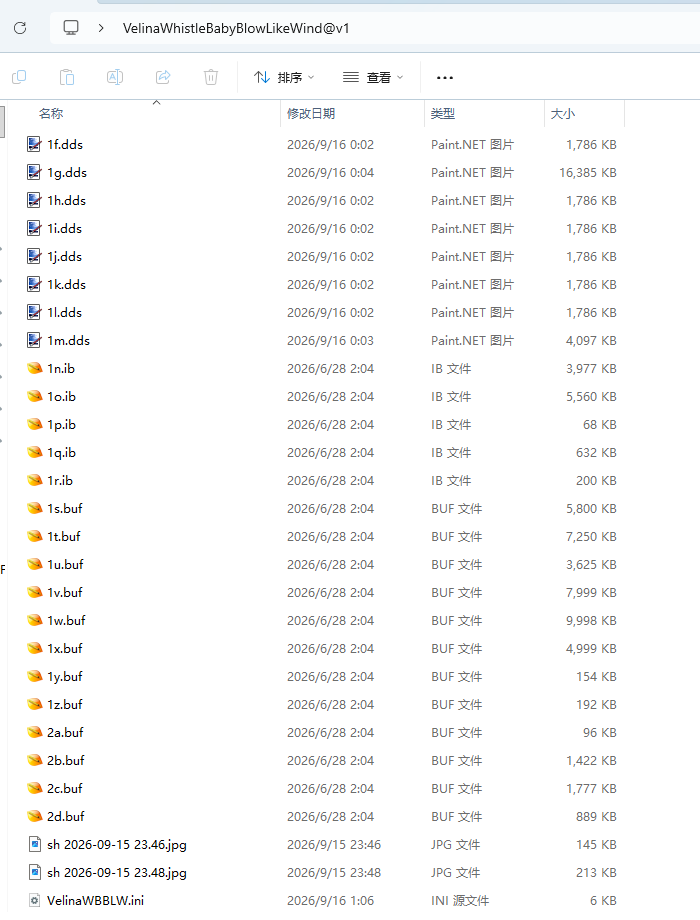

# 四种Mod逆向方式区别

## 手动逆向
### 特点
- 需要手动拖拽IB、VB文件到对应位置
- 每一页DrawIB页只能处理一个IB的逆向，多个IB需要单独开新页
- 拖拽完IB还需要手动选择每个CategoryBuffer的分类，以及IB的格式

### 缺点
- Mod文件的名称混淆后，会导致逆向耗时增加，如图几乎无法一眼看出哪个属于哪个：

- 耗时很长

### 优点
- 任意复杂Mod都可以逆向出来，只要你对Mod格式的理解足够。

## Mod分析交互式逆向
### 特点
- 相当于增强版的手动逆向，不再需要逐个拖拽文件选择分类
- 选择目录后，自动扫描IB和分类
- 只需要人工手动调整部分识别错误的分类，即可轻松逆向出来

### 缺点
- 需要手动操作，比较浪费时间

### 优点
- 实时3D视图与UV预览，轻松逆向出模型
- 属于手动逆向的增强版本，用熟练之后很丝滑
- 一定程度上可以对抗名称混淆
- 半自动分析 + 手动校正，很方便
- 逆向结果限定在指定的正确的数据类型中

## 自动一键逆向
### 特点
- 不需要关心那么多，选择ini就一键逆向出来了

### 缺点
- 只能选择一个ini，会被基于namespace的混淆对抗掉
- 会被特殊ini写法对抗掉，逆向能力取决于内置解析能力

### 优点
- 方便快捷，能应对99%的情况

## 纳米猫AI全自动逆向
### 特点
- AI全自动接管逆向所有流程，只需要告诉AI mod在哪就行，或者直接拖拽Mod的文件或文件夹到界面中

### 缺点
- 除了烧Token之外，没有缺点，Mod逆向天花板

### 优点
- AI代替思考，人类放弃大脑
- 大量节省时间
- N多个Mod也可以拖进来批量逆向
- 无视几乎所有的混淆手段，逆向能力上限取决于接入模型的能力上限
- 逆向出来的形态键会带有名称
- 逆向后全自动帮你上贴图
