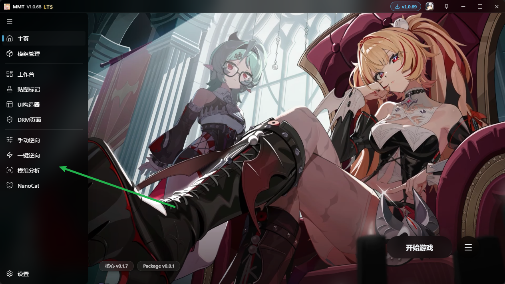
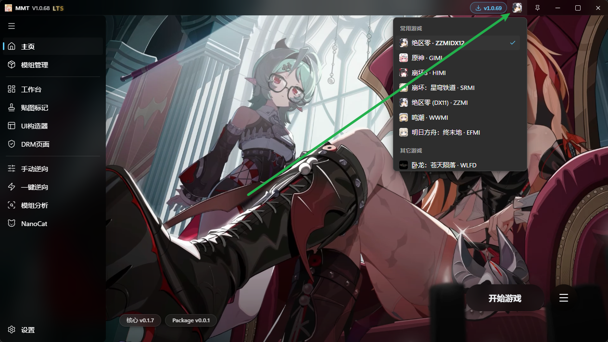

# Mod逆向功能介绍

## 4种主要的Mod逆向功能

MMT拥有四种主要功能用于将3Dmigoto Mod中的模型提取出来

分别是：

- 手动逆向 手动拖拽逆向
- 一键逆向 一键选择ini逆向
- 模组分析 选择Mod文件夹，交互式Mod逆向
- NanoCat 纳米猫 AI全自动逆向

## 支持的游戏

MMT支持的所有游戏，都支持将其Mod转换为可导入Blender的格式。

具体游戏列表可点击右上角游戏图标查看：

主要支持的游戏有：

- 原神 GIMI
- 崩坏三 HIMI
- 崩坏：星穹铁道 SRMI
- 绝区零 ZZMI
- 鸣潮 WWMI
- 明日方舟：终末地 EFMI

其它游戏的3Dmigoto Mod也支持，MMT的正向Mod制作和逆向Mod提取共用一套底层代码设施，所以MMT支持Mod制作的游戏都支持把Mod里的模型提取出来

## 仅限LTS使用

爱发电赞助解锁：

https://afdian.com/item/ec74ee782b2f11efb5a052540025c377

